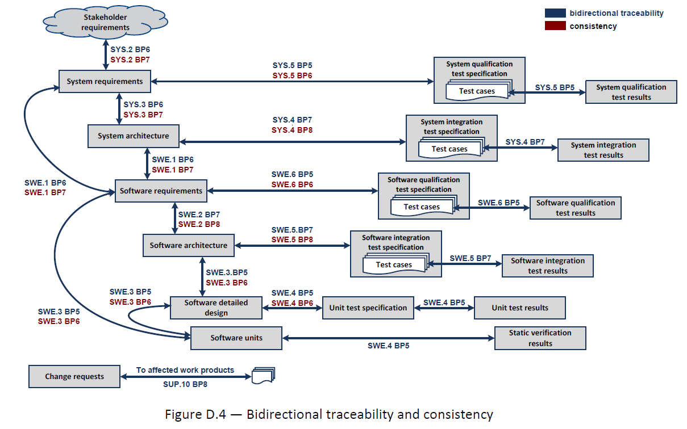

################
Automotive SPICE
################

Quality Management in the Automotive Industry

Automotive SPICE\ :sup:`®`
==========================

Process Reference Model

Process Assessment Model

Version 3.1

.. table::

   +----------------------------------+-----------------------------------------------------------------------------+
   |    **Title:**                    | Automotive SPICE Process Assessment / Reference Model                       |
   +----------------------------------+-----------------------------------------------------------------------------+
   |    **Author(s):**                | VDA QMC Working Group 13 / Automotive SIG                                   |
   +----------------------------------+-----------------------------------------------------------------------------+
   |    **Version:**                  | 3.1                                                                         |
   +----------------------------------+-----------------------------------------------------------------------------+
   |    **Date:**                     | 2017-11-01                                                                  |
   +----------------------------------+-----------------------------------------------------------------------------+
   |    **Status:**                   | PUBLISHED                                                                   |
   +----------------------------------+-----------------------------------------------------------------------------+
   |    **Confidentiality:**          | Public                                                                      |
   +----------------------------------+-----------------------------------------------------------------------------+
   |    **Revision ID:**              | 656                                                                         |
   +----------------------------------+-----------------------------------------------------------------------------+

**Copyright notice**

This document is a revision of the Automotive SPICE process assessment model 2.5 and the process reference model 4.5,
which has been developed under the Automotive SPICE initiative by consensus of the car manufacturers within the
Automotive Special Interest Group (SIG), a joint special interest group of Automotive OEM, the Procurement Forum and the
SPICE User Group.

It has been revised by the Working Group 13 of the Quality Management Center (QMC) in the German Association of the
Automotive Industry with the representation of members of the Automotive Special Interest Group, and with the agreement
of the SPICE User Group. This agreement is based on a validation of the Automotive SPICE 3.0 version regarding any ISO
copyright infringement and the statements given from VDA QMC to the SPICE User Group regarding the current and future
development of Automotive SPICE.

This document reproduces relevant material from:

•  **ISO/IEC 33020:2015**
   Information technology -- Process assessment -- Process measurement framework for assessment of process capability

**ISO/IEC 33020:2015** provides the following copyright release statement:

*‘Users of this International Standard may reproduce subclauses 5.2, 5.3, 5.4 and 5.6 as part of any process assessment
model or maturity model so that it can be used for its intended purpose.’*

•  **ISO/IEC 15504-5:2006**
   Information Technology – Process assessment – Part 5: An exemplar Process Assessment Model

**ISO/IEC 15504-5:2006** provides the following copyright release statement:

*‘Users of this part of ISO/IEC 15504 may freely reproduce the detailed descriptions contained in the exemplar
assessment model as part of any tool or other material to support the performance of process assessments, so that it can
be used for its intended purpose.’*

Relevant material from one of the mentioned standards is incorporated under the copyright release notice.

**Acknowledgement**

The VDA, the VDA QMC and the Working Group 13 explicitly acknowledge the high quality work carried out by the members of
the Automotive Special Interest Group. We would like to thank all involved people, who have contributed to the
development and publication of Automotive SPICE\ :sup:`®`.

**Derivative works**

You may not alter, transform, or build upon this work without the prior consent of both the SPICE User Group and the VDA
Quality Management Center. Such consent may be given provided ISO copyright is not infringed.

The detailed descriptions contained in this document may be incorporated as part of any tool or other material to
support the performance of process assessments, so that this process assessment model can be used for its intended
purpose, provided that any such material is not offered for sale.

All distribution of derivative works shall be made at no cost to the recipient.

**Distribution**

The Automotive SPICE\ :sup:`®` process assessment model may only be obtained by download from the
*www.automotivespice.com* web site.

It is not permitted for the recipient to further distribute the document.

**Change requests**

Any problems or change requests should be reported through the defined mechanism at the *www.automotivespice.com* web
site.

**Trademark**

Automotive SPICE\ :sup:`®` is a registered trademark of the Verband der Automobilindustrie e.V. (VDA) For further
information about Automotive SPICE\ :sup:`®` visit `www.automotivespice.com. <http://www.automotivespice.com/>`__

**Document history**

.. table::

   +--------------+----------------+-----------------------+-------------------------------------------------------+
   | **Version**  |    **Date**    | **By**                | **Notes**                                             |
   +==============+================+=======================+=======================================================+
   | **2.0**      | 2005-05-04     | AutoSIG / SUG         | DRAFT RELEASE, pending final editorial review         |
   +--------------+----------------+-----------------------+-------------------------------------------------------+
   | **2.1**      | 2005-06-24     | AutoSIG / SUG         | | Editorial review comments implemented               |
   |              |                |                       | | Updated to reflect changes in FDIS 15504-5          |
   +--------------+----------------+-----------------------+-------------------------------------------------------+
   | **2.2**      | 2005-08-21     | AutoSIG / SUG         | Final checks implemented: FORMAL RELEASE              |
   +--------------+----------------+-----------------------+-------------------------------------------------------+
   | **2.3**      | 2007-05-05     | AutoSIG / SUG         | Revision following CCB: FORMAL RELEASE                |
   +--------------+----------------+-----------------------+-------------------------------------------------------+
   | **2.4**      | 2008-08-01     | AutoSIG / SUG         | Revision following CCB: FORMAL RELEASE                |
   +--------------+----------------+-----------------------+-------------------------------------------------------+
   | **2.5**      | 2010-05-10     | AutoSIG / SUG         | Revision following CCB: FORMAL RELEASE                |
   +--------------+----------------+-----------------------+-------------------------------------------------------+
   | **3.0**      | 2015-07-16     | VDA QMC WG13          | Changes: See release notes                            |
   +--------------+----------------+-----------------------+-------------------------------------------------------+
   | **3.1**      | 2017-11-01     | VDA QMC WG13          | Changes: See www.automotivespice.com                  |
   +--------------+----------------+-----------------------+-------------------------------------------------------+

**Release notes**

Version 3.0 of the process assessment model incorporates the following major changes:

.. table::

   +----------------+-----------------------------------------------------------------------------------------------------+
   | **Chapter 1**  | Editorial adaption to ISO/IEC 330xx series, Notes regarding combined PRM/PAM in this document       |
   +----------------+-----------------------------------------------------------------------------------------------------+
   | **Chapter 2**  | Adaption to ISO/IEC 330xx series                                                                    |
   +----------------+-----------------------------------------------------------------------------------------------------+
   | **Chapter 3**  | Text optimized for better understanding and adapted to ISO/IEC 330xx series.                        |
   +----------------+-----------------------------------------------------------------------------------------------------+
   | **Chapter 4**  | Renaming ENG to SYS/SWE, Structure of old ENG Processes changed,                                    |
   |                | Rework of AS 4.5 process reference model and AS 2.5 process performance                             |
   |                | indicators focusing on a set of highly significant processes                                        |
   |                | assessed within the automotive industry (VDA Scope).                                                |
   +----------------+-----------------------------------------------------------------------------------------------------+
   | **Chapter 5**  | Adaption based on AS 2.5 to the measurement framework of ISO/IEC 33020                              |
   +----------------+-----------------------------------------------------------------------------------------------------+
   | **Annex A**    | Conformity statement adapted to ISO/IEC 33004                                                       |
   +----------------+-----------------------------------------------------------------------------------------------------+
   | **Annex B**    | Modifications on work product characteristics according to the changes in chapter 4.                |
   +----------------+-----------------------------------------------------------------------------------------------------+
   | **Annex C**    | Update to recent standards. Introduction of specific terms used in AS 3.0                           |
   +----------------+-----------------------------------------------------------------------------------------------------+
   | **Annex D**    | Added the major concepts used for AS 3.0, incorporated Annex E of AS 2.5                            |
   +----------------+-----------------------------------------------------------------------------------------------------+
   | **Annex E**    | Updated references to other standards                                                               |
   +----------------+-----------------------------------------------------------------------------------------------------+

Version 3.1 of the process assessment model incorporates minor changes. Please refer to
`www.automotivespice.com <http://www.automotivespice.com/>`__ for a detailed change log.

Table of contents
=================

.. contents::

List of Figures
===============

Figure 1 — Process assessment model relationship ................................................................ 11

Figure 2 — Automotive SPICE process reference model - Overview .................................................. 12

Figure 3 — Relationship between assessment indicators and process capability..................................... 22

Figure 4 — Possible levels of abstraction for the term "process" ................................................ 23

Figure 5 — Performing a process assessment for determining process capability ................................... 23

Figure D.1 — The "Plug-in" concept .............................................................................. 122

Figure D.2 — The tip of the "V" ................................................................................. 123

Figure D.3 — Element, component, unit, and item ................................................................. 123

Figure D.4 — Bidirectional traceability and consistency ......................................................... 124

Figure D.5 — Agree, summarize and communicate ................................................................... 125

Figure D.6 — Evaluation, verification criteria and compliance ................................................... 126

Figure D.7 — Strategy and plan .................................................................................. 127

List of Tables
==============

Table 1 — Abbreviation List ..................................................................................... 9

Table 2 — Primary life cycle processes – ACQ process group ...................................................... 13

Table 3 — Primary life cycle processes – SPL process group ...................................................... 13

Table 4 — Primary life cycle processes – SYS process group ...................................................... 13

Table 5 — Primary life cycle processes – SWE process group ...................................................... 14

Table 6 — Supporting life cycle processes - SUP process group ................................................... 14

Table 7 — Organizational life cycle processes - MAN process group ............................................... 14

Table 8 — Organizational life cycle processes - PIM process group ............................................... 15

Table 9 — Organizational life cycle processes - REU process group ............................................... 15

Table 10 — Process capability levels according to ISO/IEC 33020 ................................................. 16

Table 11 — Process attributes according to ISO/IEC 33020 ........................................................ 16

Table 12 — Rating scale according to ISO/IEC 33020 .............................................................. 17

Table 13 — Rating scale percentage values according to ISO/IEC 33020 ............................................ 17

Table 14 — Refinement of rating scale according to ISO/IEC 33020 ................................................ 17

Table 15 — Refined rating scale percentage values according to ISO/IEC 33020 .................................... 18

Table 16 — Process capability level model according to ISO/IEC 33020 ............................................ 20

Table 17 — Template for the process description ................................................................. 24

Table B.1 — Structure of WPC tables ............................................................................. 94

Table B.2 — Work product characteristics ........................................................................ 94

Table C.1 — Terminology ......................................................................................... 119

Table E.1 — Reference standards ................................................................................. 128

1. Introduction
===============

1.1. Scope
----------

Process assessment is a disciplined evaluation of an organizational unit’s processes against a process assessment model.

The Automotive SPICE process assessment model (PAM) is intended for use when performing conformant assessments of the
process capability on the development of embedded automotive systems. It was developed in accordance with the
requirements of ISO/IEC 33004.

Automotive SPICE has its own process reference model (PRM), which was developed based on the Automotive SPICE process
reference model 4.5. It was further developed and tailored considering the specific needs of the automotive industry. If
processes beyond the scope of Automotive SPICE are needed, appropriate processes from other process reference models
such as ISO/IEC 12207 or ISO/IEC 15288 may be added based on the business needs of the organization.

The PRM is incorporated in this document and is used in conjunction with the Automotive SPICE process assessment model
when performing an assessment.

This Automotive SPICE process assessment model contains a set of indicators to be considered when interpreting the
intent of the Automotive SPICE process reference model. These indicators may also be used when implementing a process
improvement program subsequent to an assessment.

1.2. Terminology
----------------

Automotive SPICE follows the following precedence for use of terminology:

a) ISO/IEC 33001 for assessment related terminology

b) ISO/IEC/IEEE 24765 and ISO/IEC/IEEE 29119 terminology (as contained in Annex C)

c) Terms introduced by Automotive SPICE (as contained in Annex C)

1.3. Abbreviations
------------------

.. table:: Table 1 — Abbreviation List

   +-----------------------+----------------------------------------------------------------------------------------------+
   | AS                    | **A**\ utomotive **SPICE**                                                                   |
   +-----------------------+----------------------------------------------------------------------------------------------+
   | BP                    | **B**\ ase **P**\ ractice                                                                    |
   +-----------------------+----------------------------------------------------------------------------------------------+
   | CAN                   | **C**\ ontroller **A**\ rea **N**\ etwork                                                    |
   +-----------------------+----------------------------------------------------------------------------------------------+
   | CASE                  | **C**\ omputer-**A**\ ided **S**\ oftware **E**\ ngineering,                                 |
   +-----------------------+----------------------------------------------------------------------------------------------+
   | CCB                   | **C**\ hange **C**\ ontrol **B**\ oard                                                       |
   +-----------------------+----------------------------------------------------------------------------------------------+
   | CFP                   | **C**\ all **F**\ or **P**\ roposals                                                         |
   +-----------------------+----------------------------------------------------------------------------------------------+
   | CPU                   | **C**\ entral **P**\ rocessing **U**\ nit                                                    |
   +-----------------------+----------------------------------------------------------------------------------------------+
   | ECU                   | **E**\ lectronic **C**\ ontrol **U**\ nit                                                    |
   +-----------------------+----------------------------------------------------------------------------------------------+
   | EEPROM                | **E**\ lectrically **E**\ rasable **P**\ rogrammable **R**\ ead-**O**\ nly **M**\ emory      |
   +-----------------------+----------------------------------------------------------------------------------------------+
   | GP                    | **G**\ eneric **P**\ ractice                                                                 |
   +-----------------------+----------------------------------------------------------------------------------------------+
   | GR                    | **G**\ eneric **R**\ esource                                                                 |
   +-----------------------+----------------------------------------------------------------------------------------------+
   | IEC                   | **I**\ nternational **E**\ lectrotechnical **C**\ ommission                                  |
   +-----------------------+----------------------------------------------------------------------------------------------+
   | IEEE                  | **I**\ nstitute of **E**\ lectrical and **E**\ lectronics **E**\ ngineers                    |
   +-----------------------+----------------------------------------------------------------------------------------------+
   | I/O                   | **I**\ nput / **O**\ utput                                                                   |
   +-----------------------+----------------------------------------------------------------------------------------------+
   | ISO                   | **I**\ nternational **O**\ rganization for **S**\ tandardization                             |
   +-----------------------+----------------------------------------------------------------------------------------------+
   | ITT                   | **I**\ nvitation **T**\ o **T**\ ender                                                       |
   +-----------------------+----------------------------------------------------------------------------------------------+
   | LIN                   | **L**\ ocal **I**\ nterconnect **N**\ etwork                                                 |
   +-----------------------+----------------------------------------------------------------------------------------------+
   | MISRA                 | **M**\ otor **I**\ ndustry **S**\ oftware **R**\ eliability **A**\ ssociation                |
   +-----------------------+----------------------------------------------------------------------------------------------+
   | MOST                  | **M**\ edia **O**\ riented **S**\ ystems **T**\ ransport                                     |
   +-----------------------+----------------------------------------------------------------------------------------------+
   | PA                    | **P**\ rocess **A**\ ttribute                                                                |
   +-----------------------+----------------------------------------------------------------------------------------------+
   | PAM                   | **P**\ rocess **A**\ ssessment **M**\ odel                                                   |
   +-----------------------+----------------------------------------------------------------------------------------------+
   | PRM                   | **P**\ rocess **R**\ eference **M**\ odel                                                    |
   +-----------------------+----------------------------------------------------------------------------------------------+
   | PWM                   | **P**\ ulse **W**\ idth **M**\ odulation                                                     |
   +-----------------------+----------------------------------------------------------------------------------------------+
   | RAM                   | **R**\ andom **A**\ ccess **M**\ emory                                                       |
   +-----------------------+----------------------------------------------------------------------------------------------+
   | ROM                   | **R**\ ead **O**\ nly **M**\ emory                                                           |
   +-----------------------+----------------------------------------------------------------------------------------------+
   | SPICE                 | **S**\ oftware **P**\ rocess **I**\ mprovement and **C**\ apability d\ **E**\ termination    |
   +-----------------------+----------------------------------------------------------------------------------------------+
   | SUG                   | **S**\ pice **U**\ ser **G**\ roup                                                           |
   +-----------------------+----------------------------------------------------------------------------------------------+
   | USB                   | **U**\ niversal **S**\ erial **B**\ us                                                       |
   +-----------------------+----------------------------------------------------------------------------------------------+
   | WP                    | **W**\ ork **P**\ roduct                                                                     |
   +-----------------------+----------------------------------------------------------------------------------------------+
   | WPC                   | **W**\ ork **P**\ roduct **C**\ haracteristic                                                |
   +-----------------------+----------------------------------------------------------------------------------------------+

2. Statement of compliance
==========================

The Automotive SPICE process assessment model and process reference model is conformant with the ISO/IEC 33004, and can
be used as the basis for conducting an assessment of process capability.

ISO/IEC 33020 is used as an ISO/IEC 33003 compliant Measurement Framework.

A statement of compliance of the process assessment model and process reference model with the requirements of ISO/IEC
33004 is provided in Annex A.

3. Process capability determination
===================================

The concept of process capability determination by using a process assessment model is based on a two-dimensional
framework. The first dimension is provided by processes defined in a process reference model (process dimension). The
second dimension consists of capability levels that are further subdivided into process attributes (capability
dimension). The process attributes provide the measurable characteristics of process capability.

The process assessment model selects processes from a process reference model and supplements with indicators. These
indicators support the collection of objective evidence which enable an assessor to assign ratings for processes
according to the capability dimension.

The relationship is shown in Figure 1:

   Figure 1 — Process assessment model relationship

3.1. Process reference model
----------------------------

Processes are grouped by process category and at a second level into process groups according to the type of activity
they address.

There are 3 process categories: Primary life cycle processes, Organizational life cycle processes and Supporting life
cycle processes.

Each process is described in terms of a purpose statement. The purpose statement contains the unique functional
objectives of the process when performed in a particular environment. For each purpose statement a list of specific
outcomes is associated, as a list of expected positive results of the process performance.

For the process dimension, the Automotive SPICE process reference model provides the set of processes shown in Figure 2.

   Figure 2 — Automotive SPICE process reference model - Overview

3.1.1. Primary life cycle processes category
~~~~~~~~~~~~~~~~~~~~~~~~~~~~~~~~~~~~~~~~~~~~

The primary life cycle processes category consists of processes that may be used by the customer when acquiring products
from a supplier, and by the supplier when responding and delivering products to the customer including the engineering
processes needed for specification, design, development, integration and testing.

The primary life cycle processes category consists of the following groups:

•  the Acquisition process group;

•  the Supply process group;

•  the System engineering process group; 

•  the Software engineering process group.

The Acquisition process group (ACQ) consists of processes that are performed by the customer, or by the supplier when
acting as a customer for its own suppliers, in order to acquire a product and/or service.

.. table:: Table 2 — Primary life cycle processes – ACQ process group

   +----------------------------+--------------------------------------------------------------+
   | **ACQ.3**                  | Contract Agreement                                           |
   +----------------------------+--------------------------------------------------------------+
   | **ACQ.4**                  | Supplier Monitoring                                          |
   +----------------------------+--------------------------------------------------------------+
   | **ACQ.11**                 | Technical Requirements                                       |
   +----------------------------+--------------------------------------------------------------+
   | **ACQ.12**                 | Legal and Administrative Requirements                        |
   +----------------------------+--------------------------------------------------------------+
   | **ACQ.13**                 | Project Requirements                                         |
   +----------------------------+--------------------------------------------------------------+
   | **ACQ.14**                 | Request for Proposals                                        |
   +----------------------------+--------------------------------------------------------------+
   | **ACQ.15**                 | Supplier Qualification                                       |
   +----------------------------+--------------------------------------------------------------+

The Supply process group (SPL) consists of processes performed by the supplier in order to supply a product and/or a
service.

.. table:: Table 3 — Primary life cycle processes – SPL process group

   +----------------------------+--------------------------------------------------------------+
   | **SPL.1**                  | Supplier Tendering                                           |
   +----------------------------+--------------------------------------------------------------+
   | **SPL.2**                  | Product Release                                              |
   +----------------------------+--------------------------------------------------------------+

The System Engineering process group (SYS) consists of processes addressing the elicitation and management of customer
and internal requirements, the definition of the system architecture and the integration and testing on the system
level.

.. table:: Table 4 — Primary life cycle processes – SYS process group

   +----------------------------+--------------------------------------------------------------+
   | **SYS.1**                  | Requirements Elicitation                                     |
   +----------------------------+--------------------------------------------------------------+
   | **SYS.2**                  | System Requirements Analysis                                 |
   +----------------------------+--------------------------------------------------------------+
   | **SYS.3**                  | System Architectural Design                                  |
   +----------------------------+--------------------------------------------------------------+
   | **SYS.4**                  | System Integration and Integration Test                      |
   +----------------------------+--------------------------------------------------------------+
   | **SYS.5**                  | System Qualification Test                                    |
   +----------------------------+--------------------------------------------------------------+

The Software Engineering process group (SWE) consists of processes addressing the management of software requirements
derived from the system requirements, the development of the corresponding software architecture and design as well as
the implementation, integration and testing of the software.

.. table:: Table 5 — Primary life cycle processes – SWE process group

   +------------------------+------------------------------------------------------------------+
   | **SWE.1**              | Software Requirements Analysis                                   |
   +------------------------+------------------------------------------------------------------+
   | **SWE.2**              | Software Architectural Design                                    |
   +------------------------+------------------------------------------------------------------+
   | **SWE.3**              | Software Detailed Design and Unit Construction                   |
   +------------------------+------------------------------------------------------------------+
   | **SWE.4**              | Software Unit Verification                                       |
   +------------------------+------------------------------------------------------------------+
   | **SWE.5**              | Software Integration and Integration Test                        |
   +------------------------+------------------------------------------------------------------+
   | **SWE.6**              | Software Qualification Test                                      |
   +------------------------+------------------------------------------------------------------+

3.1.2. Supporting life cycle processes category
~~~~~~~~~~~~~~~~~~~~~~~~~~~~~~~~~~~~~~~~~~~~~~~

The supporting life cycle processes category consists of processes that may be employed by any of the other processes at
various points in the life cycle.

.. table:: Table 6 — Supporting life cycle processes - SUP process group

   +------------------------+------------------------------------------------------------------+
   | **SUP.1**              | Quality Assurance                                                |
   +------------------------+------------------------------------------------------------------+
   | **SUP.2**              | Verification                                                     |
   +------------------------+------------------------------------------------------------------+
   | **SUP.4**              | Joint Review                                                     |
   +------------------------+------------------------------------------------------------------+
   | **SUP.7**              | Documentation                                                    |
   +------------------------+------------------------------------------------------------------+
   | **SUP.8**              | Configuration Management                                         |
   +------------------------+------------------------------------------------------------------+
   | **SUP.9**              | Problem Resolution Management                                    |
   +------------------------+------------------------------------------------------------------+
   | **SUP.10**             | Change Request Management                                        |
   +------------------------+------------------------------------------------------------------+

3.1.3. Organizational life cycle processes category
~~~~~~~~~~~~~~~~~~~~~~~~~~~~~~~~~~~~~~~~~~~~~~~~~~~

The organizational life cycle processes category consists of processes that develop process, product, and resource
assets which, when used by projects in the organization, will help the organization achieve its business goals.

The organizational life cycle processes category consists of the following groups:

-  the Management process group;

-  the Process Improvement process group;

-  the Reuse process group.

The Management process group (MAN) consists of processes that may be used by anyone who manages any type of project or
process within the life cycle.

.. table:: Table 7 — Organizational life cycle processes - MAN process group

   ========= ==================
   **MAN.3** Project Management
   **MAN.5** Risk Management
   **MAN.6** Measurement
   ========= ==================

The Process Improvement process group (PIM) covers one process that contains practices to improve the processes
performed in the organizational unit.

.. table:: Table 8 — Organizational life cycle processes - PIM process group

   ========= ===================
   **PIM.3** Process Improvement
   ========= ===================

The Reuse process group (REU) covers one process to systematically exploit reuse opportunities in organization’s reuse
programs.

.. table:: Table 9 — Organizational life cycle processes - REU process group

   ========= ========================
   **REU.2** Reuse Program Management
   ========= ========================

3.2. Measurement framework 
---------------------------

The measurement framework provides the necessary requirements and rules for the capability dimension. It defines a
schema which enables an assessor to determine the capability level of a given process. These capability levels are
defined as part of the measurement framework.

To enable the rating, the measurement framework provides process attributes defining a measurable property of process
capability. Each process attribute is assigned to a specific capability level. The extent of achievement of a certain
process attribute is represented by means of a rating based on a defined rating scale. The rules from which an assessor
can derive a final capability level for a given process are represented by a process capability level model.

Automotive SPICE 3.1 uses the measurement framework defined in ISO/IEC 33020:2015.

.. note:: *NOTE: Text incorporated from ISO/IEC 33020 within this chapter is written in italic font and marked with a left
   side bar.*

3.2.1. Process capability levels and process attributes 
~~~~~~~~~~~~~~~~~~~~~~~~~~~~~~~~~~~~~~~~~~~~~~~~~~~~~~~~

The process capability levels and process attributes are identical to those defined in ISO/IEC 33020 clause 5.2. The
detailed descriptions of the capability levels and the corresponding process attributes can be found in chapter 5.

Process attributes are features of a process that can be evaluated on a scale of achievement, providing a measure of the
capability of the process. They are applicable to all processes.

A capability level is a set of process attribute(s) that work together to provide a major enhancement in the capability
to perform a process. Each attribute addresses a specific aspect of the capability level. The levels constitute a
rational way of progressing through improvement of the capability of any process.

According to ISO/IEC 33020 there are six capability levels, incorporating nine process attributes:

.. table:: Table 10 — Process capability levels according to ISO/IEC 33020

   +-----------------------------+----------------------------------------------------------------------------------+
   | **Level 0:**                | *The process is not implemented, or fails to achieve its process purpose.*       |
   |                             |                                                                                  |
   | **Incomplete process**      |                                                                                  |
   +-----------------------------+----------------------------------------------------------------------------------+
   | **Level 1:**                | *The implemented process achieves its process purpose*                           |
   |                             |                                                                                  |
   | **Performed process**       |                                                                                  |
   +-----------------------------+----------------------------------------------------------------------------------+
   | **Level 2:**                | *The previously described performed process is now implemented in a managed      |
   |                             | fashion (planned, monitored and adjusted) and its work products are              |
   | **Managed process**         | appropriately established, controlled and maintained.*                           |
   +-----------------------------+----------------------------------------------------------------------------------+
   | **Level 3:**                | *The previously described managed process is now implemented using a defined     |
   |                             | process that is capable of achieving its process outcomes.*                      |
   | **Established process**     |                                                                                  |
   +-----------------------------+----------------------------------------------------------------------------------+
   | **Level 4:**                | *The previously described established process now operates predictively within   |
   |                             | defined limits to achieve its process outcomes.*                                 |
   | **Predictable process**     |                                                                                  |
   |                             | *Quantitative management needs are identified, measurement data are collected    |
   |                             | and analyzed to identify assignable causes of variation.*                        |
   |                             |                                                                                  |
   |                             | *Corrective action is taken to address assignable causes of variation.*          |
   +-----------------------------+----------------------------------------------------------------------------------+
   | **Level 5:**                | *The previously described predictable process is now continually improved to     |
   |                             | respond to organizational change.*                                               |
   | **Innovating process**      |                                                                                  |
   +-----------------------------+----------------------------------------------------------------------------------+

Within this process assessment model, the determination of capability is based upon the nine process attributes (PA)
defined in ISO/IEC 33020 and listed in Table 11.

.. table:: Table 11 — Process attributes according to ISO/IEC 33020

   +---------------------------+------------------------------------------------------------------------------------+
   |    **Attribute ID**       |    **Process Attributes**                                                          |
   +===========================+====================================================================================+
   | **Level 0: Incomplete process**                                                                                |
   +---------------------------+------------------------------------------------------------------------------------+
   | **Level 1: Performed  process**                                                                                |
   +---------------------------+------------------------------------------------------------------------------------+
   | **PA 1.1**                | *Process performance process attribute*                                            |
   +---------------------------+------------------------------------------------------------------------------------+
   | **Level 2: Managed process**                                                                                   |
   +---------------------------+------------------------------------------------------------------------------------+
   | **PA 2.1**                | *Performance management process attribute*                                         |
   +---------------------------+------------------------------------------------------------------------------------+
   | **PA 2.2**                | *Work product management process attribute*                                        |
   +---------------------------+------------------------------------------------------------------------------------+
   | **Level 3: Established process**                                                                               |
   +---------------------------+------------------------------------------------------------------------------------+
   | **PA 3.1**                | *Process definition process attribute*                                             |
   +---------------------------+------------------------------------------------------------------------------------+
   | **PA 3.2**                | *Process deployment process attribute*                                             |
   +---------------------------+------------------------------------------------------------------------------------+
   | **Level 4: Predictable process**                                                                               |
   +---------------------------+------------------------------------------------------------------------------------+
   | **PA 4.1**                | *Quantitative analysis process attribute*                                          |
   +---------------------------+------------------------------------------------------------------------------------+
   | **PA 4.2**                | *Quantitative control process attribute*                                           |
   +---------------------------+------------------------------------------------------------------------------------+
   | **Level 5: Innovating process**                                                                                |
   +---------------------------+------------------------------------------------------------------------------------+
   | **PA 5.1**                | *Process innovation process attribute*                                             |
   +---------------------------+------------------------------------------------------------------------------------+
   | **PA 5.2**                | *Process innovation implementation process attribute*                              |
   +---------------------------+------------------------------------------------------------------------------------+

3.2.2. Process attribute rating 
~~~~~~~~~~~~~~~~~~~~~~~~~~~~~~~~

To support the rating of process attributes, the ISO/IEC 33020 measurement framework provides a defined rating scale
with an option for refinement, different rating methods and different aggregation methods depending on the class of the
assessment (e.g. required for organizational maturity assessments).

*Rating scale* 
~~~~~~~~~~~~~~~

*Within this process measurement framework, a process attribute is a measureable property of process capability. A
process attribute rating is a judgement of the degree of achievement of the process attribute for the assessed process.*

The rating scale is defined by ISO/IEC 33020 as shown in table 12.

.. table:: Table 12 — Rating scale according to ISO/IEC 33020

   +------+----------------------+-----------------------------------------------------------------------------+
   | **N**| *Not achieved*       | *There is little or no evidence of achievement of the defined process       |
   |      |                      | attribute in the assessed process.*                                         |
   +------+----------------------+-----------------------------------------------------------------------------+
   | **P**| *Partially achieved* | *There is some evidence of an approach to, and some achievement of,         |
   |      |                      | the defined process attribute in the assessed process.*                     |
   |      |                      |                                                                             |
   |      |                      | *Some aspects of achievement of the process                                 |
   |      |                      | attribute may be unpredictable.*                                            |
   +------+----------------------+-----------------------------------------------------------------------------+
   | **L**| *Largely achieved*   | *There is evidence of a systematic approach to, and significant achievement |
   |      |                      | of, the defined process attribute in the assessed process.*                 |
   |      |                      |                                                                             |
   |      |                      | *Some weaknesses related to this process attribute may exist in the         |
   |      |                      | assessed process.*                                                          |
   +------+----------------------+-----------------------------------------------------------------------------+
   | **F**| *Fully achieved*     | *There is evidence of a complete and systematic approach to, and full       |
   |      |                      | achievement of, the defined process attribute in the assessed process.*     |
   |      |                      |                                                                             |
   |      |                      | *No significant weaknesses related to this process attribute exist in       |
   |      |                      | the assessed process.*                                                      |
   +------+----------------------+-----------------------------------------------------------------------------+

*The ordinal scale defined above shall be understood in terms of percentage achievement of a process attribute.*

*The corresponding percentages shall be:*

.. table:: Table 13 — Rating scale percentage values according to ISO/IEC 33020

   +------+-----------------------------------------+-----------------------------------------------------------+
   | **N**| *Not achieved*                          | *0 to ≤ 15% achievement*                                  |
   +------+-----------------------------------------+-----------------------------------------------------------+
   | **P**| *Partially achieved*                    | *> 15% to ≤ 50% achievement*                              |
   +------+-----------------------------------------+-----------------------------------------------------------+
   | **L**| *Largely achieved*                      | *> 50% to ≤ 85% achievement*                              |
   +------+-----------------------------------------+-----------------------------------------------------------+
   | **F**| *Fully achieved*                        | *> 85% to ≤ 100% achievement*                             |
   +------+-----------------------------------------+-----------------------------------------------------------+

*The ordinal scale may be further refined for the measures P and L as defined below.*

.. table:: Table 14 — Refinement of rating scale according to ISO/IEC 33020

   +------+----------------------+-----------------------------------------------------------------------------+
   |**P-**| *Partially           | *There is some evidence of an approach to, and some achievement of, the     |
   |      | achieved:*           | defined process attribute in the assessed process.*                         |
   |      |                      |                                                                             |
   |      |                      | *Many aspects of achievement of the process attribute may be                |
   |      |                      | unpredictable.*                                                             |
   +------+----------------------+-----------------------------------------------------------------------------+
   |**P+**| *Partially           | *There is some evidence of an approach to, and some achievement of, the     |
   |      | achieved:*           | defined process attribute in the assessed process.*                         |
   |      |                      |                                                                             |
   |      |                      | *Some aspects of achievement of the process attribute may be                |
   |      |                      | unpredictable.*                                                             |
   +------+----------------------+-----------------------------------------------------------------------------+
   |**L-**| *Largely achieved:*  | *There is evidence of a systematic approach to, and significant achievement |
   |      |                      | of, the defined process attribute in the assessed process.*                 |
   |      |                      |                                                                             |
   |      |                      | *Many weaknesses related to this process attribute may exist in the         |
   |      |                      | assessed process.*                                                          |
   +------+----------------------+-----------------------------------------------------------------------------+
   |**L+**| *Largely achieved:*  | *There is evidence of a systematic approach to, and significant achievement |
   |      |                      | of, the defined process attribute in the assessed process.*                 |
   |      |                      |                                                                             |
   |      |                      | *Some weaknesses related to this process attribute may exist in the         |
   |      |                      | assessed process.*                                                          |
   +------+----------------------+-----------------------------------------------------------------------------+

*The corresponding percentages shall be:*

.. table:: Table 15 — Refined rating scale percentage values according to ISO/IEC 33020

   +------+------------------------------------------+-----------------------------------------------------------+
   |**P-**| *Partially achieved -*                   | *> 15% to ≤ 32.5% achievement*                            |
   +------+------------------------------------------+-----------------------------------------------------------+
   |**P+**| *Partially achieved +*                   | *> 32.5 to ≤ 50% achievement*                             |
   +------+------------------------------------------+-----------------------------------------------------------+
   |**L-**| *Largely achieved -*                     | *> 50% to ≤ 67.5% achievement*                            |
   +------+------------------------------------------+-----------------------------------------------------------+
   |**L+**| *Largely achieved +*                     | *> 67.5% to ≤ 85% achievement*                            |
   +------+------------------------------------------+-----------------------------------------------------------+

*Rating and aggregation method*
~~~~~~~~~~~~~~~~~~~~~~~~~~~~~~~

ISO/IEC 33020 provides the following definitions:

*A process outcome is the observable result of successful achievement of the process purpose.*

*A process attribute outcome is the observable result of achievement of a specified process attribute.*

*Process outcomes and process attribute outcomes may be characterised as an intermediate step to providing a process
attribute rating.*

*When performing rating, the rating method employed shall be specified relevant to the class of assessment. The
following rating methods are defined.*

*The use of rating method may vary according to the class, scope and context of an assessment. The lead assessor shall
decide which (if any) rating method to use. The selected rating method(s) shall be specified in the assessment input and
referenced in the assessment report.*

ISO/IEC 33020 provides the following 3 rating methods:

Rating method R1
^^^^^^^^^^^^^^^^

*The approach to process attribute rating shall satisfy the following conditions:*

a) *Each process outcome of each process within the scope of the assessment shall be characterized for each process
   instance, based on validated data;*

b) *Each process attribute outcome of each process attribute for each process within the scope of the assessment shall
   be characterised for each process instance, based on validated data;*

c) *Process outcome characterisations for all assessed process instances shall be aggregated to provide a process
   performance attribute achievement rating;*

d) *Process attribute outcome characterisations for all assessed process instances shall be aggregated to provide a
   process attribute achievement rating.*

Rating method R2
^^^^^^^^^^^^^^^^

*The approach to process attribute rating shall satisfy the following conditions:*

a) *Each process attribute for each process within the scope of the assessment shall be characterized for each process
   instance, based on validated data;*

b) *Process attribute characterisations for all assessed process instances shall be aggregated to provide a process
   attribute achievement rating.*

Rating method R3 
^^^^^^^^^^^^^^^^^

*Process attribute rating across assessed process instances shall be made without aggregation.*

In principle the three rating methods defined in ISO/IEC 33020 depend on

a) whether the rating is made only on process attribute level (Rating method 3 and 2) or – with more level of detail –
   both on process attribute and process attribute outcome level (Rating method 1); and

b) the type of aggregation ratings across the assessed process instances for each process

If a rating is performed for both process attributes and process attribute outcomes (Rating method 1), the result will
be a process performance attribute outcome rating on level 1 and a process attribute achievement rating on higher
levels.

Depending on the class, scope and context of the assessment an aggregation within one process (one-dimensional, vertical
aggregation), across multiple process instances (one-dimensional, horizontal aggregation) or both (two-dimensional,
matrix aggregation) is performed.

ISO/IEC 33020 provides the following examples:

*When performing an assessment, ratings may be summarised across one or two dimensions.*

*For example, when rating a*

-  *process attribute for a given process, one may aggregate ratings of the associated process (attribute) outcomes –
   such an aggregation will be performed as a vertical aggregation (one dimension).*

-  *process (attribute) outcome for a given process attribute across multiple process instances, one may aggregate the
   ratings of the associated process instances for the given process (attribute) outcome such an aggregation will be
   performed as a horizontal aggregation (one dimension)*

-  *process attribute for a given process, one may aggregate the ratings of all the process (attribute) outcomes for all
   the processes instances – such an aggregation will be performed as a matrix aggregation across the full scope of
   ratings (two dimensions)*

The standard defines different methods for aggregation. Further information can be taken from ISO/IEC 33020.

3.2.3. Process capability level model
'''''''''''''''''''''''''''''''''''''

The process capability level achieved by a process shall be derived from the process attribute ratings for that process
according to the process capability level model defined in Table 16.

The process capability level model defines the rules how the achievement of each level depends on the rating of the
process attributes for the assessed and all lower levels.

As a general rule the achievement of a given level requires a largely achievement of the corresponding process
attributes and a full achievement of any lower lying process attribute.

.. table:: Table 16 — Process capability level model according to ISO/IEC 33020

   +--------------+-----------------------------------------------------------+--------------------+
   | **Scale**    |    **Process attribute**                                  | **Rating**         |
   +==============+===========================================================+====================+
   | **Level 1**  | **PA 1.1: Process Performance**                           | **Largely**        |
   +--------------+-----------------------------------------------------------+--------------------+
   | **Level 2**  | *PA 1.1:* *Process Performance*                           | *Fully*            |
   |              |                                                           |                    |
   |              | **PA 2.1: Performance Management**                        | **Largely**        |
   |              |                                                           |                    |
   |              | **PA 2.2: Work Product Management**                       | **Largely**        |
   +--------------+-----------------------------------------------------------+--------------------+
   | **Level 3**  | *PA 1.1:* *Process Performance*                           | *Fully*            |
   |              |                                                           |                    |
   |              | *PA 2.1:* *Performance Management*                        | *Fully*            |
   |              |                                                           |                    |
   |              | *PA 2.2: Work Product Management*                         | *Fully*            |
   |              |                                                           |                    |
   |              | **PA 3.1: Process Definition**                            | **Largely**        |
   |              |                                                           |                    |
   |              | **PA 3.2: Process Deployment**                            | **Largely**        |
   +--------------+-----------------------------------------------------------+--------------------+
   | **Level 4**  | *PA 1.1:* *Process Performance*                           | *Fully*            |
   |              |                                                           |                    |
   |              | *PA 2.1:* *Performance Management*                        | *Fully*            |
   |              |                                                           |                    |
   |              | *PA 2.2: Work Product Management*                         | *Fully*            |
   |              |                                                           |                    |
   |              | *PA 3.1: Process Definition*                              | *Fully*            |
   |              |                                                           |                    |
   |              | *PA 3.2: Process Deployment*                              | *Fully*            |
   |              |                                                           |                    |
   |              | **PA 4.1: Quantitative Analysis**                         | **Largely**        |
   |              |                                                           |                    |
   |              | **PA 4.2: Quantitative Control**                          | **Largely**        |
   +--------------+-----------------------------------------------------------+--------------------+
   | **Level 5**  | *PA 1.1:* *Process Performance*                           | *Fully*            |
   |              |                                                           |                    |
   |              | *PA 2.1:* *Performance Management*                        | *Fully*            |
   |              |                                                           |                    |
   |              | *PA 2.2: Work Product Management*                         | *Fully*            |
   |              |                                                           |                    |
   |              | *PA 3.1: Process Definition*                              | *Fully*            |
   |              |                                                           |                    |
   |              | *PA 3.2: Process Deployment*                              | *Fully*            |
   |              |                                                           |                    |
   |              | *PA 4.1: Quantitative Analysis*                           | *Fully*            |
   |              |                                                           |                    |
   |              | *PA 4.2: Quantitative Control*                            | *Fully*            |
   |              |                                                           |                    |
   |              | **PA 5.1: Process Innovation**                            | **Largely**        |
   |              |                                                           |                    |
   |              | **PA 5.2: Process Innovation Implementation**             | **Largely**        |
   +--------------+-----------------------------------------------------------+--------------------+

3.3. Process assessment model 
------------------------------

The process assessment model offers indicators in order to identify whether the process outcomes and the process
attribute outcomes (achievements) are present or absent in the instantiated processes of projects and organizational
units. These indicators provide guidance for assessors in accumulating the necessary objective evidence to support
judgments of capability. They are not intended to be regarded as a mandatory set of checklists to be followed.

In order to judge the presence or absence of process outcomes and process achievements an assessment obtains objective
evidence. All such evidence comes from the examination of work products and repository content of the assessed
processes, and from testimony provided by the performers and managers of the assessed processes. This evidence is mapped
to the PAM indicators to allow establishing the correspondence to the relevant process outcomes and process attribute
achievements.

There are two types of indicators:

-  **Process performance indicators**, which apply exclusively to capability Level 1. They provide an indication of the
   extent of fulfillment of the process outcomes

-  **Process capability indicators**, which apply to Capability Levels 2 to 5. They provide an indication of the extent
   of fulfillment of the process attribute achievements.

Assessment indicators are used to confirm that certain practices were performed, as shown by evidence collected during
an assessment. All such evidence comes either from the examination of work products of the processes assessed, or from
statements made by the performers and managers of the processes. The existence of base practices and work products
provide evidence of the performance of the processes associated with them. Similarly, the existence of process
capability indicators provides evidence of process capability.

The evidence obtained should be recorded in a form that clearly relates to an associated indicator, in order that
support for the assessor’s judgment can be confirmed or verified as required by ISO/IEC 33002.

3.3.1. Process performance indicators 
~~~~~~~~~~~~~~~~~~~~~~~~~~~~~~~~~~~~~~

Types of process performance indicators are

   • Base practices (BP)
   • Work products (WP).

Both BPs and WPs relate to one or more process outcomes. Consequently, BPs and WPs are always process-specific and not
generic. BPs represent activity-oriented indicators. WPs represent resultoriented indicators. Both BP and WP are used
for judging objective evidence that an assessor is to collect, and accumulate, in the performance of an assessment. In
that respect BPs and WPs are alternative indicator sets the assessor can use.

The PAM offers a set of work product characteristics (WPC, see Annex B) for each WP. These are meant to offer a good
practice and state-of-the-art knowledge guide for the assessor. Therefore, WP and WPC are supposed to be a quickly
accessible information source during an assessment. In that respect WPs and WPCs represent an example structure only.
They are neither a "strict must" nor are they normative for organizations. Instead, the actual structure, form and
content of concrete work products and documents for the implemented processes must be defined by the project and
organization, respectively. The project and/or organization ensures that the work products are appropriate for the
intended purpose and needs, and in relation to the development goals.

3.3.2. Process capability indicators 
~~~~~~~~~~~~~~~~~~~~~~~~~~~~~~~~~~~~~

Types of process capability indicators are:

-  Generic Practice (GP)

-  Generic Resource (GR)

Both GPs and GRs relate to one or more PA Achievements. In contrast to process performance indicators, however, they are
of generic type, i.e. they apply to any process.

The difference between GP and GR is that the former represent activity-oriented indicators while the latter represent
infrastructure- oriented indicators for judging objective evidence. An assessor has to collect and accumulate evidence
supporting process capability indicators during an assessment. In that respect GPs and GRs are alternative indicators
sets the assessor can use.

In spite of the fact that level 1 capability of a process is only characterized by the measure of the extent to which
the process outcomes are achieved the measurement framework (see chapter 3.2) requires each level to reveal a process
attribute, and, thus, requires the PAM to introduce at least one process capability indicator. Therefore, the only
process performance attribute for capability Level 1 (PA.1.1) has a single generic practice (GP 1.1.1) pointing as an
editorial reference to the respective process performance indicators (see Figure 3).

   Figure 3 — Relationship between assessment indicators and process capability

3.3.3. Understanding the level of abstraction of a PAM 
~~~~~~~~~~~~~~~~~~~~~~~~~~~~~~~~~~~~~~~~~~~~~~~~~~~~~~~

The term "process" can be understood at three levels of abstraction. Note that these levels of abstraction are not meant
to define a strict black-or-white split, nor is it the aim to provide a scientific classification schema – the message
here is to understand that, in practice, when it comes to the term "process" there are different abstraction levels, and
that a PAM resides at the highest.

   Figure 4 — Possible levels of abstraction for the term "process"

Capturing experience acquired during product development (i.e. at the DOING level) in order to share this experience
with others means creating a HOW level. However, a HOW is always specific to a particular context such as a company, an
organizational unit, or a product line. For example, the HOW of a project, organizational unit, or company A is
potentially not applicable as is to a project, organizational unit, or company B. However, both might be expected to
adhere the principles represented by PAM indicators for process outcomes and process attribute achievements. These
indicators are at the WHAT level while deciding on solutions for concrete templates, proceedings, and tooling etc. is
left to the HOW level.

   Figure 5 — Performing a process assessment for determining process capability

4. Process reference model and performance indicators (Level 1)
===============================================================

The processes in the process dimension can be drawn from the Automotive SPICE process reference model, which is
incorporated in the tables below indicated by a red bar at the left side.

Each table related to one process in the process dimension contains the process reference model (indicated by a red bar)
and the process performance indicators necessary to define the process assessment model. The process performance
indicators consist of base practices (indicated by a green bar) and output work products (indicated by a blue bar).

.. table:: Table 17 — Template for the process description

   +------------+---------------------------+----------------------------------------------------------------+
   | Process    | **Process ID**            | The individual processes are described in terms of process     |
   |            |                           | name, process purpose, and process outcomes to define the      |
   | reference  | **Process name**          | Automotive SPICE process reference model.                      |
   |            |                           |                                                                |
   | model      | **Process purpose**       | Additionally a process identifier is provided.                 |
   |            |                           |                                                                |
   |            | **Process outcomes**      |                                                                |
   +------------+---------------------------+----------------------------------------------------------------+
   | Process    | **Base practices**        | A set of base practices for the process providing a definition |
   |            |                           | of the tasks and activities needed to accomplish the process   |
   | performance|                           | purpose and fulfill the process outcomes                       |
   +            +---------------------------+----------------------------------------------------------------+
   | indicators | **Output work products**  | A number of output work products associated with each process  |
   |            |                           |                                                                |
   |            |                           |    *NOTE: Refer to Annex B for the characteristics associated  |
   |            |                           |    with each work product.*                                    |
   +------------+---------------------------+----------------------------------------------------------------+

4.1. Acquisition process group (ACQ)
------------------------------------

4.1.1. ACQ.3 Contract Agreement
~~~~~~~~~~~~~~~~~~~~~~~~~~~~~~~

.. stake_req:: Contract Agreement
   :id: ACQ3
   :status: new
   :safety_level: not set
   :security_level: not set

   **Process ID**

   **ACQ.3**

   **Process name**

   **Contract Agreement**

   **Process purpose**

   The purpose of Contract Agreement Process is to negotiate and approve a
   contract/agreement with the supplier.

   **Process outcomes**

   As a result of successful implementation of this process:

   .. stake_req:: 1
      :id: ACQ3_OUT1
      :status: new
      :safety_level: not set
      :security_level: not set
      :output: 02-00, 02-01, 13-05, 13-09

      a contract/agreement is negotiated, reviewed, approved and awarded to
      the supplier(s);

   .. stake_req:: 2
      :id: ACQ3_OUT2
      :status: new
      :safety_level: not set
      :security_level: not set
      :output: 02-00

      the contract/agreement clearly and unambiguously specifies the
      expectations, responsibilities, work products/deliverables and
      liabilities of both the supplier(s) and the acquirer;

   .. stake_req:: 3
      :id: ACQ3_OUT3
      :status: new
      :safety_level: not set
      :security_level: not set
      :output: 02-00

      mechanisms for monitoring the capability and performance of the
      supplier(s) and for mitigation of identified risks are reviewed and
      considered for inclusion in the contract conditions;

   and

   .. stake_req:: 4
      :id: ACQ3_OUT4
      :status: new
      :safety_level: not set
      :security_level: not set
      :output: 13-04

      proposers/tenderers are notified of the result of proposal/tender
      selection.

   **Base practices**
   
   .. stake_req:: ACQ.3.BP1: Negotiate the contract/agreement.
      :id: ACQ_3_BP1
      :status: new
      :safety_level: not set
      :security_level: not set
      :output: ACQ3_OUT1

      Negotiate all relevant aspects of the contract/agreement
      with the supplier.

   *NOTE 1: Relevant aspects of the procurement may include*

   -  *system requirements*

   -  *acceptance criteria and evaluation criteria*

   -  *linkage between payment and successful completion of acceptance
      testing*

   -  *process requirements, process interfaces and joint processes.*

   .. stake_req:: ACQ.3.BP2: Specify rights and duties.
      :id: ACQ_3_BP2
      :status: new
      :safety_level: not set
      :security_level: not set
      :output: ACQ3_OUT2

      Unambiguously specify the expectations,  responsibilities, work
      products/deliverables and liabilities of the parties in the
      contract/agreement.

   .. stake_req:: ACQ.3.BP3: Review contract/agreement for supplier \
      capability monitoring.
      :id: ACQ_3_BP3
      :status: new
      :safety_level: not set
      :security_level: not set
      :output: ACQ3_OUT3

      Review and consider a mechanism for monitoring the
      capability and performance of the supplier for inclusion in the
      contract/agreement conditions.

   .. stake_req:: ACQ.3.BP4: Review contract/agreement for risk mitigation \
      actions.
      :id: ACQ_3_BP4
      :status: new
      :safety_level: not set
      :security_level: not set
      :output: ACQ3_OUT3

      Review and consider a mechanism for the mitigation of identified risk
      for inclusion in the contract/agreement conditions.

   .. stake_req:: ACQ.3.BP5: Approve contract/agreement.
      :id: ACQ_3_BP5
      :status: new
      :safety_level: not set
      :security_level: not set
      :output: ACQ3_OUT1

      The contract/agreement is approved by relevant stakeholders.

   .. stake_req:: ACQ.3.BP6: Award contract/agreement.
      :id: ACQ_3_BP6
      :status: new
      :safety_level: not set
      :security_level: not set
      :output: ACQ3_OUT1

      The contract/agreement is awarded to the successful
      proposer/tenderer.

   .. stake_req:: ACQ.3.BP7: Communicate result to tenderers.
      :id: ACQ_3_BP7
      :status: new
      :safety_level: not set
      :security_level: not set
      :output: ACQ3_OUT4

      Notify the result of the proposal/tender selection to proposers/tenders.
      After contract award inform all tenderers of the decision.
   
   **Output work products**
   
   .. table::
      :widths: 20 5 75

      +---------------+---+-------------------------------------------------+
      | :need:`02-00` | → | [OUTCOME :need:`ACQ3_OUT1`, :need:`ACQ3_OUT2`,  |
      |               |   | :need:`ACQ3_OUT3`]                              |
      +---------------+---+-------------------------------------------------+
      | :need:`02-01` | → | [OUTCOME :need:`ACQ3_OUT1`]                     |
      +---------------+---+-------------------------------------------------+
      | :need:`13-04` | → | [OUTCOME :need:`ACQ3_OUT4`]                     |
      +---------------+---+-------------------------------------------------+
      | :need:`13-05` | → | [OUTCOME :need:`ACQ3_OUT1`]                     |
      +---------------+---+-------------------------------------------------+
      | :need:`13-09` | → | [OUTCOME :need:`ACQ3_OUT1`]                     |
      +---------------+---+-------------------------------------------------+

4.1.2. ACQ.4 Supplier Monitoring
~~~~~~~~~~~~~~~~~~~~~~~~~~~~~~~~

.. stake_req:: Supplier Monitoring
   :id: ACQ4
   :status: new
   :safety_level: not set
   :security_level: not set

   **Process ID**

   **ACQ.4**

   **Process name**

   **Supplier Monitoring**

   **Process purpose**

   The purpose of the Supplier Monitoring Process is to track and assess the
   performance of the supplier against agreed requirements.

   **Process outcomes**

   As a result of successful implementation of this process:

   .. stake_req:: 1
      :id: ACQ4_OUT1
      :status: new
      :safety_level: not set
      :security_level: not set
      :output: 13-04, 13-09

      joint activities, as agreed between the customer and the supplier, are
      performed as needed;

   .. stake_req:: 2
      :id: ACQ4_OUT2
      :status: new
      :safety_level: not set
      :security_level: not set
      :output: 13-04, 13-14, 13-19

      all information, agreed upon for exchange, is communicated regularly
      between the supplier and customer;

   .. stake_req:: 3
      :id: ACQ4_OUT3
      :status: new
      :safety_level: not set
      :security_level: not set
      :output: 13-01, 15-01

      performance of the supplier is monitored against the agreements;

   and

   .. stake_req:: 4
      :id: ACQ4_OUT4
      :status: new
      :safety_level: not set
      :security_level: not set
      :output: 02-01, 13-16, 14-02

      changes to the agreement, if needed, are negotiated between the customer
      and the supplier and documented in the agreement.

   **Base practices**
   
   .. stake_req:: ACQ.4.BP1: Agree on and maintain jointprocesses,
      :id: ACQ4_BP1
      :status: new
      :safety_level: not set
      :security_level: not set
      :output: ACQ4_OUT1, ACQ4_OUT2, ACQ4_OUT4

      joint interfaces, and information to be exchanged. Establish and
      maintain an agreement on information to be exchanged and on joint
      processes and joint interfaces, responsibilities, type and frequency
      of joint activities, communications, meetings, status
      reports and reviews.

   *NOTE1: Joint processes and interfaces usually include project management,
   requirements management, change management, configuration management,
   problem resolution, quality assurance and customer acceptance.*

   *NOTE 2: Joint activities to be performed should be mutually agreed
   between the customer and the supplier.*

   *NOTE 3: The term customer in this process refers to the assessed party.
   The term supplier refers to the supplier of the assessed party.*

   .. stake_req:: ACQ.4.BP2: Exchange all agreed information.
      :id: ACQ4_BP2
      :status: new
      :safety_level: not set
      :security_level: not set
      :output: ACQ4_OUT1, ACQ4_OUT2, ACQ4_OUT3

      Use the defined joint interfaces between customer and supplier for the
      exchange of all agreed information.

   *NOTE 4: Agreed information should include all relevant work products.*

   .. stake_req:: ACQ.4.BP3: Review technical development with the supplier.
      :id: ACQ4_BP3
      :status: new
      :safety_level: not set
      :security_level: not set
      :output: ACQ4_OUT1, ACQ4_OUT3, ACQ4_OUT4

      Review development with the supplier on the agreed regular basis,
      covering technical aspects, problems and risks and also track open
      items to closure.

   .. stake_req:: ACQ.4.BP4: Review progress of the supplier.
      :id: ACQ4_BP4
      :status: new
      :safety_level: not set
      :security_level: not set
      :output: ACQ4_OUT1, ACQ4_OUT3, ACQ4_OUT4

      Review progress of the supplier regarding schedule, quality, and cost
      on the agreed regular basis. Track items to closure and perform risk
      open mitigation activities.

   .. stake_req:: ACQ.4.BP5: Act to correct deviations.
      :id: ACQ4_BP5
      :status: new
      :safety_level: not set
      :security_level: not set
      :output: ACQ4_OUT1, ACQ4_OUT3, ACQ4_OUT4

      Take action when agreed objectives are not achieved to correct
      deviations from the agreed project plans and to prevent
      reoccurrence of problems identified. Negotiate changes to objectives and
      document them in the agreements.

   **Output work products**

   .. table::
      :widths: 20 5 75

      +---------------+---+------------------------------------------------+
      | :need:`02-01` | → | [OUTCOME :need:`ACQ4_OUT4`]                    |
      +---------------+---+------------------------------------------------+
      | :need:`13-01` | → | [OUTCOME :need:`ACQ4_OUT3`]                    |
      +---------------+---+------------------------------------------------+
      | :need:`13-04` | → | [OUTCOME :need:`ACQ4_OUT1`, :need:`ACQ4_OUT2`] |
      +---------------+---+------------------------------------------------+
      | :need:`13-09` | → | [OUTCOME :need:`ACQ4_OUT1`]                    |
      +---------------+---+------------------------------------------------+
      | :need:`13-14` | → | [OUTCOME :need:`ACQ4_OUT2`]                    |
      +---------------+---+------------------------------------------------+
      | :need:`13-16` | → | [OUTCOME :need:`ACQ4_OUT4`]                    |
      +---------------+---+------------------------------------------------+
      | :need:`13-19` | → | [OUTCOME :need:`ACQ4_OUT2`]                    |
      +---------------+---+------------------------------------------------+
      | :need:`14-02` | → | [OUTCOME :need:`ACQ4_OUT4`]                    |
      +---------------+---+------------------------------------------------+
      | :need:`15-01` | → | [OUTCOME :need:`ACQ4_OUT3`]                    |
      +---------------+---+------------------------------------------------+

4.1.3. ACQ.11 Technical Requirements
~~~~~~~~~~~~~~~~~~~~~~~~~~~~~~~~~~~~

.. stake_req:: Technical Requirements
   :id: ACQ11
   :status: new
   :safety_level: not set
   :security_level: not set

   **Process ID**

   **ACQ.11**

   **Process name**

   **Technical Requirements**

   **Process purpose**

   The purpose of the Technical Requirements Process is to establish the
   technical requirements of the acquisition. This involves the elicitation of
   functional and non-functional requirements that consider the deployment
   life cycle of the products so as to establish a technical requirement
   baseline.

   **Process outcomes**

   As a result of successful implementation of this process:

   .. stake_req:: 1
      :id: ACQ11_OUT1
      :status: new
      :safety_level: not set
      :security_level: not set
      :output: 13-17, 14-50

      the technical requirements, including environment effect evaluation,
      safety and security requirements where appropriate, are defined and
      developed to match needs and expectations;

   .. stake_req:: 2
      :id: ACQ11_OUT2
      :status: new
      :safety_level: not set
      :security_level: not set
      :output: 13-21, 14-01, 14-02

      the current and evolving acquisition needs are gathered and defined;

   .. stake_req:: 3
      :id: ACQ11_OUT3
      :status: new
      :safety_level: not set
      :security_level: not set
      :output: 13-04

      the requirements and potential solutions are communicated to all
      affected groups;

   .. stake_req:: 4
      :id: ACQ11_OUT4
      :status: new
      :safety_level: not set
      :security_level: not set
      :output: 08-28

      a mechanism is established to incorporate changed or new requirements
      into the established baseline;

   .. stake_req:: 5
      :id: ACQ11_OUT5
      :status: new
      :safety_level: not set
      :security_level: not set
      :output: 08-51

      a mechanism for identifying and managing the impact of changing
      technology to the technical requirements is defined;

   and

   .. stake_req:: 6
      :id: ACQ11_OUT6
      :status: new
      :safety_level: not set
      :security_level: not set
      :output: 13-24, 17-00, 17-03

      the requirements include compliance with relevant standards, including
      environment effect evaluation, safety and security standards where
      appropriate.

   **Base practices**

   .. stake_req:: ACQ.11.BP1: Elicit needs.
      :id: ACQ11_BP1
      :status: new
      :safety_level: not set
      :security_level: not set
      :output: ACQ11_OUT1

      Elicit the needs of all relevant user groups.

   .. stake_req:: ACQ.11.BP2: Define technical requirements.
      :id: ACQ11_BP2
      :status: new
      :safety_level: not set
      :security_level: not set
      :output: ACQ11_OUT1

      Define and develop the technical requirements and potential solutions
      (where relevant), including environment effect evaluation, safety and
      security, performance, supportability requirements to match the needs
      and expectations of the relevant user groups.

   *NOTE 1: This may include*

   -  *the categorization, prioritization and indication of requirements*

   -  *the indication of mandatory requirements*

   -  *classification of requirements into functional areas*

   -  *using defined end user types to describe the functional requirements
      within an organization*

   .. stake_req:: ACQ.11.BP3: Identify acquisition needs.
      :id: ACQ11_BP3
      :status: new
      :safety_level: not set
      :security_level: not set
      :output: ACQ11_OUT2

      Gather and define the current and evolving acquisition needs.

   .. stake_req:: ACQ.11.BP4: Ensure consistency.
      :id: ACQ11_BP4
      :status: new
      :safety_level: not set
      :security_level: not set
      :output: ACQ11_OUT2

      Ensure consistency of the technical requirements
      with the defined acquisition needs.

   .. stake_req:: ACQ.11.BP5: Identify affected groups.
      :id: ACQ11_BP5
      :status: new
      :safety_level: not set
      :security_level: not set
      :output: ACQ11_OUT3

      Identify all groups to which the technical requirements and potential
      solutions should be communicated.

   .. stake_req:: ACQ.11.BP6: Communicate to affected groups.
      :id: ACQ11_BP6
      :status: new
      :safety_level: not set
      :security_level: not set
      :output: ACQ11_OUT3

      Communicate the technical requirements and potential solutions to
      all affected groups.

   *NOTE 2: To ensure a better understanding:*

   -  *the requirements might be specified in business terms*

   -  *simulation and exploratory prototyping techniques might be used*

   .. stake_req:: ACQ.11.BP7: Establish a change mechanism.
      :id: ACQ11_BP7
      :status: new
      :safety_level: not set
      :security_level: not set
      :output: ACQ11_OUT4

      Establish a mechanism to incorporate changed or new technical
      requirements into the established baseline.

   *NOTE 3: This may include analyzing, structuring and prioritizing technical
   requirements according to their importance to the business.*

   .. stake_req:: ACQ.11.BP8: Track impact of changing technology.
      :id: ACQ11_BP8
      :status: new
      :safety_level: not set
      :security_level: not set
      :output: ACQ11_OUT5

      Define a mechanism for identifying and managing the impact of changing
      technology to the technical requirements and integrate the resulting
      consequences into the technical requirements.

   .. stake_req:: ACQ.11.BP9: Identify constraints and standards.
      :id: ACQ11_BP9
      :status: new
      :safety_level: not set
      :security_level: not set
      :output: ACQ11_OUT6

      Identify constraints and standards applicable to the technical
      requirements (e.g. open systems standards).

   .. stake_req:: ACQ.11.BP10: Ensure compliance of stated requirements.
      :id: ACQ11_BP10
      :status: new
      :safety_level: not set
      :security_level: not set
      :output: ACQ11_OUT6

      Ensure that the technical requirements include compliance with
      identified relevant standards, including environment effect evaluation,
      safety and security standards where appropriate.

   **Output work products**

   .. table::
      :widths: 20 5 75

      +---------------+---+------------------------------------------------+
      | :need:`08-28` | → | [OUTCOME :need:`ACQ11_OUT4`]                   |
      +---------------+---+------------------------------------------------+
      | :need:`08-51` | → | [OUTCOME :need:`ACQ11_OUT5`]                   |
      +---------------+---+------------------------------------------------+
      | :need:`13-04` | → | [OUTCOME :need:`ACQ11_OUT3`]                   |
      +---------------+---+------------------------------------------------+
      | :need:`13-17` | → | [OUTCOME :need:`ACQ11_OUT1`]                   |
      +---------------+---+------------------------------------------------+
      | :need:`13-21` | → | [OUTCOME :need:`ACQ11_OUT2`]                   |
      +---------------+---+------------------------------------------------+
      | :need:`13-24` | → | [OUTCOME :need:`ACQ11_OUT6`]                   |
      +---------------+---+------------------------------------------------+
      | :need:`14-01` | → | [OUTCOME :need:`ACQ11_OUT2`]                   |
      +---------------+---+------------------------------------------------+
      | :need:`14-02` | → | [OUTCOME :need:`ACQ11_OUT2`]                   |
      +---------------+---+------------------------------------------------+
      | :need:`14-50` | → | [OUTCOME :need:`ACQ11_OUT1`]                   |
      +---------------+---+------------------------------------------------+
      | :need:`17-00` | → | [OUTCOME :need:`ACQ11_OUT6`]                   |
      +---------------+---+------------------------------------------------+
      | :need:`17-03` | → | [OUTCOME :need:`ACQ11_OUT6`]                   |
      +---------------+---+------------------------------------------------+

**4.1.4. ACQ.12 Legal and Administrative Requirements**

.. stake_req:: Legal and Administrative Requirements
   :id: ACQ12
   :status: new
   :safety_level: not set
   :security_level: not set

   **Process ID**

   **ACQ.12**

   **Process name**

   **Legal and Administrative Requirements**

   **Process purpose**

   The purpose of the Legal and Administrative Requirements Process is to define the awarding
   aspects – expectations, liabilities, legal and other issues and which comply with national
   and international laws of contract.

   **Process outcomes**

   As a result of successful implementation of this process:

   .. stake_req:: 1
      :id: ACQ12_OUT1
      :status: new
      :safety_level: not set
      :security_level: not set
      :output: 02-00, 10-00, 17-00

      a contractual approach is defined which is compliant with relevant national,
      international and regulatory laws, guidance and policies;

   .. stake_req:: 2
      :id: ACQ12_OUT2
      :status: new
      :safety_level: not set
      :security_level: not set
      :output: 02-00, 02-01, 17-00

      an agreement, (contractual) terms and conditions are defined to describe how the
      supplier will meet the needs and expectations;

   .. stake_req:: 3
      :id: ACQ12_OUT3
      :status: new
      :safety_level: not set
      :security_level: not set
      :output: 02-00, 10-00, 14-02, 17-00, 18-01

      acceptance criteria and mechanisms for handling of breaches to the fulfillment of
      contract are established;

   .. stake_req:: 4
      :id: ACQ12_OUT4
      :status: new
      :safety_level: not set
      :security_level: not set
      :output: 02-00, 02-01, 17-00

      the rights of the acquirer to assume, modify or evaluate, directly or indirectly
      Intellectual Property Rights are established;

   .. stake_req:: 5
      :id: ACQ12_OUT5
      :status: new
      :safety_level: not set
      :security_level: not set
      :output: 02-00, 02-01, 17-00

      warranties and service level agreements are provided for where applicable;

   .. stake_req:: 6
      :id: ACQ12_OUT6
      :status: new
      :safety_level: not set
      :security_level: not set
      :output: 02-00, 02-01, 17-00

      provision for the suppliers to deliver other requirements (e.g. quality plan, escrow
      arrangements etc.) is defined;

   and

   .. stake_req:: 7
      :id: ACQ12_OUT7
      :status: new
      :safety_level: not set
      :security_level: not set
      :output: 02-00, 02-01, 17-00

      recognized criteria for proprietary, regulatory and other product liabilities issues
      are established.

   **Base practices**

   .. stake_req:: ACQ.12.BP1: Identify relevant regulations.
      :id: ACQ12_BP1
      :status: new
      :safety_level: not set
      :security_level: not set
      :output: ACQ12_OUT1

      Identify relevant national, international and regulatory laws, guidance and policies.

   .. stake_req:: ACQ.12.BP2: Consider relevant regulations.
      :id: ACQ12_BP2
      :status: new
      :safety_level: not set
      :security_level: not set
      :output: ACQ12_OUT2

      Consider identified relevant laws, guidance and policy when
      defining a contractual approach.

   .. stake_req:: ACQ.12.BP3: Agree on (contractual) terms and conditions.
      :id: ACQ12_BP3
      :status: new
      :safety_level: not set
      :security_level: not set
      :output: ACQ12_OUT2

   *NOTE 1: This may include*

   -  *responsibilities of the purchaser and
      supplier; and the basis for payments*

   -  *responsibility for maintenance and
      upgrades*

   -  *a separate maintenance or support
      agreement*

   -  *kind of payment*

   .. stake_req:: ACQ.12.BP4: Ensure usage of agreed terms and conditions.
      :id: ACQ12_BP4
      :status: new
      :safety_level: not set
      :security_level: not set
      :output: ACQ12_OUT2

      Ensure the usage of agreed terms and conditions when describing how
      the supplier will meet the needs and expectations.

   .. stake_req:: ACQ.12.BP5: Establish acceptance criteria.
      :id: ACQ12_BP5
      :status: new
      :safety_level: not set
      :security_level: not set
      :output: ACQ12_OUT3

   .. stake_req:: ACQ.12.BP6: Establish escalation mechanisms.
      :id: ACQ12_BP6
      :status: new
      :safety_level: not set
      :security_level: not set
      :output: ACQ12_OUT3

      Establish mechanisms for handling of breaches to the fulfillment of
      contract.

   *NOTE 2: This may include planning of
   the control of contract changes.*

   .. stake_req:: ACQ.12.BP7: Establish management of intellectual property rights.
      :id: ACQ12_BP7
      :status: new
      :safety_level: not set
      :security_level: not set
      :output: ACQ12_OUT4

      Establish the rights of the acquirer to assume,
      modify or evaluate, directly or indirectly, Intellectual Property Rights.

   .. stake_req:: ACQ.12.BP8: Provide for warranties and service level agreements.
      :id: ACQ12_BP8
      :status: new
      :safety_level: not set
      :security_level: not set
      :output: ACQ12_OUT5

      Provide for warranties and service level agreements where applicable.

   .. stake_req:: ACQ.12.BP9: Define provision for the suppliers.
      :id: ACQ12_BP9
      :status: new
      :safety_level: not set
      :security_level: not set
      :output: ACQ12_OUT6

      Define provision for the suppliers to deliver other requirements
      such as quality plan or escrow arrangements.

   .. stake_req:: ACQ.12.BP10: Establish criteria for liability issues.
      :id: ACQ12_BP10
      :status: new
      :safety_level: not set
      :security_level: not set
      :output: ACQ12_OUT7

      Establish recognized criteria for proprietary, regulatory and
      other product liability issues.

   **Output work products**

   .. table::
      :widths: 20 5 75

      +---------------+---+--------------------------------------------------+
      | :need:`02-00` | → | [OUTCOME :need:`ACQ12_OUT1`, :need:`ACQ12_OUT2`, |
      |               |   | :need:`ACQ12_OUT3`, :need:`ACQ12_OUT4`,          |
      |               |   | :need:`ACQ12_OUT5`, :need:`ACQ12_OUT6`,          |
      |               |   | :need:`ACQ12_OUT7`]                              |
      +---------------+---+--------------------------------------------------+
      | :need:`02-01` | → | [OUTCOME :need:`ACQ12_OUT2`, :need:`ACQ12_OUT4`, |
      |               |   | :need:`ACQ12_OUT5`, :need:`ACQ12_OUT6`,          |
      |               |   | :need:`ACQ12_OUT7`]                              |
      +---------------+---+--------------------------------------------------+
      | :need:`10-00` | → | [OUTCOME :need:`ACQ12_OUT1`, :need:`ACQ12_OUT3`] |
      +---------------+---+--------------------------------------------------+
      | :need:`14-02` | → | [OUTCOME :need:`ACQ12_OUT3`]                     |
      +---------------+---+--------------------------------------------------+
      | :need:`17-00` | → | [OUTCOME :need:`ACQ12_OUT1`, :need:`ACQ12_OUT2`, |
      |               |   | :need:`ACQ12_OUT3`, :need:`ACQ12_OUT4`,          |
      |               |   | :need:`ACQ12_OUT5`, :need:`ACQ12_OUT6`,          |
      |               |   | :need:`ACQ12_OUT7`]                              |
      +---------------+---+--------------------------------------------------+
      | :need:`18-01` | → | [OUTCOME :need:`ACQ12_OUT3`]                     |
      +---------------+---+--------------------------------------------------+

4.1.5. ACQ.13 Project Requirements
~~~~~~~~~~~~~~~~~~~~~~~~~~~~~~~~~~

.. stake_req:: Project Requirements
   :id: ACQ13
   :status: new
   :safety_level: not set
   :security_level: not set

   **Process ID**

   **ACQ.13**

   **Process name**

   **Project Requirements**

   **Process purpose**

   The purpose of the Project Requirements Process is to specify the requirements to ensure
   the acquisition project is performed with adequate planning, staffing, directing,
   organizing and control over project tasks and activities.

   **Process outcomes**

   As a result of successful implementation of this process:

   .. stake_req:: 1
      :id: ACQ13_OUT1
      :status: new
      :safety_level: not set
      :security_level: not set
      :output: 02-00, 13-19, 17-00

      consistency between financial, technical, contractual and project requirements is
      established;

   .. stake_req:: 2
      :id: ACQ13_OUT2
      :status: new
      :safety_level: not set
      :security_level: not set
      :output: 02-00, 17-00

      requirements for the organizational, management, controlling, and reporting aspects of
      a project are defined;

   .. stake_req:: 3
      :id: ACQ13_OUT3
      :status: new
      :safety_level: not set
      :security_level: not set
      :output: 02-00, 17-00

      requirements for adequate staffing of projects by a competent team (e.g. resources with
      requisite legal, contractual, technical and project competence) with clear
      responsibilities and goals are defined;

   .. stake_req:: 4
      :id: ACQ13_OUT4
      :status: new
      :safety_level: not set
      :security_level: not set
      :output: 02-00, 17-00

      the needs for exchanging information between all affected parties are established;

   .. stake_req:: 5
      :id: ACQ13_OUT5
      :status: new
      :safety_level: not set
      :security_level: not set
      :output: 02-00, 17-00

      requirements for the completion and acceptance of interim work products and release of
      payments are established;

   .. stake_req:: 6
      :id: ACQ13_OUT6
      :status: new
      :safety_level: not set
      :security_level: not set
      :output: 02-00, 13-20, 17-00

      potential risks are identified;

   .. stake_req:: 7
      :id: ACQ13_OUT7
      :status: new
      :safety_level: not set
      :security_level: not set
      :output: 02-00, 17-00

      requirements for ownership of interactions and relationships with suppliers are
      defined;

   .. stake_req:: 8
      :id: ACQ13_OUT8
      :status: new
      :safety_level: not set
      :security_level: not set
      :output: 02-00, 17-00

      rights for use and distribution of the product by the customer and supplier are
      defined;

   and

   .. stake_req:: 9
      :id: ACQ13_OUT9
      :status: new
      :safety_level: not set
      :security_level: not set
      :output: 02-00, 17-00

      support and maintenance requirements are established.

   **Base practices**

   .. stake_req:: ACQ.13.BP1: Identify relevant groups.
      :id: ACQ13_BP1
      :status: new
      :safety_level: not set
      :security_level: not set
      :output: ACQ13_OUT1

      Identify relevant parties/stakeholders and experts for financial, technical,
      contract and project issues.

   .. stake_req:: ACQ.13.BP2: Communicate with relevant groups.
      :id: ACQ13_BP2
      :status: new
      :safety_level: not set
      :security_level: not set
      :output: ACQ13_OUT1

      Communicate with the relevant parties regarding the specification of financial,
      technical, contract and project requirements.

   .. stake_req:: ACQ.13.BP3: Define organizational requirements.
      :id: ACQ13_BP3
      :status: new
      :safety_level: not set
      :security_level: not set
      :output: ACQ13_OUT2

      Define requirements for the organizational aspect of the project.

   *NOTE 1: Requirements for the organizational aspects refer to the organization of the
   people on the project e.g. who is responsible etc. at different levels.*

   .. stake_req:: ACQ.13.BP4: Define management requirements.
      :id: ACQ13_BP4
      :status: new
      :safety_level: not set
      :security_level: not set
      :output: ACQ13_OUT2

      Define requirements for the management,
      controlling and reporting aspects of the project.

   *NOTE 2: Requirements for the management, controlling and reporting aspects of the
   project may be*

   -  *the necessity to structure the acquisition process in logical phases*

   -  *the use of experience and skills of third parties*

   -  *the sketch of a work breakdown structure*

   -  *that all documentation conforms to appropriate standards, and should be contractually
      agreed with the suppliers*

   -  *requirements to supplier’s processes, process interfaces and joint processes*

   .. stake_req:: ACQ.13.BP5: Identify required competency.
      :id: ACQ13_BP5
      :status: new
      :safety_level: not set
      :security_level: not set
      :output: ACQ13_OUT3

      Identify required competency (e.g. legal, contractual, technical and
      project competencies) for key resources.

   .. stake_req:: ACQ.13.BP6: Define responsibilities and goals.
      :id: ACQ13_BP6
      :status: new
      :safety_level: not set
      :security_level: not set
      :output: ACQ13_OUT3

      Define responsibilities and goals of the team members.

   .. stake_req:: ACQ.13.BP7: Identify information needs.
      :id: ACQ13_BP7
      :status: new
      :safety_level: not set
      :security_level: not set
      :output: ACQ13_OUT4

      Identify information needs of the relevant parties.

   .. stake_req:: ACQ.13.BP8: Define exchange of information.
      :id: ACQ13_BP8
      :status: new
      :safety_level: not set
      :security_level: not set
      :output: ACQ13_OUT4

      Consider how exchange of information may be affected.

   *NOTE 3: Techniques for supporting the exchange of information may include electronic
   solutions, face-to-face interactions and decisions about the frequency.*

   .. stake_req:: ACQ.13.BP9: Establish criteria for interim work products.
      :id: ACQ13_BP9
      :status: new
      :safety_level: not set
      :security_level: not set
      :output: ACQ13_OUT5

      Establish requirements for the completion and acceptance of interim work products.

   .. stake_req:: ACQ.13.BP10: Establish payment requirements.
      :id: ACQ13_BP10
      :status: new
      :safety_level: not set
      :security_level: not set
      :output: ACQ13_OUT5

      Establish requirements for the release of payments.

   *NOTE 4: This may include for example the decision to link the major proportion of the
   supplier’s payment to successful completion of the acceptance test, the definition of
   supplier performance criteria and ways to measure, test and link them to the payment
   schedule or the decision that payments be made on agreed results.*

   .. stake_req:: ACQ.13.BP11: Identify risks.
      :id: ACQ13_BP11
      :status: new
      :safety_level: not set
      :security_level: not set
      :output: ACQ13_OUT6

      Identify risks associated with project life cycle and with suppliers.

   *NOTE 5: Potential risk areas are for example stakeholder (customer, user, and
   sponsor), product (uncertainty, complexity), processes (acquisition, management,
   support, and organization), resources (human, financial, time, infrastructure), context
   (corporate context, project context, regulatory context, location) or supplier (process
   maturity, resources, experience).*

   .. stake_req:: ACQ.13.BP12: Communicate risks.
      :id: ACQ13_BP12
      :status: new
      :safety_level: not set
      :security_level: not set
      :output: ACQ13_OUT6

       Assure that all identified risks are communicated to the relevant parties.

   .. stake_req:: ACQ.13.BP13: Define ownership of relationships.
      :id: ACQ13_BP13
      :status: new
      :safety_level: not set
      :security_level: not set
      :output: ACQ13_OUT7

      Define requirements for ownership of interactions and relationships with suppliers.

   *NOTE 6: This may include for example who has the lead on which type of interaction,
   who maintains an open-issue-list, who are the contact persons for management, technical
   and contractual issues, the frequency and type of interaction, to whom the relevant
   information is distributed.*

   .. stake_req:: ACQ.13.BP14: Define rights for use and distribution.
      :id: ACQ13_BP14
      :status: new
      :safety_level: not set
      :security_level: not set
      :output: ACQ13_OUT8

      Define rights for use and distribution of the product by the customer and supplier.

   *NOTE 7: This may include unrestricted right of product use or delivery of source code
   trial installation for "sale or return".*

   .. stake_req:: ACQ.13.BP15: Establish support and maintenance requirements.
      :id: ACQ13_BP15
      :status: new
      :safety_level: not set
      :security_level: not set
      :output: ACQ13_OUT9

   *NOTE 8: This may include for example training requirements, the decision if support
   and maintenance should be conducted in-house or by a third party or the establishment
   of service level agreements.*

   **Output work products**

   .. table::
      :widths: 20 5 75

      +---------------+---+--------------------------------------------------+
      | :need:`02-00` | → | [OUTCOME :need:`ACQ13_OUT1`, :need:`ACQ13_OUT2`, |
      |               |   | :need:`ACQ13_OUT3`, :need:`ACQ13_OUT4`,          |
      |               |   | :need:`ACQ13_OUT5`, :need:`ACQ13_OUT6`,          |
      |               |   | :need:`ACQ13_OUT7`, :need:`ACQ13_OUT8`,          |
      |               |   | :need:`ACQ13_OUT9`]                              |
      +---------------+---+--------------------------------------------------+
      | :need:`13-19` | → | [OUTCOME :need:`ACQ13_OUT1`]                     |
      +---------------+---+--------------------------------------------------+
      | :need:`13-20` | → | [OUTCOME :need:`ACQ13_OUT6`]                     |
      +---------------+---+--------------------------------------------------+
      | :need:`17-00` | → | [OUTCOME :need:`ACQ13_OUT1`, :need:`ACQ13_OUT2`, |
      |               |   | :need:`ACQ13_OUT3`, :need:`ACQ13_OUT4`,          |
      |               |   | :need:`ACQ13_OUT5`, :need:`ACQ13_OUT6`,          |
      |               |   | :need:`ACQ13_OUT7`, :need:`ACQ13_OUT8`,          |
      |               |   | :need:`ACQ13_OUT9`]                              |
      +---------------+---+--------------------------------------------------+

4.1.6. ACQ.14 Request for Proposals 
~~~~~~~~~~~~~~~~~~~~~~~~~~~~~~~~~~~~

.. stake_req:: Request for Proposals
   :id: ACQ14
   :status: new
   :safety_level: not set
   :security_level: not set

   **Process ID**

   **ACQ.14**

   **Process name**

   **Request for Proposals**

   **Process purpose**

   The purpose of the Request for Proposals Process is to prepare and issue the necessary
   acquisition requirements. The documentation will include, but not be limited to, the
   contract, project, finance and technical requirements to be provided for use in the Call
   For Proposals (CFP) / Invitation To Tender (ITT).

   **Process outcomes**

   As a result of successful implementation of this process:

   .. stake_req:: 1
      :id: ACQ14_OUT1
      :status: new
      :safety_level: not set
      :security_level: not set
      :output: 19-11

      rules are defined for proposal/tender invitation and evaluation which comply with the
      acquisition policy and strategy;

   .. stake_req:: 2
      :id: ACQ14_OUT2
      :status: new
      :safety_level: not set
      :security_level: not set
      :output: 17-00

      the baseline technical and non-technical requirements are assembled to accompany the
      CFP / ITT;

   .. stake_req:: 3
      :id: ACQ14_OUT3
      :status: new
      :safety_level: not set
      :security_level: not set
      :output: 02-01

      the agreement (contractual) terms of reference and conditions for CFP / ITT are
      established;

   .. stake_req:: 4
      :id: ACQ14_OUT4
      :status: new
      :safety_level: not set
      :security_level: not set
      :output: 17-00

      the financial terms of reference for costs and payments for CFP / ITT are defined;

   .. stake_req:: 5
      :id: ACQ14_OUT5
      :status: new
      :safety_level: not set
      :security_level: not set
      :output: 17-00

      the project terms of reference for CFP / ITT are defined;

   .. stake_req:: 6
      :id: ACQ14_OUT6
      :status: new
      :safety_level: not set
      :security_level: not set
      :output: 17-00

      the technical terms of reference for CFP / ITT are defined;

   and

   .. stake_req:: 7
      :id: ACQ14_OUT7
      :status: new
      :safety_level: not set
      :security_level: not set
      :output: 12-01

      a CFP / ITT is prepared and issued in accordance with acquisition policies and which
      complies with relevant national, international and regulatory laws, requirements, and
      policies.

   **Base practices**

   .. stake_req:: ACQ.14.BP1: Define rules for CFP / ITT.
      :id: ACQ14_BP1
      :status: new
      :safety_level: not set
      :security_level: not set
      :output: ACQ14_OUT1

      Define rules for proposal/tender invitation and evaluation which comply with the
      acquisition policy and strategy.

   *NOTE 1: Examples are:*

   -  *a rule that a multiphase tendering process should be used (reasonable when
      uncertainty is high)*

   -  *pre-planned interactions with suppliers*

   -  *a rule that the supplier will be informed about the evaluation criteria*

   -  *a rule that a timetable should be stipulated to allow suppliers specified
      times to respond to the call for tender*

   -  *a rule prescribing to use a two stage evaluation process (reduce a long list
      of suppliers to a short list of suppliers who are invited to tender)*

   .. stake_req:: ACQ.14.BP2: Assemble requirements.
      :id: ACQ14_BP2
      :status: new
      :safety_level: not set
      :security_level: not set
      :output: ACQ14_OUT2

      Assemble the baseline technical and non-technical requirements to
      accompany the CFP / ITT.

   *NOTE 2: The goal is to provide the supplier with an in-depth understanding
   of your business to enable him to offer the specified solution.*

   .. stake_req:: ACQ.14.BP3: Establish terms and conditions for CFP / ITT.
      :id: ACQ14_BP3
      :status: new
      :safety_level: not set
      :security_level: not set
      :output: ACQ14_OUT3

      Establish the agreement (contractual) terms of reference and conditions for CFP / ITT.

   .. stake_req:: ACQ.14.BP4: Define financial terms.
      :id: ACQ14_BP4
      :status: new
      :safety_level: not set
      :security_level: not set
      :output: ACQ14_OUT4

      Define the financial terms of reference for costs and payments for CFP / ITT.

   .. stake_req:: ACQ.14.BP5: Define project terms.
      :id: ACQ14_BP5
      :status: new
      :safety_level: not set
      :security_level: not set
      :output: ACQ14_OUT5

      Define the project terms of reference for  CFP / ITT.

   *NOTE 3: The overall purpose of this is to communicate the documented business
   requirements of the acquisition to the suppliers.*

   .. stake_req:: ACQ.14.BP6: Define technical terms.
      :id: ACQ14_BP6
      :status: new
      :safety_level: not set
      :security_level: not set
      :output: ACQ14_OUT6

      Define the technical terms of reference for CFP / ITT.

   .. stake_req:: ACQ.14.BP7: Identify relevant regulations.
      :id: ACQ14_BP7
      :status: new
      :safety_level: not set
      :security_level: not set
      :output: ACQ14_OUT7

      Identify international and regulatory laws, requirements and policies
      which are relevant for CFP preparation.

   .. stake_req:: ACQ.14.BP8: Prepare and issue a CFP / ITT.
      :id: ACQ14_BP8
      :status: new
      :safety_level: not set
      :security_level: not set
      :output: ACQ14_OUT7

      Prepare and issue a CFP / ITT in accordance with acquisition policies,
      which complies with relevant national, international and regulatory laws,
      requirements and policies.

   **Output work products**

   .. table::
      :widths: 20 5 75

      +---------------+---+--------------------------------------------------+
      | :need:`02-01` | → | [OUTCOME :need:`ACQ14_OUT3`]                     |
      +---------------+---+--------------------------------------------------+
      | :need:`12-01` | → | [OUTCOME :need:`ACQ14_OUT7`]                     |
      +---------------+---+--------------------------------------------------+
      | :need:`17-00` | → | [OUTCOME :need:`ACQ14_OUT2`, :need:`ACQ14_OUT4`, |
      |               |   | :need:`ACQ14_OUT5`, :need:`ACQ14_OUT6`]          |
      +---------------+---+--------------------------------------------------+
      | :need:`19-11` | → | [OUTCOME :need:`ACQ14_OUT1`]                     |
      +---------------+---+--------------------------------------------------+

4.1.7. ACQ.15 Supplier Qualification 
~~~~~~~~~~~~~~~~~~~~~~~~~~~~~~~~~~~~~

.. stake_req:: Supplier Qualification
   :id: ACQ15
   :status: new
   :safety_level: not set
   :security_level: not set

   **Process ID**

   **ACQ.15**

   **Process name**

   **Supplier Qualification**

   **Process purpose**

   The purpose of the Supplier Qualification Process is to evaluate and determine if the
   potential supplier(s) have the required qualification for entering the proposal/tender
   evaluation process. In this process, the technical background, quality system, servicing,
   user support capabilities etc. will be evaluated.

   **Process outcomes**

   As a result of successful implementation of this process:

   .. stake_req:: 1
      :id: ACQ15_OUT1
      :status: new
      :safety_level: not set
      :security_level: not set
      :output: 18-50

      criteria are established for qualifying suppliers;

   .. stake_req:: 2
      :id: ACQ15_OUT2
      :status: new
      :safety_level: not set
      :security_level: not set
      :output: 15-21

      supplier capability determination is performed as necessary;

   .. stake_req:: 3
      :id: ACQ15_OUT3
      :status: new
      :safety_level: not set
      :security_level: not set
      :output: 14-05

      the suppliers which possess required qualification are short-listed for tender
      solution(s) evaluation;

   .. stake_req:: 4
      :id: ACQ15_OUT4
      :status: new
      :safety_level: not set
      :security_level: not set
      :output: 15-16

      any shortfalls in capability are identified and evaluated;

   and

   .. stake_req:: 5
      :id: ACQ15_OUT5
      :status: new
      :safety_level: not set
      :security_level: not set
      :output: 14-02

      any corrective action required by the acquirer is evaluated and performed.

   **Base practices**

   .. stake_req:: ACQ.15.BP1: Establish qualification criteria.
      :id: ACQ15_BP1
      :status: new
      :safety_level: not set
      :security_level: not set
      :output: ACQ15_OUT1

      Establish criteria for qualifying suppliers.

   *NOTE 1: This could include*

   -  *technical background of the supplier*

   -  *quality system on the supplier side*

   -  *servicing*

   -  *user support capabilities*

   .. stake_req:: ACQ.15.BP2: Evaluate supplier.
      :id: ACQ15_BP2
      :status: new
      :safety_level: not set
      :security_level: not set
      :output: ACQ15_OUT2

      Perform supplier capability determination as necessary.

   *NOTE 2: It is often required that the supplier should have an ISO 9001 and/or an ISO
   16949 certificate.*

   *NOTE 3: Establish the specific target levels against which the supplier’s capability
   will be measured.*

   .. stake_req:: ACQ.15.BP3: Short-list suppliers with required qualification.
      :id: ACQ15_BP3
      :status: new
      :safety_level: not set
      :security_level: not set
      :output: ACQ15_OUT3

      Short-list the suppliers for tender solution(s) evaluation which possess
      required qualification.

   .. stake_req:: ACQ.15.BP4: Evaluate any shortfalls.
      :id: ACQ15_BP4
      :status: new
      :safety_level: not set
      :security_level: not set
      :output: ACQ15_OUT4

      Identify and evaluate any shortfalls.

   *NOTE 4: This may include developing a method for evaluating risk related to the
   supplier or the proposed solution.*

   .. stake_req:: ACQ.15.BP5: Perform corrective actions.
      :id: ACQ15_BP5
      :status: new
      :safety_level: not set
      :security_level: not set
      :output: ACQ15_OUT5

      Evaluate and perform corrective action required by the acquirer.

   **Output work products**

   .. table::
      :widths: 20 5 75

      +---------------+---+--------------------------------------------------+
      | :need:`14-02` | → | [OUTCOME :need:`ACQ15_OUT5`]                     |
      +---------------+---+--------------------------------------------------+
      | :need:`14-05` | → | [OUTCOME :need:`ACQ15_OUT3`]                     |
      +---------------+---+--------------------------------------------------+
      | :need:`15-16` | → | [OUTCOME :need:`ACQ15_OUT4`]                     |
      +---------------+---+--------------------------------------------------+
      | :need:`15-21` | → | [OUTCOME :need:`ACQ15_OUT2`]                     |
      +---------------+---+--------------------------------------------------+
      | :need:`18-50` | → | [OUTCOME :need:`ACQ15_OUT1`]                     |
      +---------------+---+--------------------------------------------------+

4.2. Supply process group (SPL) 
--------------------------------

4.2.1. SPL.1 Supplier Tendering 
~~~~~~~~~~~~~~~~~~~~~~~~~~~~~~~~

.. stake_req:: Supplier Tendering
   :id: SPL1
   :status: new
   :safety_level: not set
   :security_level: not set

   **Process ID**

   **SPL.1**

   **Process name**

   **Supplier Tendering**

   **Process purpose**

   The purpose of the Supplier Tendering Process is to establish an interface to
   respond to customer inquiries and requests for proposal, prepare and submit
   proposals, and confirm assignments through the establishment of a relevant
   agreement/contract.

   **Process outcomes**

   As a result of successful implementation of this process:

   .. stake_req:: 1
      :id: SPL1_OUT1
      :status: new
      :safety_level: not set
      :security_level: not set
      :output: 13-04

      a communication interface is established and maintained in order to
      respond to customer inquiries and requests for proposal;

   .. stake_req:: 2
      :id: SPL1_OUT2
      :status: new
      :safety_level: not set
      :security_level: not set
      :output: 13-19

      requests for proposal are evaluated according to defined criteria to
      determine whether or not to submit a proposal;

   .. stake_req:: 3
      :id: SPL1_OUT3
      :status: new
      :safety_level: not set
      :security_level: not set
      :output: 13-15

      the need to undertake preliminary surveys or feasibility studies is determined;

   .. stake_req:: 4
      :id: SPL1_OUT4
      :status: new
      :safety_level: not set
      :security_level: not set
      :output: 08-12, 13-15

      suitable staff are identified to perform the proposed work;

   .. stake_req:: 5
      :id: SPL1_OUT5
      :status: new
      :safety_level: not set
      :security_level: not set
      :output: 12-04

      a supplier proposal is prepared in response to the customer request;

   and

   .. stake_req:: 6
      :id: SPL1_OUT6
      :status: new
      :safety_level: not set
      :security_level: not set
      :output: 02-01, 13-04

      formal confirmation of agreement is obtained.

   **Base practices**

   .. stake_req:: SPL.1.BP1: Establish communication interface.
      :id: SPL1_BP1
      :status: new
      :safety_level: not set
      :security_level: not set
      :output: SPL1_OUT1

      A communication interface is established and maintained in order to
      respond to customer inquiries or requests for proposal.

   .. stake_req:: SPL.1.BP2: Perform customer inquiry screening.
      :id: SPL1_BP2
      :status: new
      :safety_level: not set
      :security_level: not set
      :output: SPL1_OUT1

      Perform customer enquiry screening to ensure validity of contract,
      ensuring the right person is quickly identified to process the lead.

   .. stake_req:: SPL.1.BP3: Establish customer proposal evaluation criteria.
      :id: SPL1_BP3
      :status: new
      :safety_level: not set
      :security_level: not set
      :output: SPL1_OUT2

      Establish evaluation criteria to determine whether
      or not to submit a proposal based on appropriate criteria.

   .. stake_req:: SPL.1.BP4: Evaluate customer request for proposal.
      :id: SPL1_BP4
      :status: new
      :safety_level: not set
      :security_level: not set
      :output: SPL1_OUT2

      Requests for proposal are evaluated according to appropriate criteria.

   .. stake_req:: SPL.1.BP5: Determine need for preliminary pre-studies.
      :id: SPL1_BP5
      :status: new
      :safety_level: not set
      :security_level: not set
      :output: SPL1_OUT3

      Determine need for preliminary pre-studies to ensure that
      a firm quotation can be made based on available requirements.

   .. stake_req:: SPL.1.BP6: Identify and nominate staff.
      :id: SPL1_BP6
      :status: new
      :safety_level: not set
      :security_level: not set
      :output: SPL1_OUT4

      Identify and nominate staff with appropriate competence for the assignment.

   .. stake_req:: SPL.1.BP7: Prepare supplier proposal response.
      :id: SPL1_BP7
      :status: new
      :safety_level: not set
      :security_level: not set
      :output: SPL1_OUT5

      A supplier proposal response is prepared in response to the customer request.

   .. stake_req:: SPL.1.BP8: Establish confirmation of agreement.
      :id: SPL1_BP8
      :status: new
      :safety_level: not set
      :security_level: not set
      :output: SPL1_OUT6

      Formally confirm the agreement to protect the interests of customer and supplier.

   *NOTE.1: The nature of the commitment should be agreed and evidenced in
   writing. Only authorized signatories should be able to commit to a contract.*

   **Output work products**

   .. table::
      :widths: 20 5 75

      +---------------+---+--------------------------------------------------+
      | :need:`02-01` | → | [OUTCOME :need:`SPL1_OUT6`]                      |
      +---------------+---+--------------------------------------------------+
      | :need:`08-12` | → | [OUTCOME :need:`SPL1_OUT4`]                      |
      +---------------+---+--------------------------------------------------+
      | :need:`12-04` | → | [OUTCOME :need:`SPL1_OUT5`]                      |
      +---------------+---+--------------------------------------------------+
      | :need:`13-04` | → | [OUTCOME :need:`SPL1_OUT1`, :need:`SPL1_OUT6`]   |
      +---------------+---+--------------------------------------------------+
      | :need:`13-15` | → | [OUTCOME :need:`SPL1_OUT3`, :need:`SPL1_OUT4`]   |
      +---------------+---+--------------------------------------------------+
      | :need:`13-19` | → | [OUTCOME :need:`SPL1_OUT2`]                      |
      +---------------+---+--------------------------------------------------+

4.2.2. SPL.2 Product Release 
~~~~~~~~~~~~~~~~~~~~~~~~~~~~~

.. stake_req:: Product Release
   :id: SPL2
   :status: new
   :safety_level: not set
   :security_level: not set

   **Process ID**

   **SPL.2**

   **Process name**

   **Product Release**

   **Process purpose**

   The purpose of the Product Release Process is to control the release of a product to the
   intended customer.

   **Process outcomes**

   As a result of successful implementation of this process:

   .. stake_req:: 1
      :id: SPL2_OUT1
      :status: new
      :safety_level: not set
      :security_level: not set
      :output: 08-16, 11-03

      the contents of the product release are determined;

   .. stake_req:: 2
      :id: SPL2_OUT2
      :status: new
      :safety_level: not set
      :security_level: not set
      :output: 11-04, 15-03

      the release is assembled from configured items;

   .. stake_req:: 3
      :id: SPL2_OUT3
      :status: new
      :safety_level: not set
      :security_level: not set
      :output: 08-16, 11-03, 11-04

      the release documentation is defined and produced;

   .. stake_req:: 4
      :id: SPL2_OUT4
      :status: new
      :safety_level: not set
      :security_level: not set
      :output: 11-03

      the release delivery mechanism and media are determined;

   .. stake_req:: 5
      :id: SPL2_OUT5
      :status: new
      :safety_level: not set
      :security_level: not set
      :output: 13-13, 18-06

      release approval is effected against defined criteria;

   .. stake_req:: 6
      :id: SPL2_OUT6
      :status: new
      :safety_level: not set
      :security_level: not set
      :output: 11-03, 11-04, 11-07, 13-06

      the product release is made available to the intended customer;

   and

   .. stake_req:: 7
      :id: SPL2_OUT7
      :status: new
      :safety_level: not set
      :security_level: not set
      :output: 13-06, 18-06

      confirmation of release is obtained.

   **Base practices**

   .. stake_req:: SPL.2.BP1: Define the functional content of releases.
      :id: SPL2_BP1
      :status: new
      :safety_level: not set
      :security_level: not set
      :output: SPL2_OUT1, SPL2_OUT3

      Establish a plan for releases that identifies the functionality to be included
      in each release.

   *NOTE 1: The plan should point out which application parameters influencing the
   identified functionality are effective for which release.*

   .. stake_req:: SPL.2.BP2: Define release products.
      :id: SPL2_BP2
      :status: new
      :safety_level: not set
      :security_level: not set
      :output: SPL2_OUT1

      The products associated with the release are defined.

   *NOTE 2: The release products may include programming tools where these are stated. In
   automotive terms a release may be associated with a sample e.g. A, B, C.*

   .. stake_req:: SPL.2.BP3: Establish a product release classification and numbering scheme.
      :id: SPL2_BP3
      :status: new
      :safety_level: not set
      :security_level: not set
      :output: SPL2_OUT2

      A product release classification and numbering scheme are established based upon
      the intended purpose and expectations of the release(s).

   *NOTE 3: A release numbering implementation may include*

   -  *the major release number*

   -  *the feature release number*

   -  *the defect repair number*

   -  *the alpha or beta release*

   -  *the iteration within the alpha or beta release*

   .. stake_req:: SPL.2.BP4: Define the build activities and build environment.
      :id: SPL2_BP4
      :status: new
      :safety_level: not set
      :security_level: not set
      :output: SPL2_OUT2

      A consistent build process is established and maintained.

   *NOTE 4: A specified and consistent build environment should be used by all parties.*

   .. stake_req:: SPL.2.BP5: Build the release from configured items.
      :id: SPL2_BP5
      :status: new
      :safety_level: not set
      :security_level: not set
      :output: SPL2_OUT2

      The release is built from configured items to ensure integrity.

   *NOTE 5: Where relevant the software release should be programmed onto the correct
   hardware revision before release.*

   .. stake_req:: SPL2.BP6: Communicate the type, service level and duration of support \
      for a release.
      :id: SPL2_BP6
      :status: new
      :safety_level: not set
      :security_level: not set
      :output: SPL2_OUT3

      The type, service level and duration of support for a release are identified and
      communicated.

   .. stake_req:: SPL.2.BP7: Determine the delivery media type for the release.
      :id: SPL2_BP7
      :status: new
      :safety_level: not set
      :security_level: not set
      :output: SPL2_OUT4

      The media type for product delivery is determined in accordance with the needs
      of the customer.

   *NOTE 6: The media type for delivery may be intermediate (placed on an adequate media
   and delivered to customer), or direct (such as delivered in firmware as part of the
   package) or a mix of both. The release may be delivered electronically by placement on
   a server. The release may also need to be duplicated before delivery.*

   .. stake_req:: SPL.2.BP8: Identify the packaging for the release media.
      :id: SPL2_BP8
      :status: new
      :safety_level: not set
      :security_level: not set
      :output: SPL2_OUT4

      The packaging for different types of media is identified.

   *NOTE 7: The packaging for certain types of media may need physical or electronic
   protection for instance specific encryption techniques.*

   .. stake_req:: SPL.2.BP9: Define and produce the product release \
      documentation/release notes.
      :id: SPL2_BP9
      :status: new
      :safety_level: not set
      :security_level: not set
      :output: SPL2_OUT3

      Ensure that all documentation to support the release is produced, reviewed,
      approved and available.

   .. stake_req:: SPL.2.BP10: Ensure product release approval before delivery.
      :id: SPL2_BP10
      :status: new
      :safety_level: not set
      :security_level: not set
      :output: SPL2_OUT5

      Criteria for the product release are satisfied before release takes place.

   .. stake_req:: SPL.2.BP11: Ensure consistency.
      :id: SPL2_BP11
      :status: new
      :safety_level: not set
      :security_level: not set
      :output: SPL2_OUT5

      Ensure consistency between software release number, paper label and
      EPROM-Label (if relevant).

   .. stake_req:: SPL.2.BP12: Provide a release note.
      :id: SPL2_BP12
      :status: new
      :safety_level: not set
      :security_level: not set
      :output: SPL2_OUT6

      A release is supported by information detailing key characteristics of the release.

   *NOTE 8: The release note may include an introduction, the environmental requirements,
   installation procedures, product invocation, new feature identification and a list of
   defect resolutions, known defects and workarounds.*

   .. stake_req:: SPL.2.BP13: Deliver the release to the intended customer.
      :id: SPL2_BP13
      :status: new
      :safety_level: not set
      :security_level: not set
      :output: SPL2_OUT6, SPL2_OUT7

      The product is delivered to the intended customer with positive confirmation
      of receipt.

   *NOTE 9: Confirmation of receipt may be achieved by hand, electronically, by post, by
   telephone or through a distribution service provider.*

   *NOTE 10: These practices are typically supported by the SUP.8 Configuration Management
   Process.*

   **Output work products**

   .. table::
      :widths: 20 5 75

      +---------------+---+--------------------------------------------------+
      | :need:`08-16` | → | [OUTCOME :need:`SPL2_OUT1`, :need:`SPL2_OUT3`]   |
      +---------------+---+--------------------------------------------------+
      | :need:`11-03` | → | [OUTCOME :need:`SPL2_OUT1`, :need:`SPL2_OUT3`,   |
      |               |   | :need:`SPL2_OUT4`, :need:`SPL2_OUT6`]            |
      +---------------+---+--------------------------------------------------+
      | :need:`11-04` | → | [OUTCOME :need:`SPL2_OUT2`, :need:`SPL2_OUT3`,   |
      |               |   | :need:`SPL2_OUT6`]                               |
      +---------------+---+--------------------------------------------------+
      | :need:`11-07` | → | [OUTCOME :need:`SPL2_OUT6`]                      |
      +---------------+---+--------------------------------------------------+
      | :need:`13-06` | → | [OUTCOME :need:`SPL2_OUT6`, :need:`SPL2_OUT7`]   |
      +---------------+---+--------------------------------------------------+
      | :need:`13-13` | → | [OUTCOME :need:`SPL2_OUT5`]                      |
      +---------------+---+--------------------------------------------------+
      | :need:`15-03` | → | [OUTCOME :need:`SPL2_OUT2`]                      |
      +---------------+---+--------------------------------------------------+
      | :need:`18-06` | → | [OUTCOME :need:`SPL2_OUT5`, :need:`SPL2_OUT7`]   |
      +---------------+---+--------------------------------------------------+

4.3. System engineering process group (SYS) 
--------------------------------------------

4.3.1. SYS.1 Requirements Elicitation 
~~~~~~~~~~~~~~~~~~~~~~~~~~~~~~~~~~~~~~

.. stake_req:: Requirements Elicitation
   :id: SYS1
   :status: new
   :safety_level: not set
   :security_level: not set

   **Process ID**

   **SYS.1**

   **Process name**

   **Requirements Elicitation**

   **Process purpose**

   The purpose of the Requirements Elicitation Process is to gather, process,
   and track evolving stakeholder needs and requirements throughout the lifecycle of
   the product and/or service so as to establish a requirements baseline that
   serves as the basis for defining the needed work products.

   **Process outcomes**

   As a result of successful implementation of this process:

   .. stake_req:: 1
      :id: SYS1_OUT1
      :status: new
      :safety_level: not set
      :security_level: not set
      :output: 13-04, 17-03

      continuing communication with the stakeholder is established;

   .. stake_req:: 2
      :id: SYS1_OUT2
      :status: new
      :safety_level: not set
      :security_level: not set
      :output: 15-01, 17-03

      agreed stakeholder requirements are defined and baselined;

   .. stake_req:: 3
      :id: SYS1_OUT3
      :status: new
      :safety_level: not set
      :security_level: not set
      :output: 13-21, 15-01

      a change mechanism is established to evaluate and incorporate changes to
      stakeholder requirements into the baselined requirements based on
      changing stakeholder needs;

   .. stake_req:: 4
      :id: SYS1_OUT4
      :status: new
      :safety_level: not set
      :security_level: not set
      :output: 13-04, 13-19, 13-21

      a mechanism is established for continuous monitoring of stakeholder needs;

   .. stake_req:: 5
      :id: SYS1_OUT5
      :status: new
      :safety_level: not set
      :security_level: not set
      :output: 13-19

      a mechanism is established for ensuring that customers can easily determine the
      status and disposition of their requests;

   and

   .. stake_req:: 6
      :id: SYS1_OUT6
      :status: new
      :safety_level: not set
      :security_level: not set
      :output: 08-19, 08-20, 15-01

      changes arising from changing technology and stakeholder needs are
      identified, the associated risks assessed and their impact managed.

   **Base practices**

   .. stake_req:: SYS.1.BP1: Obtain stakeholder requirements and requests.
      :id: SYS1_BP1
      :status: new
      :safety_level: not set
      :security_level: not set
      :output: SYS1_OUT1, SYS1_OUT4

      Obtain and define stakeholder requirements and requests through direct solicitation
      of customer input and through review of customer business proposals (where
      relevant), target operating and hardware environment, and other documents bearing
      on customer requirements.

   *NOTE 1: Requirements elicitation may involve the customer and the supplier.*

   *NOTE 2: The agreed stakeholder requirements and evaluation of any
   change may be based on feasibility studies and/or cost and time analyzes.*

   *NOTE 3: The information needed to keep traceability for each customer
   requirement has to be gathered and documented.*

   .. stake_req:: SYS.1.BP2: Understand stakeholder expectations.
      :id: SYS1_BP2
      :status: new
      :safety_level: not set
      :security_level: not set
      :output: SYS1_OUT2

      Ensure that both supplier and customer understand each requirement in the same way.

   *NOTE 4: Reviewing the requirements and requests with the customer supports a
   better understanding of customer needs and expectations. Refer to the process
   SUP.4 Joint Review.*

   .. stake_req:: SYS.1.BP3: Agree on requirements.
      :id: SYS1_BP3
      :status: new
      :safety_level: not set
      :security_level: not set
      :output: SYS1_OUT2

      Obtain an explicit agreement from all  relevant parties to work on these requirements.

   .. stake_req:: SYS.1.BP4: Establish stakeholder requirements baseline.
      :id: SYS1_BP4
      :status: new
      :safety_level: not set
      :security_level: not set
      :output: SYS1_OUT2, SYS1_OUT3

      Formalize the stakeholder's requirements and establish them as a baseline for
      project use and monitoring against stakeholder needs. The supplier should determine
      the requirements not stated by the stakeholder but necessary for specified and
      intended use and include them in the baseline.

   .. stake_req:: SYS.1.BP5: Manage stakeholder requirements changes.
      :id: SYS1_BP5
      :status: new
      :safety_level: not set
      :security_level: not set
      :output: SYS1_OUT3, SYS1_OUT6

      Manage all changes made to the stakeholder requirements against the stakeholder
      requirements baseline to ensure enhancements resulting from changing technology and
      stakeholder needs are identified and that those who are affected by the changes are
      able to assess the impact and risks and initiate appropriate change control and
      mitigation actions.

   *NOTE 5: Requirements change may arise from different sources as for instance
   changing technology and stakeholder needs, legal constraints.*

   *NOTE 6: An information management system may be needed to manage, store
   and reference any information gained and needed in defining agreed
   stakeholder requirements.*

   .. stake_req:: SYS.1.BP6: Establish customer-supplier query communication mechanism.
      :id: SYS1_BP6
      :status: new
      :safety_level: not set
      :security_level: not set
      :output: SYS1_OUT5

      Provide means by which the customer can be aware of the status and disposition of
      their requirements changes and the supplier can have the ability to communicate
      necessary information, including data, in a customer-specified language and format.

   *NOTE 7: Any changes should be communicated to the customer before
   implementation in order that the impact, in terms of time, cost and
   functionality can be evaluated.*

   *NOTE 8: This may include joint meetings with the customer or formal
   communication to review the status for their requirements and requests; Refer
   to the process SUP.4 Joint Review.*

   *NOTE 9: The formats of the information communicated by the supplier may
   include computer-aided design data and electronic data exchange.*

   **Output work products**

   .. table::
      :widths: 20 5 75

      +---------------+---+--------------------------------------------------+
      | :need:`08-19` | → | [OUTCOME :need:`SYS1_OUT6`]                      |
      +---------------+---+--------------------------------------------------+
      | :need:`08-20` | → | [OUTCOME :need:`SYS1_OUT6`]                      |
      +---------------+---+--------------------------------------------------+
      | :need:`13-04` | → | [OUTCOME :need:`SYS1_OUT1`, :need:`SYS1_OUT4`]   |
      +---------------+---+--------------------------------------------------+
      | :need:`13-19` | → | [OUTCOME :need:`SYS1_OUT4`, :need:`SYS1_OUT5`]   |
      +---------------+---+--------------------------------------------------+
      | :need:`13-21` | → | [OUTCOME :need:`SYS1_OUT3`, :need:`SYS1_OUT4`]   |
      +---------------+---+--------------------------------------------------+
      | :need:`15-01` | → | [OUTCOME :need:`SYS1_OUT2`, :need:`SYS1_OUT3`,   |
      |               |   | need:`SYS1_OUT6`]                                |
      +---------------+---+--------------------------------------------------+
      | :need:`17-03` | → | [OUTCOME :need:`SYS1_OUT1`, :need:`SYS1_OUT2`]   |
      +---------------+---+--------------------------------------------------+

4.3.2. SYS.2 System Requirements Analysis
~~~~~~~~~~~~~~~~~~~~~~~~~~~~~~~~~~~~~~~~~

.. stake_req:: System Requirements Analysis
   :id: SYS2
   :status: new
   :safety_level: not set
   :security_level: not set

   **Process ID**

   **SYS.2**

   **Process name**

   **System Requirements Analysis**

   **Process purpose**

   The purpose of the System Requirements Analysis Process is to transform the defined
   stakeholder requirements into a set of system requirements that will guide the design of
   the system.

   **Process outcomes**

   As a result of successful implementation of this process:

   .. stake_req:: 1
      :id: SYS2_OUT1
      :status: new
      :safety_level: not set
      :security_level: not set
      :output: 13-21, 17-08, 17-12

      a defined set of system requirements is established;

   .. stake_req:: 2
      :id: SYS2_OUT2
      :status: new
      :safety_level: not set
      :security_level: not set
      :output: 15-01, 17-50

      system requirements are categorized and analyzed for correctness
      and verifiability;

   .. stake_req:: 3
      :id: SYS2_OUT3
      :status: new
      :safety_level: not set
      :security_level: not set
      :output: 15-01, 17-08

      the impact of system requirements on the operating environment is analyzed;

   .. stake_req:: 4
      :id: SYS2_OUT4
      :status: new
      :safety_level: not set
      :security_level: not set
      :output: 15-01

      prioritization for implementing the system requirements is defined;

   .. stake_req:: 5
      :id: SYS2_OUT5
      :status: new
      :safety_level: not set
      :security_level: not set
      :output: 17-12

      the system requirements are updated as needed;

   .. stake_req:: 6
      :id: SYS2_OUT6
      :status: new
      :safety_level: not set
      :security_level: not set
      :output: 13-19, 13-22

      consistency and bidirectional traceability are established between stakeholder
      requirements and system requirements;

   .. stake_req:: 7
      :id: SYS2_OUT7
      :status: new
      :safety_level: not set
      :security_level: not set
      :output: 15-01

      the system requirements are evaluated for cost, schedule and technical impact;

   and

   .. stake_req:: 8
      :id: SYS2_OUT8
      :status: new
      :safety_level: not set
      :security_level: not set
      :output: 13-04

      the system requirements are agreed and communicated to all affected parties.

   **Base practices**

   .. stake_req:: SYS.2.BP1: Specify system requirements.
      :id: SYS2_BP1
      :status: new
      :safety_level: not set
      :security_level: not set
      :output: SYS2_OUT1, SYS2_OUT5, SYS2_OUT7

      Use the stakeholder requirements and changes to the
      stakeholder requirements to identify the required functions and capabilities of the
      system. Specify functional and non-functional system requirements in a
      system requirements specification.

   *NOTE 1: Application parameter influencing functions and capabilities
   are part of the system requirements.*

   *NOTE 2: For changes to the stakeholder's requirements SUP.10 applies.*

   .. stake_req:: SYS.2.BP2: Structure system requirements.
      :id: SYS2_BP2
      :status: new
      :safety_level: not set
      :security_level: not set
      :output: SYS2_OUT2, SYS2_OUT4

      Structure the system requirements in the system requirements specification by e.g.

      -  grouping to project relevant clusters,

      -  sorting in a logical order for the project,

      -  categorizing based on relevant criteria for the project,

      -  prioritizing according to stakeholder needs.

   *NOTE 3: Prioritizing typically includes the assignment of functional
   content to planned releases. Refer to SPL.2.BP1.*

   .. stake_req:: SYS.2.BP3: Analyze system requirements.
      :id: SYS2_BP3
      :status: new
      :safety_level: not set
      :security_level: not set
      :output: SYS2_OUT1, SYS2_OUT2, SYS2_OUT7

      Analyze the specified system requirements including their
      interdependencies to ensure correctness, technical feasibility and verifiability,
      and to support risk identification. Analyze the impact on cost, schedule and
      the technical impact.

   *NOTE 4: The analysis of impact on cost and schedule supports the adjustment of
   project estimates. Refer to MAN.3.BP5.*

   .. stake_req:: SYS.2.BP4: Analyze the impact on the operating environment.
      :id: SYS2_BP4
      :status: new
      :safety_level: not set
      :security_level: not set
      :output: SYS2_OUT3, SYS2_OUT7

      Identify the interfaces between the specified system
      and other elements of the operating environment. Analyze the impact that the
      system requirements will have on these interfaces and the operating environment.

   .. stake_req:: SYS.2.BP5: Develop verification criteria.
      :id: SYS2_BP5
      :status: new
      :safety_level: not set
      :security_level: not set
      :output: SYS2_OUT2, SYS2_OUT7

      Develop the verification criteria for each system requirement that
      define the qualitative and quantitative measures for the verification of a
      requirement.

   *NOTE 5: Verification criteria demonstrate that a requirement can be
   verified within agreed constraints and is typically used as the input for the
   development of the system test cases or other verification measures that
   ensurescompliance with the system requirements.*

   *NOTE 6: Verification which cannot be covered by testing is covered by SUP.2.*

   .. stake_req:: SYS.2.BP6: Establish bidirectional traceability.
      :id: SYS2_BP6
      :status: new
      :safety_level: not set
      :security_level: not set
      :output: SYS2_OUT6

      Establish bidirectional traceability between stakeholder
      requirements and system requirements.

   *NOTE 7: Bidirectional traceability supports coverage, consistency and
   impact analysis.*

   .. stake_req:: SYS.2.BP7: Ensure consistency
      :id: SYS2_BP7
      :status: new
      :safety_level: not set
      :security_level: not set
      :output: SYS2_OUT6

      Ensure consistency between stakeholder requirements and system requirements.

   *NOTE 8: Consistency is supported by bidirectional traceability and can be
   demonstrated by review records.*

   .. stake_req:: SYS.2.BP8: Communicate agreed system requirements.
      :id: SYS2_BP8
      :status: new
      :safety_level: not set
      :security_level: not set
      :output: SYS2_OUT8

      Communicate the agreed system requirements and updates to system
      requirements to all relevant parties.

   **Output work products**

   .. table::
      :widths: 20 5 75

      +---------------+---+--------------------------------------------------+
      | :need:`13-04` | → | [OUTCOME :need:`SYS2_OUT8`]                      |
      +---------------+---+--------------------------------------------------+
      | :need:`13-19` | → | [OUTCOME :need:`SYS2_OUT6`]                      |
      +---------------+---+--------------------------------------------------+
      | :need:`13-21` | → | [OUTCOME :need:`SYS2_OUT1`]                      |
      +---------------+---+--------------------------------------------------+
      | :need:`13-22` | → | [OUTCOME :need:`SYS2_OUT6`]                      |
      +---------------+---+--------------------------------------------------+
      | :need:`15-01` | → | [OUTCOME :need:`SYS2_OUT2`, :need:`SYS2_OUT3`,   |
      |               |   | :need:`SYS2_OUT4`, :need:`SYS2_OUT7`]            |
      +---------------+---+--------------------------------------------------+
      | :need:`17-08` | → | [OUTCOME :need:`SYS2_OUT1`, :need:`SYS2_OUT3`]   |
      +---------------+---+--------------------------------------------------+
      | :need:`17-12` | → | [OUTCOME :need:`SYS2_OUT1`, :need:`SYS2_OUT5`]   |
      +---------------+---+--------------------------------------------------+
      | :need:`17-50` | → | [OUTCOME :need:`SYS2_OUT2`]                      |
      +---------------+---+--------------------------------------------------+

4.3.3. SYS.3 System Architectural Design
~~~~~~~~~~~~~~~~~~~~~~~~~~~~~~~~~~~~~~~~

.. stake_req:: System Architectural Design
   :id: SYS3
   :status: new
   :safety_level: not set
   :security_level: not set

   **Process ID**
   
   **SYS.3**

   **Process name**

   **System Architectural Design**

   **Process purpose**

   The purpose of the System Architectural Design Process is to
   establish a system architectural design and identify which
   system requirements are to be allocated to which elements of
   the system, and to evaluate the system architectural design
   against defined criteria.

   **Process outcomes**

   As a result of successful implementation of this process:

   .. stake_req:: 1
      :id: SYS3_OUT1
      :status: new
      :safety_level: not set
      :security_level: not set
      :output: 04-06

      a system architectural design is defined that identifies
      the elements of the system;

   .. stake_req:: 2
      :id: SYS3_OUT2
      :status: new
      :safety_level: not set
      :security_level: not set
      :output: 04-06

      the system requirements are allocated to the elements of the system;

   .. stake_req:: 3
      :id: SYS3_OUT3
      :status: new
      :safety_level: not set
      :security_level: not set
      :output: 04-06, 17-08

      the interfaces of each system element are defined;

   .. stake_req:: 4
      :id: SYS3_OUT4
      :status: new
      :safety_level: not set
      :security_level: not set
      :output: 04-06

      the dynamic behavior of the system elements is defined;

   .. stake_req:: 5
      :id: SYS3_OUT5
      :status: new
      :safety_level: not set
      :security_level: not set
      :output: 04-06, 13-19, 13-22

      consistency and bidirectional traceability are
      established between system requirements and system
      architectural design;

   and

   .. stake_req:: 6
      :id: SYS3_OUT6
      :status: new
      :safety_level: not set
      :security_level: not set
      :output: 13-04

      the system architectural design is agreed and communicated to all affected parties.

   **Base practices**

   .. stake_req:: SYS.3.BP1: Develop system architectural design.
      :id: SYS3_BP1
      :status: new
      :safety_level: not set
      :security_level: not set
      :output: SYS3_OUT1

      Develop and document the system architectural design that specifies
      the elements of the system with respect to functional and
      non-functional system requirements.

   *NOTE 1: The development of system architectural design
   typically includes the decomposition into elements across
   appropriate hierarchical levels.*

   .. stake_req:: SYS.3.BP2: Allocate system requirements.
      :id: SYS3_BP2
      :status: new
      :safety_level: not set
      :security_level: not set
      :output: SYS3_OUT2

      Allocate the system requirements to the elements of the system
      architectural design.

   .. stake_req:: SYS.3.BP3: Define interfaces of system elements.
      :id: SYS3_BP3
      :status: new
      :safety_level: not set
      :security_level: not set
      :output: SYS3_OUT3

      Identify, develop and document the interfaces of each system element.

   .. stake_req:: SYS.3.BP4: Describe dynamic behavior.
      :id: SYS3_BP4
      :status: new
      :safety_level: not set
      :security_level: not set
      :output: SYS3_OUT4

      Evaluate and document the dynamic behavior of the interaction between
      system elements.

   *NOTE 2: Dynamic behavior is determined by operating
   modes (e.g. start-up, shutdown, normal mode, calibration,
   diagnosis, etc.).*

   .. stake_req:: SYS.3.BP5: Evaluate alternative system architectures.
      :id: SYS3_BP5
      :status: new
      :safety_level: not set
      :security_level: not set
      :output: SYS3_OUT1

      Define evaluation criteria for the architecture. Evaluate
      alternative system architectures according to the defined
      criteria. Record the rationale for the chosen system architecture.

   *NOTE 3: Evaluation criteria may include quality
   characteristics (modularity, maintainability,
   expandability, scalability, reliability, security
   realization and usability) and results of make-buy-reuse
   analysis.*

   .. stake_req:: SYS.3.BP6: Establish bidirectional traceability.
      :id: SYS3_BP6
      :status: new
      :safety_level: not set
      :security_level: not set
      :output: SYS3_OUT5

      Establish bidirectional traceability between system
      requirements and elements of the system architectural design.

   *NOTE 4: Bidirectional traceability covers allocation of
   system requirements to the elements of the system
   architectural design.*

   *NOTE 5: Bidirectional traceability supports coverage,
   consistency and impact analysis.*

   .. stake_req:: SYS.3.BP7: Ensure consistency.
      :id: SYS3_BP7
      :status: new
      :safety_level: not set
      :security_level: not set
      :output: SYS3_OUT1, SYS3_OUT2, SYS3_OUT5, SYS3_OUT6

      Ensure consistency between system requirements and the system architectural design.

   *NOTE 6: Consistency is supported by bidirectional
   traceability and can be demonstrated by review records.*

   *NOTE 7: System requirements typically include system
   architectural requirements. Refer to BP5.*

   .. stake_req:: SYS.3.BP8: Communicate agreed system architectural design.
      :id: SYS3_BP8
      :status: new
      :safety_level: not set
      :security_level: not set
      :output: SYS3_OUT6

      Communicate the agreed system architectural design
      and updates to system architectural design to all relevant parties.

   **Output work products**

   .. table::
      :widths: 20 5 75

      +---------------+---+--------------------------------------------------+
      | :need:`04-06` | → | [OUTCOME :need:`SYS3_OUT1`, :need:`SYS3_OUT2`,   |
      |               |   | :need:`SYS3_OUT3`, :need:`SYS3_OUT4`,            |
      |               |   | :need:`SYS3_OUT5`]                               |
      +---------------+---+--------------------------------------------------+
      | :need:`13-04` | → | [OUTCOME :need:`SYS3_OUT6`]                      |
      +---------------+---+--------------------------------------------------+
      | :need:`13-19` | → | [OUTCOME :need:`SYS3_OUT5`]                      |
      +---------------+---+--------------------------------------------------+
      | :need:`13-22` | → | [OUTCOME :need:`SYS3_OUT5`]                      |
      +---------------+---+--------------------------------------------------+
      | :need:`17-08` | → | [OUTCOME :need:`SYS3_OUT3`]                      |
      +---------------+---+--------------------------------------------------+

4.3.4. SYS.4 System Integration and Integration Test
~~~~~~~~~~~~~~~~~~~~~~~~~~~~~~~~~~~~~~~~~~~~~~~~~~~~

.. stake_req:: System Integration and Integration Test
   :id: SYS4
   :status: new
   :safety_level: not set
   :security_level: not set

   **Process ID**

   **SYS.4**

   **Process name**

   **System Integration and Integration Test**

   **Process purpose**

   The purpose of the System Integration and Integration Test Process is to integrate the
   system items to produce an integrated system consistent with the system architectural
   design and to ensure that the system items are tested to provide evidence for compliance
   of the integrated system items with the system architectural design, including the
   interfaces between system items.

   **Process outcomes**

   As a result of successful implementation of this process:

   .. stake_req:: 1
      :id: SYS4_OUT1
      :status: new
      :safety_level: not set
      :security_level: not set
      :output: 08-52

      a system integration strategy consistent with the project plan, the release plan and
      the system architectural design is developed to integrate the system items;

   .. stake_req:: 2
      :id: SYS4_OUT2
      :status: new
      :safety_level: not set
      :security_level: not set
      :output: 08-52

      a system integration test strategy including the regression test strategy is developed
      to test the system item interactions;

   .. stake_req:: 3
      :id: SYS4_OUT3
      :status: new
      :safety_level: not set
      :security_level: not set
      :output: 08-50

      a specification for system integration test according to the system integration test
      strategy is developed that is suitable to provide evidence for compliance of the
      integrated system items with the system architectural design, including the interfaces
      between system items;

   .. stake_req:: 4
      :id: SYS4_OUT4
      :status: new
      :safety_level: not set
      :security_level: not set
      :output: 11-06

      system items are integrated up to a complete integrated system according to the
      integration strategy;

   .. stake_req:: 5
      :id: SYS4_OUT5
      :status: new
      :safety_level: not set
      :security_level: not set
      :output: 08-50

      test cases included in the system integration test specification are selected according
      to the system integration test strategy and the release plan;

   .. stake_req:: 6
      :id: SYS4_OUT6
      :status: new
      :safety_level: not set
      :security_level: not set
      :output: 13-50

      system item interactions are tested using the selected test cases and the results of
      system integration testing are recorded;

   .. stake_req:: 7
      :id: SYS4_OUT7
      :status: new
      :safety_level: not set
      :security_level: not set
      :output: 13-19, 13-22

      consistency and bidirectional traceability between the elements of the system
      architectural design and test cases included in the system integration test
      specification and bidirectional traceability between test cases and test results is
      established;

   and

   .. stake_req:: 8
      :id: SYS4_OUT8
      :status: new
      :safety_level: not set
      :security_level: not set
      :output: 13-04, 13-50

      results of the system integration test are summarized and communicated to all affected
      parties.

   **Base practices**

   .. stake_req:: SYS.4.BP1: Develop system integration strategy.
      :id: SYS4_BP1
      :status: new
      :safety_level: not set
      :security_level: not set
      :output: SYS4_OUT1

      Develop a strategy for integrating the system items consistent
      with the project plan and the release plan. Identify system items based on
      the system architectural design and define a sequence for integrating them.

   .. stake_req:: SYS.4.BP2: Develop system integration test strategy including \
      regression test strategy.
      :id: SYS4_BP2
      :status: new
      :safety_level: not set
      :security_level: not set
      :output: SYS4_OUT2

      Develop a strategy for testing the integrated system items following the
      integration strategy. This includes a regression test strategy for re-testing
      integrated system items if a system item is changed.

   .. stake_req:: SYS.4.BP3: Develop specification for system integration test.
      :id: SYS4_BP3
      :status: new
      :safety_level: not set
      :security_level: not set
      :output: SYS4_OUT3

      Develop the test specification for system integration test including the test cases
      for each integration step of a system item according to the system integration test
      strategy. The test specification shall be suitable to provide evidence for compliance
      of the integrated system items with the system architectural design.

   *NOTE 1: The interface descriptions between system elements are an input for the system
   integration test cases.*

   *NOTE 2: Compliance to the architectural design means that the specified integration
   tests are suitable to prove that the interfaces between the system items fulfill the
   specification given by the system architectural design.*

   *NOTE 3: The system integration test cases may focus on*

   -  *the correct signal flow between system items*

   -  *the timeliness and timing dependencies of signal flow between system items*

   -  *the correct interpretation of signals by all system items using an interface*

   -  *the dynamic interaction between system items*

   *NOTE 4: The system integration test may be supported using simulation of the
   environment (e.g. Hardware-in-the-Loop simulation, vehicle network simulations, digital
   mock-up).*

   .. stake_req:: SYS.4.BP4: Integrate system items.
      :id: SYS4_BP4
      :status: new
      :safety_level: not set
      :security_level: not set
      :output: SYS4_OUT4

      Integrate the system items to an integrated system
      according to the system integration strategy.

   *NOTE 5: The system integration can be performed step wise integrating system items
   (e.g. the hardware elements as prototype hardware, peripherals (sensors and actuators),
   the mechanics and integrated software) to produce a system consistent with the system
   architectural design.*

   .. stake_req:: SYS.4.BP5: Select test cases.
      :id: SYS4_BP5
      :status: new
      :safety_level: not set
      :security_level: not set
      :output: SYS4_OUT5

      Select test cases from the system integration test
      specification. The selection of test cases shall have sufficient coverage according
      to the system integration test strategy and the release plan.

   .. stake_req:: SYS.4.BP6: Perform system integration test.
      :id: SYS4_BP6
      :status: new
      :safety_level: not set
      :security_level: not set
      :output: SYS4_OUT6

      Perform the system integration test using the selected test cases.
      Record the integration test results and logs.

   *NOTE 6: See SUP.9 for handling of non-conformances.*

   .. stake_req:: SYS.4.BP7: Establish bidirectional traceability.
      :id: SYS4_BP7
      :status: new
      :safety_level: not set
      :security_level: not set
      :output: SYS4_OUT7

      Establish bidirectional traceability between elements of the system
      architectural design and test cases included in the system
      integration test specification. Establish bidirectional traceability between
      test cases included in the system integration
      test specification and system integration test results.

   *NOTE 7: Bidirectional traceability supports coverage, consistency and impact analysis.*

   .. stake_req:: SYS.4.BP8: Ensure consistency.
      :id: SYS4_BP8
      :status: new
      :safety_level: not set
      :security_level: not set
      :output: SYS4_OUT7

      Ensure consistency between elements of the system architectural design
      and test cases included in the system integration test specification.

   *NOTE 8: Consistency is supported by bidirectional traceability and can be demonstrated
   by review records.*

   .. stake_req:: SYS.4.BP9: Summarize and communicate results.
      :id: SYS4_BP9
      :status: new
      :safety_level: not set
      :security_level: not set
      :output: SYS4_OUT8

      Summarize the system integration test
      results and communicate them to all affected parties.

   *NOTE 9: Providing all necessary information from the test case execution in a summary
   enables other parties to judge the consequences.*

   **Output work products**

   .. table::
      :widths: 20 5 75

      +---------------+---+--------------------------------------------------+
      | :need:`08-50` | → | [OUTCOME :need:`SYS4_OUT3`, :need:`SYS4_OUT5`]   |
      +---------------+---+--------------------------------------------------+
      | :need:`08-52` | → | [OUTCOME :need:`SYS4_OUT1`, :need:`SYS4_OUT2`]   |
      +---------------+---+--------------------------------------------------+
      | :need:`11-06` | → | [OUTCOME :need:`SYS4_OUT4`]                      |
      +---------------+---+--------------------------------------------------+
      | :need:`13-04` | → | [OUTCOME :need:`SYS4_OUT8`]                      |
      +---------------+---+--------------------------------------------------+
      | :need:`13-19` | → | [OUTCOME :need:`SYS4_OUT7`]                      |
      +---------------+---+--------------------------------------------------+
      | :need:`13-22` | → | [OUTCOME :need:`SYS4_OUT7`]                      |
      +---------------+---+--------------------------------------------------+
      | :need:`13-50` | → | [OUTCOME :need:`SYS4_OUT6`, :need:`SYS4_OUT8`]   |
      +---------------+---+--------------------------------------------------+

4.3.5. SYS.5 System Qualification Test
~~~~~~~~~~~~~~~~~~~~~~~~~~~~~~~~~~~~~~

.. stake_req:: System Qualification Test
   :id: SYS5
   :status: new
   :safety_level: not set
   :security_level: not set

   **Process ID**

   **SYS.5**

   **Process name**

   **System Qualification Test**

   **Process purpose**

   The purpose of the System Qualification Test Process is to ensure that the
   integrated system is tested to provide evidence for compliance with the system
   requirements and that the system is ready for delivery.

   **Process outcomes**

   As a result of successful implementation of this process:

   .. stake_req:: 1
      :id: SYS5_OUT1
      :status: new
      :safety_level: not set
      :security_level: not set
      :output: 08-52

      a system qualification test strategy including regression test strategy
      consistent with the project plan and release plan is developed to test the
      integrated system;

   .. stake_req:: 2
      :id: SYS5_OUT2
      :status: new
      :safety_level: not set
      :security_level: not set
      :output: 08-50

      a specification for system qualification test of the integrated
      system according to the system qualification test strategy is
      developed that is suitable to provide evidence for compliance with the system
      requirements;

   .. stake_req:: 3
      :id: SYS5_OUT3
      :status: new
      :safety_level: not set
      :security_level: not set
      :output: 08-50

      test cases included in the system qualification test specification are
      selected according to the system qualification test strategy and the
      release plan;

   .. stake_req:: 4
      :id: SYS5_OUT4
      :status: new
      :safety_level: not set
      :security_level: not set
      :output: 13-50

      the integrated system is tested using the selected test cases and the results
      of system qualification test are recorded;

   .. stake_req:: 5
      :id: SYS5_OUT5
      :status: new
      :safety_level: not set
      :security_level: not set
      :output: 13-19, 13-22

      consistency and bidirectional traceability are established between
      system requirements and test cases included in the system qualification
      test specification and between test cases and test results;

   and

   .. stake_req:: 6
      :id: SYS5_OUT6
      :status: new
      :safety_level: not set
      :security_level: not set
      :output: 13-04, 13-50

      results of the system qualification test are summarized and communicated to
      all affected parties.

   **Base practices**

   .. stake_req:: SYS.5.BP1: Develop system qualification test strategy including \
      regression test strategy.
      :id: SYS5_BP1
      :status: new
      :safety_level: not set
      :security_level: not set
      :output: SYS5_OUT1

      Develop a strategy for system qualification test consistent with the
      project plan and the release plan. This includes a regression test strategy for
      re-testing the integrated system if a system item is changed.

   .. stake_req:: SYS.5.BP2: Develop specification for system qualification test.
      :id: SYS5_BP2
      :status: new
      :safety_level: not set
      :security_level: not set
      :output: SYS5_OUT2

      Develop the specification for system qualification test including test cases based
      on the verification criteria according to the system qualification test strategy.
      The test specification shall be suitable to provide evidence for compliance of the
      integrated system with the system requirements.

   .. stake_req:: SYS.5.BP3: Select test cases.
      :id: SYS5_BP3
      :status: new
      :safety_level: not set
      :security_level: not set
      :output: SYS5_OUT3

      Select test cases from the system qualification test specification. The selection
      of test cases shall have sufficient coverage according to the system qualification
      test strategy and the release plan.

   .. stake_req:: SYS.5.BP4: Test integrated system.
      :id: SYS5_BP4
      :status: new
      :safety_level: not set
      :security_level: not set
      :output: SYS5_OUT4

      Test the integrated system using the selected test cases. Record the system
      qualification test results and logs.

   *NOTE 1: See SUP.9 for handling of non-conformances.*

   .. stake_req:: SYS.5.BP5: Establish bidirectional traceability.
      :id: SYS5_BP5
      :status: new
      :safety_level: not set
      :security_level: not set
      :output: SYS5_OUT5

      Establish bidirectional traceability between system requirements
      and test cases included in the system qualification test specification.
      Establish bidirectional traceability between test cases included in the system
      qualification test specification and system qualification test results.

   *NOTE 2: Bidirectional traceability supports coverage, consistency and impact analysis.*

   .. stake_req:: SYS.5.BP6: Ensure consistency.
      :id: SYS5_BP6
      :status: new
      :safety_level: not set
      :security_level: not set
      :output: SYS5_OUT5

      Ensure consistency between system requirements and test cases included in the
      system qualification test specification.

   *NOTE 3: Consistency is supported by bidirectional traceability and can be
   demonstrated by review records.*

   .. stake_req:: SYS.5.BP7: Summarize and communicate results.
      :id: SYS5_BP7
      :status: new
      :safety_level: not set
      :security_level: not set
      :output: SYS5_OUT6

      Summarize the system qualification test results and communicate
      them to all affected parties.

   *NOTE 4: Providing all necessary information from the test case
   execution in a summary enables other parties to judge the consequences.*

   **Output work products**

   .. table::
      :widths: 20 5 75

      +---------------+---+--------------------------------------------------+
      | :need:`08-50` | → | [OUTCOME :need:`SYS5_OUT2`, :need:`SYS5_OUT3`]   |
      +---------------+---+--------------------------------------------------+
      | :need:`08-52` | → | [OUTCOME :need:`SYS5_OUT1`]                      |
      +---------------+---+--------------------------------------------------+
      | :need:`13-04` | → | [OUTCOME :need:`SYS5_OUT6`]                      |
      +---------------+---+--------------------------------------------------+
      | :need:`13-19` | → | [OUTCOME :need:`SYS5_OUT5`]                      |
      +---------------+---+--------------------------------------------------+
      | :need:`13-22` | → | [OUTCOME :need:`SYS5_OUT5`]                      |
      +---------------+---+--------------------------------------------------+
      | :need:`13-50` | → | [OUTCOME :need:`SYS5_OUT4`, :need:`SYS5_OUT6`]   |
      +---------------+---+--------------------------------------------------+

4.4. Software engineering process group (SWE) 
----------------------------------------------

4.4.1. SWE.1 Software Requirements Analysis 
~~~~~~~~~~~~~~~~~~~~~~~~~~~~~~~~~~~~~~~~~~~~

.. stake_req:: Software Requirements Analysis
   :id: SWE1
   :status: new
   :safety_level: not set
   :security_level: not set

   **Process ID**

   **SWE.1**

   **Process name**

   **Software Requirements Analysis**

   **Process purpose**

   The purpose of the Software Requirements Analysis Process is to transform the software
   related parts of the system requirements into a set of software requirements.

   **Process outcomes**

   As a result of successful implementation of this process:

   .. stake_req:: 1
      :id: SWE1_OUT1
      :status: new
      :safety_level: not set
      :security_level: not set
      :output: 13-22, 17-08, 17-11

      the software requirements to be allocated to the software elements of the system and
      their interfaces are defined;

   .. stake_req:: 2
      :id: SWE1_OUT2
      :status: new
      :safety_level: not set
      :security_level: not set
      :output: 15-01, 17-50

      software requirements are categorized and analyzed for correctness
      and verifiability;

   .. stake_req:: 3
      :id: SWE1_OUT3
      :status: new
      :safety_level: not set
      :security_level: not set
      :output: 15-01, 17-08

      the impact of software requirements on the operating environment is analyzed;

   .. stake_req:: 4
      :id: SWE1_OUT4
      :status: new
      :safety_level: not set
      :security_level: not set
      :output: 15-01

      prioritization for implementing the software requirements is defined;

   .. stake_req:: 5
      :id: SWE1_OUT5
      :status: new
      :safety_level: not set
      :security_level: not set
      :output: 13-21

      the software requirements are updated as needed;

   .. stake_req:: 6
      :id: SWE1_OUT6
      :status: new
      :safety_level: not set
      :security_level: not set
      :output: 13-19, 13-22

      consistency and bidirectional traceability are established between system requirements
      and software requirements; and consistency and bidirectional traceability are
      established between system architectural design and software requirements;

   .. stake_req:: 7
      :id: SWE1_OUT7
      :status: new
      :safety_level: not set
      :security_level: not set
      :output: 13-21, 15-01

      the software requirements are evaluated for cost, schedule and technical impact;

   and

   .. stake_req:: 8
      :id: SWE1_OUT8
      :status: new
      :safety_level: not set
      :security_level: not set
      :output: 13-04

      the software requirements are agreed and communicated to all affected parties.

   **Base practices**

   .. stake_req:: SWE.1.BP1: Specify software requirements.
      :id: SWE1_BP1
      :status: new
      :safety_level: not set
      :security_level: not set
      :output: SWE1_OUT1, SWE1_OUT5, SWE1_OUT7

      Use the system requirements and the system architecture and changes
      to system requirements and architecture to identify the required functions
      and capabilities of the software. Specify functional and non-functional software
      requirements in a software requirements specification.

   *NOTE 1: Application parameter influencing functions and capabilities are part of the
   system requirements.*

   *NOTE 2: In case of software development only, the system requirements and the system
   architecture refer to a given operating environment (see also note 5). In that case,
   stakeholder requirements should be used as the basis for identifying the required
   functions and capabilities of the software as well as for identifying application
   parameters influencing software functions and capabilities.*

   .. stake_req:: SWE.1.BP2: Structure software requirements.
      :id: SWE1_BP2
      :status: new
      :safety_level: not set
      :security_level: not set
      :output: SWE1_OUT2, SWE1_OUT4

      Structure the software requirements in the
      software requirements specification by e.g.

      -  grouping to project relevant clusters,

      -  sorting in a logical order for the project,

      -  categorizing based on relevant criteria for the project,

      -  prioritizing according to stakeholder needs.

   *NOTE 3: Prioritizing typically includes the assignment of software content to planned
   releases. Refer to SPL.2.BP1.*

   .. stake_req:: SWE.1.BP3: Analyze software requirements.
      :id: SWE1_BP3
      :status: new
      :safety_level: not set
      :security_level: not set
      :output: SWE1_OUT2, SWE1_OUT7

      Analyze the specified software requirements including their interdependencies
      to ensure correctness, technical feasibility and verifiability,
      and to support risk identification. Analyze the impact on cost, schedule
      and the technical impact.

   *NOTE 4: The analysis of impact on cost and schedule supports the adjustment of project
   estimates. Refer to MAN.3.BP5.*

   .. stake_req:: SWE.1.BP4: Analyze the impact on the operating environment.
      :id: SWE1_BP4
      :status: new
      :safety_level: not set
      :security_level: not set
      :output: SWE1_OUT3, SWE1_OUT7

      Analyze the impact that the software requirements will have on
      interfaces of system elements and the operating environment.

   *NOTE 5: The operating environment is defined as the system in which the software
   executes (e.g. hardware, operating system, etc.).*

   .. stake_req:: SWE.1.BP5: Develop verification criteria.
      :id: SWE1_BP5
      :status: new
      :safety_level: not set
      :security_level: not set
      :output: SWE1_OUT2, SWE1_OUT7

      Develop the verification criteria for each software requirement that define the
      qualitative and quantitative measures for the verification of a requirement.

   *NOTE 6: Verification criteria demonstrate that a requirement can be verified within
   agreed constraints and is typically used as the input for the development of the
   software test cases or other verification measures that should demonstrate compliance
   with the software requirements.*

   *NOTE 7: Verification which cannot be covered by testing is covered by SUP.2.*

   .. stake_req:: SWE.1.BP6: Establish bidirectional traceability.
      :id: SWE1_BP6
      :status: new
      :safety_level: not set
      :security_level: not set
      :output: SWE1_OUT6

      Establish bidirectional traceability between system requirements and
      software requirements. Establish bidirectional traceability between
      the system architecture and software requirements.

   *NOTE 8: Redundancy should be avoided by establishing a combination of these approaches
   that covers the project and the organizational needs.*

   *NOTE 9: Bidirectional traceability supports coverage, consistency and impact
   analysis.*

   .. stake_req:: SWE.1.BP7: Ensure consistency.
      :id: SWE1_BP7
      :status: new
      :safety_level: not set
      :security_level: not set
      :output: SWE1_OUT6

      Ensure consistency between system requirements and software requirements.
      Ensure consistency between the system architecture and software requirements.

   *NOTE 10: Consistency is supported by bidirectional traceability and can be
   demonstrated by review records.*

   *NOTE 11: In case of software development only, the system requirements and system
   architecture refer to a given operating environment (see also note 2). In that case,
   consistency and bidirectional traceability have to be ensured between stakeholder
   requirements and software requirements.*

   .. stake_req:: SWE.1.BP8: Communicate agreed software requirements.
      :id: SWE1_BP8
      :status: new
      :safety_level: not set
      :security_level: not set
      :output: SWE1_OUT8

      Communicate the agreed software requirements and updates to software
      requirements to all relevant parties.

   **Output work products**

   .. table::
      :widths: 20 5 75

      +---------------+---+--------------------------------------------------+
      | :need:`13-04` | → | [OUTCOME :need:`SWE1_OUT8`]                      |
      +---------------+---+--------------------------------------------------+
      | :need:`13-19` | → | [OUTCOME :need:`SWE1_OUT6`]                      |
      +---------------+---+--------------------------------------------------+
      | :need:`13-21` | → | [OUTCOME :need:`SWE1_OUT5`, :need:`SWE1_OUT7`]   |
      +---------------+---+--------------------------------------------------+
      | :need:`13-21` | → | [OUTCOME :need:`SWE1_OUT1`, :need:`SWE1_OUT6`]   |
      +---------------+---+--------------------------------------------------+
      | :need:`15-01` | → | [OUTCOME :need:`SWE1_OUT2`, :need:`SWE1_OUT3`,   |
      |               |   |  OUTCOME :need:`SWE1_OUT4`, :need:`SWE1_OUT7`]   |
      +---------------+---+--------------------------------------------------+
      | :need:`17-08` | → | [OUTCOME :need:`SWE1_OUT1`, :need:`SWE1_OUT3`]   |
      +---------------+---+--------------------------------------------------+
      | :need:`17-11` | → | [OUTCOME :need:`SWE1_OUT1`]                      |
      +---------------+---+--------------------------------------------------+
      | :need:`17-50` | → | [OUTCOME :need:`SWE1_OUT2`]                      |
      +---------------+---+--------------------------------------------------+

4.4.2. SWE.2 Software Architectural Design 
~~~~~~~~~~~~~~~~~~~~~~~~~~~~~~~~~~~~~~~~~~~

.. stake_req:: Software Architectural Design
   :id: SWE2
   :status: new
   :safety_level: not set
   :security_level: not set

   **Process ID**

   **SWE.2**

   **Process name**

   **Software Architectural Design**

   **Process purpose**

   The purpose of the Software Architectural Design Process is
   to establish an architectural design and to identify which
   software requirements are to be allocated to which elements
   of the software, and to evaluate the software architectural
   design against defined criteria.

   **Process outcomes**

   As a result of successful implementation of this process:

   .. stake_req:: 1
      :id: SWE2_OUT1
      :status: new
      :safety_level: not set
      :security_level: not set
      :output: 04-04

      a software architectural design is defined that
      identifies the elements of the software;

   .. stake_req:: 2
      :id: SWE2_OUT2
      :status: new
      :safety_level: not set
      :security_level: not set
      :output: 04-04

      the software requirements are allocated to the elements
      of the software;

   .. stake_req:: 3
      :id: SWE2_OUT3
      :status: new
      :safety_level: not set
      :security_level: not set
      :output: 04-04, 17-08

      the interfaces of each software element are defined;

   .. stake_req:: 4
      :id: SWE2_OUT4
      :status: new
      :safety_level: not set
      :security_level: not set
      :output: 04-04

      the dynamic behavior and resource consumption objectives
      of the software elements are defined;

   .. stake_req:: 5
      :id: SWE2_OUT5
      :status: new
      :safety_level: not set
      :security_level: not set
      :output: 04-04, 13-19, 13-22

      consistency and bidirectional traceability are
      established between software requirements and software
      architectural design; and

   .. stake_req:: 6
      :id: SWE2_OUT6
      :status: new
      :safety_level: not set
      :security_level: not set
      :output: 13-04

      the software architectural design is agreed and
      communicated to all affected parties.

   **Base practices**

   .. stake_req:: SWE.2.BP1: Develop software architectural design.
      :id: SWE2_BP1
      :status: new
      :safety_level: not set
      :security_level: not set
      :output: SWE1_OUT1

      Develop and document the software architectural design that
      specifies the elements of the software with respect to
      functional and non-functional software requirements.

   *NOTE 1: The software is decomposed into elements across
   appropriate hierarchical levels down to the software
   components (the lowest level elements of the software
   architectural design) that are described in the detailed
   design.*

   .. stake_req:: SWE.2.BP2: Allocate software requirements.
      :id: SWE2_BP2
      :status: new
      :safety_level: not set
      :security_level: not set
      :output: SWE1_OUT2

      Allocate the software requirements to the elements of the software
      architectural design.

   .. stake_req:: SWE.2.BP3: Define interfaces of software elements.
      :id: SWE2_BP3
      :status: new
      :safety_level: not set
      :security_level: not set
      :output: SWE1_OUT3

      Identify, develop and document the interfaces of each
      software element.

   .. stake_req:: SWE.2.BP4: Describe dynamic behavior.
      :id: SWE2_BP4
      :status: new
      :safety_level: not set
      :security_level: not set
      :output: SWE1_OUT4

      Evaluate and document the timing and dynamic interaction of software
      elements to meet the required dynamic behavior of the system.

   *NOTE 2: Dynamic behavior is determined by operating
   modes (e.g. start-up, shutdown, normal mode, calibration,
   diagnosis, etc.), processes and process
   intercommunication, tasks, threads, time slices,
   interrupts, etc.*

   *NOTE 3: During evaluation of the dynamic behavior the
   target platform and potential loads on the target should
   be considered.*

   .. stake_req:: SWE.2.BP5: Define resource consumption objectives.
      :id: SWE2_BP5
      :status: new
      :safety_level: not set
      :security_level: not set
      :output: SWE1_OUT4

      Determine and document the resource consumption objectives
      for all relevant elements of the software architectural
      design on the appropriate hierarchical level.

   *NOTE 4: Resource consumption is typically determined for
   resources like Memory (ROM, RAM, external / internal
   EEPROM or Data Flash), CPU load, etc.*

   .. stake_req:: SWE.2.BP6: Evaluate alternative software architectures.
      :id: SWE2_BP6
      :status: new
      :safety_level: not set
      :security_level: not set
      :output: SWE1_OUT1, SWE1_OUT2, SWE1_OUT3, SWE1_OUT4, SWE1_OUT5

      Define evaluation criteria for the architecture. Evaluate
      alternative software architectures according to the defined
      criteria. Record the rationale for the chosen software
      architecture.

   *NOTE 5: Evaluation criteria may include quality
   characteristics (modularity, maintainability,
   expandability, scalability, reliability, security
   realization and usability) and results of make-buy-reuse
   analysis.*

   .. stake_req:: SWE.2.BP7: Establish bidirectional traceability.
      :id: SWE2_BP7
      :status: new
      :safety_level: not set
      :security_level: not set
      :output: SWE1_OUT5

      Establish bidirectional traceability between software
      requirements and elements of the software architectural
      design.

   *NOTE 6: Bidirectional traceability covers allocation of
   software requirements to the elements of the software
   architectural design.*

   *NOTE 7: Bidirectional traceability supports coverage,
   consistency and impact analysis.*

   .. stake_req:: SWE.2.BP8: Ensure consistency.
      :id: SWE2_BP8
      :status: new
      :safety_level: not set
      :security_level: not set
      :output: SWE1_OUT1, SWE1_OUT2, SWE1_OUT5, SWE1_OUT6

      Ensure consistency between software requirements and
      the software architectural design.

   *NOTE 8: Consistency is supported by bidirectional traceability
   and can be demonstrated by review records.*

   .. stake_req:: SWE.2.BP9: Communicate agreed software architectural design.
      :id: SWE2_BP9
      :status: new
      :safety_level: not set
      :security_level: not set
      :output: SWE1_OUT6

      Communicate the agreed software architectural design and updates
      to software architectural design to all relevant parties.

   **Output work products**

   .. table::
      :widths: 20 5 75

      +---------------+---+--------------------------------------------------+
      | :need:`04-04` | → | [OUTCOME :need:`SWE2_OUT1`, :need:`SWE2_OUT2`,   |
      |               |   | :need:`SWE2_OUT3`, :need:`SWE2_OUT4`,            |
      |               |   | :need:`SWE2_OUT5`]                               |
      +---------------+---+--------------------------------------------------+
      | :need:`13-04` | → | [OUTCOME :need:`SWE2_OUT6`]                      |
      +---------------+---+--------------------------------------------------+
      | :need:`13-19` | → | [OUTCOME :need:`SWE2_OUT5`]                      |
      +---------------+---+--------------------------------------------------+
      | :need:`13-22` | → | [OUTCOME :need:`SWE2_OUT5`]                      |
      +---------------+---+--------------------------------------------------+
      | :need:`17-08` | → | [OUTCOME :need:`SWE2_OUT3`]                      |
      +---------------+---+--------------------------------------------------+

4.4.3. SWE.3 Software Detailed Design and Unit Construction 
~~~~~~~~~~~~~~~~~~~~~~~~~~~~~~~~~~~~~~~~~~~~~~~~~~~~~~~~~~~~

.. stake_req:: Software Detailed Design and Unit Construction 
   :id: SWE3
   :status: new
   :safety_level: not set
   :security_level: not set

   **Process ID**

   **SWE.3**

   **Process name**

   **Software Detailed Design and Unit Construction**

   **Process purpose**

   The purpose of the Software Detailed Design and Unit Construction Process is to provide an
   evaluated detailed design for the software components and to specify and to produce the
   software units.

   **Process outcomes**

   As a result of successful implementation of this process:

   .. stake_req:: 1
      :id: SWE3_OUT1
      :status: new
      :safety_level: not set
      :security_level: not set
      :output: 04-05

      a detailed design is developed that describes software units;

   .. stake_req:: 2
      :id: SWE3_OUT2
      :status: new
      :safety_level: not set
      :security_level: not set
      :output: 04-05

      interfaces of each software unit are defined;

   .. stake_req:: 3
      :id: SWE3_OUT3
      :status: new
      :safety_level: not set
      :security_level: not set
      :output: 04-05

      the dynamic behavior of the software units is defined;

   .. stake_req:: 4
      :id: SWE3_OUT4
      :status: new
      :safety_level: not set
      :security_level: not set
      :output: 13-19, 13-22

      consistency and bidirectional traceability are established between software
      requirements and software units; and consistency and bidirectional traceability are
      established between software architectural design and software detailed design; and
      consistency and bidirectional traceability are established between software detailed
      design and software units;

   .. stake_req:: 5
      :id: SWE3_OUT5
      :status: new
      :safety_level: not set
      :security_level: not set
      :output: 13-04

      the software detailed design and the relationship to the software architectural design
      is agreed and communicated to all affected parties;

   and

   .. stake_req:: 6
      :id: SWE3_OUT6
      :status: new
      :safety_level: not set
      :security_level: not set
      :output: 11-05

      software units defined by the software detailed design are produced.

   **Base practices**

   .. stake_req:: SWE.3.BP1: Develop software detailed design.
      :id: SWE3_BP1
      :status: new
      :safety_level: not set
      :security_level: not set
      :output: SWE3_OUT1

      Develop a detailed design for each software component defined in the
      software architectural design that specifies all software units with respect
      to functional and nonfunctional software requirements.

   .. stake_req:: SWE.3.BP2: Define interfaces of software units.
      :id: SWE3_BP2
      :status: new
      :safety_level: not set
      :security_level: not set
      :output: SWE3_OUT2

      Identify, specify and document the interfaces of each software unit.

   .. stake_req:: SWE.3.BP3: Describe dynamic behavior.
      :id: SWE3_BP3
      :status: new
      :safety_level: not set
      :security_level: not set
      :output: SWE3_OUT3

      Evaluate and document the dynamic behavior of and the interaction between relevant software units.

   *NOTE 1: Not all software units have dynamic behavior to be described.*

   .. stake_req:: SWE.3.BP4: Evaluate software detailed design.
      :id: SWE3_BP4
      :status: new
      :safety_level: not set
      :security_level: not set
      :output: SWE3_OUT1, SWE3_OUT2, SWE3_OUT3, SWE3_OUT4

      Evaluate the software detailed design in terms of interoperability,
      interaction, criticality, technical complexity, risks and testability.

   *NOTE 2: The results of the evaluation can be used as input for software unit verification.*

   .. stake_req:: SWE.3.BP5: Establish bidirectional traceability.
      :id: SWE3_BP5
      :status: new
      :safety_level: not set
      :security_level: not set
      :output: SWE3_OUT4

      Establish bidirectional traceability between software requirements and software units. Establish
      bidirectional traceability between the software architectural design and the
      software detailed design. Establish bidirectional traceability between the
      software detailed design and software units.

   *NOTE 3: Redundancy should be avoided by establishing a combination of these
   approaches that covers the project and the organizational needs.*

   *NOTE 4: Bidirectional traceability supports coverage, consistency and impact analysis.*

   .. stake_req:: SWE.3.BP6: Ensure consistency.
      :id: SWE3_BP6
      :status: new
      :safety_level: not set
      :security_level: not set
      :output: SWE3_OUT4

      Ensure consistency between software requirements and software units. Ensure consistency
      between the software architectural design, the software detailed design and software units.

   *NOTE 5: Consistency is supported by bidirectional traceability and can be
   demonstrated by review records.*

   .. stake_req:: SWE.3.BP7: Communicate agreed software detailed design.
      :id: SWE3_BP7
      :status: new
      :safety_level: not set
      :security_level: not set
      :output: SWE3_OUT5

      Communicate the agreed software detailed design and updates to the software detailed design to all
      relevant parties.

   .. stake_req:: SWE.3.BP8: Develop software units.
      :id: SWE3_BP8
      :status: new
      :safety_level: not set
      :security_level: not set
      :output: SWE3_OUT6

      Develop and document the executable representations of each software unit
      according to the software detailed design.

   **Output work products**

   .. table::
      :widths: 20 5 75

      +---------------+---+--------------------------------------------------+
      | :need:`04-05` | → | [OUTCOME :need:`SWE3_OUT1`, :need:`SWE3_OUT2`,   |
      |               |   | :need:`SWE3_OUT3` ]                              |
      +---------------+---+--------------------------------------------------+
      | :need:`11-05` | → | [OUTCOME :need:`SWE3_OUT6` ]                     |
      +---------------+---+--------------------------------------------------+
      | :need:`13-04` | → | [OUTCOME :need:`SWE3_OUT5` ]                     |
      +---------------+---+--------------------------------------------------+
      | :need:`13-19` | → | [OUTCOME :need:`SWE3_OUT4` ]                     |
      +---------------+---+--------------------------------------------------+
      | :need:`13-22` | → | [OUTCOME :need:`SWE3_OUT4` ]                     |
      +---------------+---+--------------------------------------------------+

4.4.4. SWE.4 Software Unit Verification 
~~~~~~~~~~~~~~~~~~~~~~~~~~~~~~~~~~~~~~~~

.. stake_req:: Software Unit Verification 
   :id: SWE4
   :status: new
   :safety_level: not set
   :security_level: not set

   **Process ID**

   **SWE.4**

   **Process name**

   **Software Unit Verification**

   **Process purpose**

   The purpose of the Software Unit Verification Process is to verify software
   units to provide evidence for compliance of the software units with the software
   detailed design and with the non-functional software requirements.

   **Process outcomes**

   As a result of successful implementation
   of this process:

   .. stake_req:: 1
      :id: SWE4_OUT1
      :status: new
      :safety_level: not set
      :security_level: not set
      :output: 08-52

      a software unit verification strategy
      including regression strategy is
      developed to verify the software units;

   .. stake_req:: 2
      :id: SWE4_OUT2
      :status: new
      :safety_level: not set
      :security_level: not set
      :output: 08-50

      criteria for software unit verification
      are developed according to the software
      unit verification strategy that are
      suitable to provide evidence for
      compliance of the software units with
      the software detailed design and with
      the non-functional software
      requirements;

   .. stake_req:: 3
      :id: SWE4_OUT3
      :status: new
      :safety_level: not set
      :security_level: not set
      :output: 13-19, 13-25, 13-50, 15-01

      software units are verified according
      to the software unit verification
      strategy and the defined criteria for
      software unit verification and the
      results are recorded;

   .. stake_req:: 4
      :id: SWE4_OUT4
      :status: new
      :safety_level: not set
      :security_level: not set
      :output: 13-19, 13-22

      consistency and bidirectional
      traceability are established between
      software units, criteria for
      verification and verification results;
      and

   .. stake_req:: 5
      :id: SWE4_OUT5
      :status: new
      :safety_level: not set
      :security_level: not set
      :output: 13-04, 13-25, 13-50

      results of the unit verification are
      summarized and communicated to all
      affected parties.

   **Base practices**

   .. stake_req:: SWE.4.BP1: Develop software unit verification strategy including regression strategy.
      :id: SWE4_BP1
      :status: new
      :safety_level: not set
      :security_level: not set
      :output: SWE4_OUT1

      Develop a strategy for verification of the software units including regression strategy for
      re-verification if a software unit is changed. The verification strategy shall
      define how to provide evidence for compliance of the software units with the
      software detailed design and with the non-functional requirements.

   *NOTE 1: Possible techniques for unit verification include static/dynamic
   analysis, code reviews, unit testing etc.*

   .. stake_req:: SWE.4.BP2: Develop criteria for unit verification.
      :id: SWE4_BP2
      :status: new
      :safety_level: not set
      :security_level: not set
      :output: SWE4_OUT2

      Develop criteria for unit verification that are suitable to provide
      evidence for compliance of the software units, and their interactions within the
      component, with the software detailed design and with the non-functional
      requirements according to the verification strategy. For unit testing, criteria shall
      be defined in a unit test specification.

   *NOTE 2: Possible criteria for unit verification include unit test cases,
   unit test data, static verification, coverage goals and coding standards such as the MISRA rules.*

   *NOTE 3: The unit test specification may be implemented e.g. as a script in
   an automated test bench.*

   .. stake_req:: SWE.4.BP3: Perform static verification of software units.
      :id: SWE4_BP3
      :status: new
      :safety_level: not set
      :security_level: not set
      :output: SWE4_OUT3

      Verify software units for correctness using the defined criteria for verification.
      Record the results of the static verification.

   *NOTE 4: Static verification may include static analysis, code reviews,
   checks against coding standards and guidelines, and other techniques.*

   *NOTE 5: See SUP.9 for handling of non-conformances.*

   .. stake_req:: SWE.4.BP4: Test software units.
      :id: SWE4_BP4
      :status: new
      :safety_level: not set
      :security_level: not set
      :output: SWE4_OUT3

      Test software units using the unit test specification according to the software
      unit verification strategy. Record the test results and logs.

   *NOTE 6: See SUP.9 for handling of non-conformances.*

   .. stake_req:: SWE.4.BP5: Establish bidirectional traceability.
      :id: SWE4_BP5
      :status: new
      :safety_level: not set
      :security_level: not set
      :output: SWE4_OUT4

      Establish bidirectional traceability between software units and
      static verification results. Establish bidirectional traceability between the
      software detailed design and the unit test specification. Establish bidirectional
      traceability between the unit test specification and unit test results.

   *NOTE 7: Bidirectional traceability supports coverage, consistency and impact analysis.*

   .. stake_req:: SWE.4.BP6: Ensure consistency.
      :id: SWE4_BP6
      :status: new
      :safety_level: not set
      :security_level: not set
      :output: SWE4_OUT4

      Ensure consistency between the software detailed design and the unit test specification.

   *NOTE 8: Consistency is supported by bidirectional traceability and can be
   demonstrated by review records.*

   .. stake_req:: SWE.4.BP7: Summarize and communicate results.
      :id: SWE4_BP7
      :status: new
      :safety_level: not set
      :security_level: not set
      :output: SWE4_OUT5

      Summarize the unit test results and static verification results and
      communicate them to all affected parties.

   *NOTE 9: Providing all necessary information from the test case execution in a summary enables other
   parties to judge the consequences.*

   **Output work products**

   .. table::
      :widths: 20 5 75

      +---------------+---+--------------------------------------------------+
      | :need:`08-50` | → | [OUTCOME :need:`SWE4_OUT2` ]                     |
      +---------------+---+--------------------------------------------------+
      | :need:`08-52` | → | [OUTCOME :need:`SWE4_OUT1` ]                     |
      +---------------+---+--------------------------------------------------+
      | :need:`13-04` | → | [OUTCOME :need:`SWE4_OUT5` ]                     |
      +---------------+---+--------------------------------------------------+
      | :need:`13-19` | → | [OUTCOME :need:`SWE4_OUT3`, :need:`SWE4_OUT4` ]  |
      +---------------+---+--------------------------------------------------+
      | :need:`13-22` | → | [OUTCOME :need:`SWE4_OUT4` ]                     |
      +---------------+---+--------------------------------------------------+
      | :need:`13-25` | → | [OUTCOME :need:`SWE4_OUT3`, :need:`SWE4_OUT5` ]  |
      +---------------+---+--------------------------------------------------+
      | :need:`13-50` | → | [OUTCOME :need:`SWE4_OUT3`, :need:`SWE4_OUT5` ]  |
      +---------------+---+--------------------------------------------------+
      | :need:`15-01` | → | [OUTCOME :need:`SWE4_OUT3` ]                     |
      +---------------+---+--------------------------------------------------+

4.4.5. SWE.5 Software Integration and Integration Test 
~~~~~~~~~~~~~~~~~~~~~~~~~~~~~~~~~~~~~~~~~~~~~~~~~~~~~~~

.. stake_req:: Software Integration and Integration Test 
   :id: SWE5
   :status: new
   :safety_level: not set
   :security_level: not set

   **Process ID**

   **SWE.5**

   **Process name**

   **Software Integration and Integration Test**

   **Process purpose**

   The purpose of the Software Integration and Integration Test Process is to integrate the
   software units into larger software items up to a complete integrated software consistent
   with the software architectural design and to ensure that the software items are tested to
   provide evidence for compliance of the integrated software items with the software
   architectural design, including the interfaces between the software units and between the
   software items.

   **Process outcomes**

   As a result of successful implementation of this process:

   .. stake_req:: 1
      :id: SWE5_OUT1
      :status: new
      :safety_level: not set
      :security_level: not set
      :output: 08-52

      a software integration strategy consistent with the project plan, release plan and the
      software architectural design is developed to integrate the software items;

   .. stake_req:: 2
      :id: SWE5_OUT2
      :status: new
      :safety_level: not set
      :security_level: not set
      :output: 08-52

      a software integration test strategy including the regression test strategy is
      developed to test the software unit and software item interactions;

   .. stake_req:: 3
      :id: SWE5_OUT3
      :status: new
      :safety_level: not set
      :security_level: not set
      :output: 08-50

      a specification for software integration test according to the software integration
      test strategy is developed that is suitable to provide evidence for compliance of the
      integrated software items with the software architectural design, including the
      interfaces between the software units and between the software items;

   .. stake_req:: 4
      :id: SWE5_OUT4
      :status: new
      :safety_level: not set
      :security_level: not set
      :output: 01-03, 01-50, 17-02

      software units and software items are integrated up to a complete integrated software
      according to the integration strategy;

   .. stake_req:: 5
      :id: SWE5_OUT5
      :status: new
      :safety_level: not set
      :security_level: not set
      :output: 08-50

      Test cases included in the software integration test specification are selected
      according to the software integration test strategy, and the release plan;

   .. stake_req:: 6
      :id: SWE5_OUT6
      :status: new
      :safety_level: not set
      :security_level: not set
      :output: 13-50

      integrated software items are tested using the selected test cases and the results of
      software integration test are recorded;

   .. stake_req:: 7
      :id: SWE5_OUT7
      :status: new
      :safety_level: not set
      :security_level: not set
      :output: 13-19, 13-22, 17-02

      consistency and bidirectional traceability are established between the elements of the
      software architectural design and the test cases included in the software integration
      test specification and between test cases and test results; and

   .. stake_req:: 8
      :id: SWE5_OUT8
      :status: new
      :safety_level: not set
      :security_level: not set
      :output: 13-04, 13-50

      results of the software integration test are summarized and communicated to all
      affected parties.

   **Base practices**

   .. stake_req:: SWE.5.BP1: Develop software integration strategy.
      :id: SWE5_BP1
      :status: new
      :safety_level: not set
      :security_level: not set
      :output: SWE5_OUT1

      Develop a strategy for integrating
      software items consistent with the project plan and release plan. Identify software items
      based on the software architectural design and define a sequence for integrating them.

   .. stake_req:: SWE.5.BP2: Develop software integration test strategy including regression test strategy.
      :id: SWE5_BP2
      :status: new
      :safety_level: not set
      :security_level: not set
      :output: SWE5_OUT2

      Develop a strategy for testing the integrated software items following the
      integration strategy. This includes a regression test strategy for re-testing integrated
      software items if a software item is changed.

   .. stake_req:: SWE.5.BP3: Develop specification for software integration test.
      :id: SWE5_BP3
      :status: new
      :safety_level: not set
      :security_level: not set
      :output: SWE5_OUT3

      Develop the test specification for software integration test including the test cases
      according to the software integration test strategy for each integrated software item. The
      test specification shall be suitable to provide evidence
      for compliance of the integrated software items with the software architectural design.

   *NOTE 1: Compliance to the architectural design means that the specified integration
   tests are suitable to prove that the interfaces between the software units and between
   the software items fulfill the specification given by the software architectural design.*

   *NOTE 2: The software integration test cases may focus on*

   -  *the correct dataflow between software items*

   -  *the timeliness and timing dependencies of dataflow between software items*

   -  *the correct interpretation of data by all software items using an interface*

   -  *the dynamic interaction between software items*

   -  *the compliance to resource consumption objectives of interfaces*

   .. stake_req:: SWE.5.BP4: Integrate software units and software items.
      :id: SWE5_BP4
      :status: new
      :safety_level: not set
      :security_level: not set
      :output: SWE5_OUT4

      Integrate the software units
      to software items and software items to integrated software according to the software
      integration strategy.

   .. stake_req:: SWE.5.BP5: Select test cases.
      :id: SWE5_BP5
      :status: new
      :safety_level: not set
      :security_level: not set
      :output: SWE5_OUT5

      Select test cases from the software integration test
      specification. The selection of test cases shall have sufficient coverage according to the
      software integration test strategy and the release plan.

   .. stake_req:: SWE.5.BP6: Perform software integration test.
      :id: SWE5_BP6
      :status: new
      :safety_level: not set
      :security_level: not set
      :output: SWE5_OUT6

      Perform the software integration test
      using the selected test cases. Record the integration test results and logs.

   *NOTE 4: See SUP.9 for handling of non-conformances.*

   *NOTE 5: The software integration test may be supported by using hardware debug
   interfaces or simulation environments (e.g. Software-in-the-LoopSimulation).*

   .. stake_req:: SWE.5.BP7: Establish bidirectional traceability.
      :id: SWE5_BP7
      :status: new
      :safety_level: not set
      :security_level: not set
      :output: SWE5_OUT7

      Establish bidirectional traceability
      between elements of the software architectural design and test cases included in the
      software integration test specification. Establish bidirectional traceability between test
      cases included in the software integration test specification and software integration test results.

   *NOTE 6: Bidirectional traceability supports coverage, consistency and impact analysis.*

   .. stake_req:: SWE.5.BP8: Ensure consistency.
      :id: SWE5_BP8
      :status: new
      :safety_level: not set
      :security_level: not set
      :output: SWE5_OUT7

      Ensure consistency between elements of the software
      architectural design and test cases included in the software integration test specification.

   *NOTE 7: Consistency is supported by bidirectional traceability and can be demonstrated
   by review records.*

   .. stake_req:: SWE.5.BP9: Summarize and communicate results.
      :id: SWE5_BP9
      :status: new
      :safety_level: not set
      :security_level: not set
      :output: SWE5_OUT8

      Summarize the software integration test results and communicate them to all affected parties.

   *NOTE 8: Providing all necessary information from the test case execution in a summary
   enables other parties to judge the consequences.*

   **Output work products**

   .. table::
      :widths: 20 5 75

      +---------------+---+--------------------------------------------------+
      | :need:`01-03` | → | [OUTCOME :need:`SWE5_OUT4` ]                     |
      +---------------+---+--------------------------------------------------+
      | :need:`01-50` | → | [OUTCOME :need:`SWE5_OUT4` ]                     |
      +---------------+---+--------------------------------------------------+
      | :need:`08-50` | → | [OUTCOME :need:`SWE5_OUT3`, :need:`SWE5_OUT5` ]  |
      +---------------+---+--------------------------------------------------+
      | :need:`08-52` | → | [OUTCOME :need:`SWE5_OUT1`, :need:`SWE5_OUT2` ]  |
      +---------------+---+--------------------------------------------------+
      | :need:`13-04` | → | [OUTCOME :need:`SWE5_OUT8` ]                     |
      +---------------+---+--------------------------------------------------+
      | :need:`13-19` | → | [OUTCOME :need:`SWE5_OUT7` ]                     |
      +---------------+---+--------------------------------------------------+
      | :need:`13-22` | → | [OUTCOME :need:`SWE5_OUT7` ]                     |
      +---------------+---+--------------------------------------------------+
      | :need:`13-50` | → | [OUTCOME :need:`SWE5_OUT6`, :need:`SWE5_OUT8` ]  |
      +---------------+---+--------------------------------------------------+
      | :need:`17-02` | → | [OUTCOME :need:`SWE5_OUT4`, :need:`SWE5_OUT7` ]  |
      +---------------+---+--------------------------------------------------+

4.4.6. SWE.6 Software Qualification Test 
~~~~~~~~~~~~~~~~~~~~~~~~~~~~~~~~~~~~~~~~~

.. stake_req:: Software Qualification Test 
   :id: SWE6
   :status: new
   :safety_level: not set
   :security_level: not set

   **Process ID**

   **SWE.6**

   **Process name**

   **Software Qualification Test**

   **Process purpose**

   The purpose of the Software Qualification Test Process is to ensure that the
   integrated software is tested to provide evidence for compliance with the software requirements.

   **Process outcomes**

   As a result of successful implementation
   of this process:

   .. stake_req:: 1
      :id: SWE6_OUT1
      :status: new
      :safety_level: not set
      :security_level: not set
      :output: 08-52

      a software qualification test strategy
      including regression test strategy
      consistent with the project plan and
      release plan is developed to test the
      integrated software;

   .. stake_req:: 2
      :id: SWE6_OUT2
      :status: new
      :safety_level: not set
      :security_level: not set
      :output: 08-50

      a specification for software
      qualification test of the integrated
      software according to the software
      qualification test strategy is
      developed that is suitable to provide
      evidence for compliance with the
      software requirements;

   .. stake_req:: 3
      :id: SWE6_OUT3
      :status: new
      :safety_level: not set
      :security_level: not set
      :output: 08-50

      test cases included in the software
      qualification test specification are
      selected according to the software
      qualification test strategy and the
      release plan;

   .. stake_req:: 4
      :id: SWE6_OUT4
      :status: new
      :safety_level: not set
      :security_level: not set
      :output: 13-50

      the integrated software is tested using
      the selected test cases and the results
      of software qualification test are
      recorded;

   .. stake_req:: 5
      :id: SWE6_OUT5
      :status: new
      :safety_level: not set
      :security_level: not set
      :output: 13-19, 13-22

      consistency and bidirectional
      traceability are established between
      software requirements and software
      qualification test specification
      including test cases and between test
      cases and test results; and

   .. stake_req:: 6
      :id: SWE6_OUT6
      :status: new
      :safety_level: not set
      :security_level: not set
      :output: 13-04, 13-50

      results of the software qualification
      test are summarized and communicated to
      all affected parties.

   **Base practices**

   .. stake_req:: SWE.6.BP1: Develop software qualification test strategy including regression test strategy.
      :id: SWE6_BP1
      :status: new
      :safety_level: not set
      :security_level: not set
      :output: SWE6_OUT1

      Develop a strategy for software qualification testing consistent with the project plan
      and the release plan. This includes a regression test strategy for re-testing
      the integrated software if a software item is changed.

   .. stake_req:: SWE.6.BP2: Develop specification for software qualification test.
      :id: SWE6_BP2
      :status: new
      :safety_level: not set
      :security_level: not set
      :output: SWE6_OUT2

      Develop the specification for software qualification test including test cases based on the
      verification criteria, according to the software test strategy. The test
      specification shall be suitable to provide evidence for compliance of the integrated
      software with the software requirements.

   .. stake_req:: SWE.6.BP3: Select test cases.
      :id: SWE6_BP3
      :status: new
      :safety_level: not set
      :security_level: not set
      :output: SWE6_OUT3

      Select test cases from the software test specification. The selection of test cases
      shall have sufficient coverage according to the software test strategy and the release plan.

   .. stake_req:: SWE.6.BP4: Test integrated software.
      :id: SWE6_BP4
      :status: new
      :safety_level: not set
      :security_level: not set
      :output: SWE6_OUT4

      Test the integrated software using the selected test cases. Record the software
      test results and logs.

   *NOTE 1: See SUP.9 for handling of non-conformances.*

   .. stake_req:: SWE.6.BP5: Establish bidirectional traceability.
      :id: SWE6_BP5
      :status: new
      :safety_level: not set
      :security_level: not set
      :output: SWE6_OUT5

      Establish bidirectional traceability between software requirements
      and test cases included in the software qualification test specification.
      Establish bidirectional traceability between test cases included in the
      software qualification test specification and software qualification test results.

   *NOTE 2: Bidirectional traceability supports coverage, consistency and impact analysis.*

   .. stake_req:: SWE.6.BP6: Ensure consistency.
      :id: SWE6_BP6
      :status: new
      :safety_level: not set
      :security_level: not set
      :output: SWE6_OUT5

      Ensure consistency between software requirements and test cases included in the software
      qualification test specification.

   *NOTE 3: Consistency is supported by bidirectional traceability and can be
   demonstrated by review records.*

   .. stake_req:: SWE.6.BP7: Summarize and communicate results.
      :id: SWE6_BP7
      :status: new
      :safety_level: not set
      :security_level: not set
      :output: SWE6_OUT6

      Summarize the software qualification test results and communicate them to all affected parties.

   *NOTE 4: Providing all necessary information from the test case execution in a summary enables other
   parties to judge the consequences.*

   **Output work products**

   .. table::
      :widths: 20 5 75

      +---------------+---+--------------------------------------------------+
      | :need:`08-50` | → | [OUTCOME :need:`SWE6_OUT2`, :need:`SWE6_OUT3` ]  |
      +---------------+---+--------------------------------------------------+
      | :need:`08-52` | → | [OUTCOME :need:`SWE6_OUT1` ]                     |
      +---------------+---+--------------------------------------------------+
      | :need:`13-04` | → | [OUTCOME :need:`SWE6_OUT6` ]                     |
      +---------------+---+--------------------------------------------------+
      | :need:`13-19` | → | [OUTCOME :need:`SWE6_OUT5` ]                     |
      +---------------+---+--------------------------------------------------+
      | :need:`13-22` | → | [OUTCOME :need:`SWE6_OUT5` ]                     |
      +---------------+---+--------------------------------------------------+
      | :need:`13-50` | → | [OUTCOME :need:`SWE6_OUT4`, :need:`SWE6_OUT6` ]  |
      +---------------+---+--------------------------------------------------+

4.5. Supporting process group (SUP) 
------------------------------------

4.5.1. SUP.1 Quality Assurance 
~~~~~~~~~~~~~~~~~~~~~~~~~~~~~~~

.. stake_req:: Quality Assurance 
   :id: SUP1
   :status: new
   :safety_level: not set
   :security_level: not set

   **Process ID**

   **SUP.1**

   **Process name**

   **Quality Assurance**

   **Process purpose**

   The purpose of the Quality Assurance Process is to provide independent and
   objective assurance that work products and processes comply with predefined
   provisions and plans and that non-conformances are resolved and further prevented.

   **Process outcomes**

   As a result of successful implementation
   of this process:

   .. stake_req:: 1
      :id: SUP1_OUT1
      :status: new
      :safety_level: not set
      :security_level: not set
      :output: 08-13, 18-07

      a strategy for performing quality
      assurance is developed, implemented,
      and maintained;

   .. stake_req:: 2
      :id: SUP1_OUT2
      :status: new
      :safety_level: not set
      :security_level: not set
      :output: 08-13, 13-18, 13-19

      quality assurance is performed
      independently and objectively without
      conflicts of interest;

   .. stake_req:: 3
      :id: SUP1_OUT3
      :status: new
      :safety_level: not set
      :security_level: not set
      :output: 13-04, 13-07, 13-18, 13-19, 14-02

      non-conformances of work products,
      processes, and process activities with
      relevant requirements are identified,
      recorded, communicated to the relevant
      parties, tracked, resolved, and further
      prevented;

   .. stake_req:: 4
      :id: SUP1_OUT4
      :status: new
      :safety_level: not set
      :security_level: not set
      :output: 13-04, 13-18, 13-19

      conformance of work products, processes
      and activities with relevant
      requirements is verified, documented,
      and communicated to the relevant
      parties;

   .. stake_req:: 5
      :id: SUP1_OUT5
      :status: new
      :safety_level: not set
      :security_level: not set
      :output: 13-04, 13-07, 14-02

      authority to escalate non-conformances
      to appropriate levels of management is
      established; and

   .. stake_req:: 6
      :id: SUP1_OUT6
      :status: new
      :safety_level: not set
      :security_level: not set
      :output: 14-02

      management ensures that escalated
      non-conformances are resolved.

   **Base practices**

   .. stake_req:: SUP.1.BP1: Develop a project quality assurance strategy.
      :id: SUP1_BP1
      :status: new
      :safety_level: not set
      :security_level: not set
      :output: SUP1_OUT1, SUP1_OUT2

      Develop a strategy in order to ensure that work product and
      process quality assurance is performed at project level independently and
      objectively without conflicts of interest.

   *NOTE 1: Aspects of independence may be financial and/or organizational structure.*

   *NOTE 2: Quality assurance may be coordinated with, and make use of, the
   results of other processes such as verification, validation, joint review,
   audit and problem management.*

   *NOTE 3: Process quality assurance may include process assessments and audits,
   problem analysis, regular check of methods, tools, documents and the
   adherence to defined processes, reports and lessons learned that improve
   processes for future projects.*

   *NOTE 4: Work product quality assurance may include reviews, problem analysis,
   reports and lessons learned that improve the work products for further use.*

   .. stake_req:: SUP.1.BP2: Assure quality of work products.
      :id: SUP1_BP2
      :status: new
      :safety_level: not set
      :security_level: not set
      :output: SUP1_OUT2, SUP1_OUT3, SUP1_OUT4

      Perform the activities according to the quality assurance strategy and the project schedule to
      ensure that the work products meet the defined work product requirements and document the results.

   *NOTE 5: Relevant work product requirements may include requirements from applicable standards.*

   *NOTE 6: Non-conformances detected in work products may be entered into the
   problem resolution management process (SUP.9) to document, analyze, resolve,
   track to closure and prevent the problems.*

   .. stake_req:: SUP.1.BP3: Assure quality of process activities.
      :id: SUP1_BP3
      :status: new
      :safety_level: not set
      :security_level: not set
      :output: SUP1_OUT2, SUP1_OUT3, SUP1_OUT4

      Perform the activities according to the quality assurance strategy and the project schedule to
      ensure that the processes meet their defined goals and document the results.

   *NOTE 7: Relevant process goals may include goals from applicable standards.*

   *NOTE 8: Problems detected in the process definition or implementation may be entered into a process
   improvement process (PIM.3) to describe, record, analyze, resolve, track to closure and prevent the
   problems.*

   .. stake_req:: SUP.1.BP4: Summarize and communicate quality assurance activities and results.
      :id: SUP1_BP4
      :status: new
      :safety_level: not set
      :security_level: not set
      :output: SUP1_OUT3, SUP1_OUT4

      Regularly report performance, deviations, and trends of quality
      assurance activities to relevant parties for information and action according to
      the quality assurance strategy.

   .. stake_req:: SUP.1.BP5: Ensure resolution of non-conformances.
      :id: SUP1_BP5
      :status: new
      :safety_level: not set
      :security_level: not set
      :output: SUP1_OUT3, SUP1_OUT6

      Deviations or non-conformance found in process and product quality assurance activities
      should be analyzed, tracked, corrected, and further prevented.

   .. stake_req:: SUP.1.BP6: Implement an escalation mechanism.
      :id: SUP1_BP6
      :status: new
      :safety_level: not set
      :security_level: not set
      :output: SUP1_OUT5, SUP1_OUT6

      Establish and maintain an escalation mechanism according to the
      quality assurance strategy that ensures that quality assurance may escalate
      problems to appropriate levels of management and other relevant stakeholders to resolve them.

   **Output work products**

   .. table::
      :widths: 20 5 75

      +---------------+---+--------------------------------------------------+
      | :need:`08-13` | → | [OUTCOME :need:`SUP1_OUT1`, :need:`SUP1_OUT2` ]  |
      +---------------+---+--------------------------------------------------+
      | :need:`13-04` | → | [OUTCOME :need:`SUP1_OUT3`, :need:`SUP1_OUT4`,   |
      |               |   | :need:`SUP1_OUT5` ]                              |
      +---------------+---+--------------------------------------------------+
      | :need:`13-07` | → | [OUTCOME :need:`SUP1_OUT3`, :need:`SUP1_OUT5` ]  |
      +---------------+---+--------------------------------------------------+
      | :need:`13-18` | → | [OUTCOME :need:`SUP1_OUT2`, :need:`SUP1_OUT3`,   |
      |               |   | :need:`SUP1_OUT4` ]                              |
      +---------------+---+--------------------------------------------------+
      | :need:`13-19` | → | [OUTCOME :need:`SUP1_OUT2`, :need:`SUP1_OUT3`,   |
      |               |   | :need:`SUP1_OUT4` ]                              |
      +---------------+---+--------------------------------------------------+
      | :need:`14-02` | → | [OUTCOME :need:`SUP1_OUT3`, :need:`SUP1_OUT5`,   |
      |               |   | :need:`SUP1_OUT6` ]                              |
      +---------------+---+--------------------------------------------------+
      | :need:`18-07` | → | [OUTCOME :need:`SUP1_OUT1` ]                     |
      +---------------+---+--------------------------------------------------+

4.5.2. SUP.2 Verification 
~~~~~~~~~~~~~~~~~~~~~~~~~~

.. stake_req:: Verification 
   :id: SUP2
   :status: new
   :safety_level: not set
   :security_level: not set

   **Process ID**

   **SUP.2**

   **Process name**

   **Verification**

   **Process purpose**

   The purpose of the Verification Process is to confirm that each work product of a
   process or project properly reflects the specified requirements.

   **Process outcomes**

   As a result of successful implementation
   of this process:

   .. stake_req:: 1
      :id: SUP2_OUT1
      :status: new
      :safety_level: not set
      :security_level: not set
      :output: 19-10

      a verification strategy is developed,
      implemented and maintained;

   .. stake_req:: 2
      :id: SUP2_OUT2
      :status: new
      :safety_level: not set
      :security_level: not set
      :output: 13-25, 18-07

      criteria for verification of all
      required work products are identified;

   .. stake_req:: 3
      :id: SUP2_OUT3
      :status: new
      :safety_level: not set
      :security_level: not set
      :output: 13-07, 13-25

      required verification activities are
      performed;

   .. stake_req:: 4
      :id: SUP2_OUT4
      :status: new
      :safety_level: not set
      :security_level: not set
      :output: 13-07, 13-25, 14-02

      defects are identified, recorded and
      tracked; and

   .. stake_req:: 5
      :id: SUP2_OUT5
      :status: new
      :safety_level: not set
      :security_level: not set
      :output: 13-04, 13-07, 13-25

      results of the verification activities
      are made available to the customer and
      other involved parties.

   **Base practices**

   .. stake_req:: SUP.2.BP1: Develop a verification strategy.
      :id: SUP2_BP1
      :status: new
      :safety_level: not set
      :security_level: not set
      :output: SUP2_OUT1

      Develop and implement a verification strategy, including verification activities with associated
      methods, techniques, and tools; work product or processes under verification;
      degrees of independence for verification and schedule for performing these activities.

   *NOTE 1: Verification strategy is implemented through a plan.*

   *NOTE 2: Software and system verification may provide objective evidence that the outputs of a
   particular phase of the software development life cycle (e.g.*

   *requirements, design, implementation, testing) meet all of the specified
   requirements for that phase.*

   *NOTE 3: Verification methods and techniques may include inspections,
   peer reviews (see also SUP.4), audits, walkthroughs and analysis.*

   .. stake_req:: SUP.2.BP2: Develop criteria for verification.
      :id: SUP2_BP2
      :status: new
      :safety_level: not set
      :security_level: not set
      :output: SUP2_OUT2

      Develop the criteria for verification of all required technical work products.

   .. stake_req:: SUP.2.BP3: Conduct verification.
      :id: SUP2_BP3
      :status: new
      :safety_level: not set
      :security_level: not set
      :output: SUP2_OUT3

      Verify identified work products according to the specified strategy and to the
      developed criteria to confirm that the work products meet their specified
      requirements. The results of verification activities are recorded.

   .. stake_req:: SUP.2.BP4: Determine and track actions for verification results.
      :id: SUP2_BP4
      :status: new
      :safety_level: not set
      :security_level: not set
      :output: SUP2_OUT4

      Problems identified by the verification should be entered into the problem resolution
      management process (SUP.9) to describe, record, analyze, resolve, track to closure
      and prevent the problems.

   .. stake_req:: SUP.2.BP5: Report verification results.
      :id: SUP2_BP5
      :status: new
      :safety_level: not set
      :security_level: not set
      :output: SUP2_OUT5

      Verification results should be reported to all affected parties.

   **Output work products**

   .. table::
      :widths: 20 5 75

      +---------------+---+--------------------------------------------------+
      | :need:`13-04` | → | [OUTCOME :need:`SUP2_OUT5` ]                     |
      +---------------+---+--------------------------------------------------+
      | :need:`13-07` | → | [OUTCOME :need:`SUP2_OUT3`, :need:`SUP2_OUT4`,   |
      |               |   | :need:`SUP2_OUT5` ]                              |
      +---------------+---+--------------------------------------------------+
      | :need:`13-25` | → | [OUTCOME :need:`SUP2_OUT2`, :need:`SUP2_OUT3`,   |
      |               |   | :need:`SUP2_OUT4`, :need:`SUP2_OUT5` ]           |
      +---------------+---+--------------------------------------------------+
      | :need:`14-02` | → | [OUTCOME :need:`SUP2_OUT4` ]                     |
      +---------------+---+--------------------------------------------------+
      | :need:`18-07` | → | [OUTCOME :need:`SUP2_OUT2` ]                     |
      +---------------+---+--------------------------------------------------+
      | :need:`19-10` | → | [OUTCOME :need:`SUP2_OUT1` ]                     |
      +---------------+---+--------------------------------------------------+

4.5.3. SUP.4 Joint Review 
~~~~~~~~~~~~~~~~~~~~~~~~~~

.. stake_req:: Joint Review 
   :id: SUP4
   :status: new
   :safety_level: not set
   :security_level: not set

   **Process ID**

   **SUP.4**

   **Process name**

   **Joint Review**

   **Process purpose**

   The purpose of the Joint review process is to maintain a common understanding with the
   stakeholders of the progress against the objectives of the agreement and what should be
   done to help ensure development of a product that satisfies the stakeholders. Joint
   reviews are at both project management and technical levels and are held throughout the
   life of the project.

   **Process outcomes**

   As a result of successful implementation of this process:

   .. stake_req:: 1
      :id: SUP4_OUT1
      :status: new
      :safety_level: not set
      :security_level: not set
      :output: 13-05, 13-09, 13-19, 15-13

      management and technical reviews are held based on the needs of the project;

   .. stake_req:: 2
      :id: SUP4_OUT2
      :status: new
      :safety_level: not set
      :security_level: not set
      :output: 13-05, 13-09, 13-19, 15-13

      the status and products of an activity of a process are evaluated through joint review
      activities between the stakeholders;

   .. stake_req:: 3
      :id: SUP4_OUT3
      :status: new
      :safety_level: not set
      :security_level: not set
      :output: 13-04, 13-05, 13-07, 13-19, 14-02, 14-08, 15-01, 15-16

      review results are made known to all affected parties;

   .. stake_req:: 4
      :id: SUP4_OUT4
      :status: new
      :safety_level: not set
      :security_level: not set
      :output: 13-19, 14-02, 14-08, 15-16

      action items resulting from reviews are tracked to closure; and

   .. stake_req:: 5
      :id: SUP4_OUT5
      :status: new
      :safety_level: not set
      :security_level: not set
      :output: 13-07, 13-19, 14-02, 14-08, 15-01

      problems are identified and recorded.

      *NOTE 1: Joint review should be performed at specific milestones during project/product
      development. The scope and the goals of joint review may be different dependent on
      project/product development phase (for example, in the early stage of a project joint
      review may be "conceptual" in order to analyze the customer requirements; in later
      stages joint review may be concerned with the implementation).*

      *NOTE 2: Joint review should be performed to verify different aspects (for example:
      hardware resources utilization; the introduction of new requirements and new
      technologies; modification to the working team structure; technology changes).*

   **Base practices**

   .. stake_req:: SUP.4.BP1: Define review elements.
      :id: SUP4_BP1
      :status: new
      :safety_level: not set
      :security_level: not set
      :output: SUP4_OUT1

      Based on the needs of the project, identify the schedule, scope and
      participants of management and technical reviews, agree all resources required to
      conduct the reviews (this includes personnel, location and facilities) and
      establish review criteria for problem identification, resolution and agreement.

   .. stake_req:: SUP.4.BP2: Establish a mechanism to handle review outcomes.
      :id: SUP4_BP2
      :status: new
      :safety_level: not set
      :security_level: not set
      :output: SUP4_OUT3

      Establish mechanisms to ensure that review results are made available to all affected parties
      that problems detected during the reviews are identified and recorded and that
      action items raised are recorded for action.

   .. stake_req:: SUP.4.BP3: Prepare joint review.
      :id: SUP4_BP3
      :status: new
      :safety_level: not set
      :security_level: not set
      :output: SUP4_OUT1

      Collect, plan, prepare and distribute review material as appropriate in preparation for the review.

   *NOTE 1: The following items may be addressed: Scope and purpose of the
   review; Products and problems to be reviewed; Entry and exit criteria;
   Meeting agenda; Roles and participants; Distribution list; Responsibilities;
   Resource and facility requirements; Used tools (checklists, scenario for
   perspective based reviews etc.).*

   .. stake_req:: SUP.4.BP4: Conduct joint reviews.
      :id: SUP4_BP4
      :status: new
      :safety_level: not set
      :security_level: not set
      :output: SUP4_OUT1, SUP4_OUT2

      Conduct joint management and technical reviews as planned. Record the review results.

   .. stake_req:: SUP.4.BP5: Distribute the results.
      :id: SUP4_BP5
      :status: new
      :safety_level: not set
      :security_level: not set
      :output: SUP4_OUT3

      Document and distribute the review results to all the affected parties.

   .. stake_req:: SUP.4.BP6: Determine actions for review results.
      :id: SUP4_BP6
      :status: new
      :safety_level: not set
      :security_level: not set
      :output: SUP4_OUT4

      Analyze the review results, propose actions for resolution and determine the priority for actions.

   .. stake_req:: SUP.4.BP7: Track actions for review results.
      :id: SUP4_BP7
      :status: new
      :safety_level: not set
      :security_level: not set
      :output: SUP4_OUT4

      Track actions for resolution of identified problems in a review to closure.

   .. stake_req:: SUP.4.BP8: Identify and record problems.
      :id: SUP4_BP8
      :status: new
      :safety_level: not set
      :security_level: not set
      :output: SUP4_OUT5

      Identify and record the problems detected during the reviews according to the established mechanism.

   **Output work products**

   .. table::
      :widths: 20 5 75

      +---------------+---+--------------------------------------------------+
      | :need:`13-04` | → | [OUTCOME :need:`SUP4_OUT3` ]                     |
      +---------------+---+--------------------------------------------------+
      | :need:`13-05` | → | [OUTCOME :need:`SUP4_OUT1`, :need:`SUP4_OUT2`,   |
      |               |   | :need:`SUP4_OUT3` ]                              |
      +---------------+---+--------------------------------------------------+
      | :need:`13-07` | → | [OUTCOME :need:`SUP4_OUT3`, :need:`SUP4_OUT5` ]  |
      +---------------+---+--------------------------------------------------+
      | :need:`13-09` | → | [OUTCOME :need:`SUP4_OUT1`, :need:`SUP4_OUT2` ]  |
      +---------------+---+--------------------------------------------------+
      | :need:`13-19` | → | [OUTCOME :need:`SUP4_OUT1`, :need:`SUP4_OUT2`,   |
      |               |   | :need:`SUP4_OUT3`, :need:`SUP4_OUT4`,            |
      |               |   | :need:`SUP4_OUT5` ]                              |
      +---------------+---+--------------------------------------------------+
      | :need:`14-02` | → | [OUTCOME :need:`SUP4_OUT3`, :need:`SUP4_OUT4`,   |
      |               |   | :need:`SUP4_OUT5` ]                              |
      +---------------+---+--------------------------------------------------+
      | :need:`14-08` | → | [OUTCOME :need:`SUP4_OUT3`, :need:`SUP4_OUT4`,   |
      |               |   | :need:`SUP4_OUT5` ]                              |
      +---------------+---+--------------------------------------------------+
      | :need:`15-01` | → | [OUTCOME :need:`SUP4_OUT3`, :need:`SUP4_OUT5` ]  |
      +---------------+---+--------------------------------------------------+
      | :need:`15-13` | → | [OUTCOME :need:`SUP4_OUT1`, :need:`SUP4_OUT2` ]  |
      +---------------+---+--------------------------------------------------+
      | :need:`15-16` | → | [OUTCOME :need:`SUP4_OUT3`, :need:`SUP4_OUT4` ]  |
      +---------------+---+--------------------------------------------------+

4.5.4. SUP.7 Documentation 
~~~~~~~~~~~~~~~~~~~~~~~~~~~

.. stake_req:: Documentation 
   :id: SUP7
   :status: new
   :safety_level: not set
   :security_level: not set

   **Process ID**

   **SUP.7**

   **Process name**

   **Documentation**

   **Process purpose**

   The purpose of the Documentation Process is to develop and maintain
   the recorded information produced by a process.

   **Process outcomes**

   As a result of successful
   implementation of this process:

   .. stake_req:: 1
      :id: SUP7_OUT1
      :status: new
      :safety_level: not set
      :security_level: not set
      :output: 08-26

      a strategy identifying the
      documentation to be produced
      during the life cycle of the
      product or service is
      developed;

   .. stake_req:: 2
      :id: SUP7_OUT2
      :status: new
      :safety_level: not set
      :security_level: not set
      :output: 08-26

      the standards to be applied for
      the development of the
      documentation are identified;

   .. stake_req:: 3
      :id: SUP7_OUT3
      :status: new
      :safety_level: not set
      :security_level: not set
      :output: 14-11

      documentation to be produced by
      the process or project is
      identified;

   .. stake_req:: 4
      :id: SUP7_OUT4
      :status: new
      :safety_level: not set
      :security_level: not set
      :output: 13-01, 13-19

      the content and purpose of all
      documentation is specified,
      reviewed and approved;

   .. stake_req:: 5
      :id: SUP7_OUT5
      :status: new
      :safety_level: not set
      :security_level: not set
      :output: 13-01, 13-19, 14-01

      documentation is developed and
      made available in accordance
      with identified standards; and

   .. stake_req:: 6
      :id: SUP7_OUT6
      :status: new
      :safety_level: not set
      :security_level: not set
      :output: 14-01

      documentation is maintained in
      accordance with defined
      criteria.

   **Base practices**

   .. stake_req:: SUP.7.BP1: Develop a documentation management strategy.
      :id: SUP7_BP1
      :status: new
      :safety_level: not set
      :security_level: not set
      :output: SUP7_OUT1

      Develop a documentation management strategy which addresses where, when and
      what should be documented during the life cycle of the product/service.

   *NOTE 1: A documentation management strategy may define the controls needed to approve
   documentation for adequacy prior to issue; to review and update as necessary and
   re-approve documentation; to ensure that changes and the current revision status of
   documentation are identified; to ensure that relevant versions of documentation are
   available at points of issue; to ensure that documentation remain legible and readily
   identifiable; to ensure the controlled distribution of documentation; to prevent
   unintended use of obsolete documentation ; and may also specify the levels of
   confidentiality, copyright or disclaimers of liability for the documentation.*

   .. stake_req:: SUP.7.BP2: Establish standards for documentation.
      :id: SUP7_BP2
      :status: new
      :safety_level: not set
      :security_level: not set
      :output: SUP7_OUT2

      Establish standards for developing, modifying and maintaining documentation.

   .. stake_req:: SUP.7.BP3: Specify documentation requirements.
      :id: SUP7_BP3
      :status: new
      :safety_level: not set
      :security_level: not set
      :output: SUP7_OUT2

      Specify requirements for documentation such as title, date, identifier, version history, author(s),
      reviewer, authorizer, outline of contents, purpose, and distribution list.

   .. stake_req:: SUP.7.BP4: Identify the relevant documentation to be produced
      :id: SUP7_BP4
      :status: new
      :safety_level: not set
      :security_level: not set
      :output: SUP7_OUT3

      . For any given development life cycle, identify the documentation to be produced.

   .. stake_req:: SUP.7.BP5: Develop documentation.
      :id: SUP7_BP5
      :status: new
      :safety_level: not set
      :security_level: not set
      :output: SUP7_OUT4, SUP7_OUT5

      Develop documentation at required process points according to established
      standards and policy, ensuring the content and purpose is reviewed and approved as appropriate.

   .. stake_req:: SUP.7.BP6: Check documentation.
      :id: SUP7_BP6
      :status: new
      :safety_level: not set
      :security_level: not set
      :output: SUP7_OUT5

      Review documentation before distribution, and authorize documentation as
      appropriate before distribution or release.

   *NOTE 2: The documentation intended for use by system and software users should
   accurately describe the system and software and how it is to be used in clear and useful
   manner for them.*

   *NOTE 3: Documentation should be checked through verification or validation process.*

   .. stake_req:: SUP.7.BP7: Distribute documentation.
      :id: SUP7_BP7
      :status: new
      :safety_level: not set
      :security_level: not set
      :output: SUP7_OUT5

      Distribute documentation according to determined modes of distribution via appropriate media to all
      affected parties, confirming delivery of documentation, where necessary.

   .. stake_req:: SUP.7.BP8: Maintain documentation.
      :id: SUP7_BP8
      :status: new
      :safety_level: not set
      :security_level: not set
      :output: SUP7_OUT6

      Maintain documentation in accordance with the determined documentation strategy.

   *NOTE 4: If the documentation is part of a product baseline or if its control and stability
   are important, it should be modified and distributed in accordance with process SUP.8
   Configuration management.*

   **Output work products**

   .. table::
      :widths: 20 5 75

      +---------------+---+--------------------------------------------------+
      | :need:`08-26` | → | [OUTCOME :need:`SUP7_OUT1`, :need:`SUP7_OUT2` ]  |
      +---------------+---+--------------------------------------------------+
      | :need:`13-01` | → | [OUTCOME :need:`SUP7_OUT4`, :need:`SUP7_OUT5` ]  |
      +---------------+---+--------------------------------------------------+
      | :need:`13-19` | → | [OUTCOME :need:`SUP7_OUT4`, :need:`SUP7_OUT5` ]  |
      +---------------+---+--------------------------------------------------+
      | :need:`14-01` | → | [OUTCOME :need:`SUP7_OUT5`, :need:`SUP7_OUT6` ]  |
      +---------------+---+--------------------------------------------------+
      | :need:`14-11` | → | [OUTCOME :need:`SUP7_OUT3` ]                     |
      +---------------+---+--------------------------------------------------+

4.5.5. SUP.8 Configuration Management
~~~~~~~~~~~~~~~~~~~~~~~~~~~~~~~~~~~~~

.. stake_req:: Configuration Management
   :id: SUP8
   :status: new
   :safety_level: not set
   :security_level: not set

   **Process ID**

   **SUP.8**

   **Process name**

   **Configuration Management**

   **Process purpose**

   The purpose of the Configuration Management Process is to establish and maintain the
   integrity of all work products of a process or project and make them available to affected parties.

   **Process outcomes**

   As a result of successful implementation of this process:

   .. stake_req:: 1
      :id: SUP8_OUT1
      :status: new
      :safety_level: not set
      :security_level: not set
      :output: 08-04, 08-14, 16-03

      a configuration management strategy is developed;

   .. stake_req:: 2
      :id: SUP8_OUT2
      :status: new
      :safety_level: not set
      :security_level: not set
      :output: 08-04, 13-08, 13-10

      all configuration items generated by a process or project are identified, defined and
      baselined according to the configuration management strategy;

   .. stake_req:: 3
      :id: SUP8_OUT3
      :status: new
      :safety_level: not set
      :security_level: not set
      :output: 06-02, 13-08, 14-01, 16-03

      modifications and releases of the configuration items are controlled;

   .. stake_req:: 4
      :id: SUP8_OUT4
      :status: new
      :safety_level: not set
      :security_level: not set
      :output: 06-02, 13-08, 16-03

      modifications and releases are made available to affected parties;

   .. stake_req:: 5
      :id: SUP8_OUT5
      :status: new
      :safety_level: not set
      :security_level: not set
      :output: 06-02, 13-08, 13-10

      the status of the configuration items and modifications is recorded and reported;

   .. stake_req:: 6
      :id: SUP8_OUT6
      :status: new
      :safety_level: not set
      :security_level: not set
      :output: 13-08

      the completeness and consistency of the baselines is ensured; and

   .. stake_req:: 7
      :id: SUP8_OUT7
      :status: new
      :safety_level: not set
      :security_level: not set
      :output: 06-02, 08-04, 08-14, 13-10

      storage of the configuration items is controlled.

   **Base practices**

   .. stake_req:: SUP.8.BP1: Develop a configuration management strategy.
      :id: SUP8_BP1
      :status: new
      :safety_level: not set
      :security_level: not set
      :output: SUP8_OUT1

      Develop a configuration management strategy, including

      -  responsibilities;

      -  tools and repositories;

      -  criteria for configuration items;

      -  naming conventions;

      -  access rights;

      -  criteria for baselines;

      -  merge and branch strategy;

      -  the revision history approach for configuration items

   *NOTE 1: The configuration management strategy typically supports the handling of
   product/software variants which may be caused by different sets of application
   parameters or by other causes.*

   *NOTE 2: The branch management strategy specifies in which cases branching is
   permissible, whether authorization is required, how branches are merged, and which
   activities are required to verify that all changes have been consistently integrated
   without damage to other changes or to the original software.*

   .. stake_req:: SUP.8.BP2: Identify configuration items.
      :id: SUP8_BP2
      :status: new
      :safety_level: not set
      :security_level: not set
      :output: SUP8_OUT2

      Identify and document configuration items according to the configuration management strategy.

   *NOTE 3: Configuration control is typically applied for the products that are delivered
   to the customer, designated internal work products, acquired products, tools and other
   configuration items that are used in creating and describing these work products.*

   .. stake_req:: SUP.8.BP3: Establish a configuration management system.
      :id: SUP8_BP3
      :status: new
      :safety_level: not set
      :security_level: not set
      :output: SUP8_OUT1, SUP8_OUT2, SUP8_OUT3, SUP8_OUT4, SUP8_OUT6, SUP8_OUT7

      Establish a configuration management system according to the configuration management strategy.

   .. stake_req:: SUP.8.BP4: Establish branch management.
      :id: SUP8_BP4
      :status: new
      :safety_level: not set
      :security_level: not set
      :output: SUP8_OUT1, SUP8_OUT3, SUP8_OUT4, SUP8_OUT6, SUP8_OUT7

      Establish branch management according to the
      configuration management strategy where applicable for parallel developments that use the same base.

   .. stake_req:: SUP.8.BP5: Control modifications and releases.
      :id: SUP8_BP5
      :status: new
      :safety_level: not set
      :security_level: not set
      :output: SUP8_OUT3, SUP8_OUT4, SUP8_OUT5

      Establish mechanisms for control of the
      configuration items according to the configuration management strategy, and control
      modifications and releases using these mechanisms.

   .. stake_req:: SUP.8.BP6: Establish baselines.
      :id: SUP8_BP6
      :status: new
      :safety_level: not set
      :security_level: not set
      :output: SUP8_OUT2

      Establish baselines for internal purposes and for
      external delivery according to the configuration management strategy.

   *NOTE 4: For baseline issues refer also to the product release process SPL.2.*

   .. stake_req:: SUP.8.BP7: Report configuration status.
      :id: SUP8_BP7
      :status: new
      :safety_level: not set
      :security_level: not set
      :output: SUP8_OUT5

      Record and report status of configuration
      items to support project management and other relevant processes.

   *NOTE 5: Regular reporting of the configuration status (e.g. how many configuration items are
   currently under work, checked in, tested, released, etc.) supports project management
   activities and dedicated project phases like software integration.*

   .. stake_req:: SUP.8.BP8: Verify the information about configured items.
      :id: SUP8_BP8
      :status: new
      :safety_level: not set
      :security_level: not set
      :output: SUP8_OUT6

      Verify that the information about configured items, and their baselines is
      complete and ensure the consistency of baselines.

   *NOTE 6: A typical implementation is performing baseline and configuration management audits.*

   .. stake_req:: SUP.8.BP9: Manage the storage of configuration items and baselines.
      :id: SUP8_BP9
      :status: new
      :safety_level: not set
      :security_level: not set
      :output: SUP8_OUT4, SUP8_OUT5, SUP8_OUT6, SUP8_OUT7

      Ensure the integrity and availability of configuration items and baselines
      through appropriate scheduling and resourcing of storage, archiving (long term storage) and backup
      of the used CM systems.

   *NOTE 7: Backup, storage and archiving may need to extend
   beyond the guaranteed lifetime of available storage media. Relevant configuration items affected may
   include those referenced in note 2 and note 3. Availability may be specified by contract
   requirements.*

   **Output work products**

   .. table::
      :widths: 20 5 75

      +---------------+---+--------------------------------------------------+
      | :need:`06-02` | → | [OUTCOME :need:`SUP8_OUT3`, :need:`SUP8_OUT4`,   |
      |               |   | :need:`SUP8_OUT5`, :need:`SUP8_OUT7` ]           |
      +---------------+---+--------------------------------------------------+
      | :need:`08-04` | → | [OUTCOME :need:`SUP8_OUT1`, :need:`SUP8_OUT2`,   |
      |               |   | :need:`SUP8_OUT7` ]                              |
      +---------------+---+--------------------------------------------------+
      | :need:`08-14` | → | [OUTCOME :need:`SUP8_OUT1`, :need:`SUP8_OUT7` ]  |
      +---------------+---+--------------------------------------------------+
      | :need:`13-08` | → | [OUTCOME :need:`SUP8_OUT2`, :need:`SUP8_OUT3`,   |
      |               |   | :need:`SUP8_OUT4`, :need:`SUP8_OUT5`,            |
      |               |   | :need:`SUP8_OUT6` ]                              |
      +---------------+---+--------------------------------------------------+
      | :need:`13-10` | → | [OUTCOME :need:`SUP8_OUT2`, :need:`SUP8_OUT5`,   |
      |               |   | :need:`SUP8_OUT7` ]                              |
      +---------------+---+--------------------------------------------------+
      | :need:`14-01` | → | [OUTCOME :need:`SUP8_OUT3` ]                     |
      +---------------+---+--------------------------------------------------+
      | :need:`16-03` | → | [OUTCOME :need:`SUP8_OUT1`, :need:`SUP8_OUT3`,   |
      |               |   | :need:`SUP8_OUT4` ]                              |
      +---------------+---+--------------------------------------------------+

4.5.6. SUP.9 Problem Resolution Management 
~~~~~~~~~~~~~~~~~~~~~~~~~~~~~~~~~~~~~~~~~~~

.. stake_req:: Problem Resolution Management 
   :id: SUP9
   :status: new
   :safety_level: not set
   :security_level: not set

   **Process ID**

   **SUP.9**

   **Process name**

   **Problem Resolution Management**

   **Process purpose**

   The purpose of the Problem Resolution Management Process is to ensure that problems are
   identified, analyzed, managed and controlled to resolution.

   **Process outcomes**

   As a result of successful implementation of this process:

   .. stake_req:: 1
      :id: SUP9_OUT1
      :status: new
      :safety_level: not set
      :security_level: not set
      :output: 08-27

      a problem resolution management strategy is developed;

   .. stake_req:: 2
      :id: SUP9_OUT2
      :status: new
      :safety_level: not set
      :security_level: not set
      :output: 13-07

      problems are recorded, uniquely identified and classified;

   .. stake_req:: 3
      :id: SUP9_OUT3
      :status: new
      :safety_level: not set
      :security_level: not set
      :output: 13-07, 15-01, 15-05

      problems are analyzed and assessed to identify an appropriate solution;

   .. stake_req:: 4
      :id: SUP9_OUT4
      :status: new
      :safety_level: not set
      :security_level: not set
      :output: 13-07

      problem resolution is initiated;

   .. stake_req:: 5
      :id: SUP9_OUT5
      :status: new
      :safety_level: not set
      :security_level: not set
      :output: 13-07

      problems are tracked to closure; and

   .. stake_req:: 6
      :id: SUP9_OUT6
      :status: new
      :safety_level: not set
      :security_level: not set
      :output: 15-12

      the status of problems and their trend are known.

   **Base practices**

   .. stake_req:: SUP.9.BP1: Develop a problem resolution management strategy.
      :id: SUP9_BP1
      :status: new
      :safety_level: not set
      :security_level: not set
      :output: SUP9_OUT1

      Develop a problem
      resolution management strategy, including problem resolution activities, a status model
      for the problems, alert notifications, responsibilities for performing these activities
      and an urgent resolution strategy. Interfaces to affected parties are defined and
      definitions are maintained.

   *NOTE 1: Problem resolution activities can be different during the product life cycle,
   e.g. during prototype construction and series development.*

   .. stake_req:: SUP.9.BP2: Identify and record the problem.
      :id: SUP9_BP2
      :status: new
      :safety_level: not set
      :security_level: not set
      :output: SUP9_OUT2

      Each problem is uniquely identified,
      described and recorded. Supporting information should be provided to reproduce and
      diagnose the problem.

   *NOTE 2: Supporting information typically includes the origin of the problem, how it
   can be reproduced, environmental information, by whom it has been detected, etc.*

   *NOTE 3: Unique identification supports traceability to changes made.*

   .. stake_req:: SUP.9.BP3: Record the status of problems.
      :id: SUP9_BP3
      :status: new
      :safety_level: not set
      :security_level: not set
      :output: SUP9_OUT6

      A status according to the status model is assigned to each problem to facilitate tracking.

   .. stake_req:: SUP.9.BP4: Diagnose the cause and determine the impact of the problem.
      :id: SUP9_BP4
      :status: new
      :safety_level: not set
      :security_level: not set
      :output: SUP9_OUT2, SUP9_OUT3

      Investigate the problem and determine its cause and impact in order to categorize the problem and to
      determine appropriate actions.

   *NOTE 4: Problem categorization (e.g. A, B, C, light, medium, severe) may be based on
   severity, impact, criticality, urgency, relevance for the change process, etc.*

   .. stake_req:: SUP.9.BP5: Authorize urgent resolution action.
      :id: SUP9_BP5
      :status: new
      :safety_level: not set
      :security_level: not set
      :output: SUP9_OUT4

      If according to the strategy a problem
      requires an urgent resolution, authorization shall be obtained for immediate action also
      according to the strategy.

   .. stake_req:: SUP.9.BP6: Raise alert notifications.
      :id: SUP9_BP6
      :status: new
      :safety_level: not set
      :security_level: not set
      :output: SUP9_OUT4

      If according to the strategy the problem has a
      high impact on other systems or other affected parties, an alert notification needs to be
      raised also according to the strategy.

   .. stake_req:: SUP.9.BP7: Initiate problem resolution.
      :id: SUP9_BP7
      :status: new
      :safety_level: not set
      :security_level: not set
      :output: SUP9_OUT4

      Initiate appropriate actions according to the
      strategy to resolve the problem including review of those actions, or initiate a change request.

   *NOTE 5: Appropriate actions may include the initiating of a change request. See SUP.10
   for managing of change requests.*

   *NOTE 6: The implementation of process improvements (to prevent problems) is done in
   the process improvement process (PIM.3).The implementation of generic project
   management improvements (e.g. lessons learned) are part of the project management
   process (MAN.3). The implementation of generic work product related improvements are
   part of the quality assurance process (SUP.1).*

   .. stake_req:: SUP.9.BP8: Track problems to closure.
      :id: SUP9_BP8
      :status: new
      :safety_level: not set
      :security_level: not set
      :output: SUP9_OUT5, SUP9_OUT6

      Track the status of problems to closure
      including all related change requests. A formal acceptance has to be authorized before
      closing the problem.

   .. stake_req:: SUP.9.BP9: Analyze problem trends.
      :id: SUP9_BP9
      :status: new
      :safety_level: not set
      :security_level: not set
      :output: SUP9_OUT6

      Collect and analyze problem resolution management
      data, identify trends, and initiate project related actions, according to the strategy.

   *NOTE 7: Collected data typically contains information about where the problems
   occurred, how and when they were found, what were their impacts, etc.*

   **Output work products**

   .. table::
      :widths: 20 5 75

      +---------------+---+--------------------------------------------------+
      | :need:`08-27` | → | [OUTCOME :need:`SUP9_OUT1` ]                     |
      +---------------+---+--------------------------------------------------+
      | :need:`13-07` | → | [OUTCOME :need:`SUP9_OUT2`, :need:`SUP9_OUT3`,   |
      |               |   | :need:`SUP9_OUT4`, :need:`SUP9_OUT5` ]           |
      +---------------+---+--------------------------------------------------+
      | :need:`15-01` | → | [OUTCOME :need:`SUP9_OUT3` ]                     |
      +---------------+---+--------------------------------------------------+
      | :need:`15-05` | → | [OUTCOME :need:`SUP9_OUT3` ]                     |
      +---------------+---+--------------------------------------------------+
      | :need:`15-12` | → | [OUTCOME :need:`SUP9_OUT6` ]                     |
      +---------------+---+--------------------------------------------------+

4.5.7. SUP.10 Change Request Management 
~~~~~~~~~~~~~~~~~~~~~~~~~~~~~~~~~~~~~~~~

.. stake_req:: Change Request Management 
   :id: SUP10
   :status: new
   :safety_level: not set
   :security_level: not set

   **Process ID**

   **SUP.10**

   **Process name**

   **Change Request Management**

   **Process purpose**

   The purpose of the Change Request Management Process is to ensure that
   change requests are managed, tracked and implemented

   **Process outcomes**

   As a result of successful implementation
   of this process:

   .. stake_req:: 1
      :id: SUP10_OUT1
      :status: new
      :safety_level: not set
      :security_level: not set
      :output: 08-28

      a change request management strategy is
      developed;

   .. stake_req:: 2
      :id: SUP10_OUT2
      :status: new
      :safety_level: not set
      :security_level: not set
      :output: 13-16

      requests for changes are recorded and
      identified;

   .. stake_req:: 3
      :id: SUP10_OUT3
      :status: new
      :safety_level: not set
      :security_level: not set
      :output: 13-16

      dependencies and relationships to other
      change requests are identified;

   .. stake_req:: 4
      :id: SUP10_OUT4
      :status: new
      :safety_level: not set
      :security_level: not set
      :output: 13-16

      criteria for confirming implementation
      of change requests are defined;

   .. stake_req:: 5
      :id: SUP10_OUT5
      :status: new
      :safety_level: not set
      :security_level: not set
      :output: 13-16

      requests for change are analyzed, and
      resource requirements are estimated;

   .. stake_req:: 6
      :id: SUP10_OUT6
      :status: new
      :safety_level: not set
      :security_level: not set
      :output: 13-16

      changes are approved and prioritized on
      the basis of analysis results and
      availability of resources;

   .. stake_req:: 7
      :id: SUP10_OUT7
      :status: new
      :safety_level: not set
      :security_level: not set
      :output: 13-16, 13-19

      approved changes are implemented and
      tracked to closure;

   .. stake_req:: 8
      :id: SUP10_OUT8
      :status: new
      :safety_level: not set
      :security_level: not set
      :output: 13-21

      the status of all change requests is
      known; and

   .. stake_req:: 9
      :id: SUP10_OUT9
      :status: new
      :safety_level: not set
      :security_level: not set
      :output: 13-21

      bi-directional traceability is
      established between change requests and
      affected work products.

   **Base practices**

   .. stake_req:: SUP.10.BP1: Develop a change request management strategy.
      :id: SUP10_BP1
      :status: new
      :safety_level: not set
      :security_level: not set
      :output: SUP10_OUT1

      Develop a change request management strategy, including change request activities, a status model
      for the change requests, analysis criteria, and responsibilities for
      performing these activities. Interfaces to affected parties are defined and maintained.

   *NOTE 1: A status model for change requests may contain: open, under investigation, approved for
   implementation, allocated, implemented, fixed, closed, etc.*

   *NOTE 2: Typical analysis criteria are: resource requirements, scheduling
   issues, risks, benefits, etc.*

   *NOTE 3: Change request activities ensure that change requests are
   systematically identified, described, recorded, analyzed, implemented, and managed.*

   *NOTE 4: The change request management strategy may cover different
   proceedings across the product life cycle, e.g. during prototype
   construction and series development.*

   .. stake_req:: SUP.10.BP2: Identify and record the change requests.
      :id: SUP10_BP2
      :status: new
      :safety_level: not set
      :security_level: not set
      :output: SUP10_OUT2, SUP10_OUT3

      Each change request is uniquely identified, described, and recorded according to the strategy,
      including the initiator and reason of the change request.

   .. stake_req:: SUP.10.BP3: Record the status of change requests.
      :id: SUP10_BP3
      :status: new
      :safety_level: not set
      :security_level: not set
      :output: SUP10_OUT8

      A status according to the status model is assigned to each change request to facilitate tracking.

   .. stake_req:: SUP.10.BP4: Analyze and assess change requests.
      :id: SUP10_BP4
      :status: new
      :safety_level: not set
      :security_level: not set
      :output: SUP10_OUT3, SUP10_OUT4, SUP10_OUT5, SUP10_OUT9

      Change requests are analyzed according to the strategy including their
      dependencies to affected work products and other change requests. Assess the impact
      of the change requests and establish criteria for confirming implementation.

   .. stake_req:: SUP.10.BP5: Approve change requests before implementation.
      :id: SUP10_BP5
      :status: new
      :safety_level: not set
      :security_level: not set
      :output: SUP10_OUT6

      Change requests are prioritized based on analysis results and availability of
      resources before implementation and approved according to the strategy.

   *NOTE 5: A Change Control Board (CCB) is a common mechanism used to approve change requests.*

   *NOTE 6: Prioritization of change requests may be done by allocation to releases.*

   .. stake_req:: SUP.10.BP6: Review the implementation of change requests.
      :id: SUP10_BP6
      :status: new
      :safety_level: not set
      :security_level: not set
      :output: SUP10_OUT7, SUP10_OUT8

      The implementation of change requests is reviewed before closure to ensure that their criteria for
      confirming implementation are satisfied, and that all relevant processes have been applied.

   .. stake_req:: SUP.10.BP7: Track change requests to closure.
      :id: SUP10_BP7
      :status: new
      :safety_level: not set
      :security_level: not set
      :output: SUP10_OUT7, SUP10_OUT8

      Change requests are tracked until closure. Feedback to the initiator is provided.

   .. stake_req:: SUP.10.BP8: Establish bidirectional traceability.
      :id: SUP10_BP8
      :status: new
      :safety_level: not set
      :security_level: not set
      :output: SUP10_OUT9

      Establish bidirectional traceability between change requests and
      work products affected by the change requests. In case that the change request
      is initiated by a problem, establish bidirectional traceability between change
      requests and the corresponding problem reports.

   *NOTE 7: Bidirectional traceability supports consistency, completeness and impact analysis.*

   **Output work products**

   .. table::
      :widths: 20 5 75

      +---------------+---+--------------------------------------------------+
      | :need:`08-28` | → | [OUTCOME :need:`SUP10_OUT1` ]                    |
      +---------------+---+--------------------------------------------------+
      | :need:`13-16` | → | [OUTCOME :need:`SUP10_OUT2`, :need:`SUP10_OUT3`, |
      |               |   | :need:`SUP10_OUT4`, :need:`SUP10_OUT5`,          |
      |               |   | :need:`SUP10_OUT6`, :need:`SUP10_OUT7` ]         |
      +---------------+---+--------------------------------------------------+
      | :need:`13-19` | → | [OUTCOME :need:`SUP10_OUT7` ]                    |
      +---------------+---+--------------------------------------------------+
      | :need:`13-21` | → | [OUTCOME :need:`SUP10_OUT8`, :need:`SUP10_OUT9`] |
      +---------------+---+--------------------------------------------------+

4.6. Management process group (MAN) 
------------------------------------

4.6.1. MAN.3 Project Management 
~~~~~~~~~~~~~~~~~~~~~~~~~~~~~~~~

.. stake_req:: Project Management 
   :id: MAN3
   :status: new
   :safety_level: not set
   :security_level: not set

   **Process ID**

   **MAN.3**

   **Process name**

   **Project Management**

   **Process purpose**

   The purpose of the Project Management Process is to identify, establish, and control the
   activities and resources necessary for a project to produce a product, in the context of
   the project’s requirements and constraints.

   **Process outcomes**

   As a result of successful implementation of this process:

   .. stake_req:: 1
      :id: MAN3_OUT1
      :status: new
      :safety_level: not set
      :security_level: not set
      :output: 08-12

      the scope of the work for the project is defined;

   .. stake_req:: 2
      :id: MAN3_OUT2
      :status: new
      :safety_level: not set
      :security_level: not set
      :output: 13-19

      the feasibility of achieving the goals of the project with available resources and
      constraints is evaluated;

   .. stake_req:: 3
      :id: MAN3_OUT3
      :status: new
      :safety_level: not set
      :security_level: not set
      :output: 08-12, 14-06, 14-09

      the activities and resources necessary to complete the work are sized and estimated;

   .. stake_req:: 4
      :id: MAN3_OUT4
      :status: new
      :safety_level: not set
      :security_level: not set
      :output: 08-12, 13-04, 14-09, 14-50, 15-06

      interfaces within the project, and with other projects and organizational units, are
      identified and monitored;

   .. stake_req:: 5
      :id: MAN3_OUT5
      :status: new
      :safety_level: not set
      :security_level: not set
      :output: 08-12, 14-06, 14-09

      plans for the execution of the project are developed, implemented and maintained;

   .. stake_req:: 6
      :id: MAN3_OUT6
      :status: new
      :safety_level: not set
      :security_level: not set
      :output: 13-04, 15-06

      progress of the project is monitored and reported; and

   .. stake_req:: 7
      :id: MAN3_OUT7
      :status: new
      :safety_level: not set
      :security_level: not set
      :output: 13-16, 13-19, 14-02

      corrective action is taken when project goals are not achieved, and recurrence of
      problems identified in the project is prevented.

   **Base practices**

   .. stake_req:: MAN.3.BP1: Define the scope of work.
      :id: MAN3_BP1
      :status: new
      :safety_level: not set
      :security_level: not set
      :output: MAN3_OUT1

      Identify the project's goals, motivation and boundaries.

   .. stake_req:: MAN.3.BP2: Define project life cycle.
      :id: MAN3_BP2
      :status: new
      :safety_level: not set
      :security_level: not set
      :output: MAN3_OUT2

      Define the life cycle for the project, which is
      appropriate to the scope, context, magnitude and complexity of the project.

   *NOTE 1: This typically means that the project life cycle and the customer's
   development process are consistent with each other.*

   .. stake_req:: MAN.3.BP3: Evaluate feasibility of the project.
      :id: MAN3_BP3
      :status: new
      :safety_level: not set
      :security_level: not set
      :output: MAN3_OUT2

      Evaluate the feasibility of achieving
      the goals of the project in terms of technical feasibility within constraints with respect
      to time, project estimates, and available resources.

   .. stake_req:: MAN.3.BP4: Define, monitor and adjust project activities.
      :id: MAN3_BP4
      :status: new
      :safety_level: not set
      :security_level: not set
      :output: MAN3_OUT3, MAN3_OUT5, MAN3_OUT7

      Define, monitor and adjust
      project activities and their dependencies according to defined project life cycle and
      estimations. Adjust activities and their dependencies as required.

   *NOTE 2: A structure and a manageable size of the activities and related work packages
   support an adequate progress monitoring.*

   *NOTE 3: Project activities typically cover engineering, management and supporting processes.*

   .. stake_req:: MAN.3.BP5: Define, monitor and adjust project estimates and resources.
      :id: MAN3_BP5
      :status: new
      :safety_level: not set
      :security_level: not set
      :output: MAN3_OUT2, MAN3_OUT3, MAN3_OUT7

      Define, monitor
      and adjust project estimates of effort and resources based on project's goals, project
      risks, motivation and boundaries.

   *NOTE 4: Appropriate estimation methods should be used.*

   *NOTE 5: Examples of necessary resources are people, infrastructure (such as tools,
   test equipment, communication mechanisms...) and hardware/materials.*

   *NOTE 6: Project risks (using MAN.5) and quality criteria (using SUP.1) may be considered.*

   *NOTE 7: Estimations and resources typically include engineering, management and
   supporting processes.*

   .. stake_req:: MAN.3.BP6: Ensure required skills, knowledge, and experience.
      :id: MAN3_BP6
      :status: new
      :safety_level: not set
      :security_level: not set
      :output: MAN3_OUT3, MAN3_OUT7

      Identify the required skills, knowledge, and experience for the project in line with the
      estimates and make sure the selected individuals and teams either have or acquire these in time.

   *NOTE 8: In the case of deviations from required skills and knowledge trainings are
   typically provided.*

   .. stake_req:: MAN.3.BP7: Identify, monitor and adjust project interfaces and agreed commitments.
      :id: MAN3_BP7
      :status: new
      :safety_level: not set
      :security_level: not set
      :output: MAN3_OUT4, MAN3_OUT7

      Identify and agree interfaces of the project with other (sub) projects, organizational
      units and other affected stakeholders and monitor agreed commitments.

   *NOTE 9: Project interfaces relate to engineering, management and supporting processes.*

   .. stake_req:: MAN.3.BP8: Define, monitor and adjust project schedule.
      :id: MAN3_BP8
      :status: new
      :safety_level: not set
      :security_level: not set
      :output: MAN3_OUT3, MAN3_OUT5, MAN3_OUT7

      Allocate resources to
      activities, and schedule each activity of the whole project. The schedule has to be kept
      continuously updated during lifetime of the project.

   *NOTE 10: This relates to all engineering, management and supporting processes.*

   .. stake_req:: MAN.3.BP9: Ensure consistency.
      :id: MAN3_BP9
      :status: new
      :safety_level: not set
      :security_level: not set
      :output: MAN3_OUT3, MAN3_OUT4, MAN3_OUT5, MAN3_OUT7

      Ensure that estimates, skills, activities, schedules,
      plans, interfaces, and commitments for the project are consistent across affected parties.

   .. stake_req:: MAN.3.BP10: Review and report progress of the project.
      :id: MAN3_BP10
      :status: new
      :safety_level: not set
      :security_level: not set
      :output: MAN3_OUT6, MAN3_OUT7

      Regularly review and report the
      status of the project and the fulfillment of activities against estimated effort and
      duration to all affected parties. Prevent recurrence of problems identified.

   *NOTE 11: Project reviews may be executed at regular intervals by the management. At
   the end of a project, a project review contributes to identifying*
   *e.g. best practices and lessons learned.*

   **Output work products**

   .. table::
      :widths: 20 5 75

      +---------------+---+--------------------------------------------------+
      | :need:`08-12` | → | [OUTCOME :need:`MAN3_OUT1`, :need:`MAN3_OUT3`,   |
      |               |   | :need:`MAN3_OUT4`, :need:`MAN3_OUT5` ]           |
      +---------------+---+--------------------------------------------------+
      | :need:`13-04` | → | [OUTCOME :need:`MAN3_OUT4`, :need:`MAN3_OUT6` ]  |
      +---------------+---+--------------------------------------------------+
      | :need:`13-16` | → | [OUTCOME :need:`MAN3_OUT7` ]                     |
      +---------------+---+--------------------------------------------------+
      | :need:`13-19` | → | [OUTCOME :need:`MAN3_OUT2`, :need:`MAN3_OUT7` ]  |
      +---------------+---+--------------------------------------------------+
      | :need:`14-02` | → | [OUTCOME :need:`MAN3_OUT7` ]                     |
      +---------------+---+--------------------------------------------------+
      | :need:`14-06` | → | [OUTCOME :need:`MAN3_OUT3`, :need:`MAN3_OUT5` ]  |
      +---------------+---+--------------------------------------------------+
      | :need:`14-09` | → | [OUTCOME :need:`MAN3_OUT3`, :need:`MAN3_OUT4`,   |
      |               |   | :need:`MAN3_OUT5` ]                              |
      +---------------+---+--------------------------------------------------+
      | :need:`14-50` | → | [OUTCOME :need:`MAN3_OUT4` ]                     |
      +---------------+---+--------------------------------------------------+
      | :need:`15-06` | → | [OUTCOME :need:`MAN3_OUT4`, :need:`MAN3_OUT6` ]  |
      +---------------+---+--------------------------------------------------+

4.6.2. MAN.5 Risk Management 
~~~~~~~~~~~~~~~~~~~~~~~~~~~~~

.. stake_req:: Risk Management 
   :id: MAN5
   :status: new
   :safety_level: not set
   :security_level: not set

   **Process ID**

   **MAN.5**

   **Process name**

   **Risk Management**

   **Process purpose**

   The purpose of the Risk Management Process is to identify, analyze, treat and monitor
   the risks continuously.

   **Process outcomes**

   As a result of successful implementation
   of this process:

   .. stake_req:: 1
      :id: MAN5_OUT1
      :status: new
      :safety_level: not set
      :security_level: not set
      :output: 08-19, 13-20

      the scope of the risk management to be
      performed is determined;

   .. stake_req:: 2
      :id: MAN5_OUT2
      :status: new
      :safety_level: not set
      :security_level: not set
      :output: 08-19, 13-20

      appropriate risk management strategies
      are defined and implemented;

   .. stake_req:: 3
      :id: MAN5_OUT3
      :status: new
      :safety_level: not set
      :security_level: not set
      :output: 08-19, 08-20

      risks are identified as they develop
      during the conduct of the project;

   .. stake_req:: 4
      :id: MAN5_OUT4
      :status: new
      :safety_level: not set
      :security_level: not set
      :output: 08-14, 08-19, 08-20, 15-08, 15-09

      risks are analyzed and the priority in
      which to apply resources to treatment
      of these risks is determined;

   .. stake_req:: 5
      :id: MAN5_OUT5
      :status: new
      :safety_level: not set
      :security_level: not set
      :output: 07-07, 08-19, 08-20, 14-08, 15-09

      risk measures are defined, applied, and
      assessed to determine changes in the
      status of risk and the progress of the
      treatment activities; and

   .. stake_req:: 6
      :id: MAN5_OUT6
      :status: new
      :safety_level: not set
      :security_level: not set
      :output: 08-14, 08-19, 08-20, 13-20, 14-02, 14-08

      appropriate treatment is taken to
      correct or avoid the impact of risk
      based on its priority, probability, and
      consequence or other defined risk
      threshold.

   **Base practices**

   .. stake_req:: MAN.5.BP1: Establish risk management scope.
      :id: MAN5_BP1
      :status: new
      :safety_level: not set
      :security_level: not set
      :output: MAN5_OUT1

      Determine the scope of risk management to be performed for the
      project, in accordance with organizational risk management policies.

   *NOTE 1: Risks may include technical, economic and timing risks.*

   .. stake_req:: MAN.5.BP2: Define risk management strategies.
      :id: MAN5_BP2
      :status: new
      :safety_level: not set
      :security_level: not set
      :output: MAN5_OUT2

      Define appropriate strategies to identify risks, mitigate risks and set acceptability levels for
      each risk or set of risks, both at the project and organizational level.

   .. stake_req:: MAN.5.BP3: Identify risks.
      :id: MAN5_BP3
      :status: new
      :safety_level: not set
      :security_level: not set
      :output: MAN5_OUT2, MAN5_OUT3

      Identify risks to the project both initially within the project strategy and as they develop
      during the conduct of the project, continuously looking for risk factors at
      any occurrence of technical or managerial decisions.

   *NOTE 2: Examples of risk areas that are typically analyzed for potential
   risk reasons or risks factors include: cost, schedule, effort, resource, and technical.*

   *NOTE 3: Examples of risk factors may include: unsolved and solved trade-offs, decisions of not
   implementing a project feature, design changes, lack of expected resources.*

   .. stake_req:: MAN.5.BP4: Analyze risks.
      :id: MAN5_BP4
      :status: new
      :safety_level: not set
      :security_level: not set
      :output: MAN5_OUT4

      Analyze risks to determine the priority in which to apply resources to mitigate these risks.

   *NOTE 4: Risks are normally analyzed to determine their probability, consequence and severity.*

   *NOTE 5: Different techniques may be used to analyze a system in order to
   understand if risks exist, for example, functional analysis, simulation, FMEA, FTA etc.*

   .. stake_req:: MAN.5.BP5: Define risk treatment actions.
      :id: MAN5_BP5
      :status: new
      :safety_level: not set
      :security_level: not set
      :output: MAN5_OUT5, MAN5_OUT6

      For each risk (or set of risks) define, perform and track the selected
      actions to keep/reduce the risks to acceptable level.

   .. stake_req:: MAN.5.BP6: Monitor risks.
      :id: MAN5_BP6
      :status: new
      :safety_level: not set
      :security_level: not set
      :output: MAN5_OUT5, MAN5_OUT6

      For each risk (or set of risks) define measures (e.g. metrics) to determine changes in the
      status of a risk and to evaluate the progress of the of mitigation activities.
      Apply and assess these risk measures.

   *NOTE 6: Major risks may need to be communicated to and monitored by higher levels of management.*

   .. stake_req:: MAN.5.BP7: Take corrective action.
      :id: MAN5_BP7
      :status: new
      :safety_level: not set
      :security_level: not set
      :output: MAN5_OUT6

      When expected progress in risk mitigation is not achieved, take appropriate
      corrective action to reduce or avoid the impact of risk.

   *NOTE 7: Corrective actions may involve developing and implementing new
   mitigation strategies or adjusting the existing strategies.*

   **Output work products**

   .. table::
      :widths: 20 5 75

      +---------------+---+--------------------------------------------------+
      | :need:`07-07` | → | [OUTCOME :need:`MAN5_OUT5` ]                     |
      +---------------+---+--------------------------------------------------+
      | :need:`08-14` | → | [OUTCOME :need:`MAN5_OUT4`, :need:`MAN5_OUT6` ]  |
      +---------------+---+--------------------------------------------------+
      | :need:`08-19` | → | [OUTCOME :need:`MAN5_OUT1`, :need:`MAN5_OUT2`,   |
      |               |   | :need:`MAN5_OUT3`, :need:`MAN5_OUT4`,            |
      |               |   | :need:`MAN5_OUT5`, :need:`MAN5_OUT6` ]           |
      +---------------+---+--------------------------------------------------+
      | :need:`08-20` | → | [OUTCOME :need:`MAN5_OUT3`, :need:`MAN5_OUT4`,   |
      |               |   | :need:`MAN5_OUT5`, :need:`MAN5_OUT6` ]           |
      +---------------+---+--------------------------------------------------+
      | :need:`13-20` | → | [OUTCOME :need:`MAN5_OUT1`, :need:`MAN5_OUT2`,   |
      |               |   | :need:`MAN5_OUT6` ]                              |
      +---------------+---+--------------------------------------------------+
      | :need:`14-02` | → | [OUTCOME :need:`MAN5_OUT6` ]                     |
      +---------------+---+--------------------------------------------------+
      | :need:`14-08` | → | [OUTCOME :need:`MAN5_OUT5`, :need:`MAN5_OUT6` ]  |
      +---------------+---+--------------------------------------------------+
      | :need:`15-08` | → | [OUTCOME :need:`MAN5_OUT4` ]                     |
      +---------------+---+--------------------------------------------------+
      | :need:`15-09` | → | [OUTCOME :need:`MAN5_OUT4`, :need:`MAN5_OUT5` ]  |
      +---------------+---+--------------------------------------------------+

4.6.3. MAN.6 Measurement 
~~~~~~~~~~~~~~~~~~~~~~~~~

.. stake_req:: Measurement 
   :id: MAN6
   :status: new
   :safety_level: not set
   :security_level: not set

   **Process ID**

   **MAN.6**

   **Process name**

   **Measurement**

   **Process purpose**

   The purpose of the Measurement Process is to collect and analyze data relating to the
   products developed and processes implemented within the organization and its projects, to
   support effective management of the processes and to objectively demonstrate the quality
   of the products.

   **Process outcomes**

   As a result of successful implementation of this process:

   .. stake_req:: 1
      :id: MAN6_OUT1
      :status: new
      :safety_level: not set
      :security_level: not set
      :output: 02-01

      organizational commitment is established and sustained to implement the measurement
      process;

   .. stake_req:: 2
      :id: MAN6_OUT2
      :status: new
      :safety_level: not set
      :security_level: not set
      :output: 15-01

      the measurement information needs of organizational and management processes are
      identified;

   .. stake_req:: 3
      :id: MAN6_OUT3
      :status: new
      :safety_level: not set
      :security_level: not set
      :output: 07-01, 07-02, 07-03, 07-04, 07-05, 07-06, 07-07, 07-08

      an appropriate set of measures, driven by the information needs are identified and/or
      developed;

   .. stake_req:: 4
      :id: MAN6_OUT4
      :status: new
      :safety_level: not set
      :security_level: not set
      :output: 07-03, 07-04, 07-05, 07-06, 07-07, 07-08

      measurement activities are identified and performed;

   .. stake_req:: 5
      :id: MAN6_OUT5
      :status: new
      :safety_level: not set
      :security_level: not set
      :output: 03-03, 03-04, 15-01, 15-05, 15-18

      the required data is collected, stored, analyzed, and the results interpreted;

   .. stake_req:: 6
      :id: MAN6_OUT6
      :status: new
      :safety_level: not set
      :security_level: not set
      :output: 03-06

      information products are used to support decisions and provide an objective basis for
      communication; and

   .. stake_req:: 7
      :id: MAN6_OUT7
      :status: new
      :safety_level: not set
      :security_level: not set
      :output: 07-01, 07-02, 07-03, 07-04, 07-05, 07-06, 07-07, 07-08, 15-05, 15-18

      the measurement process and measures are evaluated and communicated to the process
      owner.

   **Base practices**

   .. stake_req:: MAN.6.BP1: Establish organizational commitment for measurement.
      :id: MAN6_BP1
      :status: new
      :safety_level: not set
      :security_level: not set
      :output: MAN6_OUT1

      A commitment of
      management and staff to measurement is established and communicated to the organizational unit.

   .. stake_req:: MAN.6.BP2: Develop measurement strategy.
      :id: MAN6_BP2
      :status: new
      :safety_level: not set
      :security_level: not set
      :output: MAN6_OUT1

      Define an appropriate measurement strategy to
      identify, perform and evaluate measurement activities and results, based on organizational
      and project needs.

   .. stake_req:: MAN.6.BP3: Identify measurement information needs.
      :id: MAN6_BP3
      :status: new
      :safety_level: not set
      :security_level: not set
      :output: MAN6_OUT2

      Identify the measurement information needs of organizational and management processes.

   .. stake_req:: MAN.6.BP4: Specify measures.
      :id: MAN6_BP4
      :status: new
      :safety_level: not set
      :security_level: not set
      :output: MAN6_OUT3

      Identify and develop an appropriate set of measures based on measurement information needs.

   .. stake_req:: MAN.6.BP5: Perform measurement activities.
      :id: MAN6_BP5
      :status: new
      :safety_level: not set
      :security_level: not set
      :output: MAN6_OUT4

      Identify and perform measurements activities.

   .. stake_req:: MAN.6.BP6: Retrieve measurement data.
      :id: MAN6_BP6
      :status: new
      :safety_level: not set
      :security_level: not set
      :output: MAN6_OUT5

      Collect and store data of both base and derived
      measures, including any context information necessary to verify, understand, or evaluate the data.

   .. stake_req:: MAN.6.BP7: Analyze measures.
      :id: MAN6_BP7
      :status: new
      :safety_level: not set
      :security_level: not set
      :output: MAN6_OUT5

      Analyze and interpret measurement data and develop information products.

   .. stake_req:: MAN.6.BP8: Use measurement information for decision-making.
      :id: MAN6_BP8
      :status: new
      :safety_level: not set
      :security_level: not set
      :output: MAN6_OUT6

      Make accurate and current
      measurement information accessible for any decision-making processes for which it is relevant.

   .. stake_req:: MAN.6.BP9: Communicate measures.
      :id: MAN6_BP9
      :status: new
      :safety_level: not set
      :security_level: not set
      :output: MAN6_OUT5, MAN6_OUT6

      Disseminate measurement information to all affected
      parties who will be using them and collect feedback to evaluate appropriateness for intended use.

   .. stake_req:: MAN.6.BP10: Evaluate information products and measurement activities.
      :id: MAN6_BP10
      :status: new
      :safety_level: not set
      :security_level: not set
      :output: MAN6_OUT7

      Evaluate information products and measurement activities against the identified information needs
      and measurement strategy.

      Identify potential improvements.

   *NOTE 1: Information products are produced as a result analysis of data in order to
   summarize and communicate information.*

   .. stake_req:: MAN.6.BP11: Communicate potential improvements.
      :id: MAN6_BP11
      :status: new
      :safety_level: not set
      :security_level: not set
      :output: MAN6_OUT7

      Communicate to the affected people the
      identified potential improvements concerning the processes they are involved in.

   **Output work products**

   .. table::
      :widths: 20 5 75

      +---------------+---+--------------------------------------------------+
      | :need:`02-01` | → | [OUTCOME :need:`MAN6_OUT1` ]                     |
      +---------------+---+--------------------------------------------------+
      | :need:`03-03` | → | [OUTCOME :need:`MAN6_OUT5` ]                     |
      +---------------+---+--------------------------------------------------+
      | :need:`03-04` | → | [OUTCOME :need:`MAN6_OUT5` ]                     |
      +---------------+---+--------------------------------------------------+
      | :need:`03-06` | → | [OUTCOME :need:`MAN6_OUT6` ]                     |
      +---------------+---+--------------------------------------------------+
      | :need:`07-01` | → | [OUTCOME :need:`MAN6_OUT3`, :need:`MAN6_OUT7` ]  |
      +---------------+---+--------------------------------------------------+
      | :need:`07-02` | → | [OUTCOME :need:`MAN6_OUT3`, :need:`MAN6_OUT7` ]  |
      +---------------+---+--------------------------------------------------+
      | :need:`07-03` | → | [OUTCOME :need:`MAN6_OUT3`, :need:`MAN6_OUT4`,   |
      |               |   | :need:`MAN6_OUT7` ]                              |
      +---------------+---+--------------------------------------------------+
      | :need:`07-04` | → | [OUTCOME :need:`MAN6_OUT3`, :need:`MAN6_OUT4`,   |
      |               |   | :need:`MAN6_OUT7` ]                              |
      +---------------+---+--------------------------------------------------+
      | :need:`07-05` | → | [OUTCOME :need:`MAN6_OUT3`, :need:`MAN6_OUT4`,   |
      |               |   | :need:`MAN6_OUT7` ]                              |
      +---------------+---+--------------------------------------------------+
      | :need:`07-06` | → | [OUTCOME :need:`MAN6_OUT3`, :need:`MAN6_OUT4`,   |
      |               |   | :need:`MAN6_OUT7` ]                              |
      +---------------+---+--------------------------------------------------+
      | :need:`07-07` | → | [OUTCOME :need:`MAN6_OUT3`, :need:`MAN6_OUT4`,   |
      |               |   | :need:`MAN6_OUT7` ]                              |
      +---------------+---+--------------------------------------------------+
      | :need:`07-08` | → | [OUTCOME :need:`MAN6_OUT3`, :need:`MAN6_OUT4`,   |
      |               |   | :need:`MAN6_OUT7` ]                              |
      +---------------+---+--------------------------------------------------+
      | :need:`15-01` | → | [OUTCOME :need:`MAN6_OUT2`, :need:`MAN6_OUT5` ]  |
      +---------------+---+--------------------------------------------------+
      | :need:`15-05` | → | [OUTCOME :need:`MAN6_OUT5`, :need:`MAN6_OUT7` ]  |
      +---------------+---+--------------------------------------------------+
      | :need:`15-18` | → | [OUTCOME :need:`MAN6_OUT5`, :need:`MAN6_OUT7` ]  |
      +---------------+---+--------------------------------------------------+

4.7. Process improvement process group (PIM) 
---------------------------------------------

4.7.1. PIM.3 Process Improvement 
~~~~~~~~~~~~~~~~~~~~~~~~~~~~~~~~~

.. stake_req:: Process Improvement 
   :id: PIM3
   :status: new
   :safety_level: not set
   :security_level: not set

   **Process ID**

   **PIM.3**

   **Process name**

   **Process Improvement**

   **Process purpose**

   The purpose of the Process Improvement Process is to continually improve the
   organization’s effectiveness and efficiency through the processes used and aligned with
   the business need.

   **Process outcomes**

   As a result of successful implementation of this process:

   .. stake_req:: 1
      :id: PIM3_OUT1
      :status: new
      :safety_level: not set
      :security_level: not set
      :output: 02-01

      commitment is established to provide resources to sustain improvement actions;

   .. stake_req:: 2
      :id: PIM3_OUT2
      :status: new
      :safety_level: not set
      :security_level: not set
      :output: 08-00, 13-16, 15-05, 15-16

      issues arising from the organization's internal/external environment are identified as
      improvement opportunities and justified as reasons for change;

   .. stake_req:: 3
      :id: PIM3_OUT3
      :status: new
      :safety_level: not set
      :security_level: not set
      :output: 15-05, 15-13, 15-16

      analysis of the current status of the existing process is performed, focusing on those
      processes from which improvement stimuli arise;

   .. stake_req:: 4
      :id: PIM3_OUT4
      :status: new
      :safety_level: not set
      :security_level: not set
      :output: 05-00, 06-04, 08-00, 08-29, 10-00, 15-05, 15-16, 16-06

      improvement goals are identified and prioritized, and consequent changes to the process
      are defined, planned and implemented;

   .. stake_req:: 5
      :id: PIM3_OUT5
      :status: new
      :safety_level: not set
      :security_level: not set
      :output: 15-05, 15-13

      the effects of process implementation are monitored, measured and confirmed against the
      defined improvement goals;

   .. stake_req:: 6
      :id: PIM3_OUT6
      :status: new
      :safety_level: not set
      :security_level: not set
      :output: 06-04, 07-04, 13-04

      knowledge gained from the improvement is communicated within the organization; and

   .. stake_req:: 7
      :id: PIM3_OUT7
      :status: new
      :safety_level: not set
      :security_level: not set
      :output: 08-00, 15-05, 15-16

      the improvements made are evaluated and consideration given for using the solution
      elsewhere within the organization.

   **Base practices**

   .. stake_req:: PIM.3.BP1: Establish commitment.
      :id: PIM3_BP1
      :status: new
      :safety_level: not set
      :security_level: not set
      :output: PIM3_OUT1

      Commitment is established to support the process
      group, to provide resources and further enablers (trainings, methods, infrastructure,
      etc.) to sustain improvement actions.

   *NOTE 1: The process improvement process is a generic process, which can be used at all
   levels (e.g. organizational level, process level, project level, etc.) and which can be
   used to improve all other processes.*

   *NOTE 2: Commitment at all levels of management may support process improvement.
   Personal goals may be set for the relevant managers to enforce management commitment.*

   .. stake_req:: PIM.3.BP2: Identify issues.
      :id: PIM3_BP2
      :status: new
      :safety_level: not set
      :security_level: not set
      :output: PIM3_OUT2, PIM3_OUT3

      Processes and interfaces are continuously analyzed to
      identify issues arising from the organization’s internal/external environment as
      improvement opportunities, and with justified reasons for change. This includes issues and
      improvement suggestions addressed by the customer.

   *NOTE 3: Continuous analysis may include problem report trend analysis (see SUP.9),
   analysis from Quality Assurance and Verification results and records (see
   SUP.1 – SUP.2), validation results and records, and product quality measures like ppm
   and recalls.*

   *NOTE 4: Information sources providing input for change may include: process assessment
   results, audits, customer's satisfaction reports, organizational
   effectiveness/efficiency, cost of quality.*

   .. stake_req:: PIM.3.BP3: Establish process improvement goals.
      :id: PIM3_BP3
      :status: new
      :safety_level: not set
      :security_level: not set
      :output: PIM3_OUT3

      Analysis of the current status of the
      existing process is performed, focusing on those processes from which improvement stimuli
      arise, resulting in improvement objectives for the processes being established.

   *NOTE 5: The current status of processes may be determined by process assessment.*

   .. stake_req:: PIM.3.BP4: Prioritize improvements.
      :id: PIM3_BP4
      :status: new
      :safety_level: not set
      :security_level: not set
      :output: PIM3_OUT4

      The improvement objectives and improvement activities are prioritized.

   .. stake_req:: PIM.3.BP5: Plan process changes.
      :id: PIM3_BP5
      :status: new
      :safety_level: not set
      :security_level: not set
      :output: PIM3_OUT4

      Consequent changes to the process are defined and planned.

   *NOTE 6: Process changes may only be possible if the complete supply chain improves
   (all relevant parties).*

   *NOTE 7: Traditionally process changes are mostly applied to new projects. Within the
   automotive industry, changes could be implemented per project phase (e.g. product
   sample phases A, B, C), yielding a higher improvement rate. Also, the principle of low
   hanging fruit (that is implementing easy improvements first) may be considered when
   planning process changes.*

   *NOTE 8: Improvements may be planned in continuous incremental small steps. Also,
   improvements are usually piloted before roll out at the organization.*

   .. stake_req:: PIM.3.BP6: Implement process changes.
      :id: PIM3_BP6
      :status: new
      :safety_level: not set
      :security_level: not set
      :output: PIM3_OUT4

      The improvements to the processes are
      implemented. Process documentation is updated and people are trained.

   *NOTE 9: This practice includes defining the processes and making sure these processes
   are applied. Process application can be supported by establishing policies, adequate
   process infrastructure (tools, templates, example artifacts, etc.), process training,
   process coaching and tailoring processes to local needs.*

   .. stake_req:: PIM.3.BP7: Confirm process improvement.
      :id: PIM3_BP7
      :status: new
      :safety_level: not set
      :security_level: not set
      :output: PIM3_OUT5

      The effects of process implementation are
      monitored, measured and confirmed against the defined improvement goals.

   *NOTE 10: Examples of measures may be metrics for goal achievement, process definition
   and process adherence.*

   .. stake_req:: PIM.3.BP8: Communicate results of improvement.
      :id: PIM3_BP8
      :status: new
      :safety_level: not set
      :security_level: not set
      :output: PIM3_OUT6

      Knowledge gained from the improvements
      and progress of the improvement implementation is communicated outside of the improvement
      project across relevant parts of the organization and to the customer (as appropriate).

   .. stake_req:: PIM.3.BP9: Evaluate the results of the improvement project.
      :id: PIM3_BP9
      :status: new
      :safety_level: not set
      :security_level: not set
      :output: PIM3_OUT7

      Evaluate the results of
      the improvement project to check whether the solution was successful and can be used
      elsewhere in the organization.

   **Output work products**

   .. table::
      :widths: 20 5 75

      +---------------+---+--------------------------------------------------+
      | :need:`02-01` | → | [OUTCOME :need:`PIM3_OUT1` ]                     |
      +---------------+---+--------------------------------------------------+
      | :need:`05-00` | → | [OUTCOME :need:`PIM3_OUT4` ]                     |
      +---------------+---+--------------------------------------------------+
      | :need:`06-04` | → | [OUTCOME :need:`PIM3_OUT4`, :need:`PIM3_OUT6` ]  |
      +---------------+---+--------------------------------------------------+
      | :need:`07-04` | → | [OUTCOME :need:`PIM3_OUT6` ]                     |
      +---------------+---+--------------------------------------------------+
      | :need:`08-00` | → | [OUTCOME :need:`PIM3_OUT2`, :need:`PIM3_OUT4`,   |
      |               |   | :need:`PIM3_OUT7` ]                              |
      +---------------+---+--------------------------------------------------+
      | :need:`08-29` | → | [OUTCOME :need:`PIM3_OUT4` ]                     |
      +---------------+---+--------------------------------------------------+
      | :need:`10-00` | → | [OUTCOME :need:`PIM3_OUT4` ]                     |
      +---------------+---+--------------------------------------------------+
      | :need:`13-04` | → | [OUTCOME :need:`PIM3_OUT6` ]                     |
      +---------------+---+--------------------------------------------------+
      | :need:`13-16` | → | [OUTCOME :need:`PIM3_OUT2` ]                     |
      +---------------+---+--------------------------------------------------+
      | :need:`15-05` | → | [OUTCOME :need:`PIM3_OUT2`, :need:`PIM3_OUT3`,   |
      |               |   | :need:`PIM3_OUT4`, :need:`PIM3_OUT5`,            |
      |               |   | :need:`PIM3_OUT7` ]                              |
      +---------------+---+--------------------------------------------------+
      | :need:`15-13` | → | [OUTCOME :need:`PIM3_OUT3`, :need:`PIM3_OUT5` ]  |
      +---------------+---+--------------------------------------------------+
      | :need:`15-16` | → | [OUTCOME :need:`PIM3_OUT2`, :need:`PIM3_OUT3`,   |
      |               |   | :need:`PIM3_OUT4`, :need:`PIM3_OUT7` ]           |
      +---------------+---+--------------------------------------------------+
      | :need:`16-06` | → | [OUTCOME :need:`PIM3_OUT4` ]                     |
      +---------------+---+--------------------------------------------------+

4.8. Reuse process group (REU) 
-------------------------------

4.8.1. REU.2 Reuse Program Management 
~~~~~~~~~~~~~~~~~~~~~~~~~~~~~~~~~~~~~~

.. stake_req:: Reuse Program Management 
   :id: REU2
   :status: new
   :safety_level: not set
   :security_level: not set

   **Process ID**

   **REU.2**

   **Process name**

   **Reuse Program Management**

   **Process purpose**

   The purpose of the Reuse Program Management Process is to plan, establish,
   manage, control, and monitor an organization’s reuse program and to systematically exploit reuse
   opportunities.

   **Process outcomes**

   As a result of successful implementation
   of this process:

   .. stake_req:: 1
      :id: REU2_OUT1
      :status: new
      :safety_level: not set
      :security_level: not set
      :output: 09-03, 19-05

      the reuse strategy, including its
      purpose, scope, goals and objectives,
      is defined;

   .. stake_req:: 2
      :id: REU2_OUT2
      :status: new
      :safety_level: not set
      :security_level: not set
      :output: 04-02, 04-03

      each domain is assessed to determine
      its reuse potential;

   .. stake_req:: 3
      :id: REU2_OUT3
      :status: new
      :safety_level: not set
      :security_level: not set
      :output: 15-13

      the domains in which to investigate
      reuse opportunities, or in which it is
      intended to practice reuse, are
      identified;

   .. stake_req:: 4
      :id: REU2_OUT4
      :status: new
      :safety_level: not set
      :security_level: not set
      :output: 12-03, 15-13

      the organization's systematic reuse
      capability is assessed;

   .. stake_req:: 5
      :id: REU2_OUT5
      :status: new
      :safety_level: not set
      :security_level: not set
      :output: 08-17, 15-07

      reuse proposals are evaluated to ensure
      the reuse product is suitable for the
      proposed application;

   .. stake_req:: 6
      :id: REU2_OUT6
      :status: new
      :safety_level: not set
      :security_level: not set
      :output: 08-17, 15-07

      reuse is implemented according to the
      reuse strategy;

   .. stake_req:: 7
      :id: REU2_OUT7
      :status: new
      :safety_level: not set
      :security_level: not set
      :output: 13-04

      feedback, communication, and
      notification mechanisms are
      established, that operate between
      affected parties; and

   .. stake_req:: 8
      :id: REU2_OUT8
      :status: new
      :safety_level: not set
      :security_level: not set
      :output: 15-07

      the reuse program is monitored
      and evaluated.

   **Base practices**

   .. stake_req:: REU.2.BP1: Define organizational reuse strategy.
      :id: REU2_BP1
      :status: new
      :safety_level: not set
      :security_level: not set
      :output: REU2_OUT2

      Define the reuse program and necessary supporting infrastructure for the organization. [Outcome 1]

      **REU.2.BP2: Identify domains for potential reuse.** Identify set(s) of
      systems and their components in terms of common properties that can be organized
      into a collection of reusable assets that may be used to construct systems in the domain.

   .. stake_req:: REU.2.BP3: Assess domains for potential reuse.
      :id: REU2_BP3
      :status: new
      :safety_level: not set
      :security_level: not set
      :output: REU2_OUT3

      Assess each domain to identify potential use and applications of reusable components and products.

   .. stake_req:: REU.2.BP4: Assess reuse maturity.
      :id: REU2_BP4
      :status: new
      :safety_level: not set
      :security_level: not set
      :output: REU2_OUT4

      Gain an understanding of the reuse readiness and maturity of the organization, to
      provide a baseline and success criteria for reuse program management.

   .. stake_req:: REU.2.BP5: Evaluate reuse proposals.
      :id: REU2_BP5
      :status: new
      :safety_level: not set
      :security_level: not set
      :output: REU2_OUT5

      Evaluate suitability of the provided reusable components and product(s) to proposed use.

   .. stake_req:: REU.2.BP6: Implement the reuse program.
      :id: REU2_BP6
      :status: new
      :safety_level: not set
      :security_level: not set
      :output: REU2_OUT6

      Perform the defined activities identified in the reuse program.

   .. stake_req:: REU.2.BP7: Get feedback from reuse.
      :id: REU2_BP7
      :status: new
      :safety_level: not set
      :security_level: not set
      :output: REU2_OUT7, REU2_OUT8

      Establish feedback, assessment, communication and notification mechanism
      that operate between affected parties to control the progress of reuse program.

   *NOTE 1: Affected parties may include reuse program administrators, asset
   managers, domain engineers, developers, operators, and maintenance groups.*

   .. stake_req:: REU.2.BP8: Monitor reuse.
      :id: REU2_BP8
      :status: new
      :safety_level: not set
      :security_level: not set
      :output: REU2_OUT6, REU2_OUT8

      Monitor the implementation of the reuse program periodically and evaluate its suitability
      to actual needs.

   *NOTE 2: The quality requirements for re-use work products should be defined.*

   **Output work products**

   .. table::
      :widths: 20 5 75

      +---------------+---+--------------------------------------------------+
      | :need:`04-02` | → | [OUTCOME :need:`REU2_OUT2` ]                     |
      +---------------+---+--------------------------------------------------+
      | :need:`04-03` | → | [OUTCOME :need:`REU2_OUT2` ]                     |
      +---------------+---+--------------------------------------------------+
      | :need:`08-17` | → | [OUTCOME :need:`REU2_OUT5`, :need:`REU2_OUT6` ]  |
      +---------------+---+--------------------------------------------------+
      | :need:`09-03` | → | [OUTCOME :need:`REU2_OUT1` ]                     |
      +---------------+---+--------------------------------------------------+
      | :need:`12-03` | → | [OUTCOME :need:`REU2_OUT4` ]                     |
      +---------------+---+--------------------------------------------------+
      | :need:`13-04` | → | [OUTCOME :need:`REU2_OUT7` ]                     |
      +---------------+---+--------------------------------------------------+
      | :need:`15-07` | → | [OUTCOME :need:`REU2_OUT5`, :need:`REU2_OUT6`,   |
      |               |   | :need:`REU2_OUT8` ]                              |
      +---------------+---+--------------------------------------------------+
      | :need:`15-13` | → | [OUTCOME :need:`REU2_OUT3`, :need:`REU2_OUT4` ]  |
      +---------------+---+--------------------------------------------------+
      | :need:`19-05` | → | [OUTCOME :need:`REU2_OUT1` ]                     |
      +---------------+---+--------------------------------------------------+

5. Process capability levels and process attributes 
====================================================

Process capability indicators are the means of achieving the capabilities addressed by the considered process
attributes. Evidence of process capability indicators supports the judgment of the degree of achievement of the process
attribute.

The capability dimension of the process assessment model consists of six capability levels matching the capability
levels defined in ISO/IEC 33020. The process capability indicators for the 9 process attributes included in the
capability dimension for process capability level 1 to 5 are described.

Each of the process attributes in this process assessment model is identical to the process attribute defined in the
process measurement framework. The generic practices address the characteristics from each process attribute. The
generic resources relate to the process attribute as a whole.

Process capability level 0 does not include any type of indicators, as it reflects a non-implemented process or a
process which fails to partially achieve any of its outcomes.

   *NOTE: ISO/IEC 33020 process attribute definitions and attribute outcomes are duplicated from ISO/IEC 33020 in italic
   font and marked with a left side bar.*

5.1. Process capability Level 0: Incomplete process 
----------------------------------------------------

*The process is not implemented, or fails to achieve its process purpose. At this level there is little or no evidence
of any systematic achievement of the process purpose.*

5.2. Process capability Level 1: Performed process 
---------------------------------------------------

*The implemented process achieves its process purpose. The following process attribute demonstrates the
achievement of this level*

5.2.1. PA 1.1 Process performance process attribute 
~~~~~~~~~~~~~~~~~~~~~~~~~~~~~~~~~~~~~~~~~~~~~~~~~~~~

*The process performance process attribute is a measure of the extent to which the process purpose is achieved.
As a result of full achievement of this attribute:*

*a) the process achieves its defined outcomes*

+----------------------------+-----------------------------------------------------------------------------------------+
| **Generic practices**      |    **GP 1.1.1 Achieve the process outcomes** [ACHIEVEMENT a]                            |
|                            |                                                                                         |
|                            |    Achieve the intent of the base practices.                                            |
|                            |                                                                                         |
|                            |    Produce work products that evidence the process outcomes.                            |
+----------------------------+-----------------------------------------------------------------------------------------+
| **Generic resources**      |    **Resources are used to achieve the intent of process specific base practices**      |
|                            |    [ACHIEVEMENT a]                                                                      |
+----------------------------+-----------------------------------------------------------------------------------------+

5.3. Process capability Level 2: Managed process 
-------------------------------------------------

*The previously described Performed process is now implemented in a managed fashion (planned, monitored and adjusted)
and its work products are appropriately established, controlled and maintained.*

*The following process attributes, together with the previously defined process attribute, demonstrate the achievement
of this level:*

5.3.1. PA 2.1 Performance management process attribute 
~~~~~~~~~~~~~~~~~~~~~~~~~~~~~~~~~~~~~~~~~~~~~~~~~~~~~~~

*The performance management process attribute is a measure of the extent to which the performance of the process is
managed. As a result of full achievement of this process attribute:*

a) *Objectives for the performance of the process are identified;*

b) *Performance of the process is planned;*

c) *Performance of the process is monitored;*

d) *Performance of the process is adjusted to meet plans;*

e) *Responsibilities and authorities for performing the process are defined, assigned and communicated;*

f) *Personnel performing the process are prepared for executing their responsibilities;*

g) *Resources and information necessary for performing the process are identified, made available, allocated and used;*

h) *Interfaces between the involved parties are managed to ensure both effective communication and clear assignment of
   responsibility.*

+-----------------------------+----------------------------------------------------------------------------------------+
|    **Generic practices**    | **GP 2.1.1 Identify the objectives for the performance of the process.**               |
|                             | [ACHIEVEMENT a]                                                                        |
|                             |                                                                                        |
|                             | Performance objectives are identified based on process requirements.                   |
|                             |                                                                                        |
|                             | The scope of the process performance is defined.                                       |
|                             |                                                                                        |
|                             | Assumptions and constraints are considered when identifying the performance            |
|                             | objectives.                                                                            |
|                             |                                                                                        |
|                             | *NOTE 1: Performance objectives may include*                                           |
|                             |                                                                                        |
|                             | (1) *timely production of artifacts meeting the defined quality criteria,*             |
|                             |                                                                                        |
|                             | (2) *process cycle time or frequency*                                                  |
|                             |                                                                                        |
|                             | (3) *resource usage; and*                                                              |
|                             |                                                                                        |
|                             | (4) *boundaries of the process.*                                                       |
|                             |                                                                                        |
|                             | *NOTE 2: At minimum, process performance objectives for resources, effort and schedule |
|                             | should be stated.*                                                                     |
|                             |                                                                                        |
|                             | **GP 2.1.2 Plan the performance of the process to fulfill the                          |
|                             | identified objectives.** [ACHIEVEMENT b]                                               |
|                             |                                                                                        |
|                             | Plan(s) for the performance of the process are developed.                              |
|                             |                                                                                        |
|                             | The process performance cycle is defined.                                              |
|                             |                                                                                        |
|                             | Key milestones for the performance of the process are established.                     |
|                             |                                                                                        |
|                             | Estimates for process performance attributes are determined and maintained.            |
|                             |                                                                                        |
|                             | Process activities and tasks are defined.                                              |
|                             |                                                                                        |
|                             | Schedule is defined and aligned with the approach to performing the process.           |
|                             |                                                                                        |
|                             | Process work product reviews are planned.                                              |
|                             |                                                                                        |
|                             | **GP 2.1.3 Monitor the performance of the process against the plans.**                 |
|                             | [ACHIEVEMENT c]                                                                        |
|                             |                                                                                        |
|                             | The process is performed according to the plan(s).                                     |
|                             |                                                                                        |
|                             | Process performance is monitored to ensure planned results are achieved and to         |
|                             | identify possible deviations                                                           |
|                             |                                                                                        |
|                             | **GP 2.1.4 Adjust the performance of the process.** [ACHIEVEMENT d]                    |
|                             |                                                                                        |
|                             | Process performance issues are identified.                                             |
|                             |                                                                                        |
|                             | Appropriate actions are taken when planned results and objectives are not achieved.    |
|                             |                                                                                        |
|                             | The plan(s) are adjusted, as necessary.                                                |
|                             |                                                                                        |
|                             | Rescheduling is performed as necessary.                                                |
|                             |                                                                                        |
|                             | **GP 2.1.5 Define responsibilities and authorities for performing the process.**       |
|                             | [ACHIEVEMENT e]                                                                        |
|                             |                                                                                        |
|                             | Responsibilities, commitments and authorities to perform the process are defined,      |
|                             | assigned and communicated.                                                             |
|                             |                                                                                        |
|                             | Responsibilities and authorities to verify process work products are defined and       |
|                             | assigned.                                                                              |
|                             |                                                                                        |
|                             | The needs for process performance experience, knowledge and skills are defined.        |
|                             |                                                                                        |
|                             | **GP 2.1.6 Identify, prepare, and make available resources to perform the process      |
|                             | according to plan.** [ACHIEVEMENT f, g]                                                |
|                             |                                                                                        |
|                             | The human and infrastructure resources, necessary for performing the process are       |
|                             | identified made available, allocated and used.                                         |
|                             |                                                                                        |
|                             | The individuals performing and managing the process are prepared by training,          |
|                             | mentoring, or coaching to execute their responsibilities.                              |
|                             |                                                                                        |
|                             | The information necessary to perform the process is identified and made available.     |
|                             |                                                                                        |
|                             | **GP 2.1.7 Manage the interfaces between involved parties.**                           |
|                             | [ACHIEVEMENT h]                                                                        |
|                             |                                                                                        |
|                             | The individuals and groups involved in the process performance are determined.         |
|                             |                                                                                        |
|                             | Responsibilities of the involved parties are assigned.                                 |
|                             |                                                                                        |
|                             | Interfaces between the involved parties are managed.                                   |
|                             |                                                                                        |
|                             | Communication is assured between the involved parties.                                 |
|                             |                                                                                        |
|                             | Communication between the involved parties is effective.                               |
+-----------------------------+----------------------------------------------------------------------------------------+
|    **Generic resources**    | **Human resources with identified objectives, responsibilities and authorities**       |
|                             | [ACHIEVEMENT e, f, h]                                                                  |
|                             |                                                                                        |
|                             | **Facilities and infrastructure resources** [ACHIEVEMENT g, h]                         |
|                             |                                                                                        |
|                             | **Project planning, management and control tools, including time and cost reporting**  |
|                             | [ACHIEVEMENT a, b, c, d]                                                               |
|                             |                                                                                        |
|                             | **Workflow management system** [ACHIEVEMENT d, f, g, h]                                |
|                             |                                                                                        |
|                             | **Email and/or other communication mechanisms** [ACHIEVEMENT b, c, d, f, g, h]         |
|                             |                                                                                        |
|                             | **Information and/or experience repository** [ACHIEVEMENT b, d, e]                     |
|                             |                                                                                        |
|                             | **Problem and issues management mechanisms** [ACHIEVEMENT c]                           |
+-----------------------------+----------------------------------------------------------------------------------------+

5.3.2. PA 2.2 Work product management process attribute 
~~~~~~~~~~~~~~~~~~~~~~~~~~~~~~~~~~~~~~~~~~~~~~~~~~~~~~~~

*The work product management process attribute is a measure of the extent to which the work products produced by the
process are appropriately managed. As a result of full achievement of this process attribute:*

a) *Requirements for the work products of the process are defined;*

b) *Requirements for documentation and control of the work products are defined;*

c) *Work products are appropriately identified, documented, and controlled;*

d) *Work products are reviewed in accordance with planned arrangements and adjusted as necessary to meet requirements.*

*NOTE 1: Requirements for documentation and control of work products may include requirements for the identification
of changes and revision status, approval and re-approval of work products, distribution of work products, and for
making relevant versions of applicable work products available at points of use.*

*NOTE 2: The work products referred to in this clause are those that result from the achievement of the process
purpose through the process outcomes.*

+----------------------------+-----------------------------------------------------------------------------------------+
|    **Generic practices**   | **GP 2.2.1 Define the requirements for the work products.** [ACHIEVEMENT a]             |
|                            |                                                                                         |
|                            | The requirements for the work products to be produced are defined. Requirements may     |
|                            | include defining contents and structure.                                                |
|                            |                                                                                         |
|                            | Quality criteria of the work products are identified.                                   |
|                            |                                                                                         |
|                            | Appropriate review and approval criteria for the work products are defined.             |
|                            |                                                                                         |
|                            | **GP 2.2.2 Define the requirements for documentation and control of the work            |
|                            | products.** [ACHIEVEMENT b]                                                             |
|                            |                                                                                         |
|                            | Requirements for the documentation and control of the work products are defined. Such   |
|                            | requirements may include requirements for                                               |
|                            |                                                                                         |
|                            | (1) distribution,                                                                       |
|                            |                                                                                         |
|                            | (2) identification of work products and their components and                            |
|                            |                                                                                         |
|                            | (3) traceability.                                                                       |
|                            |                                                                                         |
|                            | Dependencies between work products are identified and understood.                       |
|                            |                                                                                         |
|                            | Requirements for the approval of work products to be controlled are defined.            |
|                            |                                                                                         |
|                            | **GP 2.2.3 Identify, document and control the work products.** [ACHIEVEMENT c]          |
|                            |                                                                                         |
|                            | The work products to be controlled are identified.                                      |
|                            |                                                                                         |
|                            | Change control is established for work products.                                        |
|                            |                                                                                         |
|                            | The work products are documented and controlled in accordance with requirements.        |
|                            |                                                                                         |
|                            | Versions of work products are assigned to product configurations as applicable.         |
|                            |                                                                                         |
|                            | The work products are made available through appropriate access mechanisms.             |
|                            |                                                                                         |
|                            | The revision status of the work products may readily be ascertained.                    |
|                            |                                                                                         |
|                            | **GP 2.2.4 Review and adjust work products to meet the defined requirements.**          |
|                            | [ACHIEVEMENT d]                                                                         |
|                            |                                                                                         |
|                            | Work products are reviewed against the defined requirements in accordance with planned  |
|                            | arrangements.                                                                           |
|                            |                                                                                         |
|                            | Issues arising from work product reviews are resolved.                                  |
+----------------------------+-----------------------------------------------------------------------------------------+
|    **Generic resources**   | **Requirement management method/toolset** [ACHIEVEMENT a, b, c]                         |
|                            |                                                                                         |
|                            | **Configuration management system** [ACHIEVEMENT b, c]                                  |
|                            |                                                                                         |
|                            | **Documentation elaboration and support tool** [ACHIEVEMENT b, c]                       |
|                            |                                                                                         |
|                            | **Document identification and control procedure** [ACHIEVEMENT b, c]                    |
|                            |                                                                                         |
|                            | **Work product review methods and experiences** [ACHIEVEMENT d]                         |
|                            |                                                                                         |
|                            | **Review management method/toolset** [ACHIEVEMENT d]                                    |
|                            |                                                                                         |
|                            | **Intranets, extranets and/or other communication mechanisms** [ACHIEVEMENT b, c]       |
|                            |                                                                                         |
|                            | **Problem and issue management mechanisms** [ACHIEVEMENT d]                             |
+----------------------------+-----------------------------------------------------------------------------------------+

5.4. Process capability Level 3: Established process 
-----------------------------------------------------

*The previously described Managed process is now implemented using a defined process that is capable of achieving its
process outcomes.*

*The following process attributes, together with the previously defined process attributes, demonstrate the achievement
of this level:*

5.4.1. PA 3.1 Process definition process attribute 
~~~~~~~~~~~~~~~~~~~~~~~~~~~~~~~~~~~~~~~~~~~~~~~~~~~

*The process definition process attribute is a measure of the extent to which a standard process is maintained to
support the deployment of the defined process. As a result of full achievement of this process attribute:*

a) *A standard process, including appropriate tailoring guidelines, is defined and maintained that describes the
   fundamental elements that must be incorporated into a defined process;*

b) *The sequence and interaction of the standard process with other processes is determined.*

c) *Required competencies and roles for performing the process are identified as part of the standard process;*

d) *Required infrastructure and work environment for performing the process are identified as part of the standard
   process;*

e) *Suitable methods and measures for monitoring the effectiveness and suitability of the process are determined.*

+----------------------------+-----------------------------------------------------------------------------------------+
|    **Generic practices**   | **GP 3.1.1 Define and maintain the standard process that will support the deployment of |
|                            | the defined process.** [ACHIEVEMENT a]                                                  |
|                            |                                                                                         |
|                            | A standard process is developed and maintained that includes the fundamental process    |
|                            | elements.                                                                               |
|                            |                                                                                         |
|                            | The standard process identifies the deployment needs and deployment context.            |
|                            |                                                                                         |
|                            | Guidance and/or procedures are provided to support implementation of the process as     |
|                            | needed.                                                                                 |
|                            |                                                                                         |
|                            | Appropriate tailoring guideline(s) are available as needed.                             |
|                            |                                                                                         |
|                            | **GP 3.1.2 Determine the sequence and interaction between processes so that they work   |
|                            | as an integrated system of processes.** [ACHIEVEMENT b]                                 |
|                            |                                                                                         |
|                            | The standard process’s sequence and interaction with other processes are determined.    |
|                            |                                                                                         |
|                            | Deployment of the standard process as a defined process maintains integrity of          |
|                            | processes.                                                                              |
|                            |                                                                                         |
|                            | **GP 3.1.3 Identify the roles and competencies, responsibilities, and authorities for   |
|                            | performing the standard process.** [ACHIEVEMENT c]                                      |
|                            |                                                                                         |
|                            | Process performance roles are identified                                                |
|                            |                                                                                         |
|                            | Competencies for performing the process are identified.                                 |
|                            |                                                                                         |
|                            | Authorities necessary for executing responsibilities are identified.                    |
|                            |                                                                                         |
|                            | **GP 3.1.4 Identify the required infrastructure and work environment for performing the |
|                            | standard process.** [ACHIEVEMENT d]                                                     |
|                            |                                                                                         |
|                            | Process infrastructure components are identified (facilities, tools, networks, methods, |
|                            | etc.).                                                                                  |
|                            |                                                                                         |
|                            | Work environment requirements are identified.                                           |
|                            |                                                                                         |
|                            | **GP 3.1.5 Determine suitable methods and measures to monitor the effectiveness and     |
|                            | suitability of the standard process.** [ACHIEVEMENT e]                                  |
|                            |                                                                                         |
|                            | Methods and measures for monitoring the effectiveness and suitability of the process    |
|                            | are determined.                                                                         |
|                            |                                                                                         |
|                            | Appropriate criteria and data needed to monitor the effectiveness and suitability of    |
|                            | the process are defined.                                                                |
|                            |                                                                                         |
|                            | The need to conduct internal audit and management review is established.                |
|                            |                                                                                         |
|                            | Process changes are implemented to maintain the standard process.                       |
+----------------------------+-----------------------------------------------------------------------------------------+
|    **Generic resources**   | **Process modeling methods/tools** [ACHIEVEMENT a, b, c, d]                             |
|                            |                                                                                         |
|                            | **Training material and courses** [ACHIEVEMENT a, b, c, d]                              |
|                            |                                                                                         |
|                            | **Resource management system** [ACHIEVEMENT d]                                          |
|                            |                                                                                         |
|                            | **Process infrastructure** [ACHIEVEMENT a, b, d]                                        |
|                            |                                                                                         |
|                            | **Audit and trend analysis tools** [ACHIEVEMENT e]                                      |
|                            |                                                                                         |
|                            | **Process monitoring method** [ACHIEVEMENT e]                                           |
+----------------------------+-----------------------------------------------------------------------------------------+

5.4.2. PA 3.2 Process deployment process attribute 
~~~~~~~~~~~~~~~~~~~~~~~~~~~~~~~~~~~~~~~~~~~~~~~~~~~

*The process deployment process attribute is a measure of the extent to which the standard process is deployed as a
defined process to achieve its process outcomes. As a result of full achievement of this process attribute:*

a) *A defined process is deployed based upon an appropriately selected and/or tailored standard process;*

b) *Required roles, responsibilities and authorities for performing the defined process are assigned and communicated;*

c) *Personnel performing the defined process are competent on the basis of appropriate education, training, and
   experience;*

d) *Required resources and information necessary for performing the defined process are made available, allocated and
   used;*

e) *Required infrastructure and work environment for performing the defined process are made available, managed and
   maintained;*

f) *Appropriate data are collected and analysed as a basis for understanding the behaviour of the process, to
   demonstrate the suitability and effectiveness of the process, and to evaluate where continual improvement of the
   process can be made.*

+----------------------------+-----------------------------------------------------------------------------------------+
|    **Generic practices**   | **GP 3.2.1 Deploy a defined process that satisfies the context specific requirements of |
|                            | the use of the standard process.** [ACHIEVEMENT a]                                      |
|                            |                                                                                         |
|                            | The defined process is appropriately selected and/or tailored from the standard         |
|                            | process.                                                                                |
|                            |                                                                                         |
|                            | Conformance of defined process with standard process requirements is verified.          |
|                            |                                                                                         |
|                            | **GP 3.2.2 Assign and communicate roles, responsibilities and authorities for           |
|                            | performing the defined process.** [ACHIEVEMENT b]                                       |
|                            |                                                                                         |
|                            | The roles for performing the defined process are assigned and communicated.             |
|                            |                                                                                         |
|                            | The responsibilities and authorities for performing the defined process are assigned    |
|                            | and communicated. **GP 3.2.3 Ensure necessary competencies for performing the defined   |
|                            | process.** [ACHIEVEMENT c]                                                              |
|                            |                                                                                         |
|                            | Appropriate competencies for assigned personnel are identified.                         |
|                            |                                                                                         |
|                            | Suitable training is available for those deploying the defined process.                 |
|                            |                                                                                         |
|                            | **GP 3.2.4 Provide resources and information to support the performance of the defined  |
|                            | process.**                                                                              |
|                            | [ACHIEVEMENT d]                                                                         |
|                            |                                                                                         |
|                            | Required human resources are made available, allocated and used.                        |
|                            |                                                                                         |
|                            | Required information to perform the process is made available, allocated and used.      |
|                            |                                                                                         |
|                            | **GP 3.2.5 Provide adequate process infrastructure to support the performance of the    |
|                            | defined process.** [ACHIEVEMENT e]                                                      |
|                            |                                                                                         |
|                            | Required infrastructure and work environment is available.                              |
|                            |                                                                                         |
|                            | Organizational support to effectively manage and maintain the infrastructure and work   |
|                            | environment is available.                                                               |
|                            |                                                                                         |
|                            | Infrastructure and work environment is used and maintained.                             |
|                            |                                                                                         |
|                            | **GP 3.2.6 Collect and analyze data about performance of the process to demonstrate its |
|                            | suitability and effectiveness.** [ACHIEVEMENT f]                                        |
|                            |                                                                                         |
|                            | Data required to understand the behavior, suitability and effectiveness of the defined  |
|                            | process are identified.                                                                 |
|                            |                                                                                         |
|                            | Data is collected and analyzed to understand the behavior, suitability and              |
|                            | effectiveness of the defined process.                                                   |
|                            |                                                                                         |
|                            | Results of the analysis are used to identify where continual improvement of the         |
|                            | standard and/or defined process can be made.                                            |
|                            |                                                                                         |
|                            |    *NOTE 1: Data about process performance may be qualitative or quantitative.*         |
+----------------------------+-----------------------------------------------------------------------------------------+
|    **Generic resources**   | **Feedback mechanisms** (customer, staff, other stakeholders)                           |
|                            | [ACHIEVEMENT f]                                                                         |
|                            |                                                                                         |
|                            | **Process repository** [ACHIEVEMENT a]                                                  |
|                            |                                                                                         |
|                            | **Resource management system** [ACHIEVEMENT b, c, d]                                    |
|                            |                                                                                         |
|                            | **Knowledge management system** [ACHIEVEMENT a, b, d, f]                                |
|                            |                                                                                         |
|                            | **Problem and change management system** [ACHIEVEMENT f]                                |
|                            |                                                                                         |
|                            | **Working environment and infrastructure** [ACHIEVEMENT d, e]                           |
|                            |                                                                                         |
|                            | **Data collection analysis system** [ACHIEVEMENT f]                                     |
|                            |                                                                                         |
|                            | **Process assessment framework** [ACHIEVEMENT f]                                        |
|                            |                                                                                         |
|                            | **Audit/review system** [ACHIEVEMENT f]                                                 |
+----------------------------+-----------------------------------------------------------------------------------------+

5.5. Process capability Level 4: Predictable process 
-----------------------------------------------------

*The previously described Established process now operates predictively within defined limits to achieve its process
outcomes. Quantitative management needs are identified, measurement data are collected and analysed to identify
assignable causes of variation. Corrective action is taken to address assignable causes of variation.*

*The following process attributes, together with the previously defined process attributes, demonstrate the achievement
of this level:*

5.5.1. PA 4.1 Quantitative analysis process attribute 
~~~~~~~~~~~~~~~~~~~~~~~~~~~~~~~~~~~~~~~~~~~~~~~~~~~~~~

*The quantitative analysis process attribute is a measure of the extent to which information needs are defined,
relationships between process elements are identified and data are collected. As a result of full achievement of this
process attribute:*

a) *The process is aligned with quantitative business goals;*

b) *Process information needs in support of relevant defined quantitative business goals are established;*

c) *Process measurement objectives are derived from process information needs;*

d) *Measurable relationships between process elements that contribute to the process performance are identified;*

e) *Quantitative objectives for process performance in support of relevant business goals are established;*

f) *Appropriate measures and frequency of measurement are identified and defined in line with process measurement
   objectives and quantitative objectives for process performance;*

g) *Results of measurement are collected, validated and reported in order to monitor the extent to which the
   quantitative objectives for process performance are met.*

..

   *NOTE 1: Information needs typically reflect management, technical, project, process or product needs.*

+----------------------------+-----------------------------------------------------------------------------------------+
|    **Generic practices**   | **GP 4.1.1 Identify business goals.** [ACHIEVEMENT a]                                   |
|                            |                                                                                         |
|                            | Business goals are identified that are supported by the quantitatively measured         |
|                            | process.                                                                                |
|                            |                                                                                         |
|                            | **GP 4.1.2 Establish process information needs.** [ACHIEVEMENT a, b]                    |
|                            |                                                                                         |
|                            | Stakeholders of the identified business goals and the quantitatively measured process,  |
|                            | and their information needs are identified, defined and agreed.                         |
|                            |                                                                                         |
|                            | **GP 4.1.3 Derive process measurement objectives from process information needs.**      |
|                            | [ACHIEVEMENT a, c]                                                                      |
|                            |                                                                                         |
|                            | The process measurement objectives to satisfy the established process information needs |
|                            | are derived.                                                                            |
|                            |                                                                                         |
|                            | **GP 4.1.4 Identify measurable relationships between process elements.**                |
|                            | [ACHIEVEMENT a, d]                                                                      |
|                            |                                                                                         |
|                            | Identify the relationships between process elements, which contribute to the derived    |
|                            | measurement objectives.                                                                 |
|                            |                                                                                         |
|                            | **GP 4.1.5 Establish quantitative objectives.** [ACHIEVEMENT a, e]                      |
|                            |                                                                                         |
|                            | Establish quantitative objectives for the identified measurable process elements and    |
|                            | their relationships. Agreement with process stakeholders is established.                |
|                            |                                                                                         |
|                            | **GP 4.1.6 Identify process measures that support the achievement of the quantitative   |
|                            | objectives.** [ACHIEVEMENT a, f]                                                        |
|                            |                                                                                         |
|                            | Detailed measures are defined to support monitoring, analysis and verification needs of |
|                            | the quantitative objectives.                                                            |
|                            |                                                                                         |
|                            | Frequency of data collection is defined.                                                |
|                            |                                                                                         |
|                            | Algorithms and methods to create derived measurement results from base measures are     |
|                            | defined, as appropriate.                                                                |
|                            |                                                                                         |
|                            | Verification mechanism for base and derived measures is defined.                        |
|                            |                                                                                         |
|                            |    *NOTE 1: Typically, the standard process definition is extended to include the       |
|                            |    collection of data for process measurement.*                                         |
|                            |                                                                                         |
|                            | **GP 4.1.7 Collect product and process measurement results through performing the       |
|                            | defined process.** [ACHIEVEMENT a, g]                                                   |
|                            |                                                                                         |
|                            | Data collection mechanism is created for all identified measures.                       |
|                            |                                                                                         |
|                            | Required data is collected within the defined frequency, and recorded.                  |
|                            |                                                                                         |
|                            | Measurement results are analyzed, and reported to the identified stakeholders.          |
|                            |                                                                                         |
|                            |    *NOTE 2: A product measure can contribute to a process measure, e.g. the             |
|                            |    productivity of testing characterized by the number of defects found in a given      |
|                            |    timeframe in relation to the product defect rate in the field.*                      |
+----------------------------+-----------------------------------------------------------------------------------------+
|    **Generic resources**   | **Management information** (cost, time, reliability, profitability, customer benefits,  |
|                            | risks etc.) [ACHIEVEMENT a, b, c, d, e, f]                                              |
|                            |                                                                                         |
|                            | **Applicable measurement techniques** [ACHIEVEMENT a, d]                                |
|                            |                                                                                         |
|                            | **Product and Process measurement tools and results databases**                         |
|                            | [ACHIEVEMENT a, d, e, f, g]                                                             |
|                            |                                                                                         |
|                            | **Process measurement framework** [ACHIEVEMENT a, d, e, f, g]                           |
|                            |                                                                                         |
|                            | **Tools for data analysis and measurement** [ACHIEVEMENT a, b, c, d, e, f]              |
+----------------------------+-----------------------------------------------------------------------------------------+

5.5.2. PA 4.2 Quantitative control process attribute 
~~~~~~~~~~~~~~~~~~~~~~~~~~~~~~~~~~~~~~~~~~~~~~~~~~~~~

*The quantitative control process attribute is a measure of the extent to which objective data are used to manage
process performance that is predictable. As a result of full achievement of this process attribute:*

a) *Techniques for analyzing the collected data are selected;*

b) *Assignable causes of process variation are determined through analysis of the collected data;*

c) *Distributions that characterize the performance of the process are established;*

d) *Corrective actions are taken to address assignable causes of variation;*

e) *Separate distributions are established (as necessary) for analyzing the process under the influence of assignable
   causes of variation.*

+----------------------------+-----------------------------------------------------------------------------------------+
|    **Generic practices**   | **GP 4.2.1 Select analysis techniques.** [ACHIEVEMENT a]                                |
|                            |                                                                                         |
|                            | Analysis methods and techniques for control of the process measurements are defined.    |
|                            |                                                                                         |
|                            | **GP 4.2.2 Establish distributions that characterize the process performance.**         |
|                            | [ACHIEVEMENT c]                                                                         |
|                            |                                                                                         |
|                            | Expected distributions and corresponding control limits for measurement results are     |
|                            | defined.                                                                                |
|                            |                                                                                         |
|                            | **GP 4.2.3 Determine assignable causes of process variation.**                          |
|                            | [ACHIEVEMENT b]                                                                         |
|                            |                                                                                         |
|                            | Each deviation from the defined control limits is identified and recorded.              |
|                            |                                                                                         |
|                            | Determine assignable causes of these deviations by analyzing collected data using the   |
|                            | defined analysis techniques. All deviations and assigned causes are recorded.           |
|                            |                                                                                         |
|                            | **GP 4.2.4 Identify and implement corrective actions to address assignable causes.**    |
|                            | [ACHIEVEMENT d]                                                                         |
|                            |                                                                                         |
|                            | Corrective actions are determined, recorded, and implemented to address assignable      |
|                            | causes of variation.                                                                    |
|                            |                                                                                         |
|                            | Corrective action results are monitored and evaluated to determine their effectiveness. |
|                            |                                                                                         |
|                            | **GP 4.2.5 Establish separate distributions for analyzing the process**                 |
|                            | [ACHIEVEMENT e]                                                                         |
|                            |                                                                                         |
|                            | Separate distributions are used to quantitatively understand the variation of process   |
|                            | performance under the influence of assignable causes.                                   |
+----------------------------+-----------------------------------------------------------------------------------------+
|    **Generic resources**   | **Process control and analysis techniques** [ACHIEVEMENT a, c]                          |
|                            |                                                                                         |
|                            | **Statistical analysis tools/applications** [ACHIEVEMENT a, b, c, e]                    |
|                            |                                                                                         |
|                            | **Process control tools/applications** [ACHIEVEMENT d, e]                               |
+----------------------------+-----------------------------------------------------------------------------------------+

5.6. Process capability Level 5: Innovating process 
----------------------------------------------------

*The previously described Predictable process is now continually improved to respond to change aligned with
organizational goals.*

*The following process attributes, together with the previously defined process attributes, demonstrate the achievement
of this level:*

5.6.1. PA 5.1 Process innovation process attribute 
~~~~~~~~~~~~~~~~~~~~~~~~~~~~~~~~~~~~~~~~~~~~~~~~~~~

*The process innovation process attribute is a measure of the extent to which changes to the process are identified from
investigations of innovative approaches to the definition and deployment of the process. As a result of full achievement
of this process attribute:*

a) *Process innovation objectives are defined that support the relevant business goals;*

b) *Appropriate data are analysed to identify opportunities for innovation;*

c) *Innovation opportunities derived from new technologies and process concepts are identified;*

d) *An implementation strategy is established to achieve the process innovation objectives.*

+----------------------------+-----------------------------------------------------------------------------------------+
|    **Generic practices**   | **GP 5.1.1 Define the process innovation objectives for the process that support the    |
|                            | relevant business goals.** [ACHIEVEMENT a]                                              |
|                            |                                                                                         |
|                            | New business visions and goals are analyzed to give guidance for new process objectives |
|                            | and potential areas of process innovation.                                              |
|                            |                                                                                         |
|                            | **GP 5.1.2 Analyze data of the process to identify opportunities for innovation.**      |
|                            | [ACHIEVEMENT b]                                                                         |
|                            |                                                                                         |
|                            | Common causes of variation in process performance are identified and analyzed to get a  |
|                            | quantitative understanding of their impact.                                             |
|                            |                                                                                         |
|                            | Identify opportunities for innovation based on the quantitative understanding of the    |
|                            | analyzed data.                                                                          |
|                            |                                                                                         |
|                            | **GP 5.1.3 Analyze new technologies and process concepts to identify opportunities for  |
|                            | innovation.** [ACHIEVEMENT c]                                                           |
|                            |                                                                                         |
|                            | Industry best practices, new technologies and process concepts are identified and       |
|                            | evaluated.                                                                              |
|                            |                                                                                         |
|                            | Feedback on opportunities for innovation is actively sought.                            |
|                            |                                                                                         |
|                            | Emergent risks are considered in evaluating improvement opportunities.                  |
|                            |                                                                                         |
|                            | **GP 5.1.4 Define and maintain an implementation strategy based on innovation vision    |
|                            | and objectives.** [ACHIEVEMENT d]                                                       |
|                            |                                                                                         |
|                            | Commitment to innovation is demonstrated by organizational management including the     |
|                            | process owner(s) and other relevant stakeholders.                                       |
|                            |                                                                                         |
|                            | Define and maintain an implementation strategy to achieve identified opportunities for  |
|                            | innovation and objectives.                                                              |
|                            |                                                                                         |
|                            | Based on implementation strategy process changes are planned, prioritized based on      |
|                            | their impact on defined innovations.                                                    |
|                            |                                                                                         |
|                            | Measures that validate the results of process changes are defined to determine the      |
|                            | expected effectiveness of the process changes and the expected impact on defined        |
|                            | business objectives.                                                                    |
+----------------------------+-----------------------------------------------------------------------------------------+
|    **Generic resources**   | **Process improvement framework** [ACHIEVEMENT a, c, d]                                 |
|                            |                                                                                         |
|                            | **Process feedback and analysis system** (measurement data, causal                      |
|                            | analysis results etc.) [ACHIEVEMENT b, c]                                               |
|                            |                                                                                         |
|                            | **Piloting and trialing mechanism** [ACHIEVEMENT c, d]                                  |
+----------------------------+-----------------------------------------------------------------------------------------+

5.6.2. PA 5.2 Process innovation implementation process attribute 
~~~~~~~~~~~~~~~~~~~~~~~~~~~~~~~~~~~~~~~~~~~~~~~~~~~~~~~~~~~~~~~~~~

*The process innovation process implementation attribute is a measure of the extent to which changes to the definition,
management and performance of the process achieves the relevant process innovation objectives. As a result of full
achievement of this process attribute:*

a) *Impact of all proposed changes is assessed against the objectives of the defined process and standard process;*

b) *Implementation of all agreed changes is managed to ensure that any disruption to the process performance is
   understood and acted upon;*

c) *Effectiveness of process change on the basis of actual performance is evaluated against the defined product
   requirements and process objectives.*

+----------------------------+-----------------------------------------------------------------------------------------+
|    **Generic practices**   | **GP 5.2.1 Assess the impact of each proposed change against the objectives of the      |
|                            | defined and standard process.** [ACHIEVEMENT a] Objective priorities for process        |
|                            | innovation are established.                                                             |
|                            |                                                                                         |
|                            | Specified changes are assessed against product quality and process performance          |
|                            | requirements and goals.                                                                 |
|                            |                                                                                         |
|                            | Impact of changes to other defined and standard processes is considered.                |
|                            |                                                                                         |
|                            | **GP 5.2.2. Manage the implementation of agreed changes.**                              |
|                            | [ACHIEVEMENT b]                                                                         |
|                            |                                                                                         |
|                            | A mechanism is established for incorporating accepted changes into the defined and      |
|                            | standard process(es) effectively and completely.                                        |
|                            |                                                                                         |
|                            | The factors that impact the effectiveness and full deployment of the process change are |
|                            | identified and managed, such as:                                                        |
|                            |                                                                                         |
|                            | -  Economic factors (productivity, profit, growth, efficiency, quality, competition,    |
|                            |    resources, and capacity );                                                           |
|                            |                                                                                         |
|                            | -  Human factors (job satisfaction, motivation, morale, conflict/cohesion, goal         |
|                            |    consensus, participation, training, span of control);                                |
|                            |                                                                                         |
|                            | -  Management factors (skills, commitment, leadership, knowledge, ability,              |
|                            |    organizational culture and risks);                                                   |
|                            |                                                                                         |
|                            | -  Technology factors (sophistication of system, technical expertise, development       |
|                            |    methodology, need of new technologies).                                              |
|                            |                                                                                         |
|                            | Training is provided to users of the process.                                           |
|                            |                                                                                         |
|                            | Process changes are effectively communicated to all affected parties.                   |
|                            |                                                                                         |
|                            | Records of the change implementation are maintained.                                    |
|                            |                                                                                         |
|                            | **GP 5.2.3 Evaluate the effectiveness of process change.**                              |
|                            | [ACHIEVEMENT c]                                                                         |
|                            |                                                                                         |
|                            | Performance and capability of the changed process are measured and evaluated against    |
|                            | process objectives and historical data.                                                 |
|                            |                                                                                         |
|                            | A mechanism is available for documenting and reporting analysis results to management   |
|                            | and owners of standard and defined process.                                             |
|                            |                                                                                         |
|                            | Measures are analyzed to determine whether the process performance has improved with    |
|                            | respect to common causes of variations.                                                 |
|                            |                                                                                         |
|                            | Other feedback is recorded, such as opportunities for further innovation of the         |
|                            | predictable process.                                                                    |
+----------------------------+-----------------------------------------------------------------------------------------+
|    **Generic resources**   | **Change management system** [ACHIEVEMENT a, b, c]                                      |
|                            |                                                                                         |
|                            | **Process evaluation system (impact analysis, etc.)** [ACHIEVEMENT a, c]                |
+----------------------------+-----------------------------------------------------------------------------------------+

Annex A Conformity of the process assessment and reference model 
=================================================================

A.1 Introduction 
-----------------

The Automotive SPICE process assessment and process reference model are meeting the requirements for conformance defined
in ISO/IEC 33004. The process assessment model can be used in the performance of assessments that meet the requirements
of ISO/IEC 33002.

This clause serves as the statement of conformance of the process assessment and process reference models to the
requirements defined in ISO/IEC 33004. *[ISO/IEC 33004, 5.5 and 6.4]*

Due to copyright reasons each requirement is only referred by its number. The full text of the requirements can be drawn
from ISO/IEC 33004.

A.2 Conformance to the requirements for process reference models 
-----------------------------------------------------------------

*Clause 5.3, "Requirements for process reference models"*
~~~~~~~~~~~~~~~~~~~~~~~~~~~~~~~~~~~~~~~~~~~~~~~~~~~~~~~~~

The following information is provided in chapter 1 and 3 of this document:

-  the declaration of the domain of this process reference model;

-  the description of the relationship between this process reference model and its intended context of use; and

-  the description of the relationship between the processes defined within this process reference model.

The descriptions of the processes within the scope of this process reference model meeting the requirements of ISO/IEC
33004 clause 5.4 is provided in chapter 4 of this document.

*[ISO/IEC 33004, 5.3.1]*

The relevant communities of interest and their mode of use and the consensus achieved for this process reference model
is documented in the copyright notice and the scope of this document.

*[ISO/IEC 33004, 5.3.2]*

The process descriptions are unique. The identification is provided by unique names and by the identifier of each
process of this document.

*[ISO/IEC 33004, 5.3.3]*

*Clause 5.4, "Process descriptions"*
~~~~~~~~~~~~~~~~~~~~~~~~~~~~~~~~~~~~

These requirements are met by the process descriptions in chapter 4 of this document.

*[ISO/IEC 33004, 5.4]*

A.3 Conformance to the requirements for process assessment models 
------------------------------------------------------------------

*Clause 6.1, "Introduction"* 
~~~~~~~~~~~~~~~~~~~~~~~~~~~~~

The purpose of this process assessment model is to support assessment of process capability within the automotive domain
using the process measurement framework defined in ISO/IEC 33020.

*[ISO/IEC 33004, 6.1]*

*Clause 6.2, "Process assessment model scope"* 
~~~~~~~~~~~~~~~~~~~~~~~~~~~~~~~~~~~~~~~~~~~~~~~

The process scope of this process assessment model is defined in the process reference model included in chapter 3.1 of
this document. The Automotive SPICE process reference model is satisfying the requirements of ISO/IEC 33004, clause 5 as
described in Annex A.2.

The process capability scope of this process assessment model is defined in the process measurement framework specified
in ISO/IEC 33020, which defines a process measurement framework for process capability satisfying the requirements of
ISO/IEC 33003.

*[ISO/IEC 33004, 6.2]*

*Clause 6.3, "Requirements for process assessment models"* 
~~~~~~~~~~~~~~~~~~~~~~~~~~~~~~~~~~~~~~~~~~~~~~~~~~~~~~~~~~~

The Automotive SPICE process assessment model is related to process capability.

*[ISO/IEC 33004, 6.3.1]*

This process assessment model incorporates the process measurement framework specified in ISO/IEC 33020, which satisfies
the requirements of ISO/IEC 33003.

*[ISO/IEC 33004, 6.3.2]*

This process assessment model is based on the Automotive SPICE Reference Model included in this document.

This process assessment model is based on the Measurement Framework defined in ISO/IEC 33020.

*[ISO/IEC 33004, 6.3.3]*

The processes included in this process assessment model are identical to those specified in the Process Reference Model

*[ISO/IEC 33004, 6.3.4]*

For all processes in this process assessment model all levels defined in the process measurement framework from ISO/IEC
33020 are addressed.

*[ISO/IEC 33004, 6.3.5]*

This process assessment model defines

-  the selected process quality characteristic;

-  the selected process measurement framework;

-  the selected process reference model(s);

-  the selected processes from the process reference model(s)

in chapter 3 of this document.

*[ISO/IEC 33004, 6.3.5 a-d]*

In the capability dimension, this process assessment model addresses all of the process attributes and capability levels
defined in the process measurement framework in ISO/IEC 33020. *[ISO/IEC 33004, 6.3.5 e]*

*Clause 6.3.1, "Assessment indicators"*
~~~~~~~~~~~~~~~~~~~~~~~~~~~~~~~~~~~~~~~

   *NOTE: Due to an error in numbering in the published version of ISO/IEC 33004 the following reference numbers are
   redundant to those stated above. To refer to the correct clauses from ISO/IEC 33004, the text of clause heading is
   additionally specified for the following three requirements.*

The Automotive SPICE process assessment model provides a two-dimensional view of process capability for the processes in
the process reference model, through the inclusion of assessment indicators as defined in chapter 3.3. The assessment
indicators used are:

-  Base practices and output work products

*[ISO/IEC 33004, 6.3.1 a, "Assessment indicators"]*

-  Generic practices and Generic resources

*[ISO/IEC 33004, 6.3.1 b, "Assessment indicators"]*

*Clause 6.3.2, "Mapping process assessment models to process reference models"*
~~~~~~~~~~~~~~~~~~~~~~~~~~~~~~~~~~~~~~~~~~~~~~~~~~~~~~~~~~~~~~~~~~~~~~~~~~~~~~~

The mapping of the assessment indicators to the purpose and process outcomes of the processes in the process reference
model is included in each description of the base practices in chapter 4.

The mapping of the assessment indicators to the process attributes in the process measurement framework including all of
the process attribute achievements is included in each description of the generic practices in chapter 5.

Each mapping is indicated by a reference in square brackets.

*[ISO/IEC 33004, 6.3.2, "Mapping process assessment models"]*

*Clause 6.3.3, "Expression of assessment results"*
~~~~~~~~~~~~~~~~~~~~~~~~~~~~~~~~~~~~~~~~~~~~~~~~~~

The process attributes and the process attribute ratings in this process assessment model are identical to those defined
in the measurement framework. As a consequence, results of assessments based upon this process assessment model are
expressed directly as a set of process attribute ratings for each process within the scope of the assessment. No form of
translation or conversion is required.

*[ISO/IEC 33004, 6.3.3, "Expression of assessment results"]*

Annex B Work product characteristics
====================================

Work product characteristics listed in this Annex can be used when reviewing potential outputs of process
implementation. The characteristics are provided as guidance for the attributes to look for, in a particular sample work
product, to provide objective evidence supporting the assessment of a particular process.

A documented process and assessor judgment is needed to ensure that the process context (application domain, business
purpose, development methodology, size of the organization, etc.) is considered when using this information.

Work products are defined using the schema in table B.1. Work products and their characteristics should be considered as
a starting point for considering whether, given the context, they are contributing to the intended purpose of the
process, not as a check-list of what every organization must have.

.. table:: Table B.1 — Structure of WPC tables

   +--------------------+--------------------------------------------------------------------------------------------+
   |    Work product    | An identifier number for the work product which is used to reference the work product.     |
   |                    |                                                                                            |
   |    identifier      |                                                                                            |
   +====================+============================================================================================+
   |    Work product    | Provides an example of a typical name associated with the work product characteristics.    |
   |    name            | This name is provided as an identifier of the type of work product the practice or         |
   |                    | process might produce. Organizations may call these work products by different names. The  |
   |                    | name of the work product in the organization is not significant. Similarly, organizations  |
   |                    | may have several equivalent work products which contain the characteristics defined in     |
   |                    | one work product type. The formats for the work products can vary. It is up to the         |
   |                    | assessor and the organizational unit coordinator to map the actual work products produced  |
   |                    | in their organization to the examples given here.                                          |
   +--------------------+--------------------------------------------------------------------------------------------+
   |    Work product    | Provides examples of the potential characteristics associated with the work product types. |
   |    characteristics |  The assessor may look for these in the samples provided by the organizational unit.       |
   +--------------------+--------------------------------------------------------------------------------------------+

Work products (with the ID NN-00) are sets of characteristics that would be expected to be evident in work products of
generic types as a result of achievement of an attribute. The generic work products form the basis for the
classification of specific work products defined as process performance indicators.

Specific work product types are typically created by process owners and applied by process deployers in order to satisfy
an outcome of a particular process purpose.

*NOTE: The generic work products denoted with `*` are not used in the Automotive SPICE process assessment model but
are included for completeness.*

Table B.2 — Work product characteristics

.. needtable:: Table B.2 — Work product characteristicse
   :tags: artifact
   :filter: section_name=="Annex B Work product characteristics"
   :style: table
   :columns: id as "WP ID"; title as "WP Name"; content as "WP Characteristics"
   :colwidths: 10, 20, 7

.. stake_req:: Configuration item
   :id: 01-00
   :status: new
   :safety_level: not set
   :security_level: not set
   :tags: artifact

   •  Item which is maintained under configuration control:

      -  may include components, subsystems, libraries, test cases, compilers, data,
         documentation, physical media, and external interfaces

   •  Version identification is maintained

   •  Description of the item is available including the:

      -  type of item
      -  associated configuration management library, file, system
      -  responsible owner
      -  date when placed under configuration control
      -  status information (i.e., development, baselined, released)
      -  relationship to lower level configured items
      -  identification of the change control records
      -  identification of change history

.. stake_req:: Software item
   :id: 01-03
   :status: new
   :safety_level: not set
   :security_level: not set
   :tags: artifact

   •  Integrated software consisting of:

      -  source code
      -  software elements
      -  executable code
      -  configuration files

   •  Documentation, which:

      -  describes and identifies source code
      -  describes and identifies software elements
      -  describes and identifies configuration files
      -  describes and identifies executable code
      -  describes software life-cycle status
      -  describes archive and release criteria
      -  describes compilation of software units
      -  describes building of software item

.. stake_req:: Integrated software
   :id: 01-50
   :status: new
   :safety_level: not set
   :security_level: not set
   :tags: artifact

   •  An aggregate of software items
   •  A set of executables for a specific ECU configuration and possibly associated documentation and data

.. stake_req:: Application parameter
   :id: 01-51
   :status: new
   :safety_level: not set
   :security_level: not set
   :tags: artifact

   •  Name
   •  Description
   •  Value domain, threshold values, characteristic curves
   •  Owner
   •  Means of data application (e.g. flashing interfaces)
   •  If necessary a grouping/a categorization:

      -  name of the category/group/file name
      -  description

   •  Actual value or characteristic curve applied

.. stake_req:: Contract
   :id: 02-00_old
   :status: new
   :safety_level: not set
   :security_level: not set
   :tags: artifact

   •  Defines what is to be purchased or delivered
   •  Identifies time frame for delivery or contracted service dates
   •  Identifies any statutory requirements
   •  Identifies monetary considerations
   •  Identifies any warranty information
   •  Identifies any copyright and licensing information
   •  Identifies any customer service requirements
   •  Identifies service level requirements
   •  References to any performance and quality expectations/constraints/monitoring
   •  Standards and procedures to be used
   •  Evidence of review and approval
   •  As appropriate to the contract the following are considered:

      -  references to any acceptance criteria
      -  references to any special customer needs (i.e., confidentiality requirements, security, hardware, etc.)
      -  references to any change management and problem resolution procedures
      -  identification of any interfaces to independent agents and subcontractors
      -  identification of customer's role in the development and maintenance process
      -  identification of resources to be provided by the customer

.. stake_req:: Commitment / agreement
   :id: 02-01_old
   :status: new
   :safety_level: not set
   :security_level: not set
   :tags: artifact

   •  Signed off by all parties involved in the commitment/agreement
   •  Establishes what the commitment is for
   •  Establishes the resources required to fulfill the commitment, such as:

      - time
      -  people
      -  budget
      -  equipment
      -  facilities

.. stake_req:: Data
   :id: 03-00
   :status: new
   :safety_level: not set
   :security_level: not set
   :tags: artifact

   • Result of applying a measure

.. stake_req:: Benchmarking data
   :id: 03-03
   :status: new
   :safety_level: not set
   :security_level: not set
   :tags: artifact

   •  Results of measurement of current performance that allow comparison against
      historical or target values
   •  Relates to key goals/process/product/market need criteria and information to be benchmarked

.. stake_req:: Customer satisfaction data
   :id: 03-04
   :status: new
   :safety_level: not set
   :security_level: not set
   :tags: artifact

   •  Determines levels of customer satisfaction with products and services
   •  Mechanism to collect data on customer satisfaction:

      -  results of field performance data
      -  results of customer satisfaction survey
      -  interview notes
      -  meeting minutes from customer meetings

.. stake_req:: Process performance data
   :id: 03-06
   :status: new
   :safety_level: not set
   :security_level: not set
   :tags: artifact

   •  Data comparing process performance against expected levels data
   •  Defined input and output work products available
   •  Meeting minutes
   •  Change records
   •  Task completion criteria met
   •  Quality criteria met
   •  Resource allocation and tracking

.. stake_req:: Design
   :id: 04-00
   :status: new
   :safety_level: not set
   :security_level: not set
   :tags: artifact

   •  Describes the overall product/system structure
   •  Identifies the required product/system elements
   •  Identifies the relationship between the elements
   •  Consideration is given to:

      -  any required performance characteristics
      -  any required interfaces
      -  any required security characteristics

.. stake_req:: Domain architecture
   :id: 04-02
   :status: new
   :safety_level: not set
   :security_level: not set
   :tags: artifact

   •  Identified domain model(s) tailored from
   •  Identified asset specifications
   •  Definition of boundaries and relationships with other domains (Domain Interface Specification)
   •  Identification of domain vocabulary
   •  Identification of the domain representation standard
   •  Provides an overview of the functions, features capabilities and concepts in the domains

.. stake_req:: Domain model
   :id: 04-03
   :status: new
   :safety_level: not set
   :security_level: not set
   :tags: artifact

   •  Must provide a clear explanation and description, on usage and properties, for reuse purposes
   •  Identification of the management and structures used in the model

.. stake_req:: Software architectural design
   :id: 04-04_old
   :status: new
   :safety_level: not set
   :security_level: not set
   :tags: artifact

   •  Describes the overall software structure
   •  Describes the operative system including task structure
   •  Identifies inter-task/inter-process communication
   •  Identifies the required software elements
   •  Identifies own developed and supplied code
   •  Identifies the relationship and dependency between software elements
   •  Identifies where the data (such as application parameters or variables) are
      stored and which measures (e.g. checksums, redundancy) are taken to prevent
      data corruption
   •  Describes how variants for different model series or configurations are derived
   •  Describes the dynamic behavior of the software (Start-up, shutdown, software
      update, error handling and recovery, etc.)
   •  Describes which data is persistent and under which conditions
   •  Consideration is given to:

      -  any required software performance characteristics
      -  any required software interfaces
      -  any required security characteristics required
      -  any database design requirements

.. stake_req:: Software detailed design
   :id: 04-05_old
   :status: new
   :safety_level: not set
   :security_level: not set
   :tags: artifact

   •  Provides detailed design (could be represented as a prototype, flow chart,
      entity relationship diagram, pseudo code, etc.)
   •  Provides format of input/output data
   •  Provides specification of CPU, ROM, RAM, EEPROM and Flash needs
   •  Describes the interrupts with their priorities
   •  Describes the tasks with cycle time and priority
   •  Establishes required data naming conventions
   •  Defines the format of required data structures
   •  Defines the data fields and purpose of each required data element
   •  Provides the specifications of the program structure

.. stake_req:: System architectural design
   :id: 04-06_old
   :status: new
   :safety_level: not set
   :security_level: not set
   :tags: artifact

   •  Provides an overview of all system design
   •  Describes the interrelationship between system elements
   •  Describes the relationship between the system elements and the software
   •  Specifies the design for each required system element, consideration is given to aspects such as:

      -  memory/capacity requirements
      -  hardware interface requirements
      -  user interface requirements
      -  external system interface requirements
      -  performance requirements
      -  command structures
      -  security/data protection characteristics
      -  settings for system parameters (such as application parameters or global variables)
      -  manual operations
      -  reusable components

   •  Mapping of requirements to system elements
   •  Description of the operation modes of the system components
      (startup, shutdown, sleep mode, diagnosis mode, etc.)
   •  Description of the dependencies among the system components regarding the operation modes
   •  Description of the dynamic behavior of the system and the system components

.. stake_req:: Goals
   :id: 05-00
   :status: new
   :safety_level: not set
   :security_level: not set
   :tags: artifact

   •  Identifies the objective to be achieved
   •  Identifies who is expected to achieve the goal
   •  Identifies any incremental supporting goals
   •  Identifies any conditions/constraints
   •  Identifies the timeframe for achievement
   •  Are reasonable and achievable within the resources allocated
   •  Are current, established for current project, organization
   •  Are optimized to support known performance criteria and plans

.. stake_req:: User documentation
   :id: 06-00
   :status: new
   :safety_level: not set
   :security_level: not set
   :tags: artifact

   •  Identifies:

      -  external documents
      -  internal documents
      -  current site distribution and maintenance list maintained

   •  Documentation kept synchronized with latest product release
   •  Addresses technical issues

.. stake_req:: Customer manual
   :id: 06-01
   :status: new
   :safety_level: not set
   :security_level: not set
   :tags: artifact

   •  Takes account of:

      -  audience and task profiles
      -  the environment in which the information will be used
      -  convenience to users
      -  the range of technical facilities, including resources and the product,
         available for developing and delivering on-screen documentation
      -  information characteristics
      -  cost of delivery and maintainability

   •  Includes information needed for operation of the system, including but not limited to:

      -  product and version information
      -  instructions for handling the system
      -  initial familiarization information
      -  long examples
      -  structured reference material, particularly for advanced features of the software
      -  checklists
      -  guides to use input devices

.. stake_req:: Handling and storage guide
   :id: 06-02
   :status: new
   :safety_level: not set
   :security_level: not set
   :tags: artifact

   •  Defines the tasks to perform in handling and storing products including:

      -  providing for master copies of code and documentation
      -  disaster recovery
      -  addressing appropriate critical safety and security issues

   •  Provides a description of how to store the product including:

      -  storage environment required
      -  the protection media to use
      -  packing materials required
      -  what items need to be stored
      -  assessments to be done on stored product

   •  Provides retrieval instructions

.. stake_req:: Training material
   :id: 06-04
   :status: new
   :safety_level: not set
   :security_level: not set
   :tags: artifact

   •  Updated and available for new releases
   •  Coverage of system, application, operations, maintenance as appropriate to the application
   •  Course listings and availability

.. stake_req:: Measure
   :id: 07-00
   :status: new
   :safety_level: not set
   :security_level: not set
   :tags: artifact

   •  Available to those with a need to know
   •  Understood by those expected to use them
   •  Provides value to the organization/project
   •  Non-disruptive to the work flow
   •  Appropriate to the process, life cycle model, organization:

      -  is accurate
      -  source data is validated
      -  results are validated to ensure accuracy

   •  Has appropriate analysis and commentary to allow meaningful interpretation by users

.. stake_req:: Customer satisfaction survey
   :id: 07-01
   :status: new
   :safety_level: not set
   :security_level: not set
   :tags: artifact

   •  Identification of customer and customer information
   •  Date requested
   •  Target date for responses
   •  Identification of associated hardware/software/product configuration
   •  Ability to record feedback

.. stake_req:: Field measure
   :id: 07-02
   :status: new
   :safety_level: not set
   :security_level: not set
   :tags: artifact

   • Measures attributes of the performance of system's operation at field locations, such as:

      -  field defects
      -  performance against defined service level measures
      -  system ability to meet defined customer requirements
      -  support time required
      -  user complaints (may be third party users)
      -  customer requests for help
      -  performance trends
      -  problem reports
      -  enhancements requested

.. stake_req:: Personnel performance measure
   :id: 07-03
   :status: new
   :safety_level: not set
   :security_level: not set
   :tags: artifact

   •  Real time measures of personnel performance or expected service level
   •  Identifies aspects such as:

      -  capacity
      -  throughput
      -  operational performance
      -  operational service
      -  availability

.. stake_req:: Process measure
   :id: 07-04
   :status: new
   :safety_level: not set
   :security_level: not set
   :tags: artifact

   •  Measures about the process' performance:

      -  ability to produce sufficient work products
      -  adherence to the process
      -  time it takes to perform process
      -  defects related to the process

   •  Measures the impact of process change
   •  Measures the efficiency of the process

.. stake_req:: Project measure
   :id: 07-05
   :status: new
   :safety_level: not set
   :security_level: not set
   :tags: artifact

   •  Monitors key processes and critical tasks, provides status information to the project on:

      -  project performance against established plan
      -  resource utilization against established plan
      -  time schedule against established plan
      -  process quality against quality expectations and/or criteria
      -  product quality against quality expectations and/or criteria
      -  highlight product performance problems, trends

   •  Measures the results of project activities:

      -  tasks are performed on schedule
      -  product's development is within the resource commitments allocated

   •  References any goals established

.. stake_req:: Quality measure
   :id: 07-06
   :status: new
   :safety_level: not set
   :security_level: not set
   :tags: artifact

   •  Measures quality attributes of the work products defined:

      -  functionality
      -  reliability
      -  usability
      -  efficiency
      -  maintainability
      -  portability

   •  Measures quality attributes of the "end customer" product quality and reliability

   *NOTE: Refer ISO/IEC 25010 for detailed information on measurement of product quality.*

.. stake_req:: Risk measure
   :id: 07-07_old
   :status: new
   :safety_level: not set
   :security_level: not set
   :tags: artifact

   •  Identifies the probability of risk occurring
   •  Identifies the impact of risk occurring
   •  Establishes measures for each risk defined
   •  Measures the change in the risk state

.. stake_req:: Service level measure
   :id: 07-08
   :status: new
   :safety_level: not set
   :security_level: not set
   :tags: artifact

   •  Real time measures taking while a system is operational, it measures the
      system's performance or expected service level
   •  Identifies aspects such as:

      -  capacity
      -  throughput
      -  operational performance
      -  operational service
      -  service outage time
      -  up time
      -  job run time

.. stake_req:: Plan
   :id: 08-00
   :status: new
   :safety_level: not set
   :security_level: not set
   :tags: artifact

   As appropriate to the application and purpose:

   •  Identifies what objectives or goals there are to be satisfied
   •  Establishes the options and approach for satisfying the objectives, or goals
   •  Identification of the plan owner
   •  Includes:

      -  the objective and scope of what is to be accomplished
      -  assumptions made
      -  constraints
      -  risks
      -  tasks to be accomplished
      -  schedules, milestones and target dates
      -  critical dependencies
      -  maintenance disposition for the plan

   •  Method/approach to accomplish plan
   •  Identifies:

      -  task ownership, including tasks performed by other parties (e.g. supplier, customer)

   •  quality criteria
   •  required work products
   •  Includes resources to accomplish plan objectives:

      -  time
      -  staff (key roles and authorities e.g. sponsor)
      -  materials/equipment
      -  budget

   •  Includes contingency plan for non-completed tasks
   •  Plan is approved

.. stake_req:: Configuration management plan
   :id: 08-04
   :status: new
   :safety_level: not set
   :security_level: not set
   :tags: artifact

   •  Defines or references the procedures to control changes to configuration items
   •  Defines measurements used to determine the status of the configuration management activities
   •  Defines configuration management audit criteria
   •  Approved by the configuration management function
   •  Identifies configuration library tools or mechanism
   •  Includes management records and status reports that show the status and history of controlled items
   •  Specifies the location and access mechanisms for the configuration management library
   •  Storage, handling and delivery (including archival and retrieval) mechanisms specified

.. stake_req:: Project plan
   :id: 08-12
   :status: new
   :safety_level: not set
   :security_level: not set
   :tags: artifact

   •  Defines:

      -  work products to be developed
      -  life cycle model and methodology to be used
      -  customer requirements related to project management - project resources

   •  Milestones and target dates:

      -  estimates
      -  quality criteria
      -  processes and methods to employ
      -  contingency actions

.. stake_req:: Quality plan
   :id: 08-13
   :status: new
   :safety_level: not set
   :security_level: not set
   :tags: artifact

   •  Objectives/goal for quality
   •  Defines the activities tasks required to ensure quality
   •  References related work products
   •  References any regulatory requirements, standards, customer requirements
   •  Identifies the expected quality criteria
   •  Specifies the monitoring and quality checkpoints for the defined life
      cycle and associated activities planned
   •  Defines the methods of assuring quality
   •  Identifies the quality criteria for work products and process tasks
   •  Specifies the threshold/tolerance level allowed prior to requiring corrective actions
   •  Defines quality measurements and timing of the collection
   •  Specifies mechanism to feed collected quality record back into process impacted by poor quality
   •  Defines the approach to guaranteeing objectivity
   •  Approved by the quality responsible organization/function:

      -  identifies escalations opportunities and channels
      -  defines the cooperation with customer and supplier QA

.. stake_req:: Recovery plan
   :id: 08-14_old
   :status: new
   :safety_level: not set
   :security_level: not set
   :tags: artifact

   •  Identifies what is to be recovered:

      -  procedures/methods to perform the recovery
      -  schedule for recovery
      -  time required for the recovery
      -  critical dependencies
      -  resources required for the recovery
      -  list of backups maintained
      -  staff responsible for recovery and roles assigned
      -  special materials required
      -  required work products
      -  required equipment
      -  required documentation
      -  locations and storage of backups
      -  contact information on who to notify about the recovery
      -  verification procedures
      -  cost estimation for recovery

.. stake_req:: Release plan
   :id: 08-16
   :status: new
   :safety_level: not set
   :security_level: not set
   :tags: artifact

   •  Identifies the functionality to be included in each release
   •  Identifies the associated elements required (i.e., hardware, software, documentation etc.)
   •  Mapping of the customer requests, requirements satisfied to particular releases of the product

.. stake_req:: Reuse plan
   :id: 08-17
   :status: new
   :safety_level: not set
   :security_level: not set
   :tags: artifact

   •  Defines the policy about what items to be reused
   •  Defines standards for construction of reusable objects:

      - defines the attributes of reusable components
      -  quality/reliability expectations
      -  standard naming conventions

   •  Defines the reuse repository (library, CASE tool, file, data base, etc.)
   •  Identifies reusable components:

      - directory of component
      -  description of components
      -  applicability of their use
      -  method to retrieve and use them
      -  restrictions for modifications and usage

   •  Method for using reusable components
   •  Establishes goal for reusable components

.. stake_req:: Review plan
   :id: 08-18
   :status: new
   :safety_level: not set
   :security_level: not set
   :tags: artifact

   •  Defines:

      -  what to be reviewed
      -  roles and responsibilities of reviewers
      -  criteria for review (check-lists, requirements, standards)
      -  expected preparation time
      -  schedule for reviews

   •  Identification of:

      -  procedures for conducting review
      -  review inputs and outputs
      -  expertise expected at each review
      -  review records to keep
      -  review measurements to keep
      -  resources, tools allocated to the review

.. stake_req:: Risk management plan
   :id: 08-19_old
   :status: new
   :safety_level: not set
   :security_level: not set
   :tags: artifact

   •  Project risks identified and prioritized
   •  Mechanism to track the risk
   •  Threshold criteria to identify when corrective action required
   •  Proposed ways to mitigate risks:

      -  risk mitigator
      -  work around
      -  corrective actions activities/tasks
      -  monitoring criteria
      -  mechanisms to measure risk

.. stake_req:: Risk mitigation plan
   :id: 08-20_old
   :status: new
   :safety_level: not set
   :security_level: not set
   :tags: artifact

   •  Planned risk treatment activities and tasks:

      -  describes the specifics of the risk treatment selected for a risk or 
         combination of risks found to be unacceptable
      -  describes any difficulties that may be found in implementing the treatment

   •  Treatment schedule
   •  Treatment resources and their allocation
   •  Responsibilities and authority:

      -  describes who is responsible for ensuring that the treatment is being implemented
         and their authority

   •  Treatment control measures:

      -  defines the measures that will be used to evaluate the effectiveness of the
         risk treatment

   •  Treatment cost
   •  Interfaces among parties involved:

      -  describes any coordination among stakeholders or with the project’s master
         plan that must occur for the treatment to be properly implemented

   •  Environment/infrastructure:

      - describes any environmental or infrastructure requirements or impacts 
        (e.g., safety or security impacts that the treatment may have)

   •  Risk treatment plan change procedures and history

.. stake_req:: Documentation plan
   :id: 08-26
   :status: new
   :safety_level: not set
   :security_level: not set
   :tags: artifact

   •  Identifies documents to be produced
   •  Defines the documentation activities during the life cycle of the software
      product or service
   •  Identifies any applicable standards and templates
   •  Defines requirements for documents
   •  Review and authorization practices
   •  Distribution of the documents
   •  Maintenance and disposal of the documents

.. stake_req:: Problem management plan
   :id: 08-27
   :status: new
   :safety_level: not set
   :security_level: not set
   :tags: artifact

   •  Defines problem resolution activities including identification,
      recording, description and classification
   •  Problem resolution approach: evaluation and correction of the problem
   •  Defines problem tracking
   •  Mechanism to collect and distribute problem resolutions

.. stake_req:: Change management plan
   :id: 08-28
   :status: new
   :safety_level: not set
   :security_level: not set
   :tags: artifact

   •  Defines change management activities including identification, recording,
      description, analysis and implementation
   •  Defines approach to track status of change requests
   •  Defines verification and validation activities
   •  Change approval and implication review

.. stake_req:: Improvement plan
   :id: 08-29
   :status: new
   :safety_level: not set
   :security_level: not set
   :tags: artifact

   •  Improvement objectives derived from organizational business goals
   •  Organizational scope
   •  Process scope, the processes to be improved
   •  Key roles and responsibilities
   •  Appropriate milestones, review points and reporting mechanisms
   •  Activities to be performed to keep all those affected by the improvement
      program informed of progress

.. stake_req:: Test specification
   :id: 08-50_old
   :status: new
   :safety_level: not set
   :security_level: not set
   :tags: artifact

   •  Test Design Specification
   •  Test Case Specification
   •  Test Procedure Specification
   •  Identification of test cases for regression testing
   •  Additionally, for system integration:

      -  identification of required system elements (hardware elements, wiring
         elements, settings for parameters (such as application parameters or global
         variables) , data bases, etc.)

      -  necessary sequence or ordering identified for integrating the system elements

.. stake_req:: Technology monitoring plan
   :id: 08-51
   :status: new
   :safety_level: not set
   :security_level: not set
   :tags: artifact

   *No requirements additional to Plan (Generic)*

.. stake_req:: Test plan
   :id: 08-52_old
   :status: new
   :safety_level: not set
   :security_level: not set
   :tags: artifact

   •  Test Plan according to ISO29119-3
   •  Context:

      -  project/Test sub-process
      -  test item(s)
      -  test scope
      -  assumptions and constraints
      -  stakeholder
      -  testing communication

   •  Test strategy

      -  identifies what needs there are to be satisfied
      -  establishes the options and approach for satisfying the needs (black-box
         and/or white-box-testing, boundary class test determination, regression
         testing strategy, etc.)
      -  establishes the evaluation criteria against which the strategic options are evaluated
      -  identifies any constraints/risks and how these will be addressed
      -  test design techniques
      -  test completion criteria
      -  test ending criteria
      -  test start, abort and re-start criteria
      -  metrics to be collected
      -  test data requirements
      -  retesting and regression testing
      -  suspension and resumption criteria
      -  deviations from the Organizational Test Strategy

   •  Test data requirements
   •  Test environment requirements
   •  Test sub-processes
   •  Test deliverables
   •  Testing activities and estimates

.. stake_req:: Policy
   :id: 09-00
   :status: new
   :safety_level: not set
   :security_level: not set
   :tags: artifact

   •  Authorized
   •  Available to all personnel impacted by the policy
   •  Establishes practices/rules to be adhered to

.. stake_req:: Reuse policy
   :id: 09-03
   :status: new
   :safety_level: not set
   :security_level: not set
   :tags: artifact

   •  Identification of reuse requirements
   •  Establishes the rules of reuse
   •  Documents the reuse adoption strategy including goals and objectives
   •  Identification of the reuse program
   •  Identification of the name of the reuse sponsor
   •  Identification of the reuse program participants
   •  Identification of the reuse steering function
   •  Identification of reuse program support functions

.. stake_req:: Process description
   :id: 10-00
   :status: new
   :safety_level: not set
   :security_level: not set
   :tags: artifact

   •  A detailed description of the process/procedure which includes:

      -  tailoring of the standard process (if applicable)
      -  purpose of the process
      -  outcomes of the process
      -  task and activities to be performed and ordering of tasks
      -  critical dependencies between task activities
      -  expected time required to execute task
      -  input/output work products
      -  links between input and outputs work products

   •  Identifies process entry and exit criteria
   •  Identifies internal and external interfaces to the process
   •  Identifies process measures
   •  Identifies quality expectations
   •  Identifies functional roles and responsibilities
   •  Approved by authorized personnel

.. stake_req:: Product
   :id: 11-00
   :status: new
   :safety_level: not set
   :security_level: not set
   :tags: artifact

   •  Is a result/deliverable of the execution of a process, includes services,
      systems (software and hardware) and processed materials
   •  Has elements that satisfy one or more aspects of a process purpose
   •  May be represented on various media (tangible and intangible)

.. stake_req:: Product release information
   :id: 11-03
   :status: new
   :safety_level: not set
   :security_level: not set
   :tags: artifact

   •  Coverage for key elements (as appropriate to the application):
   •  Description of what is new or changed (including features removed)
   •  System information and requirements
   •  Identification of conversion programs and instructions
   •  Release numbering implementation may include:

      -  the major release number
      -  the feature release number
      -  the defect repair number
      -  the alpha or beta release; and the iteration within the alpha or beta release

   •  Identification of the component list (version identification included):

      -  hardware / software / product elements, libraries, etc.
      -  associated documentation list

   •  new parameter information (e.g. for application parameters or global
      variables) and/or commands
   •  Backup and recovery information
   •  List of open known problems, faults, warning information, etc.
   •  Identification of verification and diagnostic procedures
   •  Technical support information
   •  Copyright and license information
   •  The release note may include an introduction, the environmental requirements,
      installation procedures, product invocation, new feature identification and a
      list of defect resolutions, known defects and workarounds

.. stake_req:: Product release package
   :id: 11-04
   :status: new
   :safety_level: not set
   :security_level: not set
   :tags: artifact

   •  Includes the hardware/software/product
   •  Includes and associated release elements such as:

      -  system hardware/software/product elements
      -  associated customer documentation
      -  application parameter definitions defined
      -  command language defined
      -  installation instructions
      -  release letter

.. stake_req:: Software unit
   :id: 11-05_old
   :status: new
   :safety_level: not set
   :security_level: not set
   :tags: artifact

   •  Follows established coding standards 
      (as appropriate to the language and application):

      -  commented
      -  structured or optimized
      -  meaningful naming conventions
      -  parameter information identified
      -  error codes defined
      -  error messages descriptive and meaningful
      -  formatting - indented, levels

   •  Follows data definition standards (as appropriate to the language and application):

      -  variables defined
      -  data types defined
      -  classes and inheritance structures defined
      -  objects defined

   •  Entity relationships defined
   •  Database layouts are defined
   •  File structures and blocking are defined
   •  Data structures are defined
   •  Algorithms are defined
   •  Functional interfaces defined

.. stake_req:: System
   :id: 11-06
   :status: new
   :safety_level: not set
   :security_level: not set
   :tags: artifact

   •  All elements of the product release are included
   •  Any required hardware
   •  Integrated product
   •  Customer documentation
   •  Fully configured set of the system elements:

      -  application parameters defined
      -  commands defined
      -  data loaded or converted

.. stake_req:: Temporary solution
   :id: 11-07
   :status: new
   :safety_level: not set
   :security_level: not set
   :tags: artifact

   •  Problem identification
   •  Release and system information
   •  Temporary solution, target date for actual fix identified
   •  Description of the solution:

      -  limitations, restriction on usage
      -  additional operational requirements
      -  special procedures
      -  applicable releases

   •  Backup/recovery information
   •  Verification procedures
   •  Temporary installation instructions

.. stake_req:: Proposal
   :id: 12-00
   :status: new
   :safety_level: not set
   :security_level: not set
   :tags: artifact

   •  Defines the proposed solution
   •  Defines the proposed schedule
   •  Identifies the coverage identification of initial proposal:

      -  identifies the requirements that would be satisfied
      -  identifies the requirements that could not be satisfied, and provides a
         justification of variants

   •  Defines the estimated price of proposed development, product, or service

.. stake_req:: Request for proposal
   :id: 12-01_old
   :status: new
   :safety_level: not set
   :security_level: not set
   :tags: artifact

   •  Reference to the requirements specifications
   •  Identifies supplier selection criteria
   •  Identifies desired characteristics, such as:

      -  system architecture, configuration requirements or the requirements for service
         (consultants, maintenance, etc.)
      -  quality criteria or requirements
      -  project schedule requirements
      -  expected delivery/service dates
      -  cost/price expectations
      -  regulatory standards/requirements

   •  Identifies submission constraints:

      -  date for resubmission of the response
      -  requirements with regard to the format of response

.. stake_req:: Reuse proposal
   :id: 12-03
   :status: new
   :safety_level: not set
   :security_level: not set
   :tags: artifact

   •  Identifies the project name
   •  Identifies the project contact
   •  Identifies the reuse goals and objectives
   •  Identifies the list of reuse assets
   •  Identifies the issues/risks of reusing the component including specific
      requirements (hardware, software, resource and other reuse components)
   •  Identifies the person who will be approving the reuse proposal

.. stake_req:: Supplier proposal response
   :id: 12-04
   :status: new
   :safety_level: not set
   :security_level: not set
   :tags: artifact

   •  Defines the suppliers proposed solution
   •  Defines the suppliers proposed delivery schedule
   •  Identifies the coverage identification of initial proposal:

      -  identifies the requirements that would be satisfied
      -  identifies the requirements that could not be satisfied,
         and provides a justification of variants

   • Defines the estimated price of proposed development, product, or service

.. stake_req:: Record
   :id: 13-00
   :status: new
   :safety_level: not set
   :security_level: not set
   :tags: artifact

   •  Work product stating results achieved or provides evidence of activities
      performed in a process
   •  An item that is part of a set of identifiable and retrievable data

.. stake_req:: Acceptance record
   :id: 13-01_old
   :status: new
   :safety_level: not set
   :security_level: not set
   :tags: artifact

   •  Record of the receipt of the delivery
   •  Identification of the date received
   •  Identification of the delivered components
   •  Records the verification of any customer acceptance criteria defined
   •  Signed by receiving customer

.. stake_req:: Communication record
   :id: 13-04_old
   :status: new
   :safety_level: not set
   :security_level: not set
   :tags: artifact

   •  All forms of interpersonal communication including:

      -  letters
      -  faxes
      -  e-mails
      -  voice recordings
      -  podcast
      -  blog
      -  videos
      -  forum
      -  live chat
      -  wikis
      -  photo protocol
      -  meeting support record

.. stake_req:: Contract review record
   :id: 13-05
   :status: new
   :safety_level: not set
   :security_level: not set
   :tags: artifact

   •  Scope of contract and requirements
   •  Possible contingencies or risks
   •  Alignment of the contract with the strategic business plan of the organization
   •  Protection of proprietary information
   •  Requirements which differ from those in the original documentation
   •  Capability to meet contractual requirements
   •  Responsibility for subcontracted work
   •  Terminology
   •  Customer ability to meet contractual obligations.

.. stake_req:: Delivery record
   :id: 13-06
   :status: new
   :safety_level: not set
   :security_level: not set
   :tags: artifact

   •  Record of items shipped/delivered electronically to customer
   •  Identification of:

      -  who it was sent to
      -  address where delivered
      -  the date delivered

   •  Record receipt of delivered product

.. stake_req:: Problem record
   :id: 13-07
   :status: new
   :safety_level: not set
   :security_level: not set
   :tags: artifact

   •  Identifies the name of submitted and associated contact details
   •  Identifies the group/person(s) responsible for providing a fix
   •  Includes a description of the problem
   •  Identifies classification of the problem (criticality, urgency, relevance etc.)
   •  Identifies the status of the reported problem
   •  Identifies the target release(s) in which the problem will be fixed
   •  Identifies the expected closure date
   •  Identifies any closure criteria
   •  Identifies re-review actions

.. stake_req:: Baseline
   :id: 13-08
   :status: new
   :safety_level: not set
   :security_level: not set
   :tags: artifact

   •  Identifies a state of one or a set of work products and artifacts which are
      consistent and complete
   •  Basis for next process steps
   •  Is unique and may not be changed

   *NOTE: This should be established before a release to identify consistent and  |
   complete delivery*

.. stake_req:: Meeting support record
   :id: 13-09
   :status: new
   :safety_level: not set
   :security_level: not set
   :tags: artifact

   • Agenda and minutes that are records that define:

      -  purpose of meeting
      -  attendees
      -  date, place held
      -  reference to previous minutes
      -  what was accomplished
      -  identifies issues raised
      -  any open issues
      -  next meeting, if any

.. stake_req:: Configuration management record
   :id: 13-10
   :status: new
   :safety_level: not set
   :security_level: not set
   :tags: artifact

   •  Status of the work products/items and modifications
   •  Identifies items under configuration control
   •  Identifies activities performed e.g. backup, storage, archiving, handling and
      delivery of configured items
   •  Supports consistency of the product

.. stake_req:: Product release approval record
   :id: 13-13
   :status: new
   :safety_level: not set
   :security_level: not set
   :tags: artifact

   •  Content information of what is to be shipped or delivered
   •  Identification of:

      -  for whom it is intended
      -  the address where to deliver
      -  the date released

   •  Record of supplier approval

.. stake_req:: Progress status record
   :id: 13-14_old
   :status: new
   :safety_level: not set
   :security_level: not set
   :tags: artifact

   •  Record of the status of a plan(s) (actual against planned) such as:

      - status of actual tasks against planned tasks
      -  status of actual results against established objectives/goals
      -  status of actual resources allocation against planned resources
      -  status of actual cost against budget estimates
      -  status of actual time against planned schedule
      -  status of actual quality against planned quality

   •  Record of any deviations from planned activities and reason why

.. stake_req:: Proposal review record
   :id: 13-15
   :status: new
   :safety_level: not set
   :security_level: not set
   :tags: artifact

   •  Scope of proposal and requirements
   •  Possible contingencies or risks
   •  Alignment of the proposal with the strategic business plan of the organization
   •  Protection of proprietary information
   •  Requirements which differ from those in the original documentation
   •  Capability to meet contractual requirements
   •  Responsibility for subcontracted work
   •  Terminology
   •  Supplier ability to meet obligations
   •  Approved

.. stake_req:: Change request
   :id: 13-16_old
   :status: new
   :safety_level: not set
   :security_level: not set
   :tags: artifact

   •  Identifies purpose of change
   •  Identifies request status (e.g., open, allocated, implemented, closed)
   •  Identifies requester contact information
   •  Impacted system(s)
   •  Impact to operations of existing system(s) defined
   •  Impact to associated documentation defined
   •  Criticality of the request, due date

.. stake_req:: Customer request
   :id: 13-17
   :status: new
   :safety_level: not set
   :security_level: not set
   :tags: artifact

   •  Identifies request purpose, such as:

      - new development

   •  enhancement
   •  internal customer
   •  operations
   •  documentation
   •  informational
   •  Identifies request status information, such as:

      -  date opened
      -  current status
      -  date assigned and responsible owner
      -  date verified
      -  date closed

   •  Identifies priority/severity of the request
   •  Identifies customer information, such as:

      -  company/person initiating the request
      -  contact information and details
      -  system site configuration information
      -  impacted system(s)
      -  impact to operations of existing systems
      -  criticality of the request
      -  expected customer response/closure requirements

   •  Identifies needed requirements/standards
   •  Identifies information sent with request (i.e., RFPs, dumps, etc.)

.. stake_req:: Quality record
   :id: 13-18
   :status: new
   :safety_level: not set
   :security_level: not set
   :tags: artifact

   •  Identifies what information to keep
   •  Identifies what tasks/activities/process produce the information
   •  Identifies when the data was collected
   •  Identifies source of any associated data
   •  Identifies the associated quality criteria
   •  Identifies any associated measurements using the informatio
   •  Identifies any requirements to be adhered to create the record, or satisfied by the record

.. stake_req:: Review record
   :id: 13-19_old
   :status: new
   :safety_level: not set
   :security_level: not set
   :tags: artifact

   •  Provides the context information about the review:

      -  what was reviewed
      -  lists reviewers who attended
      -  status of the review

   •  Provides information about the coverage of the review:

      -  check-lists
      -  review criteria
      -  requirements
      -  compliance to standards

   •  Records information about:

      -  the readiness for the review
      -  preparation time spent for the review
      -  time spent in the review - reviewers, roles and expertise

   •  Review findings:

      -  non-conformances
      -  improvement suggestions

   •  Identifies the required corrective actions:

      -  risk identification
      -  prioritized list of deviations and problems discovered
      -  the actions, tasks to be performed to fix the problem
      -  ownership for corrective action
      -  status and target closure dates for identified problems

.. stake_req:: Risk action request
   :id: 13-20_old
   :status: new
   :safety_level: not set
   :security_level: not set
   :tags: artifact

   •  Date of initiation
   •  Scope
   •  Subject
   •  Request originator
   •  Risk management process context:

      -  this section may be provided once, and then referenced in subsequent action
         requests if no changes have occurred
      -  process scope
      -  stakeholder perspective
      -  risk categories
      -  risk thresholds
      -  project objectives
      -  project assumptions
      -  project constraints

   •  Risks:

      -  this section may cover one risk or many, as the user chooses
      -  where all the information above applies to the whole set of risks, one
         action request may suffice
      -  where the information varies, each request may cover the risk or risks that
         share common information
      -  risk description(s)
      -  risk probability
      -  risk consequences - expected timing of risk

   •  Risk treatment alternatives:

      -  alternative descriptions
      -  recommended alternative(s)
      -  justifications

   •  Risk action request disposition:

      -  each request should be annotated as to whether it is accepted, rejected, or
         modified, and the rationale provided for whichever decision is taken

.. stake_req:: Change control record
   :id: 13-21
   :status: new
   :safety_level: not set
   :security_level: not set
   :tags: artifact

   •  Used as a mechanism to control change to baselined products/products in
      official project release libraries
   •  Record of the change requested and made to a baselined product (work products,
      software, customer documentation, etc.):

      -  identification of system, documents impacted with change
      -  identification of change requester
      -  identification of party responsible for the change
      -  identification of status of the change

   •  Linkage to associated customer requests, internal change requests, etc.
   •  Appropriate approvals
   •  Duplicate requests are identified and grouped

.. stake_req:: Traceability record
   :id: 13-22_old
   :status: new
   :safety_level: not set
   :security_level: not set
   :tags: artifact

   •  All requirements (customer and internal) are to be traced
   •  Identifies a mapping of requirement to life cycle work products
   •  Provides the linkage of requirements to work product decomposition
      (i.e., requirement → design → code → test → deliverables, etc.)
   •  Provides forward and backwards mapping of requirements to associated work
      products throughout all phases of the life cycle

   *NOTE: this may be included as a function of another defined work product 
   (example: A CASE tool for design decomposition may have a 
   mapping ability as part of its features)*

.. stake_req:: Validation results
   :id: 13-24_old
   :status: new
   :safety_level: not set
   :security_level: not set
   :tags: artifact

   •  Validation check-list
   •  Passed items of validation
   •  Failed items of validation
   •  Pending items of validation
   •  Problems identified during validation
   •  Risk analysis
   •  Recommendation of actions
   •  Conclusions of validation
   •  Signature of validation

.. stake_req:: Verification results
   :id: 13-25_old
   :status: new
   :safety_level: not set
   :security_level: not set
   :tags: artifact

   •  Verification check-list
   •  Passed items of verification
   •  Failed items of verification
   •  Pending items of verification
   •  Problems identified during verification
   •  Risk analysis
   •  Recommendation of actions
   •  Conclusions of verification
   •  Signature of verification

.. stake_req:: Test results
   :id: 13-50_old
   :status: new
   :safety_level: not set
   :security_level: not set
   :tags: artifact

   •  Level Test Log
   •  Anomaly Report
   •  Level Test Report (Summary)

      -  test cases not passed
      -  test cases not executed
      -  information about the test execution (date, tester name etc.)

   Additionally where necessary:

   •  Level Interim Test Status Report
   •  Master Test Report (Summary)

.. stake_req:: Register
   :id: 14-00
   :status: new
   :safety_level: not set
   :security_level: not set
   :tags: artifact

   •  A register is a compilation of data or information captured in a defined
      sequence to enable:

      - an overall view of evidence of activities that have taken place
      - monitoring and analyzes
      - provides evidence of performance of a process over time

.. stake_req:: Change history
   :id: 14-01
   :status: new
   :safety_level: not set
   :security_level: not set
   :tags: artifact

   •  Historical records of all changes made to an object 
      (document, file, software component, etc.):

      - description of change
      - version information about changed object
      - date of change
      - change requester information
      - hange control record information

.. stake_req:: Corrective action register
   :id: 14-02_old
   :status: new
   :safety_level: not set
   :security_level: not set
   :tags: artifact

   •  Identifies the initial problem
   •  Identifies the ownership for completion of defined action
   •  Defines a solution (series of actions to fix problem)
   •  Identifies the open date and target closure date
   •  Contains a status indicator
   •  Indicates follow up audit actions

.. stake_req:: Preferred suppliers register
   :id: 14-05_old
   :status: new
   :safety_level: not set
   :security_level: not set
   :tags: artifact

   •  Subcontractor or supplier history
   •  List of potential subcontractor/suppliers
   •  Qualification information
   •  Identification of their qualifications
   •  Past history information when it exists

.. stake_req:: Schedule
   :id: 14-06
   :status: new
   :safety_level: not set
   :security_level: not set
   :tags: artifact

   •  Identifies the tasks to be performed
   •  Identifies the expected and actual start and completion date for required
      tasks against progress/completion of tasks
   •  Allows for the identification of critical tasks and task dependencies
   •  Identifies task completion status, vs. planned date
   •  Has a mapping to scheduled resource data

   *NOTE: A schedule is consistent with the work breakdown structure, see 14-09*

.. stake_req:: Tracking system
   :id: 14-08_old
   :status: new
   :safety_level: not set
   :security_level: not set
   :tags: artifact

   •  Ability to record customer and process owner information
   •  Ability to record related system configuration information
   •  Ability to record information about problem or action needed:

      -  date opened and target closure date
      -  severity/criticality of item
      -  status of any problem or actions needed
      -  information about the problem or action owner
      -  priority of problem resolution

   •  Ability to record proposed resolution or action plan
   •  Ability to provide management status information
   •  Information is available to all with a need to know
   •  Integrated change control system(s)/records

.. stake_req:: Work breakdown structure
   :id: 14-09
   :status: new
   :safety_level: not set
   :security_level: not set
   :tags: artifact

   •  Defines tasks to be performed, and their amendments
   •  Documents ownership for tasks
   •  Documents critical dependencies between tasks
   •  Documents inputs and output work products
   •  Documents the critical dependencies between defined work products

   *NOTE: A work breakdown structure may be integrated into/part of the schedule, see 14-06*

.. stake_req:: Work product list
   :id: 14-11
   :status: new
   :safety_level: not set
   :security_level: not set
   :tags: artifact

   •  Identifies:

      -  name of work product
      -  work product reference ID
      -  work product revision
      -  when updated
      -  work product status
      -  when approved
      -  reference to approval source
      -  file reference

.. stake_req:: Stakeholder groups list
   :id: 14-50
   :status: new
   :safety_level: not set
   :security_level: not set
   :tags: artifact

   •  Identifies:

      -  relevant stakeholder groups
      -  weight/importance of each stakeholder group
      -  representative(s) for each stakeholder group
      -  information needs of each stakeholder group

.. stake_req:: Report
   :id: 15-00
   :status: new
   :safety_level: not set
   :security_level: not set
   :tags: artifact

   •  A work product describing a situation that:

      -  includes results and status
      -  identifies applicable/associated information
      -  identifies considerations/constraints
      -  provides evidence/verification

.. stake_req:: Analysis report
   :id: 15-01_old
   :status: new
   :safety_level: not set
   :security_level: not set
   :tags: artifact

   •  What was analyzed?
   •  Who did the analysis?
   •  The analysis criteria used:

      -  selection criteria or prioritization scheme used
      -  decision criteria
      -  quality criteria

   •  Records the results:

      -  what was decided/selected
      -  reason for the selection
      -  assumptions made
      -  potential risks

   •  Aspects of correctness to analyze include:

      -  completeness
      -  understandability
      -  testability
      -  verifiability
      -  feasibility
      -  validity
      -  consistency
      -  adequacy of content

.. stake_req:: Configuration status report
   :id: 15-03
   :status: new
   :safety_level: not set
   :security_level: not set
   :tags: artifact

   •  Identification of the number of items under configuration management
   •  Identification of risks associated to configuration management
   •  Identification of the number of configuration management items lost and reason
      for their loss
   •  Identification of problem and issues related to configuration management
   •  Identification of receiving parties
   •  Identification of baselines made

.. stake_req:: Evaluation report
   :id: 15-05
   :status: new
   :safety_level: not set
   :security_level: not set
   :tags: artifact

   •  States the purpose of evaluation
   •  Method used for evaluation
   •  Requirements used for the evaluation
   •  Assumptions and limitations
   •  Identifies the context and scope information required:

      -  date of evaluation
      -  parties involved
      -  context details
      -  evaluation instrument (check-list, tool) used

   •  Records the result:

      -  data
      -  identifies the required corrective and preventive actions
      -  improvement opportunities, as appropriate

.. stake_req:: Project status report
   :id: 15-06
   :status: new
   :safety_level: not set
   :security_level: not set
   :tags: artifact

   •  A report of the current status of the project
   •  Schedule:

      -  planned progress (established objectives/goals) or completion
         (dates/deadlines) of tasks against
      -  actual progress of tasks
      -  reasons for variance from planned progress
      -  threats to continued progress
      -  contingency plans to maintain progress

   •  Resources (human resources, infrastructure, hardware/materials, budget):

      -  planned expenditure against actual expenditure
      -  reasons for variance between planned and actual expenditure
      -  expected future expenditure
      -  contingency plans to achieve budget goals

   •  Quality goals:

      -  actual quality measures
      -  reasons for variance from planned quality measures
      -  contingency plans to achieve quality goal

   •  Project issues:

      -  issues which may affect the ability of the project to achieve its goals.
      -  contingency plans to overcome threats to project goals

.. stake_req:: Reuse evaluation report
   :id: 15-07
   :status: new
   :safety_level: not set
   :security_level: not set
   :tags: artifact

   •  Identification of reuse opportunities
   •  Identification of investment in Reuse
   •  Identification of current skills and experience
   •  Identification of reuse infrastructure
   •  The evaluation report must represent current status in implementation of the
      reuse program

.. stake_req:: Risk analysis report
   :id: 15-08_old
   :status: new
   :safety_level: not set
   :security_level: not set
   :tags: artifact

   •  Identifies the risks analyzed
   •  Records the results of the analysis:

      -  potential ways to mitigate the risk
      -  assumptions made
      -  constraints

.. stake_req:: Risk status report
   :id: 15-09_old
   :status: new
   :safety_level: not set
   :security_level: not set
   :tags: artifact

   •  Identifies the status of an identified risk:

      -  related project or activity
      -  risk statement
      -  condition
      -  consequence
      -  changes in priority
      -  duration of mitigation, when started
      -  risk mitigation activities in progress
      -  responsibility
      -  constraints

.. stake_req:: Problem status report
   :id: 15-12
   :status: new
   :safety_level: not set
   :security_level: not set
   :tags: artifact

   •  Presents a summary of problem records:

      -  by problem categories/classification

   •  Status of problem solving:

      -  development of solved vs. open problems

.. stake_req:: Assessment/audit report
   :id: 15-13
   :status: new
   :safety_level: not set
   :security_level: not set
   :tags: artifact

   •  States the purpose of assessment
   •  Method used for assessment
   •  Requirements used for the assessmen
   •  Assumptions and limitations
   •  Identifies the context and scope information required:

      -  date of assessment
      -  organizational unit assessed
      -  sponsor information
      -  assessment team
      -  attendees
      -  scope/coverage
      -  assessees’ information
      -  assessment Instrument (check-list, tool) used

   •  Records the result:

      -  data
      -  identifies the required corrective actions
      -  improvement opportunities

.. stake_req:: Improvement opportunity
   :id: 15-16
   :status: new
   :safety_level: not set
   :security_level: not set
   :tags: artifact

   •  Identifies what the problem is
   •  Identifies what the cause of a problem is
   •  Suggest what could be done to fix the problem
   •  Identifies the value (expected benefit) in performing the improvement
   •  Identifies the penalty for not making the improvement

.. stake_req:: Process performance report
   :id: 15-18
   :status: new
   :safety_level: not set
   :security_level: not set
   :tags: artifact

   No requirements additional to Evaluation report (Generic)

.. stake_req:: Supplier evaluation report
   :id: 15-21_old
   :status: new
   :safety_level: not set
   :security_level: not set
   :tags: artifact

   No requirements additional to Evaluation report (Generic)

.. stake_req:: Repository
   :id: 16-00
   :status: new
   :safety_level: not set
   :security_level: not set
   :tags: artifact

   •  Repository for components
   •  Storage and retrieval capabilities
   •  Ability to browse content
   •  Listing of contents with description of attributes
   •  Sharing and transfer of components between affected groups
   •  Recovery of archive versions of components
   •  Ability to report component status
   •  Changes to components are tracked to change/user requests

.. stake_req:: Configuration management system
   :id: 16-03
   :status: new
   :safety_level: not set
   :security_level: not set
   :tags: artifact

   •  Supports the configuration management strategy
   •  Correct configuration of products
   •  Can recreate any release or test configuration
   •  Ability to report configuration status
   •  Has to cover all relevant tools

.. stake_req:: Process repository
   :id: 16-06
   :status: new
   :safety_level: not set
   :security_level: not set
   :tags: artifact

   •  Contains process descriptions
   •  Supports multiple presentations of process assets

.. stake_req:: Requirement specification
   :id: 17-00
   :status: new
   :safety_level: not set
   :security_level: not set
   :tags: artifact

   •  Each requirement is identified
   •  Each requirement is unique
   •  Each requirement is verifiable or can be assessed (see 17-50)
   •  Includes statutory and regulatory requirements
   •  Includes issues/requirements from (contract) reviews

.. stake_req:: Build list
   :id: 17-02
   :status: new
   :safety_level: not set
   :security_level: not set
   :tags: artifact

   •  Identification of aggregates of the software application system
   •  Identification of required system elements (application parameter settings,
      macro libraries, data bases, job control languages, etc.)
   •  Necessary sequence ordering identified for compiling the software release
   •  Input and output source libraries identified

.. stake_req:: Stakeholder requirements
   :id: 17-03
   :status: new
   :safety_level: not set
   :security_level: not set
   :tags: artifact

   •  Purpose/objectives defined
   •  Includes issues/requirements from (contract) reviews
   •  Identifies any:

      -  time schedule/constraints
      -  required feature and functional characteristics
      -  necessary performance considerations/constraints
      -  necessary internal/external interface considerations/constraints
      -  required system characteristics/constraints
      -  human engineering considerations/constraints
      -  security considerations/constraints
      -  environmental considerations/constraints
      -  operational considerations/constraints
      -  maintenance considerations/constraints
      -  installation considerations/constraints
      -  support considerations/constraints
      -  design constraints
      -  safety/reliability considerations/constraints
      -  quality requirements/expectations

.. stake_req:: Documentation requirements
   :id: 17-05
   :status: new
   :safety_level: not set
   :security_level: not set
   :tags: artifact

   •  Purpose/objectives defined
   •  Proposed contents (coverage) defined
   •  Intended audience defined
   •  Identification of supported hardware/software/product release, system information
   •  Identification of associated hardware/software/product requirements and
      designs satisfied by document
   •  Identification of style, format, media standards expected definition of the
      intended distribution requirement
   •  Includes storage requirements

.. stake_req:: Interface requirements specification
   :id: 17-08
   :status: new
   :safety_level: not set
   :security_level: not set
   :tags: artifact

   •  Defines relationships between two products, process or process tasks
   •  Defines criteria and format for what is common to both
   •  Defines critical timing dependencies or sequence ordering
   •  Description of the physical interfaces of each system component like:

      -  bus interfaces (CAN, MOST, LIN, Flexray etc.)
      -  transceiver (type, manufacturer, etc.)
      -  analogue interfaces
      -  digital interfaces (PWM, I/O)
      -  additional interfaces (IEEE, ISO, Bluetooth, USB, etc.)

   •  Identification of the software interfaces of software components and other

      software item in terms of:
      -  inter-process communication mechanisms
      -  bus communication mechanisms

.. stake_req:: Software requirements specification
   :id: 17-11_old
   :status: new
   :safety_level: not set
   :security_level: not set
   :tags: artifact

   •  Identifies standards to be used
   •  Identifies any software structure considerations/constraints
   •  Identifies the required software elements
   •  Identifies the relationship between software elements
   •  Consideration is given to:

      -  any required software performance characteristics
      -  any required software interfaces
      -  any required security characteristics required
      -  any database design requirements
      -  any required error handling and recovery attributes
      -  any required resource consumption characteristics

.. stake_req:: System requirements specification
   :id: 17-12_old
   :status: new
   :safety_level: not set
   :security_level: not set
   :tags: artifact

   •  System requirements include: functions and capabilities of the system;
      business, organizational and user requirements; safety, security,
      human-factors engineering (ergonomics), interface, operations, and maintenance
      requirements; design constraints and qualification requirements.
   •  Identifies the required system overview
   •  Identifies any interrelationship considerations/constraints between system
      elements
   •  Identifies any relationship considerations/constraints between the system
      elements and the software
   •  Identifies any design considerations/constraints for each required system
      element, including:

      -  memory/capacity requirements
      -  hardware interface requirements
      -  user interface requirements
      -  external system interface requirements
      -  performance requirements
      -  command structures
      -  security/data protection characteristics
      -  application parameter settings
      -  manual operations
      -  reusable components

   •  Describes the operation capabilities
   •  Describes environmental capabilities
   •  Documentation requirements
   •  Reliability requirements
   •  Logistical Requirements
   •  Describes security requirements
   •  Diagnosis requirements

.. stake_req:: Verification criteria
   :id: 17-50
   :status: new
   :safety_level: not set
   :security_level: not set
   :tags: artifact

   •  Each requirement is verifiable or can be assessed
   •  Verification criteria define the qualitative and quantitative criteria for
      verification of a requirement.
   •  Verification criteria demonstrate that a requirement can be verified within
      agreed constraints. (Additional Requirement to 17-00 Requirements specification)

.. stake_req:: Standard
   :id: 18-00
   :status: new
   :safety_level: not set
   :security_level: not set
   :tags: artifact

   •  Identification of to whom/what they apply
   •  Expectations for conformance are identified
   •  Conformance to requirements can be demonstrated
   •  Provisions for tailoring or exception to the requirements are included

.. stake_req:: Acceptance criteria
   :id: 18-01
   :status: new
   :safety_level: not set
   :security_level: not set
   :tags: artifact

   • Defines expectations for acceptance like e.g.:

     -  interfaces
     -  schedules
     -  messages
     -  documents
     -  meetings
     -  joint reviews

.. stake_req:: Product release criteria
   :id: 18-06
   :status: new
   :safety_level: not set
   :security_level: not set
   :tags: artifact

   • Defines expectations for product release:

     -  release type and status
     -  required elements of the release
     -  product completeness including documentation
     -  adequacy and coverage of testing
     -  limit for open defects
     -  change control status

.. stake_req:: Quality criteria
   :id: 18-07
   :status: new
   :safety_level: not set
   :security_level: not set
   :tags: artifact

   •  Defines expectations for quality:

      -  establishes what is an adequate work product (required elements,
         completeness expected, accuracy, etc.)
      -  identifies what constitutes the completeness of the defined tasks
      -  establishes life cycle transition criteria and the entry and exit
         requirements for each process and/or activity defined
      -  establishes expected performance attributes
      -  establishes product reliability attributes

.. stake_req:: Supplier qualification criteria
   :id: 18-50_old
   :status: new
   :safety_level: not set
   :security_level: not set
   :tags: artifact

   •  Expectations for conformance, to be fulfilled by competent suppliers, are identified
   •  Links from the expectations to national/international/domains-specific
      standards/laws/regulations are described
   •  Conformance to requirements can be demonstrated by the potential suppliers or
      assessed by the acquiring organization
   •  Provisions for tailoring or exception to the requirements are included

.. stake_req:: Strategy
   :id: 19-00
   :status: new
   :safety_level: not set
   :security_level: not set
   :tags: artifact

   •  Identifies what needs and objectives or goals there are to be satisfied
   •  Establishes the options and approach for satisfying the needs, objectives, or goals
   •  Establishes the evaluation criteria against which the strategic options are evaluated
   •  Identifies any constraints/risks and how these will be addressed

.. stake_req:: Reuse strategy
   :id: 19-05
   :status: new
   :safety_level: not set
   :security_level: not set
   :tags: artifact

   •  Identify the goals for reuse
   •  Identify the commitment for creating reusable components
   •  Determine which product lines and type of artifacts should be supported with reuse
   •  Identify system and hardware/software/product elements which can be reused
      within the organization
   •  Identify the reuse repository and tools

.. stake_req:: Verification strategy
   :id: 19-10_old
   :status: new
   :safety_level: not set
   :security_level: not set
   :tags: artifact

   •  Verification methods, techniques, and tools
   •  Work product or processes under verification
   •  Degrees of independence for verification
   •  Schedule for performing the above activities
   •  Identifies what needs there are to be satisfied
   •  Establishes the options and approach for satisfying the need
   •  Establishes the evaluation criteria against which the strategic options are
      evaluated
   •  Identifies any constraints/risks and how these will be addressed
   •  Verification ending criteria
   •  Verification start, abort and re-start criteria

.. stake_req:: Validation strategy
   :id: 19-11_old
   :status: new
   :safety_level: not set
   :security_level: not set
   :tags: artifact

   •  Validation methods, techniques, and tools
   •  Work products under validation
   •  Degrees of independence for validation
   •  Schedule for performing the above activities
   •  Identifies what needs there are to be satisfied
   •  Establishes the options and approach for satisfying the need
   •  Establishes the evaluation criteria against which the strategic
      options are evaluated
   •  Identifies any constraints/risks and how these will be addressed

.. stake_req:: Template
   :id: 20-00
   :status: new
   :safety_level: not set
   :security_level: not set
   :tags: artifact

   •  Defines the attributes associated with a work product to be created as a
      consequence of a process execution
   •  Identifies technical elements typically associated with this product type
   •  Defines expected form and style

.. stake_req:: Work product
   :id: 21-00
   :status: new
   :safety_level: not set
   :security_level: not set
   :tags: artifact

   •  Defines the attributes associated with an artifact from a process execution:
      -  key elements to be represented in the work product

Annex C Terminology 
====================

Annex C lists the applicable terminology references from ISO/IEC/IEEE 24765 and ISO/IEC/IEEE 29119. It also provides
terms which are specifically defined within Automotive SPICE. Some of these definitions are based on ISO/IEC/IEEE 24765.

.. table:: Table C.1 — Terminology

   +----------------------+------------------+---------------------------------------------------------------------------+
   | **Term**             | **Origin**       | **Description**                                                           |
   +======================+==================+===========================================================================+
   | Acceptance testing   | ISO/IEC/IEEE     | Formal testing conducted to enable a user, customer, or authorized        |
   |                      | 24765            | entity to determine whether to accept a system or component.              |
   +----------------------+------------------+---------------------------------------------------------------------------+
   | Application          | Automotive SPICE | An application parameter is a parameter containing data applied to the    |
   | parameter            | V3.1             | system or software functions, behavior or properties.                     |
   |                      |                  |                                                                           |
   |                      |                  | The notion of application parameter is expressed in two ways:             |
   |                      |                  |                                                                           |
   |                      |                  | firstly, the logical specification (including name, description, unit,    |
   |                      |                  | value domain or threshold values or characteristic curves, respectively), |
   |                      |                  | and,                                                                      |
   |                      |                  |                                                                           |
   |                      |                  | secondly, the actual quantitative data value it receives by means of      |
   |                      |                  | data application.                                                         |
   +----------------------+------------------+---------------------------------------------------------------------------+
   | Architecture element | Automotive SPICE | Result of the decomposition of the architecture on system and software    |
   |                      | V3.1             | level:                                                                    |
   |                      |                  |                                                                           |
   |                      |                  | •  The system is decomposed into elements of the system architecture      |
   |                      |                  |    across appropriate hierarchical levels.                                |
   |                      |                  |                                                                           |
   |                      |                  | •  The software is decomposed into elements of the software               |
   |                      |                  |    architecture across appropriate hierarchical levels down to the        |
   |                      |                  |    software components (the lowest level elements of the software         |
   |                      |                  |    architecture).                                                         |
   +----------------------+------------------+---------------------------------------------------------------------------+
   | Baseline             | ISO/IEC/IEEE     | A specification or product that has been formally reviewed and agreed     |
   |                      | 24765            | upon, that thereafter serves as the basis for further development, and    |
   |                      |                  | can be changed only through formal change control procedures.             |
   +----------------------+------------------+---------------------------------------------------------------------------+
   | Black-box testing    | Automotive SPICE | Method of requirement testing where tests are developed without           |
   |                      | V3.1             | knowledge of the internal structure and mechanisms of the tested item.    |
   +----------------------+------------------+---------------------------------------------------------------------------+
   | Code review          | Automotive SPICE | A check of the code by one or more qualified persons to determine its     |
   |                      | V3.1             | suitability for its intended use and identify discrepancies from          |
   |                      |                  | specifications and standards.                                             |
   +----------------------+------------------+---------------------------------------------------------------------------+
   | Coding               | ISO/IEC/IEEE     | The transforming of logic and data from design specifications (design     |
   |                      | 24765            | descriptions) into programming language.                                  |
   +----------------------+------------------+---------------------------------------------------------------------------+
   | Consistency          | Automotive SPICE | Consistency addresses content and semantics and ensures that work         |
   |                      | V3.1             | products are not in contradiction to each other. Consistency is           |
   |                      |                  | supported by bidirectional traceability.                                  |
   +----------------------+------------------+---------------------------------------------------------------------------+
   | Defect               |                  | → [FAULT]                                                                 |
   +----------------------+------------------+---------------------------------------------------------------------------+
   | Dynamic analysis     | ISO/IEC/IEEE     | A process of evaluating a system or component based on its behavior       |
   |                      | 24765            | during execution.                                                         |
   +----------------------+------------------+---------------------------------------------------------------------------+
   | Element              | Automotive SPICE | Elements are all structural objects on architectural and design level     |
   |                      | V3.1             | on the left side of the "V". Such elements can be further decomposed      |
   |                      |                  | into more fine-grained sub-elements of the architecture or design         |
   |                      |                  | across appropriate hierarchical levels.                                   |
   +----------------------+------------------+---------------------------------------------------------------------------+
   | Error                | ISO/IEC/IEEE     | The difference between a computed, observed, or measured value or         |
   |                      | 24765            | condition and the true, specified, or theoretically correct value or      |
   |                      |                  | condition.                                                                |
   +----------------------+------------------+---------------------------------------------------------------------------+
   | Fault                | ISO/IEC/IEEE     | A manifestation of an error in software.                                  |
   |                      | 24765            |                                                                           |
   +----------------------+------------------+---------------------------------------------------------------------------+
   | Functional           | ISO/IEC/IEEE     | A statement that identifies what a product or process must accomplish     |
   | requirement          | 24765            | to produce required behavior and/or results.                              |
   +----------------------+------------------+---------------------------------------------------------------------------+
   | Functional           | ISO/IEC/IEEE     | A document that specifies the functions that a system or component        |
   | specification        | 24765            | must perform. Often part of a requirements specification.                 |
   +----------------------+------------------+---------------------------------------------------------------------------+
   | Functional testing   | ISO/IEC/IEEE     | Testing conducted to evaluate the compliance of a system or component     |
   |                      | 24765            | with specified functional requirements.                                   |
   +----------------------+------------------+---------------------------------------------------------------------------+
   | Hardware             | ISO/IEC/IEEE     | Physical equipment used to process, store, or transmit computer           |
   |                      | 24765            | programs or data.                                                         |
   +----------------------+------------------+---------------------------------------------------------------------------+
   | Hardware item        | Automotive SPICE | A physical representation of a hardware element.                          |
   |                      | V3.1             |                                                                           |
   +----------------------+------------------+---------------------------------------------------------------------------+
   | Integration          | Automotive SPICE | A process of combining items to larger items up to an overall system.     |
   |                      | V3.1             |                                                                           |
   +----------------------+------------------+---------------------------------------------------------------------------+
   | Integrated software  | Automotive SPICE | A set of software units or items that are integrated into a larger        |
   | item                 | V3.1             | assembly for the purpose of integration testing.                          |
   +----------------------+------------------+---------------------------------------------------------------------------+
   | Integration testing  | Automotive SPICE | Testing in which items (software items, hardware items, or system         |
   |                      | V3.1             | items) are combined and tested to evaluate the interaction among them.    |
   +----------------------+------------------+---------------------------------------------------------------------------+
   | Integrated system    | Automotive SPICE | A set of items that are integrated into a larger assembly for the         |
   | item                 | V3.1             | purpose of integration testing.                                           |
   +----------------------+------------------+---------------------------------------------------------------------------+
   | Quality assurance    | ISO/IEC/IEEE     | A planned and systematic pattern of all actions necessary to provide      |
   |                      | 24765            | adequate confidence that an item or product conforms to established       |
   |                      |                  | technical requirements.                                                   |
   +----------------------+------------------+---------------------------------------------------------------------------+
   | Regression testing   | Automotive SPICE | Selective retesting of a system or item to verify that modifications      |
   |                      | V3.1             | have not caused unintended effects and that the system or item still      |
   |                      |                  | complies with its specified requirements.                                 |
   +----------------------+------------------+---------------------------------------------------------------------------+
   | Requirement          | Automotive SPICE | A property or capability that must be achieved or possessed by a          |
   |                      | V3.1             | system, system item, product, or service to satisfy a contract,           |
   |                      |                  | standard, specification or other formally imposed documents.              |
   +----------------------+------------------+---------------------------------------------------------------------------+
   | Requirements         | Automotive SPICE | A document that specifies the requirements for a system or item.          |
   | specification        | V3.1             | Typically included are functional requirements, performance               |
   |                      |                  | requirements, interface requirements, design requirements, and            |
   |                      |                  | development standards.                                                    |
   +----------------------+------------------+---------------------------------------------------------------------------+
   | Software             | ISO/IEC/IEEE     | Computer programs, procedures, and possibly associated documentation      |
   |                      | 24765            | and data pertaining to the operation of a computer system.                |
   +----------------------+------------------+---------------------------------------------------------------------------+
   | Software component   | Automotive SPICE | In Automotive SPICE V3.1 the term "software component" is used for the    |
   |                      | V3.1             | lowest level elements of the software architecture for which finally      |
   |                      |                  | the detailed design is defined. A software "component" consists of one    |
   |                      |                  | or more software "units". → [ARCHITECTURE ELEMENT], [UNIT]                |
   +----------------------+------------------+---------------------------------------------------------------------------+
   | Software element     |                  | → [ARCHITECTURE ELEMENT]                                                  |
   +----------------------+------------------+---------------------------------------------------------------------------+
   | Software item        | ISO/IEC/IEEE     | Identifiable part of a software product.                                  |
   |                      | 24765            |                                                                           |
   +----------------------+------------------+---------------------------------------------------------------------------+
   | Software unit        |                  | → [UNIT]                                                                  |
   +----------------------+------------------+---------------------------------------------------------------------------+
   | Static analysis      | Automotive SPICE | A process of evaluating an item based on its form, structure, content,    |
   |                      | V3.1             | or documentation.                                                         |
   +----------------------+------------------+---------------------------------------------------------------------------+
   | System               | Automotive SPICE | A collection of interacting items organized to accomplish a specific      |
   |                      | V3.1             | function or set of functions within a specific environment.               |
   +----------------------+------------------+---------------------------------------------------------------------------+
   | System item          | Automotive SPICE | Identifiable part of the system.                                          |
   |                      | V3.1             |                                                                           |
   +----------------------+------------------+---------------------------------------------------------------------------+
   | System test          | ISO/IEC/IEEE     | Testing conducted on a complete, integrated system to evaluate the        |
   |                      | 24765            | system's compliance with its specified requirements.                      |
   +----------------------+------------------+---------------------------------------------------------------------------+
   | Testing              | Automotive SPICE | Activity in which an item (system, hardware, or software) is executed     |
   |                      | V3.1             | under specific conditions; and the results are recorded, summarized       |
   |                      |                  | and communicated.                                                         |
   +----------------------+------------------+---------------------------------------------------------------------------+
   | Traceability         | ISO/IEC/IEEE     | The degree to which a relationship can be established between two or      |
   |                      | 24765            | more products of the development process, especially products having a    |
   |                      |                  | predecessor-successor or master-subordinate relationship to one           |
   |                      |                  | another.                                                                  |
   +----------------------+------------------+---------------------------------------------------------------------------+
   | Unit                 | Automotive SPICE | Part of a software component which is not further subdivided.             |
   |                      | V3.1             |                                                                           |
   |                      |                  | → [SOFTWARE COMPONENT]                                                    |
   +----------------------+------------------+---------------------------------------------------------------------------+
   | Unit test            | Automotive SPICE | The testing of individual software units or a set of combined             |
   |                      | V3.1             | software units.                                                           |
   +----------------------+------------------+---------------------------------------------------------------------------+
   | Validation           | ISO/IEC/IEEE     | Validation demonstrates that the work item can be used by the users       |
   |                      | 29119            | for their specific tasks.                                                 |
   +----------------------+------------------+---------------------------------------------------------------------------+
   | Verification         | ISO/IEC/IEEE     | Verification is confirmation, through the provision of objective          |
   |                      | 29119            | evidence, that specified requirements have been fulfilled in a given      |
   |                      |                  | work item.                                                                |
   +----------------------+------------------+---------------------------------------------------------------------------+
   | White-box testing    | Automotive SPICE | Method of testing where tests are developed based on the knowledge of     |
   |                      | V3.1             | the internal structure and mechanisms of the tested item.                 |
   +----------------------+------------------+---------------------------------------------------------------------------+

Annex D Key concepts
====================

The following sections describe the key concepts that have been introduced in the Automotive SPICE PRM resp. PAM 3.1.
They relate to the terminology described in Annex C Terminology.

D.1 The "Plug-in" concept
-------------------------

The following figure shows the basic principle of the "plug-in" concept. The top-level comprises all system engineering
processes organized in a system "V". Depending on the product to be developed the corresponding engineering disciplines
with their domain-specific processes (e.g. hardware engineering HWE, mechanical engineering MEE, or software engineering
SWE) can be added to the assessment scope. All other processes such as management processes and supporting processes are
domain-independent and are therefore designed in a way that they can be applied to both the system level and the domain
levels.

   Figure D.1 — The "Plug-in" concept

All processes printed in bold are part of the Automotive SPICE 3.1 PRM/PAM whereas the other processes (mechanical
engineering and hardware engineering) are not developed under VDA QMC mandate.

D.2 The Tip of the "V"
----------------------

All engineering processes (i.e. system engineering and software engineering) have been organized according to the "V
model" principle in such a way that each process on the left side is corresponding to exactly one process on the right
side. Therefore, the process SWE.3 "Software Detailed Design and Unit Construction" is separated from the process SWE.4
"Software Unit Verification".

   Figure D.2 — The tip of the "V"

D.3 Terms "Element", "Component", "Unit", and "Item"
----------------------------------------------------

The following figure depicts the relationships between element, component, software unit, and item, which are used
consistently in the engineering processes.

   Figure D.3 — Element, component, unit, and item

An architecture consists of architectural "elements" that can be further decomposed into more fine-grained
architectural sub-"elements" across appropriate hierarchical levels. The software "components" are the lowest-level
"elements" of the software architecture for which finally the detailed design is defined. A software "component"
consists of one or more software "units".

"Items" on the right side of the V-model correspond to "elements" on the left side (e.g. a software "item" can be an
object file, a library or an executable). This can be a 1:1 or m:n relationship, e.g. an "item" may represent more than
one architectural "element".

D.4 Traceability and consistency
--------------------------------

Traceability and consistency are addressed by two separate base practices in the Automotive SPICE 3.1 PAM. Traceability
refers to the existence of references or links between work products thereby further supporting coverage, impact
analysis, requirements implementation status tracking etc. In contrast, consistency addresses content and semantics.

Furthermore, bidirectional traceability has been explicitly defined between

-  test cases and test results, and

-  change requests and work products affected by these change requests.

An overview of bidirectional traceability and consistency is depicted in the following figure.

   Figure D.4 — Bidirectional traceability and consistency

D.5 "Agree" and "Summarize and Communicate"
-------------------------------------------

The information flow on the left side of the "V" is ensured through a base practice "Communicate agreed ‘work product
x’". The term "agreed" here means that there is a joint understanding between affected parties of what is meant by the
content of the work product.

The information flow on the right side of the "V" is ensured through a base practice "Summarize and communicate
results". The term "Summarize" refers to abstracted information resulting from test executions made available to all
relevant parties.

Note that these communication-oriented base practices do not necessarily require a formal approval, confirmation, or
release as rather targeted at by GP 2.1.7 on capability level 2. At capability level 1 the communication-oriented base
practices mean that the work products (or their content) are to be disseminated to relevant parties.

   Figure D.5 — Agree, summarize and communicate

D.6 "Evaluate", "Verification Criteria" and "Ensuring compliance"
-----------------------------------------------------------------

This section describes relations, differences, and commonalities between verification, testing, evaluation, and
compliance. The following Figure D.6 provides an overview.

Verification criteria are used as input for the development of the test cases or other verification measures that
ensures compliance with the requirements. Verification criteria are only used in the context of System Requirements
Analysis (SYS.2) and Software Requirements Analysis (SWE.1) processes. Verification aspects which cannot be covered by
testing are covered by the verification process (SUP.2).

Criteria for unit verification ensure compliance of the source code with the software detailed design and the
non-functional requirements. Possible criteria for unit verification include unit test cases, unit test data, coverage
goals and coding standards and coding guidelines, e.g. MISRA. For unit testing, such criteria shall be defined in a unit
test specification. This unit test specification may be implemented e.g. as a script in an automated test bench.

   Figure D.6 — Evaluation, verification criteria and compliance

Evaluation of alternative solutions is required for system and software architectures as well as for software detailed
designs. The evaluation has to be done according to defined criteria. Such evaluation criteria may include quality
characteristics like modularity, reliability, security, and usability, or results of make-or-buy or reuse analysis. The
evaluation result including a rationale for the architecture/design selection has to be recorded.

Compliance with an architectural design means that the specified integration tests are capable of proving that
interfaces and relevant interactions between

-  the software units,

-  the software items and

-  the system items

fulfill the specification given by the architectural design.

D.7 The relation between "Strategy" and "Plan"
----------------------------------------------

Both terms "Strategy" and "Plan" are commonly used across following processes of the Automotive SPICE 3.1 PAM:

.. table::

   +------+------------+--------------------------------------------------------------------------+
   | •    | SYS.4      |    System Integration and Integration Test                               |
   +------+------------+--------------------------------------------------------------------------+
   | •    | SYS.5      |    System Qualification Test                                             |
   +------+------------+--------------------------------------------------------------------------+
   | •    | SWE.4      |    Software Unit Verification                                            |
   +------+------------+--------------------------------------------------------------------------+
   | •    | SWE.5      |    Software Integration and Integration Test                             |
   +------+------------+--------------------------------------------------------------------------+
   | •    | SWE.6      |    Software Qualification Test                                           |
   +------+------------+--------------------------------------------------------------------------+
   | •    | SUP.1      |    Quality Assurance                                                     |
   +------+------------+--------------------------------------------------------------------------+
   | •    | SUP.8      |    Configuration Management                                              |
   +------+------------+--------------------------------------------------------------------------+
   | •    | SUP.9      |    Problem Resolution Management                                         |
   +------+------------+--------------------------------------------------------------------------+
   | •    | SUP.10     |    Change Request Management                                             |
   +------+------------+--------------------------------------------------------------------------+

The following figure shows the general relationship between strategy and plan in any of these processes.

   Figure D.7 — Strategy and plan

**Capability Level 1:**

Each of these processes requires the development of a process-specific strategy. The strategy always corresponds to a
process-specific "Plan". For each process-specific "Plan" there are processspecific work product characteristics defined
(e.g. "08-52 Test Plan", "08-04 Configuration Management Plan").

**Capability Level 2 or higher:**

Each process-specific "Plan" (WP 08-nn) inherits the work product characteristics represented by the Generic Plan (WP
08-00). This means that for a process-specific "Plan" both the process-specific characteristics (WP 08-nn) and the
generic characteristics (WP 08-00) apply.

Annex E Reference standards
===========================

Annex E provides a list of reference standards and guidelines that support implementation of the Automotive SPICE PAM /
PRM.

.. table:: Table E.1 — Reference standards

   +-------------------------------+--------------------------------------------------------------------------------+
   | ISO/IEC 33001:2015            | Information technology -- Process assessment – Concepts and terminology        |
   +-------------------------------+--------------------------------------------------------------------------------+
   | ISO/IEC 33002:2015            | Information technology -- Process assessment                                   |
   |                               |                                                                                |
   |                               | – Requirements for performing process assessment                               |
   +-------------------------------+--------------------------------------------------------------------------------+
   | ISO/IEC 33003:2015            | Information technology -- Process assessment                                   |
   |                               |                                                                                |
   |                               | – Requirements for process measurement frameworks                              |
   +-------------------------------+--------------------------------------------------------------------------------+
   | ISO/IEC 33004:2015            | Information technology -- Process assessment                                   |
   |                               |                                                                                |
   |                               | – Requirements for process reference, process assessment and maturity models   |
   +-------------------------------+--------------------------------------------------------------------------------+
   | ISO/IEC 33020:2015            | Information technology -- Process assessment                                   |
   |                               |                                                                                |
   |                               | – Process measurement framework for assessment of process capability           |
   +-------------------------------+--------------------------------------------------------------------------------+
   | ISO/IEC 15504-5:2006          | Information Technology – Process assessment                                    |
   |                               |                                                                                |
   |                               | – Part 5: An exemplar Process Assessment Model                                 |
   +-------------------------------+--------------------------------------------------------------------------------+
   | ISO/IEC 12207:2008            | Systems and software engineering -- Software life cycle processes              |
   +-------------------------------+--------------------------------------------------------------------------------+
   | ISO/IEC/IEEE 29119-1:2013     | Software and systems engineering -- Software testing                           |
   |                               |                                                                                |
   |                               | -- Part 1: Concepts and definitions                                            |
   +-------------------------------+--------------------------------------------------------------------------------+
   | ISO/IEC/IEEE 29119-3:2013     | Software and systems engineering -- Software testing                           |
   |                               |                                                                                |
   |                               | -- Part 3: Test documentation                                                  |
   +-------------------------------+--------------------------------------------------------------------------------+
   | ISO/IEC/IEEE 24765:2010       | Systems and software engineering -- Vocabulary                                 |
   +-------------------------------+--------------------------------------------------------------------------------+
   | ISO/IEC 25010:2011            | Systems and software engineering                                               |
   |                               |                                                                                |
   |                               | -- Systems and software Quality Requirements and Evaluation (SQuaRE)           |
   |                               |                                                                                |
   |                               | -- System and software quality models                                          |
   +-------------------------------+--------------------------------------------------------------------------------+

