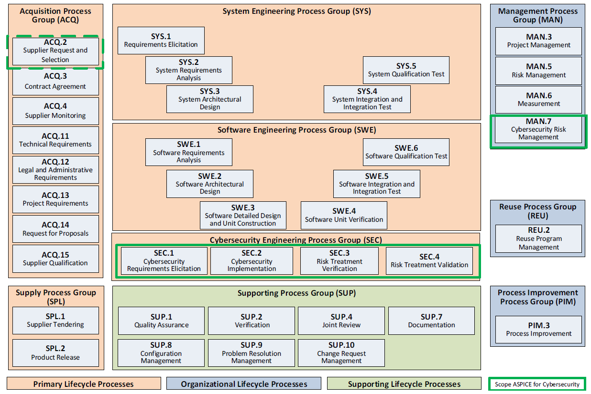
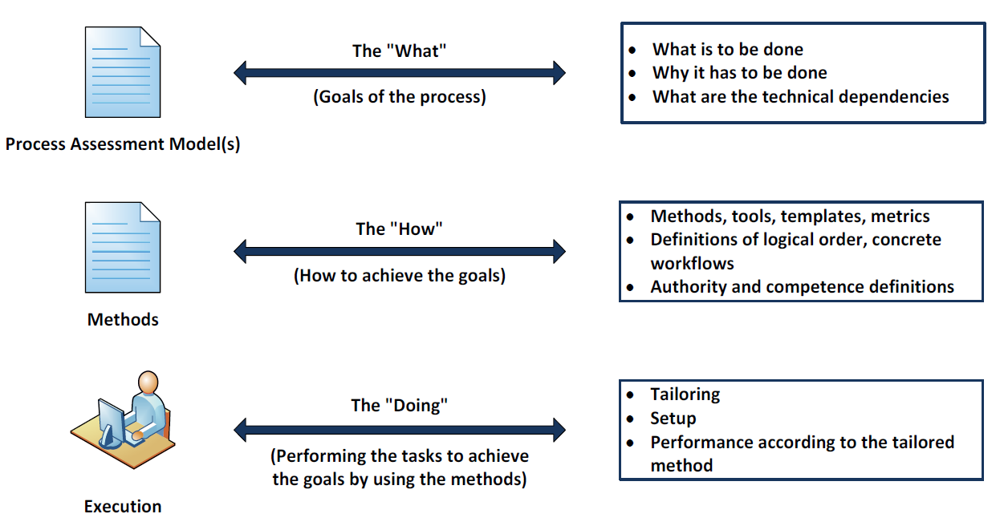
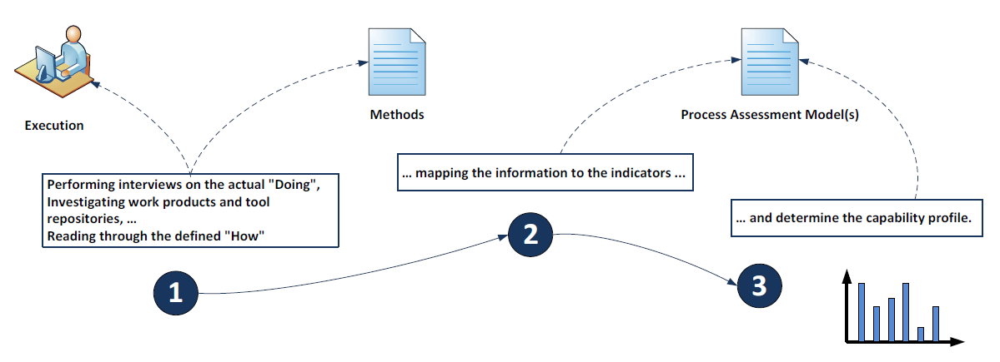
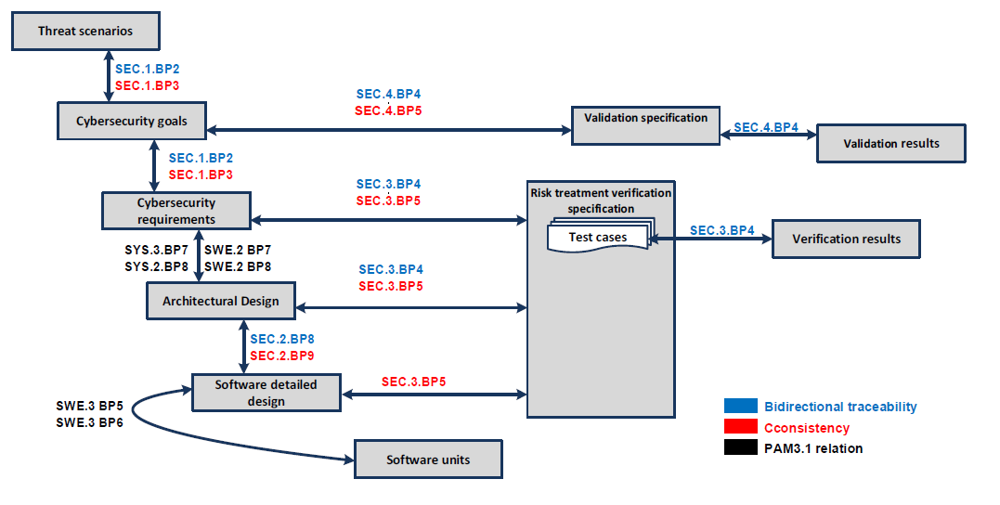

#########################################################################
Automotive SPICE for Cybersecurity Process Reference and Assessment Model
#########################################################################

Quality Management in the Automotive Industry

Automotive SPICE\ :sup:`®`
--------------------------

Process Reference and Assessment

Model for Cybersecurity Engineering

.. table::

   +----------------------+------------------------------------------------------+
   | **Title:**           | Automotive SPICE\ :sup:`®` for Cybersecurity Process |
   |                      | Reference and Assessment Model                       |
   +----------------------+------------------------------------------------------+
   | **Author(s):**       | VDA QMC Project Group 13                             |
   +----------------------+------------------------------------------------------+
   | **Version:**         | 1.0                                                  |
   +----------------------+------------------------------------------------------+
   | **Date:**            | 2021-07-16                                           |
   +----------------------+------------------------------------------------------+
   | **Status:**          | PUBLISHED                                            |
   +----------------------+------------------------------------------------------+
   | **Confidentiality:** | Public                                               |
   +----------------------+------------------------------------------------------+

Copyright Notice
-----------------

This document is a supplement to the Automotive SPICE Process Assessment Model 3.1. It has been
developed by the Project Group 13 of the Quality Management Center (QMC) in the German Association
of the Automotive Industry.

This document reproduces relevant material from:

• **ISO/IEC 33020:2015**

   Information technology – Process assessment – Process measurement framework for assessment of
   process capability

**ISO/IEC 33020:2015** provides the following copyright release statement:

*‘Users of this International Standard may reproduce subclauses 5.2, 5.3, 5.4
and 5.6 as part of any process assessment model or maturity model so that
it can be used for its intended purpose.’*

Relevant material from this standard is incorporated under the copyright release notice.

The Automotive SPICE\ :sup:`®` for cybersecurity Process Assessment Model may be obtained free of
charge via download from the *www.automotivespice.com* website.

Trademark
---------

Automotive SPICE\ :sup:`®` is a registered trademark of the *Verband der Automobilindustrie e.V.*
(VDA).

For further information about Automotive SPICE\ :sup:`®` visit
`www.vda-qmc.de. <http://www.vda-qmc.de/>`__

Table of Contents
-----------------

.. contents::

List of Figures
---------------

Figure 1 — Process Assessment Model Relationship ...................................................... 10

Figure 2 — Automotive SPICE and Automotive SPICE for Cybersecurity Process Reference Model – Overview . 11

Figure 3 — Possible Levels of Abstraction for the Term "Process" ...................................... 17

Figure 4 — Performing a Process Assessment for Determining Process Capability ......................... 18

Figure 5 — Bidirectional traceability and consistency ................................................. 74

List of Tables
--------------

Table 2 — Primary Lifecycle Processes – ACQ ......................................... 12

Table 3 — Primary Lifecycle Processes – SPL ......................................... 13

Table 4 — Primary Lifecycle Processes – SEC ......................................... 13

Table 5 — Primary Lifecycle Processes – SYS ......................................... 13

Table 6 — Primary Lifecycle Processes – SWE ......................................... 14

Table 7 — Supporting Lifecycle Processes – SUP ...................................... 14

Table 8 — Organizational Lifecycle Processes – MAN .................................. 15

Table 9 — Organizational Lifecycle Processes – PIM .................................. 15

Table 10 — Organizational Lifecycle Processes – REU ................................. 15

Table B.1 — Structure of WPC Tables ................................................. 47

Table B.2 — Work Product Characteristics ............................................ 48

Table C.1 — Terminology ............................................................. 67

Table C.2 — Abbreviations ........................................................... 72

Introduction
------------

**Scope**

The UNECE regulation R155 requires, among others, that the vehicle manufacturer identify and manage
cybersecurity risks in the supply chain. Automotive SPICE is a process assessment model, when used
with an appropriate assessment method, which helps to identify process-related product risks. To
incorporate cybersecurity-related processes into the proven scope of Automotive SPICE, additional
processes have been defined in a Process Reference and Assessment Model for Cybersecurity
Engineering (Cybersecurity PAM).

Part I of this document supplements the Automotive SPICE PAM 3.1 enabling the evaluation of
cybersecurity-relevant development processes.

A prerequisite for performing an assessment using the Automotive SPICE for Cybersecurity PAM is the
existence of an ASPICE assessment result for the VDA scope with a comparable assessment scope.
Otherwise, an assessment using both the Automotive SPICE for Cybersecurity PAM and ASPICE PAM for
the VDA scope processes has to be performed.

Part II of this document complements the existing Automotive SPICE Guideline (1\ :sup:`st` edition).
It contains interpretation and rating guidelines for the processes defined in Part I. Chapters 1 and
2 of the Automotive SPICE Guideline (1\ :sup:`st` edition) also apply to Part II and therefore are
not repeated here.

Annex B contains a subset of Work Product Characteristics that are relevant for the processes of
Automotive SPICE for Cybersecurity.

Annex C contains a subset of terms that are relevant for the processes of Automotive SPICE for
cybersecurity.

NOTE: this free download version does not contain Part II and Annex D of this document.

Statement of Compliance
-----------------------

The Automotive SPICE process assessment and process reference models conform with
ISO/IEC 33004:2015, and can be used as the basis for conducting an assessment of
process capability.

ISO/IEC 33020:2015 is used as an ISO/IEC 33003-compliant measurement framework.

A statement of compliance of the process assessment and process reference models with the
requirements of ISO/IEC 33004:2015 is provided in Annex A.

Relation to ISO/SAE 21434
-------------------------

The purpose of an Automotive SPICE assessment is to identify systematic weaknesses in the primary
life cycle processes, management processes, and support processes.

Automotive SPICE PAM3.1 and Automotive SPICE for Cybersecurity are covering system engineering and
software engineering. Indicators for mechanical engineering and hardware engineering are not part of
the current Automotive SPICE PAMs.

Certain aspects of the ISO/SAE 21434 are not in the scope of this document, as they are not
performed in a development project context. They are addressed by the Automotive Cybersecurity
Management System (ACSMS). These aspects, such as cybersecurity management, continuous cybersecurity
activities, and post-development phases are subject to an audit of the cybersecurity management
system.

The capability determination of processes for distributed cybersecurity activities, concept
development, product development, cybersecurity validation, and threat analysis and risk assessment
is supported by this document.

Project-dependent cybersecurity management is supported as follows:

-  Cybersecurity responsibilities: GP 2.1.5 – Define responsibilities and authorities for performing
   the process.

-  Cybersecurity planning: GP 2.1.2 – Plan the performance of the process to fulfill the identified
   objectives and MAN.3 Project Management.

-  Tailoring of cybersecurity activities: PA 3.2 – Process deployment and GP 2.1.2 – Plan the
   performance of the process to fulfill the identified objectives.

-  Reuse: included in make-buy reuse analysis SWE.2.BP6 – Evaluate alternative software architectures,
   SYS.3.BP5 – Evaluate alternative system architectures and REU.2 – Reuse Program Management.

-  Component out of context: covered by Cybersecurity Engineering Process Group (SEC) based on
   assumptions regarding cybersecurity goals.

-  Off-the-shelf component: ACQ.2 – Supplier Request and Selection and MAN.7 – Cybersecurity Risk
   Management.

-  Cybersecurity case: input provided by base practices "summarize and communicate result" of
   engineering processes.

-  Cybersecurity assessment: ASPICE for Cybersecurity is a model for process capability
   determination. An in-depth technical analysis is not part of an ASPICE for Cybersecurity
   assessment.

-  Release for post-development: SPL.2 – Product Release, SUP.8 – Configuration Management Process,
   and SUP.1 – Quality Assurance Process.

The term "item" as described in Annex C is used in Automotive SPICE to define an identifiable part
of system or software (this might be different to its use in other standards).

Process Reference and Assessment Model for Cybersecurity Engineering
--------------------------------------------------------------------

1 Process Capability Assessment
-------------------------------

The concept of process capability assessment by using a process assessment model is based on a
two-dimensional framework. The first dimension is provided by processes defined in a process
reference model (process dimension). The second consists of capability levels that are further
subdivided into process attributes (capability dimension). The process attributes provide the
measurable characteristics of process capability.

The process assessment model selects processes from a process reference model and supplements it
with indicators. These indicators support the collection of objective evidence that enable an
assessor to assign ratings for processes according to the capability dimension.

The relationship is shown in Figure 1:

.. figure:: media/figure1.png

   Figure 1 — Process Assessment Model Relationship

1.1 Process reference model
~~~~~~~~~~~~~~~~~~~~~~~~~~~

Processes are grouped by category and at a second level into groups according to the type of
activity they address.

There are three process categories: primary lifecycle, organizational lifecycle, and supporting
lifecycle processes.

Each process is described in terms of a purpose statement. The purpose statement contains the unique
functional objectives of the process when performed in a particular environment. For each purpose
statement, a list of specific outcomes is associated representing the expected positive results from
the process performance.

For the process dimension, the Automotive SPICE and Automotive SPICE for Cybersecurity process
reference models provide the set of processes shown in Figure 2.

   Figure 2 — Automotive SPICE and Automotive SPICE for Cybersecurity Process Reference Model – Overview

1.1.1 Primary Lifecycle Processes category
^^^^^^^^^^^^^^^^^^^^^^^^^^^^^^^^^^^^^^^^^^

The Primary Lifecycle Processes category consists of processes that may be used by the customer when
acquiring products from a supplier, and by the supplier when responding and delivering products to
the customer, including the engineering processes needed for specification, design, development,
integration and testing.

The Primary Lifecycle Processes category consists of the following groups:

-  the Acquisition Process Group

-  the Supply Process Group

-  the Security Engineering Process Group

-  the System Engineering Process Group

-  the Software Engineering Process Group

The Acquisition Process Group (ACQ) consists of processes that are performed by the customer, or the
supplier when acting as a customer for its own suppliers, in order to acquire a product and/or
service.

.. table:: Table 1 — Primary Lifecycle Processes – ACQ

   +----------------+--------------------------------------------------------------------------+
   | **ACQ.2**      | Supplier Request and Selection                                           |
   +----------------+--------------------------------------------------------------------------+
   | **ACQ.3**      | Contract Agreement                                                       |
   +----------------+--------------------------------------------------------------------------+
   | **ACQ.4**      | Supplier Monitoring                                                      |
   +----------------+--------------------------------------------------------------------------+
   | **ACQ.11**     | Technical Requirements                                                   |
   +----------------+--------------------------------------------------------------------------+
   | **ACQ.12**     | Legal and Administrative Requirements                                    |
   +----------------+--------------------------------------------------------------------------+
   | **ACQ.13**     | Project Requirements                                                     |
   +----------------+--------------------------------------------------------------------------+
   | **ACQ.14**     | Request for Proposals                                                    |
   +----------------+--------------------------------------------------------------------------+
   | **ACQ.15**     | Supplier Qualification                                                   |
   +----------------+--------------------------------------------------------------------------+

The Supply Process Group (SPL) consists of processes performed by the supplier in order to supply a
product and/or a service.

.. table:: Table 2 — Primary Lifecycle Processes – SPL

   +----------------+--------------------------------------------------------------------------+
   | **SPL.1**      | Supplier Tendering                                                       |
   +----------------+--------------------------------------------------------------------------+
   | **SPL.2**      | Product Release                                                          |
   +----------------+--------------------------------------------------------------------------+

The Security Engineering Process Group (SEC) consists of processes performed in order to achieve
cybersecurity goals.

.. table:: Table 3 — Primary Lifecycle Processes – SEC

   +----------------+--------------------------------------------------------------------------+
   | **SEC.1**      | Cybersecurity Requirements Elicitation                                   |
   +----------------+--------------------------------------------------------------------------+
   | **SEC.2**      | Cybersecurity Implementation                                             |
   +----------------+--------------------------------------------------------------------------+
   | **SEC.3**      | Risk Treatment Verification                                              |
   +----------------+--------------------------------------------------------------------------+
   | **SEC.4**      | Risk Treatment Validation                                                |
   +----------------+--------------------------------------------------------------------------+

The System Engineering Process Group (SYS) consists of processes addressing the elicitation and
management of customer and internal requirements, definition of the system architecture and the
integration and testing at the system level.

.. table:: Table 4 — Primary Lifecycle Processes – SYS

   +----------------+--------------------------------------------------------------------------+
   | **SYS.1**      | Requirements Elicitation                                                 |
   +----------------+--------------------------------------------------------------------------+
   | **SYS.2**      | System Requirements Analysis                                             |
   +----------------+--------------------------------------------------------------------------+
   | **SYS.3**      | System Architectural Design                                              |
   +----------------+--------------------------------------------------------------------------+
   | **SYS.4**      | System Integration and Integration Test                                  |
   +----------------+--------------------------------------------------------------------------+
   | **SYS.5**      | System Qualification Test                                                |
   +----------------+--------------------------------------------------------------------------+

The Software Engineering Process Group (SWE) consists of processes addressing the management of
software requirements derived from the system requirements and the system architecture, development
of the corresponding software architecture, and design as well as the implementation, integration
and testing of the software.

.. table:: Table 5 — Primary Lifecycle Processes – SWE

   +----------------+--------------------------------------------------------------------------+
   | **SWE.1**      | Software Requirements Analysis                                           |
   +----------------+--------------------------------------------------------------------------+
   | **SWE.2**      | Software Architectural Design                                            |
   +----------------+--------------------------------------------------------------------------+
   | **SWE.3**      | Software Detailed Design and Unit Construction                           |
   +----------------+--------------------------------------------------------------------------+
   | **SWE.4**      | Software Unit Verification                                               |
   +----------------+--------------------------------------------------------------------------+
   | **SWE.5**      | Software Integration and Integration Test                                |
   +----------------+--------------------------------------------------------------------------+
   | **SWE.6**      | Software Qualification Test                                              |
   +----------------+--------------------------------------------------------------------------+

1.1.2 Supporting Lifecycle Processes category
^^^^^^^^^^^^^^^^^^^^^^^^^^^^^^^^^^^^^^^^^^^^^^

The Supporting Lifecycle Processes (SUP) category consists of processes that may be employed by any
of the other processes at various points in the lifecycle.

.. table:: Table 6 — Supporting Lifecycle Processes – SUP

   +----------------+--------------------------------------------------------------------------+
   | **SUP.1**      | Quality Assurance                                                        |
   +----------------+--------------------------------------------------------------------------+
   | **SUP.2**      | Verification                                                             |
   +----------------+--------------------------------------------------------------------------+
   | **SUP.4**      | Joint Review                                                             |
   +----------------+--------------------------------------------------------------------------+
   | **SUP.7**      | Documentation                                                            |
   +----------------+--------------------------------------------------------------------------+
   | **SUP.8**      | Configuration Management                                                 |
   +----------------+--------------------------------------------------------------------------+
   | **SUP.9**      | Problem Resolution Management                                            |
   +----------------+--------------------------------------------------------------------------+
   | **SUP.10**     | Change Request Management                                                |
   +----------------+--------------------------------------------------------------------------+

1.1.3 Organizational Lifecycle Processes category
^^^^^^^^^^^^^^^^^^^^^^^^^^^^^^^^^^^^^^^^^^^^^^^^^^

The Organizational Lifecycle Processes category consists of processes that develop process, product
and resource assets which, when used by projects in the organization, will help the organization
achieve its business goals.

The organizational Lifecycle Processes category consists of the following groups:

-  the Management Process Group

-  the Process Improvement Process Group

-  the Reuse Process Group

The Management Process Group (MAN) consists of processes that may be used by anyone who manages any
type of project or process within the lifecycle.

.. table:: Table 7 — Organizational Lifecycle Processes – MAN

   +----------------+--------------------------------------------------------------------------+
   | **MAN.3**      | Project Management                                                       |
   +----------------+--------------------------------------------------------------------------+
   | **MAN.5**      | Risk Management                                                          |
   +----------------+--------------------------------------------------------------------------+
   | **MAN.6**      | Measurement                                                              |
   +----------------+--------------------------------------------------------------------------+
   | **MAN.7**      | Cybersecurity Risk Management                                            |
   +----------------+--------------------------------------------------------------------------+

The Process Improvement Process Group (PIM) covers one process that

contains practices to improve the processes performed in the organizational unit.

.. table:: Table 8 — Organizational Lifecycle Processes – PIM

   +----------------+--------------------------------------------------------------------------+
   | **PIM.3**      | Process Improvement                                                      |
   +----------------+--------------------------------------------------------------------------+

The Reuse Process Group (REU) covers one process to systematically exploit opportunities in an
organization’s reuse programs.

.. table:: Table 9 — Organizational Lifecycle Processes – REU

   +----------------+--------------------------------------------------------------------------+
   | **REU.2**      | Reuse Program Management                                                 |
   +----------------+--------------------------------------------------------------------------+

1.2 Measurement framework
~~~~~~~~~~~~~~~~~~~~~~~~~~

The process capability levels, process attributes, rating scale and capability level rating model
are identical to those defined in ISO/IEC 33020:2015, clause 5.2. The detailed descriptions of the
capability levels and corresponding process attributes can be found in Automotive SPICE PAM 3.1.

1.3 Understanding the level of abstraction of a PAM
~~~~~~~~~~~~~~~~~~~~~~~~~~~~~~~~~~~~~~~~~~~~~~~~~~~~

The term "process" can be understood at three levels of abstraction. Note that these levels of
abstraction are not meant to define a strict black-orwhite split or provide a scientific
classification schema. The message here is to understand that, in practice, when it comes to the
term "process" there are different abstraction levels, and that a PAM resides at the highest.

   Figure 3 — Possible Levels of Abstraction for the Term "Process"

Capturing experience acquired during product development (i.e., at the DOING level) in order to
share this experience with others means creating a HOW level. However, a HOW is always specific to a
particular context such as a company, organizational unit or product line. For example, the HOW of a
project, organizational unit, or company A is potentially not applicable as is to a project,
organizational unit or company B. However, both might be expected to adhere the principles
represented by PAM indicators for process outcomes and process attribute achievements. These
indicators are at the WHAT level, while deciding on solutions for concrete templates, proceedings,
tooling, etc. is left to the HOW level.

   Figure 4 — Performing a Process Assessment for Determining Process Capability

2 Process Reference Model and Performance Indicators (Level 1)
--------------------------------------------------------------

2.1 Acquisition Process Group (ACQ)
~~~~~~~~~~~~~~~~~~~~~~~~~~~~~~~~~~~

2.1.1 ACQ.2 Supplier request and selection
^^^^^^^^^^^^^^^^^^^^^^^^^^^^^^^^^^^^^^^^^^

.. stake_req:: Supplier request and selection
   :id: ACQ2
   :status: new
   :safety_level: not set
   :security_level: not set

   **Process ID**

   **ACQ.2**

   **Process name**

   **Supplier Request and Selection**

   **Process purpose**

   The purpose of supplier request and selection process is to award a
   supplier for a contract/agreement based on relevant criteria.

   **Process outcomes**

   As a result of successful implementation of this process:

   .. stake_req:: 1
      :id: ACQ2_OUT1
      :status: new
      :safety_level: not set
      :security_level: not set
      :output: 18-50

      evaluation criteria are established for suppliers,

   .. stake_req:: 2
      :id: ACQ2_OUT2
      :status: new
      :safety_level: not set
      :security_level: not set
      :output: 14-05, 15-21

      suppliers are evaluated against the defined criteria,

   .. stake_req:: 3
      :id: ACQ2_OUT3
      :status: new
      :safety_level: not set
      :security_level: not set
      :output: 12-01, 14-02

      a request for quotation is issued to supplier candidates, and

   .. stake_req:: 4
      :id: ACQ2_OUT4
      :status: new
      :safety_level: not set
      :security_level: not set
      :output: 02-00, 02-01, 02-50, 08-20, 14-02

      contract, action, and risk mitigation plans are agreed. The supplier is
      contracted in consideration of the evaluation result.

   **Base practices**

   .. stake_req:: ACQ.2.BP1: Establish supplier evaluation criteria.
      :id: ACQ2_BP1
      :status: new
      :safety_level: not set
      :security_level: not set
      :output: ACQ2_OUT1

      Analyze relevant requirements to define evaluation criteria for supplier’s capabilities.

   *NOTE 1: Criteria may consider:*

   -  *Functional and non-functional requirements*

   -  *Technical evaluation regarding cybersecurity capabilities of the supplier,
      including cybersecurity concepts and methods (threat analysis and risk
      assessment, attack models, vulnerability analysis, etc.)*

   -  *The organization’s capability of the supplier concerning cybersecurity
      (e.g., cybersecurity best practices from the development, post-development,
      governance, quality, and information security)*

   -  *Continuous operation, including cybersecurity*

   -  *Supplier capability and performance evidence in terms of cybersecurity obtained by supplier
      monitoring in previous projects*

   .. stake_req:: ACQ.2.BP2: Evaluate potential suppliers.
      :id: ACQ2_BP2
      :status: new
      :safety_level: not set
      :security_level: not set
      :output: ACQ2_OUT2

      Collect information about the supplier’s capabilities and evaluate it against the
      established evaluation criteria. Short-list the preferred suppliers and document the results.

   *NOTE 2: The evaluation of potential suppliers may be supported by:*

   -  *Summaries of previous Automotive SPICE for Cybersecurity assessments*

   -  *Evidence of the organizational cybersecurity management system (e.g., organizational audit
      results if available)*

   -  *Evidence of an information security management system*

   -  *Evidence of the organization's quality management system appropriate/capable of
      supporting cybersecurity engineering*

   .. stake_req:: ACQ.2.BP3: Prepare and execute request for quotation
      :id: ACQ2_BP3
      :status: new
      :safety_level: not set
      :security_level: not set
      :output: ACQ2_OUT3, ACQ2_OUT4

      *(RFQ).* Identify supplier candidates based on the evaluation. Prepare and issue a request for
      quotation including a corrective action plan for identified deviations.

   *NOTE 3: The request for quotation may include:*

   -  *A formal request to conform with all customer relevant and legal standards*

   -  *Cybersecurity responsibilities of the supplier*

   -  *The scope of work regarding cybersecurity, including the cybersecurity goals or the set
      of relevant cybersecurity requirements and their attributes, depending on what the
      supplier is quoting for*

   -  *Action plan for identified deviations and risks*

   .. stake_req:: ACQ.2.BP4: Negotiate and award the contract/agreement.
      :id: ACQ2_BP4
      :status: new
      :safety_level: not set
      :security_level: not set
      :output: ACQ2_OUT4

      Establish a contract based on the evaluation of the request for quotation
      results, covering the relevant requirements and the agreed corrective actions.

   *NOTE 4: Distributed cybersecurity activities may be specified within a cybersecurity
   interface agreement considering all relevant aspects (e.g., contacts, tailoring,
   responsibilities, information share, milestones, timing).*

   *NOTE 5: In case of deliverables without any support (e.g. free and open source software),
   an interface agreement is not required.*

   **Output work products**

   .. table::
      :widths: 20 80

      +---------------+--------------------------------------------------+
      | :need:`02-00` | [OUTCOME :need:`ACQ2_OUT4` ]                     |
      +---------------+--------------------------------------------------+
      | :need:`02-01` | [OUTCOME :need:`ACQ2_OUT4` ]                     |
      +---------------+--------------------------------------------------+
      | :need:`02-50` | [OUTCOME :need:`ACQ2_OUT4` ]                     |
      +---------------+--------------------------------------------------+
      | :need:`08-20` | [OUTCOME :need:`ACQ2_OUT4` ]                     |
      +---------------+--------------------------------------------------+
      | :need:`12-01` | [OUTCOME :need:`ACQ2_OUT3` ]                     |
      +---------------+--------------------------------------------------+
      | :need:`14-02` | [OUTCOME :need:`ACQ2_OUT3`, :need:`ACQ2_OUT4` ]  |
      +---------------+--------------------------------------------------+
      | :need:`14-05` | [OUTCOME :need:`ACQ2_OUT2` ]                     |
      +---------------+--------------------------------------------------+
      | :need:`15-21` | [OUTCOME :need:`ACQ2_OUT2` ]                     |
      +---------------+--------------------------------------------------+
      | :need:`18-50` | [OUTCOME :need:`ACQ2_OUT1` ]                     |
      +---------------+--------------------------------------------------+

   +----------------------+-------------------+-------------------+-------------------+-------------------+
   |                      | :need:`ACQ2_OUT1` | :need:`ACQ2_OUT2` | :need:`ACQ2_OUT3` | :need:`ACQ2_OUT4` |
   +----------------------+-------------------+-------------------+-------------------+-------------------+
   | Base Practices                                                                                       |
   +----------------------+-------------------+-------------------+-------------------+-------------------+
   | :need:`ACQ2_BP1`     | x                 |                   |                   |                   |
   +----------------------+-------------------+-------------------+-------------------+-------------------+
   | :need:`ACQ2_BP2`     |                   | x                 |                   |                   |
   +----------------------+-------------------+-------------------+-------------------+-------------------+
   | :need:`ACQ2_BP3`     |                   |                   | x                 | x                 |
   +----------------------+-------------------+-------------------+-------------------+-------------------+
   | :need:`ACQ2_BP4`     |                   |                   |                   | x                 |
   +----------------------+-------------------+-------------------+-------------------+-------------------+
   | Output Work Products                                                                                 |
   +----------------------+-------------------+-------------------+-------------------+-------------------+
   | :need:`02-00`        |                   |                   |                   | x                 |
   +----------------------+-------------------+-------------------+-------------------+-------------------+
   | :need:`02-01`        |                   |                   |                   | x                 |
   +----------------------+-------------------+-------------------+-------------------+-------------------+
   | :need:`02-50`        |                   |                   |                   | x                 |
   +----------------------+-------------------+-------------------+-------------------+-------------------+
   | :need:`08-20`        |                   |                   |                   | x                 |
   +----------------------+-------------------+-------------------+-------------------+-------------------+
   | :need:`12-01`        |                   |                   | x                 |                   |
   +----------------------+-------------------+-------------------+-------------------+-------------------+
   | :need:`14-02`        |                   |                   | x                 | x                 |
   +----------------------+-------------------+-------------------+-------------------+-------------------+
   | :need:`14-05`        |                   | x                 |                   |                   |
   +----------------------+-------------------+-------------------+-------------------+-------------------+
   | :need:`15-21`        |                   | x                 |                   |                   |
   +----------------------+-------------------+-------------------+-------------------+-------------------+
   | :need:`18-50`        | x                 |                   |                   |                   |
   +----------------------+-------------------+-------------------+-------------------+-------------------+

2.2 Management Process Group (MAN)
~~~~~~~~~~~~~~~~~~~~~~~~~~~~~~~~~~

2.2.1 MAN.7 Cybersecurity Risk Management
^^^^^^^^^^^^^^^^^^^^^^^^^^^^^^^^^^^^^^^^^

.. stake_req:: Cybersecurity Risk Management
   :id: MAN7
   :status: new
   :safety_level: not set
   :security_level: not set

   **Process ID**

   **MAN.7**

   **Process name**

   **Cybersecurity Risk Management**

   **Process purpose**

   The purpose of the Cybersecurity Risk Management Process is to identify,
   prioritize, and analyze risks of damage to relevant stakeholders as well as
   monitor and control respective risk treatment options continuously.

   **Process outcomes**

   As a result of successful implementation of this process:

   .. stake_req:: 1
      :id: MAN7_OUT1
      :status: new
      :safety_level: not set
      :security_level: not set
      :output: 08-19, 14-51, 14-52

      the scope of the risk management to be performed is determined,

   .. stake_req:: 2
      :id: MAN7_OUT2
      :status: new
      :safety_level: not set
      :security_level: not set
      :output: 08-19

      appropriate risk management practices are defined and implemented,

   .. stake_req:: 3
      :id: MAN7_OUT3
      :status: new
      :safety_level: not set
      :security_level: not set
      :output: 14-51, 14-52

      potential risks are identified as they evolve,

   .. stake_req:: 4
      :id: MAN7_OUT4
      :status: new
      :safety_level: not set
      :security_level: not set
      :output: 08-19, 14-08

      potential risks are prioritized initially for estimated damage and impact,

   .. stake_req:: 5
      :id: MAN7_OUT5
      :status: new
      :safety_level: not set
      :security_level: not set
      :output: 08-19, 14-08, 14-51, 15-08

      potential risks are analyzed and risks are evaluated,

   .. stake_req:: 6
      :id: MAN7_OUT6
      :status: new
      :safety_level: not set
      :security_level: not set
      :output: 07-07, 08-14, 08-19, 13-20, 14-08, 15-08, 15-09

      risk treatment options are determined,

   .. stake_req:: 7
      :id: MAN7_OUT7
      :status: new
      :safety_level: not set
      :security_level: not set
      :output: 08-14, 08-19, 13-20, 14-08, 15-09

      risks are continuously monitored and identified for relevant changes, and

   .. stake_req:: 8
      :id: MAN7_OUT8
      :status: new
      :safety_level: not set
      :security_level: not set
      :output: 08-14, 08-19, 13-20, 14-08, 15-09

      corrective actions are performed on relevant changes.

   **Base practices**

   .. stake_req:: MAN.7.BP1: Determine cybersecurity risk management scope.
      :id: MAN7_BP1
      :status: new
      :safety_level: not set
      :security_level: not set
      :output: MAN7_OUT1

      Determine the scope of the cybersecurity risk management to be performed including project
      and project assets with cybersecurity properties, damage scenarios, relevant
      stakeholders, impact categories and related product phases.
      Determine the scope in accordance with its operational environment and
      organizational risk management policies.

   *NOTE 1: Cybersecurity properties of assets include confidentiality, integrity and availability.*

   *NOTE 2: Typical impact categories are safety, financial, operational and privacy.*

   .. stake_req:: MAN.7.BP2: Define cybersecurity risk management practices.
      :id: MAN7_BP2
      :status: new
      :safety_level: not set
      :security_level: not set
      :output: MAN7_OUT2

      Define appropriate practices to manage the cybersecurity risks according to the
      defined scope including:

      -  Potential risk identification

      -  Risk analysis

      -  Risk evaluation

      -  Risk determination

      -  Risk treatment decision

   *NOTE 3: Relevant risk assessment practices may be included from established
   standards covering practices such as FMEA, TARA, HARA, FTA.*

   .. stake_req:: MAN.7.BP3: Identify potential risks.
      :id: MAN7_BP3
      :status: new
      :safety_level: not set
      :security_level: not set
      :output: MAN7_OUT3

      Identify potential risks within the
      project scope initially and during the conduct of the project, continuously
      looking for risk factors at any occurrence of technical or managerial decisions.

   *NOTE 4: The identification of potential risks shall include the determination
   of threat scenarios that impose a specific risk to initiate a damage scenario
   with impact on relevant stakeholders for all related properties and assets within the scope.*

   .. stake_req:: MAN.7.BP4: Prioritize potential risks initially for damage.
      :id: MAN7_BP4
      :status: new
      :safety_level: not set
      :security_level: not set
      :output: MAN7_OUT4

      Prioritize potential risks with respect to damage and impact on the relevant category and
      stakeholder.

   *NOTE 5: The potential risks prioritization may be consistent with the scope of risk assessment.*

   .. stake_req:: MAN.7.BP5: Analyze potential risks and evaluate risks.
      :id: MAN7_BP5
      :status: new
      :safety_level: not set
      :security_level: not set
      :output: MAN7_OUT5

      Analyze potential risks to determine the probability, consequence, and severity of risks.

   *NOTE 6: Risks are analyzed based on identified attack paths that realize a
   threat scenario and the ease with which identified attack paths can be conducted.*

   *NOTE 7: Different techniques for evaluation of metrics, rating and scoring
   scheme may be used to analyze a system, e.g.,*
   *functional analysis, simulation, FMEA, FTA, ATA etc.*

   .. stake_req:: MAN.7.BP6: Define risk treatment option.
      :id: MAN7_BP6
      :status: new
      :safety_level: not set
      :security_level: not set
      :output: MAN7_OUT6

      For each risk (or set of risks) define the selected treatment option to accept, reduce, avoid or
      share (transfer) the risks.

   *NOTE 8: Typically accepted and shared risks define cybersecurity claims.*

   .. stake_req:: MAN.7.BP7: Monitor risks.
      :id: MAN7_BP7
      :status: new
      :safety_level: not set
      :security_level: not set
      :output: MAN7_OUT7

      For each risk (or set of risks) determine changes in the status of a
      risk and evaluate the progress of the treatment activities.

   *NOTE 9: Major risks may need to be communicated to and monitored by higher levels of management.*

   *NOTE 10: Risk treatment decisions may be revised for changed conditions or arise from new and
   updated estimations and analysis results.*

   .. stake_req:: MAN.7.BP8: Take corrective action.
      :id: MAN7_BP8
      :status: new
      :safety_level: not set
      :security_level: not set
      :output: MAN7_OUT8

      When relevant changes to risks are identified, take appropriate corrective action.

   *NOTE 11: Corrective actions may involve a reevaluation of risks,
   developing and implementing new risk treatment practices or adjusting existing practices.*

   **Output work products**

   .. table::
      :widths: 20 80

      +---------------+--------------------------------------------------+
      | :need:`07-07` | [OUTCOME :need:`MAN7_OUT6` ]                     |
      +---------------+--------------------------------------------------+
      | :need:`08-14` | [OUTCOME :need:`MAN7_OUT6`, :need:`MAN7_OUT7`,   |
      |               | :need:`MAN7_OUT8` ]                              |
      +---------------+--------------------------------------------------+
      | :need:`08-19` | [OUTCOME :need:`MAN7_OUT1`, :need:`MAN7_OUT2`,   |
      |               | :need:`MAN7_OUT4`, :need:`MAN7_OUT5`,            |
      |               | :need:`MAN7_OUT6`, :need:`MAN7_OUT7`,            |
      |               | :need:`MAN7_OUT8` ]                              |
      +---------------+--------------------------------------------------+
      | :need:`13-20` | [OUTCOME :need:`MAN7_OUT6`, :need:`MAN7_OUT7`,   |
      |               | :need:`MAN7_OUT8` ]                              |
      +---------------+--------------------------------------------------+
      | :need:`14-08` | [OUTCOME :need:`MAN7_OUT4`, :need:`MAN7_OUT5`,   |
      |               | :need:`MAN7_OUT6`, :need:`MAN7_OUT7`,            |
      |               | :need:`MAN7_OUT8` ]                              |
      +---------------+--------------------------------------------------+
      | :need:`14-51` | [OUTCOME :need:`MAN7_OUT1`, :need:`MAN7_OUT3`,   |
      |               | :need:`MAN7_OUT5` ]                              |
      +---------------+--------------------------------------------------+
      | :need:`14-52` | [OUTCOME :need:`MAN7_OUT1`, :need:`MAN7_OUT3` ]  |
      +---------------+--------------------------------------------------+
      | :need:`15-08` | [OUTCOME :need:`MAN7_OUT5`, :need:`MAN7_OUT6` ]  |
      +---------------+--------------------------------------------------+
      | :need:`15-09` | [OUTCOME :need:`MAN7_OUT6`, :need:`MAN7_OUT7`,   |
      |               | :need:`MAN7_OUT8` ]                              |
      +---------------+--------------------------------------------------+

   +----------------------+-------------------+-------------------+-------------------+-------------------+-------------------+-------------------+-------------------+-------------------+
   |                      | :need:`MAN7_OUT1` | :need:`MAN7_OUT2` | :need:`MAN7_OUT3` | :need:`MAN7_OUT4` | :need:`MAN7_OUT5` | :need:`MAN7_OUT6` | :need:`MAN7_OUT7` | :need:`MAN7_OUT8` |
   +----------------------+-------------------+-------------------+-------------------+-------------------+-------------------+-------------------+-------------------+-------------------+
   | Base Practices                                                                                                                                                                       |
   +----------------------+-------------------+-------------------+-------------------+-------------------+-------------------+-------------------+-------------------+-------------------+
   | :need:`MAN7_BP1`     | x                 |                   |                   |                   |                   |                   |                   |                   |
   +----------------------+-------------------+-------------------+-------------------+-------------------+-------------------+-------------------+-------------------+-------------------+
   | :need:`MAN7_BP2`     |                   | x                 |                   |                   |                   |                   |                   |                   |
   +----------------------+-------------------+-------------------+-------------------+-------------------+-------------------+-------------------+-------------------+-------------------+
   | :need:`MAN7_BP3`     |                   |                   | x                 |                   |                   |                   |                   |                   |
   +----------------------+-------------------+-------------------+-------------------+-------------------+-------------------+-------------------+-------------------+-------------------+
   | :need:`MAN7_BP4`     |                   |                   |                   | x                 |                   |                   |                   |                   |
   +----------------------+-------------------+-------------------+-------------------+-------------------+-------------------+-------------------+-------------------+-------------------+
   | :need:`MAN7_BP5`     |                   |                   |                   |                   | x                 |                   |                   |                   |
   +----------------------+-------------------+-------------------+-------------------+-------------------+-------------------+-------------------+-------------------+-------------------+
   | :need:`MAN7_BP6`     |                   |                   |                   |                   |                   | x                 |                   |                   |
   +----------------------+-------------------+-------------------+-------------------+-------------------+-------------------+-------------------+-------------------+-------------------+
   | :need:`MAN7_BP7`     |                   |                   |                   |                   |                   |                   | x                 |                   |
   +----------------------+-------------------+-------------------+-------------------+-------------------+-------------------+-------------------+-------------------+-------------------+
   | :need:`MAN7_BP8`     |                   |                   |                   |                   |                   |                   |                   | x                 |
   +----------------------+-------------------+-------------------+-------------------+-------------------+-------------------+-------------------+-------------------+-------------------+
   | Output Work Products                                                                                                                                                                 |
   +----------------------+-------------------+-------------------+-------------------+-------------------+-------------------+-------------------+-------------------+-------------------+
   | :need:`07-07`        |                   |                   |                   |                   |                   | x                 |                   |                   |
   +----------------------+-------------------+-------------------+-------------------+-------------------+-------------------+-------------------+-------------------+-------------------+
   | :need:`08-14`        |                   |                   |                   |                   |                   | x                 | x                 | x                 |
   +----------------------+-------------------+-------------------+-------------------+-------------------+-------------------+-------------------+-------------------+-------------------+
   | :need:`08-19`        | x                 | x                 |                   | x                 | x                 | x                 | x                 | x                 |
   +----------------------+-------------------+-------------------+-------------------+-------------------+-------------------+-------------------+-------------------+-------------------+
   | :need:`13-20`        |                   |                   |                   |                   |                   | x                 | x                 | x                 |
   +----------------------+-------------------+-------------------+-------------------+-------------------+-------------------+-------------------+-------------------+-------------------+
   | :need:`14-08`        |                   |                   |                   | x                 | x                 | x                 | x                 | x                 |
   +----------------------+-------------------+-------------------+-------------------+-------------------+-------------------+-------------------+-------------------+-------------------+
   | :need:`14-51`        | x                 |                   | x                 |                   | x                 |                   |                   |                   |
   +----------------------+-------------------+-------------------+-------------------+-------------------+-------------------+-------------------+-------------------+-------------------+
   | :need:`14-52`        | x                 |                   | x                 |                   |                   |                   |                   |                   |
   +----------------------+-------------------+-------------------+-------------------+-------------------+-------------------+-------------------+-------------------+-------------------+
   | :need:`15-08`        |                   |                   |                   |                   | x                 | x                 |                   |                   |
   +----------------------+-------------------+-------------------+-------------------+-------------------+-------------------+-------------------+-------------------+-------------------+
   | :need:`15-09`        |                   |                   |                   |                   |                   | x                 | x                 | x                 |
   +----------------------+-------------------+-------------------+-------------------+-------------------+-------------------+-------------------+-------------------+-------------------+

2.3 Security Engineering Process Group (SEC)
~~~~~~~~~~~~~~~~~~~~~~~~~~~~~~~~~~~~~~~~~~~~

2.3.1 SEC.1 Cybersecurity Requirements Elicitation
^^^^^^^^^^^^^^^^^^^^^^^^^^^^^^^^^^^^^^^^^^^^^^^^^^

.. stake_req:: Cybersecurity Requirements Elicitation
   :id: SEC1
   :status: new
   :safety_level: not set
   :security_level: not set

   **Process ID**

   **SEC.1**

   **Process name**

   **Cybersecurity Requirements Elicitation**

   **Process purpose**

   The purpose of the Cybersecurity Requirements Elicitation
   Process is to derive cybersecurity goals and requirements
   from the outcomes of risk management, and ensure
   consistency between the risk assessment, cybersecurity goals and
   cybersecurity requirements.

   **Process outcomes**

   As a result of successful implementation of this process:

   .. stake_req:: 1
      :id: SEC1_OUT1
      :status: new
      :safety_level: not set
      :security_level: not set
      :output: 15-01, 17-11, 17-12, 17-51

      cybersecurity goals are defined,

   .. stake_req:: 2
      :id: SEC1_OUT2
      :status: new
      :safety_level: not set
      :security_level: not set
      :output: 15-01, 17-11, 17-12

      cybersecurity requirements are derived from
      cybersecurity goals,

   .. stake_req:: 3
      :id: SEC1_OUT3
      :status: new
      :safety_level: not set
      :security_level: not set
      :output: 13-19, 13-22

      consistency and bidirectional traceability are
      established between cybersecurity requirements and
      goals and between the cybersecurity goals and the
      threat scenarios, and

   .. stake_req:: 4
      :id: SEC1_OUT4
      :status: new
      :safety_level: not set
      :security_level: not set
      :output: 13-04

      the cybersecurity requirements are agreed and
      communicated to all affected parties.

   **Base practices**

   .. stake_req:: SEC.1.BP1: Derive cybersecurity goals and cybersecurity requirements.
      :id: SEC1_BP1
      :status: new
      :safety_level: not set
      :security_level: not set
      :output: SEC1_OUT1, SEC1_OUT2

      Derive cybersecurity goals for those threat scenarios, where the risk treatment decision
      requires risk reduction. Specify functional and non-functional cybersecurity requirements for the
      cybersecurity goals, including criteria for the achievement of the cybersecurity goals.

   *NOTE 1: This includes the refinement of requirements during iterations of this process.*

   *NOTE 2: This includes requirements for post-development phases which may include production,
   operation, maintenance and decommissioning.*

   .. stake_req:: SEC.1.BP2: Establish bidirectional traceability.
      :id: SEC1_BP2
      :status: new
      :safety_level: not set
      :security_level: not set
      :output: SEC1_OUT3

      Establish bidirectional traceability between the cybersecurity requirements and the cybersecurity
      goals. Establish bidirectional traceability between
      the cybersecurity goals and the threat scenarios. [Outcome 3]

   .. stake_req:: SEC.1.BP3: Ensure consistency.
      :id: SEC1_BP3
      :status: new
      :safety_level: not set
      :security_level: not set

      Ensure consistency between the cybersecurity requirements and the
      cybersecurity goals. Ensure consistency between the cybersecurity goals and the threat scenarios.

   .. stake_req:: SEC.1.BP4: Communicate agreed cybersecurity requirements.
      :id: SEC1_BP4
      :status: new
      :safety_level: not set
      :security_level: not set
      :output: SEC1_OUT4

      Communicate agreed cybersecurity goals and cybersecurity requirements to all affected parties.

   **Output work products**

   .. table::
      :widths: 20 80

      +---------------+--------------------------------------------------+
      | :need:`13-04` | [OUTCOME :need:`SEC1_OUT4` ]                     |
      +---------------+--------------------------------------------------+
      | :need:`13-19` | [OUTCOME :need:`SEC1_OUT3` ]                     |
      +---------------+--------------------------------------------------+
      | :need:`13-22` | [OUTCOME :need:`SEC1_OUT3` ]                     |
      +---------------+--------------------------------------------------+
      | :need:`15-01` | [OUTCOME :need:`SEC1_OUT1`, :need:`SEC1_OUT2` ]  |
      +---------------+--------------------------------------------------+
      | :need:`17-11` | [OUTCOME :need:`SEC1_OUT1`, :need:`SEC1_OUT2` ]  |
      +---------------+--------------------------------------------------+
      | :need:`17-12` | [OUTCOME :need:`SEC1_OUT1`, :need:`SEC1_OUT2` ]  |
      +---------------+--------------------------------------------------+
      | :need:`17-51` | [OUTCOME :need:`SEC1_OUT1` ]                     |
      +---------------+--------------------------------------------------+

   +----------------------+-------------------+-------------------+-------------------+-------------------+
   |                      | :need:`SEC1_OUT1` | :need:`SEC1_OUT2` | :need:`SEC1_OUT3` | :need:`SEC1_OUT4` |
   +----------------------+-------------------+-------------------+-------------------+-------------------+
   | Base Practices                                                                                       |
   +----------------------+-------------------+-------------------+-------------------+-------------------+
   | :need:`SEC1_BP1`     | x                 | x                 |                   |                   |
   +----------------------+-------------------+-------------------+-------------------+-------------------+
   | :need:`SEC1_BP2`     |                   |                   | x                 |                   |
   +----------------------+-------------------+-------------------+-------------------+-------------------+
   | :need:`SEC1_BP3`     |                   |                   | x                 |                   |
   +----------------------+-------------------+-------------------+-------------------+-------------------+
   | :need:`SEC1_BP4`     |                   |                   |                   | x                 |
   +----------------------+-------------------+-------------------+-------------------+-------------------+
   | Output Work Products                                                                                 |
   +----------------------+-------------------+-------------------+-------------------+-------------------+
   | :need:`13-04`        |                   |                   |                   | x                 |
   +----------------------+-------------------+-------------------+-------------------+-------------------+
   | :need:`13-19`        |                   |                   | x                 |                   |
   +----------------------+-------------------+-------------------+-------------------+-------------------+
   | :need:`13-22`        |                   |                   | x                 |                   |
   +----------------------+-------------------+-------------------+-------------------+-------------------+
   | :need:`15-01`        | x                 | x                 |                   |                   |
   +----------------------+-------------------+-------------------+-------------------+-------------------+
   | :need:`17-11`        | x                 | x                 |                   |                   |
   +----------------------+-------------------+-------------------+-------------------+-------------------+
   | :need:`17-12`        | x                 | x                 |                   |                   |
   +----------------------+-------------------+-------------------+-------------------+-------------------+
   | :need:`17-51`        | x                 |                   |                   |                   |
   +----------------------+-------------------+-------------------+-------------------+-------------------+

2.3.2 SEC.2 Cybersecurity Implementation
^^^^^^^^^^^^^^^^^^^^^^^^^^^^^^^^^^^^^^^^

.. stake_req:: Cybersecurity Implementation
   :id: SEC2
   :status: new
   :safety_level: not set
   :security_level: not set

   **Process ID**

   **SEC.2**

   **Process name**

   **Cybersecurity Implementation**

   **Process purpose**

   The purpose of the Cybersecurity Implementation Process is to allocate the
   cybersecurity requirements to the elements of the system and software and
   ensure they are implemented.

   **Process outcomes**

   As a result of successful implementation of this process:

   .. stake_req:: 1
      :id: SEC2_OUT1
      :status: new
      :safety_level: not set
      :security_level: not set
      :output: 04-04, 04-06

      architectural design is refined,

   .. stake_req:: 2
      :id: SEC2_OUT2
      :status: new
      :safety_level: not set
      :security_level: not set
      :output: 13-22

      cybersecurity requirements are allocated to elements of the architectural
      design,

   .. stake_req:: 3
      :id: SEC2_OUT3
      :status: new
      :safety_level: not set
      :security_level: not set
      :output: 17-52

      appropriate cybersecurity controls are selected,

   .. stake_req:: 4
      :id: SEC2_OUT4
      :status: new
      :safety_level: not set
      :security_level: not set
      :output: 15-50

      vulnerabilities are analyzed,

   .. stake_req:: 5
      :id: SEC2_OUT5
      :status: new
      :safety_level: not set
      :security_level: not set
      :output: 04-05

      detailed design is refined,

   .. stake_req:: 6
      :id: SEC2_OUT6
      :status: new
      :safety_level: not set
      :security_level: not set
      :output: 11-05

      software units are developed,

   .. stake_req:: 7
      :id: SEC2_OUT7
      :status: new
      :safety_level: not set
      :security_level: not set
      :output: 13-19, 13-22

      consistency and bidirectional traceability are established between
      architectural design and detailed design, and

   .. stake_req:: 8
      :id: SEC2_OUT8
      :status: new
      :safety_level: not set
      :security_level: not set
      :output: 13-04

      the cybersecurity risk treatment implementation is agreed upon and
      communicated to all affected parties.

   **Base practices**

   .. stake_req:: SEC.2.BP1: Refine the details of the architectural design.
      :id: SEC2_BP1
      :status: new
      :safety_level: not set
      :security_level: not set
      :output: SEC2_OUT1

      The architectural design is refined based on cybersecurity goals and cybersecurity requirements.

   *NOTE 1: Refinement could be on system and software level architecture.*

   *NOTE 2: Refinement here means to add, adapt or rework elements of the architecture.*

   .. stake_req:: SEC.2.BP2: Allocate cybersecurity requirements.
      :id: SEC2_BP2
      :status: new
      :safety_level: not set
      :security_level: not set
      :output: SEC2_OUT2

      Allocate the cybersecurity requirements to one or more elements of the architectural design.

   *NOTE 3: Cybersecurity requirements could be on system and software level.*

   .. stake_req:: SEC.2.BP3: Select cybersecurity controls.
      :id: SEC2_BP3
      :status: new
      :safety_level: not set
      :security_level: not set
      :output: SEC2_OUT3

      Select appropriate cybersecurity controls to achieve or support the cybersecurity requirements.

   *NOTE 4: Typically, cybersecurity controls are technical or other solutions to avoid, detect,
   counteract or mitigate cybersecurity risks.*

   .. stake_req:: SEC.2.BP4: Refine interfaces.
      :id: SEC2_BP4
      :status: new
      :safety_level: not set
      :security_level: not set
      :output: SEC2_OUT1

      Refine and describe cybersecurity related interfaces between
      the elements of the architectural design and operating environment.

   .. stake_req:: SEC.2.BP5: Analyze architectural design.
      :id: SEC2_BP5
      :status: new
      :safety_level: not set
      :security_level: not set
      :output: SEC2_OUT4

      Analyze the architectural design to identify and analyze vulnerabilities.

   .. stake_req:: SEC.2.BP6: Refine the details of the detailed design.
      :id: SEC2_BP6
      :status: new
      :safety_level: not set
      :security_level: not set
      :output: SEC2_OUT5

      The detailed design is refined based on architectural design.

   *NOTE 5: Refinement here means to add, adapt or rework components of the detailed design.*

   .. stake_req:: SEC.2.BP7: Develop software units.
      :id: SEC2_BP7
      :status: new
      :safety_level: not set
      :security_level: not set
      :output: SEC2_OUT6

      Implement the software using appropriate modeling or programming languages.

   *NOTE 6: Criteria for appropriate modeling and programming languages for cybersecurity can
   include the use of language subsets, enforcement of strong typing and/or the use of defensive
   implementation techniques.*

   *NOTE 7: Example to cover the defined criteria above could be the use of a coding guideline or
   an appropriate development environment.*

   .. stake_req:: SEC.2.BP8: Establish bidirectional traceability.
      :id: SEC2_BP8
      :status: new
      :safety_level: not set
      :security_level: not set
      :output: SEC2_OUT2, SEC2_OUT7

      Establish bidirectional traceability between the refined architectural
      design and the detailed design.

   .. stake_req:: SEC.2.BP9: Ensure consistency.
      :id: SEC2_BP9
      :status: new
      :safety_level: not set
      :security_level: not set
      :output: SEC2_OUT7

      Ensure consistency between the refined architectural design and the detailed design.

   .. stake_req:: SEC.2.BP10: Communicate agreed results of cybersecurity implementation.
      :id: SEC2_BP10
      :status: new
      :safety_level: not set
      :security_level: not set
      :output: SEC2_OUT8

      Communicate the agreed results of the cybersecurity implementation to all affected parties
      including stakeholders from post-development phases.

   *NOTE 8: The communicated contents may include both results of the cybersecurity implementation
   and vulnerabilities identified within the architectural design analysis.*

   **Output work products**

   .. table::
      :widths: 20 80

      +---------------+--------------------------------------------------+
      | :need:`04-04` | [OUTCOME :need:`SEC2_OUT1` ]                     |
      +---------------+--------------------------------------------------+
      | :need:`04-05` | [OUTCOME :need:`SEC2_OUT5` ]                     |
      +---------------+--------------------------------------------------+
      | :need:`04-06` | [OUTCOME :need:`SEC2_OUT1` ]                     |
      +---------------+--------------------------------------------------+
      | :need:`11-05` | [OUTCOME :need:`SEC2_OUT6` ]                     |
      +---------------+--------------------------------------------------+
      | :need:`13-04` | [OUTCOME :need:`SEC2_OUT8` ]                     |
      +---------------+--------------------------------------------------+
      | :need:`13-19` | [OUTCOME :need:`SEC2_OUT7` ]                     |
      +---------------+--------------------------------------------------+
      | :need:`13-22` | [OUTCOME :need:`SEC2_OUT2`, :need:`SEC2_OUT7` ]  |
      +---------------+--------------------------------------------------+
      | :need:`15-50` | [OUTCOME :need:`SEC2_OUT4` ]                     |
      +---------------+--------------------------------------------------+
      | :need:`17-52` | [OUTCOME :need:`SEC2_OUT3` ]                     |
      +---------------+--------------------------------------------------+

   +----------------------+-------------------+-------------------+-------------------+-------------------+-------------------+-------------------+-------------------+-------------------+
   |                      | :need:`SEC2_OUT1` | :need:`SEC2_OUT2` | :need:`SEC2_OUT3` | :need:`SEC2_OUT4` | :need:`SEC2_OUT5` | :need:`SEC2_OUT6` | :need:`SEC2_OUT7` | :need:`SEC2_OUT8` |
   +----------------------+-------------------+-------------------+-------------------+-------------------+-------------------+-------------------+-------------------+-------------------+
   | Base Practices                                                                                                                                                                       |
   +----------------------+-------------------+-------------------+-------------------+-------------------+-------------------+-------------------+-------------------+-------------------+
   | :need:`SEC2_BP1`     | x                 |                   |                   |                   |                   |                   |                   |                   |
   +----------------------+-------------------+-------------------+-------------------+-------------------+-------------------+-------------------+-------------------+-------------------+
   | :need:`SEC2_BP2`     |                   | x                 |                   |                   |                   |                   |                   |                   |
   +----------------------+-------------------+-------------------+-------------------+-------------------+-------------------+-------------------+-------------------+-------------------+
   | :need:`SEC2_BP3`     |                   |                   | x                 |                   |                   |                   |                   |                   |
   +----------------------+-------------------+-------------------+-------------------+-------------------+-------------------+-------------------+-------------------+-------------------+
   | :need:`SEC2_BP4`     | x                 |                   |                   |                   |                   |                   |                   |                   |
   +----------------------+-------------------+-------------------+-------------------+-------------------+-------------------+-------------------+-------------------+-------------------+
   | :need:`SEC2_BP5`     |                   |                   |                   | x                 |                   |                   |                   |                   |
   +----------------------+-------------------+-------------------+-------------------+-------------------+-------------------+-------------------+-------------------+-------------------+
   | :need:`SEC2_BP6`     |                   |                   |                   |                   | x                 |                   |                   |                   |
   +----------------------+-------------------+-------------------+-------------------+-------------------+-------------------+-------------------+-------------------+-------------------+
   | :need:`SEC2_BP7`     |                   |                   |                   |                   |                   | x                 |                   |                   |
   +----------------------+-------------------+-------------------+-------------------+-------------------+-------------------+-------------------+-------------------+-------------------+
   | :need:`SEC2_BP8`     |                   |                   |                   |                   |                   |                   | x                 |                   |
   +----------------------+-------------------+-------------------+-------------------+-------------------+-------------------+-------------------+-------------------+-------------------+
   | :need:`SEC2_BP9`     |                   |                   |                   |                   |                   |                   | x                 |                   |
   +----------------------+-------------------+-------------------+-------------------+-------------------+-------------------+-------------------+-------------------+-------------------+
   | :need:`SEC2_BP10`    |                   |                   |                   |                   |                   |                   |                   | x                 |
   +----------------------+-------------------+-------------------+-------------------+-------------------+-------------------+-------------------+-------------------+-------------------+
   | Output Work Products                                                                                                                                                                 |
   +----------------------+-------------------+-------------------+-------------------+-------------------+-------------------+-------------------+-------------------+-------------------+
   | :need:`04-04`        | x                 | x                 |                   |                   |                   |                   |                   |                   |
   +----------------------+-------------------+-------------------+-------------------+-------------------+-------------------+-------------------+-------------------+-------------------+
   | :need:`04-05`        |                   | x                 |                   |                   | x                 |                   |                   |                   |
   +----------------------+-------------------+-------------------+-------------------+-------------------+-------------------+-------------------+-------------------+-------------------+
   | :need:`04-06`        | x                 | x                 |                   |                   |                   |                   |                   |                   |
   +----------------------+-------------------+-------------------+-------------------+-------------------+-------------------+-------------------+-------------------+-------------------+
   | :need:`11-05`        |                   |                   |                   |                   |                   | x                 |                   |                   |
   +----------------------+-------------------+-------------------+-------------------+-------------------+-------------------+-------------------+-------------------+-------------------+
   | :need:`13-04`        |                   |                   |                   |                   |                   |                   |                   | x                 |
   +----------------------+-------------------+-------------------+-------------------+-------------------+-------------------+-------------------+-------------------+-------------------+
   | :need:`13-19`        |                   |                   |                   |                   |                   |                   | x                 |                   |
   +----------------------+-------------------+-------------------+-------------------+-------------------+-------------------+-------------------+-------------------+-------------------+
   | :need:`13-22`        |                   |                   |                   |                   |                   |                   | x                 |                   |
   +----------------------+-------------------+-------------------+-------------------+-------------------+-------------------+-------------------+-------------------+-------------------+
   | :need:`15-50`        |                   |                   |                   | x                 |                   |                   |                   |                   |
   +----------------------+-------------------+-------------------+-------------------+-------------------+-------------------+-------------------+-------------------+-------------------+
   | :need:`17-52`        |                   |                   | x                 |                   |                   |                   |                   |                   |
   +----------------------+-------------------+-------------------+-------------------+-------------------+-------------------+-------------------+-------------------+-------------------+

2.3.3 SEC.3 Risk Treatment Verification
^^^^^^^^^^^^^^^^^^^^^^^^^^^^^^^^^^^^^^^

.. stake_req:: Risk Treatment Verification
   :id: SEC3
   :status: new
   :safety_level: not set
   :security_level: not set

   **Process ID**

   **SEC.3**

   **Process name**

   **Risk Treatment Verification**

   **Process purpose**

   The purpose of the Risk Treatment Verification Process is to confirm that the
   implementation of the design and integration of the components comply with the
   cybersecurity requirements, the refined architectural design and detailed design.

   **Process outcomes**

   As a result of successful implementation of this process:

   .. stake_req:: 1
      :id: SEC3_OUT1
      :status: new
      :safety_level: not set
      :security_level: not set
      :output: 08-52, 19-10

      a risk treatment verification and integration strategy are developed,
      implemented, and maintained,

   .. stake_req:: 2
      :id: SEC3_OUT2
      :status: new
      :safety_level: not set
      :security_level: not set
      :output: 08-50

      a specification for risk treatment verification is developed according to
      the risk treatment verification strategy suitable
      to provide evidence of compliance in implementing cybersecurity
      requirements as well as the refined architectural and detailed design,

   .. stake_req:: 3
      :id: SEC3_OUT3
      :status: new
      :safety_level: not set
      :security_level: not set
      :output: 13-19, 13-25, 13-50

      identified work products are verified according to the risk treatment
      verification strategy for risk treatment verification. The implementation
      of the design and the integration of the components is tested using the
      defined test cases. Verification and test results are recorded,

   .. stake_req:: 4
      :id: SEC3_OUT4
      :status: new
      :safety_level: not set
      :security_level: not set
      :output: 13-22

      bidirectional traceability between the cybersecurity requirements and risk
      treatment verification specification (including test cases), and
      bidirectional traceability between the refined architectural design
      (including detailed design) and the risk treatment verification
      specification (including test cases), and between the test cases included
      in the risk treatment verification specification, and verification results
      is established,

   .. stake_req:: 5
      :id: SEC3_OUT5
      :status: new
      :safety_level: not set
      :security_level: not set
      :output: 13-19

      consistency between the cybersecurity requirements and risk treatment
      verification specification (including test cases) and consistency between
      the refined architectural design (including detailed design) and the risk
      treatment verification specification (including test cases) is established,
      and

   .. stake_req:: 6
      :id: SEC3_OUT6
      :status: new
      :safety_level: not set
      :security_level: not set
      :output: 13-04, 13-25, 13-50

      results of the verification are summarized and communicated to all affected
      parties

   **Base practices**

   .. stake_req:: SEC.3.BP1: Develop a risk treatment verification and integration strategy.
      :id: SEC3_BP1
      :status: new
      :safety_level: not set
      :security_level: not set
      :output: SEC3_OUT1

      Develop and implement a risk treatment verification and integration strategy,
      including a regression strategy. This contains:

      -  activities with associated methods, techniques and tools,

      -  work products or processes under verification,

      -  degree of independence for verification for performing these activities, and

      -  verification criteria.

   *NOTE 1: The risk treatment verification may provide objective evidence
   that the outputs of a particular phase of the system and software
   development lifecycle (e.g., requirements, design, implementation, testing)
   meet the specified requirements for that phase.*

   *NOTE 2: The risk treatment verification strategy may include*

   -  *requirements-based testing and interface testing on system and software level,*

   -  *check for any unspecified functionalities,*

   -  *resource consumption evaluation,*

   -  *control flow and data flow verification, and*

   -  *static analysis; for software: static code analysis e.g. industry
      recognized security-focused coding standards.*

   *NOTE 3: The risk treatment verification methods and techniques may include*

   -  *network tests simulating attacks (non-authorized commands, signals with
      wrong hash key, flooding the connection with messages, etc.), and*

   -  *simulating brute force attacks.*

   *NOTE 4: The risk treatment verification methods and techniques may also
   include audits, inspections, peer reviews, walkthroughs, code reviews, and other techniques.*

   .. stake_req:: SEC.3.BP2: Develop specification for risk treatment verification.
      :id: SEC3_BP2
      :status: new
      :safety_level: not set
      :security_level: not set
      :output: SEC3_OUT2

      Develop the specification for risk treatment verification (including test cases)
      according to the risk treatment verification strategy. It shall be suitable to provide evidence of
      compliance of the implementation with the cybersecurity requirements and the
      refined architectural design and detailed design.

   *NOTE 5: Methods of deriving test cases may include*

   -  *analysis of requirements,*

   -  *generation and analysis of equivalence classes,*

   -  *boundary values analysis, and/or*

   -  *error guessing based on knowledge or experience.*

   .. stake_req:: SEC.3.BP3: Perform verification activities.
      :id: SEC3_BP3
      :status: new
      :safety_level: not set
      :security_level: not set
      :output: SEC3_OUT3

      Verify identified work products according to the specified strategy in order to confirm that the
      work products meet their specified requirements.

      Test the implementation of the design and component integration according to
      the risk treatment verification specification.

      Record the risk treatment verification results and logs.

   .. stake_req:: SEC.3.BP4: Establish bidirectional traceability.
      :id: SEC3_BP4
      :status: new
      :safety_level: not set
      :security_level: not set
      :output: SEC3_OUT4

      Establish bidirectional traceability between the cybersecurity requirements and risk treatment
      verification specification, including test cases comprised in the risk
      treatment verification specification.

      Establish bidirectional traceability between the refined architectural
      design, detailed design, software units and the risk treatment verification specification.

      Establish bidirectional traceability between the test cases included in the
      risk treatment verification specification, and verification results.

   *NOTE 6: Bidirectional traceability supports coverage, consistency, and impact analysis.*

   .. stake_req:: SEC.3.BP5: Ensure consistency.
      :id: SEC3_BP5
      :status: new
      :safety_level: not set
      :security_level: not set
      :output: SEC3_OUT5

      Ensure consistency between the cybersecurity requirements and the risk treatment verification
      specification, including test cases comprised in the risk treatment verification specification.

      Ensure consistency between the refined architectural and detailed design and
      the risk treatment verification specification.

   *NOTE 7: Consistency is supported by bidirectional traceability and can be
   demonstrated by review records.*

   .. stake_req:: SEC.3.BP6: Summarize and communicate results.
      :id: SEC3_BP6
      :status: new
      :safety_level: not set
      :security_level: not set
      :output: SEC3_OUT6

      Summarize the risk treatment verification results and communicate them to all affected parties.

   *NOTE 8: Providing all necessary information from the risk treatment
   verification execution in a summary enables other parties to judge the consequences.*

   **Output work products**

   .. table::
      :widths: 20 80

      +---------------+--------------------------------------------------+
      | :need:`08-50` | [OUTCOME :need:`SEC3_OUT2` ]                     |
      +---------------+--------------------------------------------------+
      | :need:`08-52` | [OUTCOME :need:`SEC3_OUT1` ]                     |
      +---------------+--------------------------------------------------+
      | :need:`13-04` | [OUTCOME :need:`SEC3_OUT6` ]                     |
      +---------------+--------------------------------------------------+
      | :need:`13-19` | [OUTCOME :need:`SEC3_OUT3`, :need:`SEC3_OUT5` ]  |
      +---------------+--------------------------------------------------+
      | :need:`13-22` | [OUTCOME :need:`SEC3_OUT4` ]                     |
      +---------------+--------------------------------------------------+
      | :need:`13-25` | [OUTCOME :need:`SEC3_OUT3`, :need:`SEC3_OUT6` ]  |
      +---------------+--------------------------------------------------+
      | :need:`13-50` | [OUTCOME :need:`SEC3_OUT3`, :need:`SEC3_OUT6` ]  |
      +---------------+--------------------------------------------------+
      | :need:`19-10` | [OUTCOME :need:`SEC3_OUT1` ]                     |
      +---------------+--------------------------------------------------+

   +----------------------+-------------------+-------------------+-------------------+-------------------+-------------------+-------------------+
   |                      | :need:`SEC3_OUT1` | :need:`SEC3_OUT2` | :need:`SEC3_OUT3` | :need:`SEC3_OUT4` | :need:`SEC3_OUT5` | :need:`SEC3_OUT6` |
   +----------------------+-------------------+-------------------+-------------------+-------------------+-------------------+-------------------+
   | Base Practices                                                                                                                               |
   +----------------------+-------------------+-------------------+-------------------+-------------------+-------------------+-------------------+
   | :need:`SEC3_BP1`     | x                 |                   |                   |                   |                   |                   |
   +----------------------+-------------------+-------------------+-------------------+-------------------+-------------------+-------------------+
   | :need:`SEC3_BP2`     |                   | x                 |                   |                   |                   |                   |
   +----------------------+-------------------+-------------------+-------------------+-------------------+-------------------+-------------------+
   | :need:`SEC3_BP3`     |                   |                   | x                 |                   |                   |                   |
   +----------------------+-------------------+-------------------+-------------------+-------------------+-------------------+-------------------+
   | :need:`SEC3_BP4`     |                   |                   |                   | x                 |                   |                   |
   +----------------------+-------------------+-------------------+-------------------+-------------------+-------------------+-------------------+
   | :need:`SEC3_BP5`     |                   |                   |                   |                   | x                 |                   |
   +----------------------+-------------------+-------------------+-------------------+-------------------+-------------------+-------------------+
   | :need:`SEC3_BP6`     |                   |                   |                   |                   |                   | x                 |
   +----------------------+-------------------+-------------------+-------------------+-------------------+-------------------+-------------------+
   | Output Work Products                                                                                                                         |
   +----------------------+-------------------+-------------------+-------------------+-------------------+-------------------+-------------------+
   | :need:`08-50`        |                   | x                 |                   |                   |                   |                   |
   +----------------------+-------------------+-------------------+-------------------+-------------------+-------------------+-------------------+
   | :need:`08-52`        | x                 |                   |                   |                   |                   |                   |
   +----------------------+-------------------+-------------------+-------------------+-------------------+-------------------+-------------------+
   | :need:`13-04`        |                   |                   |                   |                   |                   | x                 |
   +----------------------+-------------------+-------------------+-------------------+-------------------+-------------------+-------------------+
   | :need:`13-19`        |                   |                   | x                 |                   | x                 |                   |
   +----------------------+-------------------+-------------------+-------------------+-------------------+-------------------+-------------------+
   | :need:`13-22`        |                   |                   |                   | x                 |                   |                   |
   +----------------------+-------------------+-------------------+-------------------+-------------------+-------------------+-------------------+
   | :need:`13-25`        |                   |                   | x                 |                   |                   | x                 |
   +----------------------+-------------------+-------------------+-------------------+-------------------+-------------------+-------------------+
   | :need:`13-50`        |                   |                   | x                 |                   |                   | x                 |
   +----------------------+-------------------+-------------------+-------------------+-------------------+-------------------+-------------------+
   | :need:`19-10`        | x                 |                   |                   |                   |                   |                   |
   +----------------------+-------------------+-------------------+-------------------+-------------------+-------------------+-------------------+

2.3.4 SEC.4 Risk Treatment Validation
^^^^^^^^^^^^^^^^^^^^^^^^^^^^^^^^^^^^^

.. stake_req:: Risk Treatment Validation
   :id: SEC4
   :status: new
   :safety_level: not set
   :security_level: not set

   **Process ID**

   **SEC.4**

   **Process name**

   **Risk Treatment Validation**

   **Process purpose**

   The purpose of the Risk Treatment Validation Process is to confirm that the
   integrated system achieves the associated cybersecurity goals.

   **Process outcomes**

   As a result of successful implementation of this process

   .. stake_req:: 1
      :id: SEC4_OUT1
      :status: new
      :safety_level: not set
      :security_level: not set
      :output: 19-11

      a risk treatment validation strategy is developed, implemented and agreed
      upon with relevant stakeholders and maintained suitably to provide evidence
      that the implementation achieves the associated cybersecurity goals,

   .. stake_req:: 2
      :id: SEC4_OUT2
      :status: new
      :safety_level: not set
      :security_level: not set
      :output: 08-50, 13-19

      the implemented design and integrated components are validated according to
      the defined risk treatment validation strategy,

   .. stake_req:: 3
      :id: SEC4_OUT3
      :status: new
      :safety_level: not set
      :security_level: not set
      :output: 13-24

      validation activities are documented and the results are recorded,

   .. stake_req:: 4
      :id: SEC4_OUT4
      :status: new
      :safety_level: not set
      :security_level: not set
      :output: 13-22

      bidirectional traceability between the cybersecurity goals, risk treatment
      validation specification and validation results is established,

   .. stake_req:: 5
      :id: SEC4_OUT5
      :status: new
      :safety_level: not set
      :security_level: not set
      :output: 13-19

      consistency between the cybersecurity goals and the risk treatment
      validation specification is established, and

   .. stake_req:: 6
      :id: SEC4_OUT6
      :status: new
      :safety_level: not set
      :security_level: not set
      :output: 13-04

      results of the validation are summarized and communicated to all affected
      parties.

   **Base practices**

   .. stake_req:: SEC.4.BP1: Develop a risk treatment validation strategy.
      :id: SEC4_BP1
      :status: new
      :safety_level: not set
      :security_level: not set
      :output: SEC4_OUT1

      Develop and implement a validation strategy.

   *NOTE 1: Risk treatment validation methods and techniques typically include
   cybersecurity-relevant methods to detect unidentified vulnerabilities (e.g., penetration testing).*

   *NOTE 2: Risk treatment validation examines whether the associated
   cybersecurity goals are achieved.*

   .. stake_req:: SEC.4.BP2: Develop specification for risk treatment validation.
      :id: SEC4_BP2
      :status: new
      :safety_level: not set
      :security_level: not set
      :output: SEC4_OUT2

      Develop the specification for risk treatment
      validation (including test cases) according to the risk treatment validation
      strategy. It shall be suitable to provide evidence of achievement of the
      associated cybersecurity goals.

   *NOTE 3: Methods of deriving test cases may include*

   -  *analysis of requirements,*

   -  *generation and analysis of equivalence classes,*

   -  *boundary values analysis, and/or*

   -  *error guessing based on knowledge or experience.*

   .. stake_req:: SEC.4.BP3: Perform and document risk treatment validation activities.
      :id: SEC4_BP3
      :status: new
      :safety_level: not set
      :security_level: not set
      :output: SEC4_OUT2, SEC4_OUT3

      Validate the implemented design and the integrated components according to the
      defined risk treatment validation strategy.
      The risk treatment validation activities are documented, and the results are recorded.

   *NOTE 4: See SUP.9 for handling of non-conformances and vulnerabilities.*

   .. stake_req:: SEC.4.BP4: Establish bidirectional traceability.
      :id: SEC4_BP4
      :status: new
      :safety_level: not set
      :security_level: not set
      :output: SEC4_OUT4

      Establish bidirectional
      traceability between the cybersecurity goals and the risk treatment validation
      specification. Establish bidirectional traceability between the risk treatment
      validation specification and the validation results.

   *NOTE 5: Bidirectional traceability supports coverage, consistency and impact analysis.*

   .. stake_req:: SEC.4.BP5: Ensure consistency.
      :id: SEC4_BP5
      :status: new
      :safety_level: not set
      :security_level: not set
      :output: SEC4_OUT5

      Ensure consistency between the cybersecurity goals and the risk treatment validation specification.

   *NOTE 6: Consistency is supported by bidirectional traceability and can be
   demonstrated by review records.*

   .. stake_req:: SEC.4.BP6 Summarize and communicate results.
      :id: SEC4_BP6
      :status: new
      :safety_level: not set
      :security_level: not set
      :output: SEC4_OUT3, SEC4_OUT6

      Summarize the risk treatment validation results and communicate them to all affected parties.

   *NOTE 7: This includes typically information from the risk treatment
   validation activities and important findings concerning additional
   vulnerabilities that enables other parties to judge the consequences.*

   **Output work products**

   .. table::
      :widths: 20 80

      +---------------+--------------------------------------------------+
      | :need:`08-50` | [OUTCOME :need:`SEC4_OUT2` ]                     |
      +---------------+--------------------------------------------------+
      | :need:`13-04` | [OUTCOME :need:`SEC4_OUT6` ]                     |
      +---------------+--------------------------------------------------+
      | :need:`13-19` | [OUTCOME :need:`SEC4_OUT2`, :need:`SEC4_OUT5` ]  |
      +---------------+--------------------------------------------------+
      | :need:`13-22` | [OUTCOME :need:`SEC4_OUT4` ]                     |
      +---------------+--------------------------------------------------+
      | :need:`13-24` | [OUTCOME :need:`SEC4_OUT3` ]                     |
      +---------------+--------------------------------------------------+
      | :need:`19-11` | [OUTCOME :need:`SEC4_OUT1` ]                     |
      +---------------+--------------------------------------------------+

   +----------------------+-------------------+-------------------+-------------------+-------------------+-------------------+-------------------+
   |                      | :need:`SEC4_OUT1` | :need:`SEC4_OUT2` | :need:`SEC4_OUT3` | :need:`SEC4_OUT4` | :need:`SEC4_OUT5` | :need:`SEC4_OUT6` |
   +----------------------+-------------------+-------------------+-------------------+-------------------+-------------------+-------------------+
   | Base Practices                                                                                                                               |
   +----------------------+-------------------+-------------------+-------------------+-------------------+-------------------+-------------------+
   | :need:`SEC4_BP1`     | x                 |                   |                   |                   |                   |                   |
   +----------------------+-------------------+-------------------+-------------------+-------------------+-------------------+-------------------+
   | :need:`SEC4_BP2`     |                   | x                 |                   |                   |                   |                   |
   +----------------------+-------------------+-------------------+-------------------+-------------------+-------------------+-------------------+
   | :need:`SEC4_BP3`     |                   | x                 | x                 |                   |                   |                   |
   +----------------------+-------------------+-------------------+-------------------+-------------------+-------------------+-------------------+
   | :need:`SEC4_BP4`     |                   |                   |                   | x                 |                   |                   |
   +----------------------+-------------------+-------------------+-------------------+-------------------+-------------------+-------------------+
   | :need:`SEC4_BP5`     |                   |                   |                   |                   | x                 |                   |
   +----------------------+-------------------+-------------------+-------------------+-------------------+-------------------+-------------------+
   | :need:`SEC4_BP6`     |                   |                   | x                 |                   |                   | x                 |
   +----------------------+-------------------+-------------------+-------------------+-------------------+-------------------+-------------------+
   | Output Work Products                                                                                                                         |
   +----------------------+-------------------+-------------------+-------------------+-------------------+-------------------+-------------------+
   | :need:`08-50`        |                   | x                 |                   |                   |                   |                   |
   +----------------------+-------------------+-------------------+-------------------+-------------------+-------------------+-------------------+
   | :need:`13-04`        |                   |                   |                   |                   |                   | x                 |
   +----------------------+-------------------+-------------------+-------------------+-------------------+-------------------+-------------------+
   | :need:`13-19`        |                   | x                 |                   |                   | x                 |                   |
   +----------------------+-------------------+-------------------+-------------------+-------------------+-------------------+-------------------+
   | :need:`13-22`        |                   |                   |                   | x                 |                   |                   |
   +----------------------+-------------------+-------------------+-------------------+-------------------+-------------------+-------------------+
   | :need:`13-24`        |                   |                   | x                 |                   |                   |                   |
   +----------------------+-------------------+-------------------+-------------------+-------------------+-------------------+-------------------+
   | :need:`19-11`        | x                 |                   |                   |                   |                   |                   |
   +----------------------+-------------------+-------------------+-------------------+-------------------+-------------------+-------------------+

Annex A Process Assessment and Reference Model Conformity
---------------------------------------------------------

A.1 Introduction
~~~~~~~~~~~~~~~~~

The Automotive SPICE process assessment and reference model meet the requirements for conformity
defined in ISO/IEC 33004:2015. The process assessment model can be used in the performance of
assessments that meet the requirements of ISO/IEC 33002:2015.

This clause serves as the statement of conformity of the process assessment and reference models to
the requirements defined in ISO/IEC 33004:2015.

*[ISO/IEC 33004:2015, 5.5 and 6.4]*

Due to copyright reasons each requirement is only referred to by its number. The full text of the
requirements can be drawn from ISO/IEC 33004:2015.

A.2 Conformity to the requirements for process reference models
~~~~~~~~~~~~~~~~~~~~~~~~~~~~~~~~~~~~~~~~~~~~~~~~~~~~~~~~~~~~~~~

*Clause 5.3, "Requirements for process reference models"*
^^^^^^^^^^^^^^^^^^^^^^^^^^^^^^^^^^^^^^^^^^^^^^^^^^^^^^^^^

The following information is provided in Chapter 1 of this document:

-  the declaration of the domain of this process reference model,

-  the description of the relationship between this process reference model and its intended use,
   and

-  the description of the relationship between the processes defined within this process reference
   model.

The descriptions of the processes within the scope of this process reference model that meet the
requirements of ISO/IEC 33004:2015 clause 5.4 are provided in Chapter 2 of this document.

*[ISO/IEC 33004:2015, 5.3.1]*

The relevant communities of interest and their mode of use and the consensus achieved for this
process reference model are documented in the copyright notice and scope of this document.

*[ISO/IEC 33004:2015, 5.3.2]*

The process descriptions are unique. The identification is provided by unique names and by the
identifier of each process of this document.

*[ISO/IEC 33004:2015, 5.3.3]*

Clause 5.4: Process descriptions
''''''''''''''''''''''''''''''''

These requirements are met by the process descriptions in Chapter 2 of this document.

*[ISO/IEC 33004:2015, 5.4]*

A.3 Conformity to the requirements for process assessment models
~~~~~~~~~~~~~~~~~~~~~~~~~~~~~~~~~~~~~~~~~~~~~~~~~~~~~~~~~~~~~~~~

*Clause 6.1: "Introduction"*
^^^^^^^^^^^^^^^^^^^^^^^^^^^^

The purpose of this process assessment model is to support assessment of process capability within
the automotive domain using the process measurement framework defined in ISO/IEC 33020:2015.

*[ISO/IEC 33004:2015, 6.1]*

*Clause 6.2: "Process assessment model scope"*
^^^^^^^^^^^^^^^^^^^^^^^^^^^^^^^^^^^^^^^^^^^^^^

The process scope of this process assessment model is defined in the process reference model
included in subchapter 3.1 of this document. The Automotive SPICE Process Reference Model satisfies
the requirements of ISO/IEC 33004:2015, clause 5 as described in Annex A.2.

The process capability scope of this process assessment model is defined in the process measurement
framework specified in ISO/IEC 33020:2015, which defines a process measurement framework for process
capability satisfying the requirements of ISO/IEC 33003. *[ISO/IEC 33004:2015, 6.2]*

*Clause 6.3: "Requirements for process assessment models"*
^^^^^^^^^^^^^^^^^^^^^^^^^^^^^^^^^^^^^^^^^^^^^^^^^^^^^^^^^^

The Automotive SPICE Process Assessment Model is related to process capability.

*[ISO/IEC 33004:2015, 6.3.1]*

This process assessment model incorporates the process measurement framework specified in ISO/IEC
33020:2015, which satisfies the requirements of ISO/IEC 33003.

*[ISO/IEC 33004:2015, 6.3.2]*

This process assessment model is based on the Automotive SPICE Reference Model included in this
document.

This process assessment model is based on the measurement framework defined in ISO/IEC 33020:2015.

*[ISO/IEC 33004:2015, 6.3.3]*

The processes included in this process assessment model are identical to those specified in the
process reference model.

*[ISO/IEC 33004:2015, 6.3.4]*

For all processes in this process assessment model all levels defined in the process measurement
framework from ISO/IEC 33020:2015 are addressed.

*[ISO/IEC 33004:2015, 6.3.5]*

This process assessment model defines

-  the selected process quality characteristic,

-  the selected process measurement framework,

-  the selected process reference model(s), and

-  the selected processes from the process reference model(s) in Chapter 3 of this document.

*[ISO/IEC 33004:2015, 6.3.5 a-d]*

In the capability dimension, this process assessment model addresses all of the process attributes
and capability levels defined in the process measurement framework in ISO/IEC 33020:2015.

*[ISO/IEC 33004:2015, 6.3.5 e]*

Clause 6.3.1: "Assessment indicators"
'''''''''''''''''''''''''''''''''''''

   *NOTE: Due to an error in numbering in the published version of ISO/IEC 33004:2015, the following
   reference numbers are redundant to those stated above. To refer to the correct clauses from
   ISO/IEC 33004:2015, the text of the clause heading is additionally specified for the following
   three requirements.*

The Automotive SPICE Process Assessment Model provides a twodimensional view of process capability
for the processes in the process reference model, through the inclusion of assessment indicators as
defined in subchapter 3.3. The assessment indicators used are:

-  Base practices and output work products

*[ISO/IEC 33004:2015, 6.3.1 a: "Assessment indicators"]*

-  Generic practices and Generic resources

*[ISO/IEC 33004:2015, 6.3.1 b: "Assessment indicators"]*

Clause 6.3.2: "Mapping process assessment models to process reference models"
'''''''''''''''''''''''''''''''''''''''''''''''''''''''''''''''''''''''''''''

The mapping of the assessment indicators to the purpose and process outcomes of the processes in the
process reference model is included in each description of the base practices in Chapter 4.

The mapping of the assessment indicators to the process attributes in the process measurement
framework including all of the process attribute achievements is included in each description of the
generic practices in Chapter 5.

Each mapping is indicated by a reference in square brackets.

*[ISO/IEC 33004:2015, 6.3.2: "Mapping process assessment models"]*

Clause 6.3.3: "Expression of assessment results"
''''''''''''''''''''''''''''''''''''''''''''''''

The process attributes and the process attribute ratings in this process assessment model are
identical to those defined in the measurement framework. As a consequence, results of assessments
based upon this process assessment model are expressed directly as a set of process attribute
ratings for each process within the scope of the assessment. No form of translation or conversion is
required.

*[ISO/IEC 33004:2015, 6.3.3: "Expression of assessment results"]*

Annex B Work Product Characteristics
------------------------------------

Work product characteristics listed in this annex can be used when reviewing potential outputs of
process implementation. The characteristics are provided as guidance regarding the attributes that
should be looked for in a particular sample work product in order to provide objective evidence
supporting the assessment of a particular process.

A documented process and assessor judgment is needed to ensure that the process context (application
domain, business purpose, development methodology, size of the organization, etc.) is considered
when using this information.

Work products are defined using the schema in Table B.1. Work products and their characteristics
should be considered as a starting point for considering whether, given the context, they are
contributing to the intended purpose of the process and not as a checklist of what every
organization must have.

.. table:: Table B.1 — Structure of WPC Tables
   :width: 30%

   +-----------------------+--------------------------------------------------------------------------+
   | Work product          | An identifier number for the work product used to reference the          |
   |                       | work product.                                                            |
   | identifier            |                                                                          |
   +-----------------------+--------------------------------------------------------------------------+
   | Work product          | Provides an example of a typical name associated with the work           |
   |                       | product characteristics.                                                 |
   | name                  |                                                                          |
   |                       | This name is furnished as an identifier of the type of                   |
   |                       | work product the practice or process might produce.                      |
   |                       |                                                                          |
   |                       | Organizations may call these work products by different names.           |
   |                       |                                                                          |
   |                       | The name of the work product in the organization is not significant.     |
   |                       |                                                                          |
   |                       | Similarly, organizations may have several equivalent work products       |
   |                       | that contain the characteristics defined in one work product type.       |
   |                       |                                                                          |
   |                       | The formats for the work products can vary.                              |
   |                       |                                                                          |
   |                       | It is up to the assessor and the organizational                          |
   |                       | unit coordinator to map the actual work products produced in             |
   |                       | their organization to the examples given here.                           |
   +-----------------------+--------------------------------------------------------------------------+
   | Work product          | Provides examples of the potential characteristics associated with       |
   |                       | the work product types.                                                  |
   | characteristics       |                                                                          |
   |                       | The assessor may look for these in the samples supplied                  |
   |                       | by the organizational unit.                                              |
   +-----------------------+--------------------------------------------------------------------------+

Work products (with the ID NN-00) are sets of characteristics that would be expected to be evident
in work products of generic types as a result of achievement of an attribute. The generic work
products form the basis for the classification of specific work products defined as process
performance indicators.

Specific work product types are typically created by process owners and applied by process deployers
in order to satisfy an outcome of a particular process purpose.

   *NOTE: The generic work products denoted with \* are not used in the Automotive SPICE Process
   Assessment Model but are included for completeness.*

Table B.2 — Work Product Characteristics

[This table contains only the relevant work product characteristics for the Automotive SPICE for
Cybersecurity]

.. needtable:: Table B.2 — Work Product Characteristics
   :tags: artifact
   :filter: section_name=="Annex B Work Product Characteristics"
   :style: table
   :columns: id as "WP ID"; title as "WP Name"; content as "WP Characteristics"
   :colwidths: 10, 20, 7

.. stake_req:: Contract
   :id: 02-00
   :status: new
   :safety_level: not set
   :security_level: not set
   :tags: artifact

   •  Defines what is to be purchased or delivered
   •  Identifies time frame for delivery or contracted service dates
   •  Identifies any statutory requirements
   •  Identifies monetary considerations
   •  Identifies any warranty information
   •  Identifies any copyright and licensing information
   •  Identifies any customer service requirements
   •  Identifies service level requirements
   •  References to any performance and quality
      expectations/constraints/monitoring
   •  Standards and procedures to be used
   •  Evidence of review and approval
   •  As appropriate to the contract the following are
      considered:

      -  references to any acceptance criteria
      -  references to any special customer needs (i.e.,
         confidentiality requirements, security, hardware, etc.)
      -  references to any change management and problem
         resolution procedures
      -  identification of any interfaces to independent agents
         and subcontractors
      -  identification of customer's role in the development and
         maintenance process
      -  identification of resources to be provided by the customer

.. stake_req:: Commitment/agreement
   :id: 02-01
   :status: new
   :safety_level: not set
   :security_level: not set
   :tags: artifact

   •  Signed off by all parties involved in the
   •  Establishes what the commitment is for
   •  Establishes the resources required to fulfill the
      commitment, such as:

      -  time
      -  people
      -  budget
      -  equipment
      -  facilities

.. stake_req:: Interface agreement
   :id: 02-50
   :status: new
   :safety_level: not set
   :security_level: not set
   :tags: artifact

   •  Interface agreement should include definitions regarding

      -  customer and supplier stakeholder and contacts
      -  tailoring agreements
      -  customer/supplier responsibilities (e.g., roles, RASIC
         chart) for distributive activities, including required
         actions in development and post-development
      -  share of information/work products in
         case of issues (e.g., vulnerabilities, findings, risks)
      -  agreed customer/supplier milestones
      -  duration of supplier’s support and maintenance

.. stake_req:: Software architectural design
   :id: 04-04
   :status: new
   :safety_level: not set
   :security_level: not set
   :tags: artifact

   •  Describes the overall software structure
   •  Describes the operative system including task structure
   •  Identifies inter-task/inter-process communication
   •  Identifies the required software elements
   •  Identifies own developed and supplied code
   •  Identifies the relationship and dependency between software elements
   •  Identifies where the data (e.g., application parameters or
      variables) are stored and which measures (e.g., checksums,
      redundancy) are taken to prevent data corruption
   •  Describes how variants for different model series or
      configurations are derived
   •  Describes the dynamic behavior of the software (start-up,
      shutdown, software update, error handling and recovery,
      etc.)
   •  Describes which data is persistent and under which
      conditions
   •  Consideration is given to:

      -  any required software performance characteristics
      -  any required software interfaces
      -  any required security characteristics required
      -  any database design requirements

.. stake_req:: Software detailed design
   :id: 04-05
   :status: new
   :safety_level: not set
   :security_level: not set
   :tags: artifact

   •  Provides detailed design (could be represented as a
      prototype, flow chart, entity relationship diagram, pseudo
      code, etc.)
   •  Provides format of input/output data
   •  Provides specification of CPU, ROM, RAM, EEPROM and Flash needs
   •  Describes the interrupts with their priorities
   •  Describes the tasks with cycle time and priority
   •  Establishes required data naming conventions
   •  Defines the format of required data structures
   •  Defines the data fields and purpose of each required data element
   •  Provides the specifications of the program structure

.. stake_req:: System architectural design
   :id: 04-06
   :status: new
   :safety_level: not set
   :security_level: not set
   :tags: artifact

   •  Provides an overview of all system design
   •  Describes the interrelationship between system elements
   •  Describes the relationship between the system elements and the software
   •  Specifies the design for each required system element,
      consideration is given to aspects such as:

      -  memory/capacity requirements
      -  hardware interface requirements
      -  user interface requirements
      -  external system interface requirements
      -  performance requirements
      -  command structures
      -  security/data protection characteristics
      -  settings for system parameters (such as application
         parameters or global variables)
      -  manual operations
      -  reusable components

   •  Mapping of requirements to system elements
   •  Description of the operation modes of the system components
      (startup, shutdown, sleep mode, diagnosis mode, etc.)
   •  Description of the dependencies among the system components
      regarding the operation modes
   •  Description of the dynamic behavior of the system and the
      system components

.. stake_req:: Risk measure
   :id: 07-07
   :status: new
   :safety_level: not set
   :security_level: not set
   :tags: artifact

   •  Identifies the probability of risk occurring
   •  Identifies the impact of risk occurring
   •  Establishes measures for each risk defined
   •  Measures the change in the risk state

.. stake_req:: Recovery plan
   :id: 08-14
   :status: new
   :safety_level: not set
   :security_level: not set
   :tags: artifact

   •  Identifies what is to be recovered:

      -  procedures/methods to perform the recovery
      -  schedule for recovery
      -  time required for the recovery
      -  critical dependencies
      -  resources required for the recovery
      -  list of backups maintained
      -  staff responsible for recovery and roles assigned
      -  special materials required
      -  required work products
      -  required equipment
      -  required documentation
      -  locations and storage of backups
      -  contact information on who to notify about the recovery
      -  verification procedures
      -  cost estimation for recovery

.. stake_req:: Risk management plan
   :id: 08-19
   :status: new
   :safety_level: not set
   :security_level: not set
   :tags: artifact

   •  Project risks identified and prioritized
   •  Mechanism to track the risk
   •  Threshold criteria to identify when corrective action required
   •  Proposed ways to mitigate risks:

      -  risk mitigator
      -  work around
      -  corrective actions activities/tasks
      -  monitoring criteria
      -  mechanisms to measure risk

.. stake_req:: Risk mitigation plan
   :id: 08-20
   :status: new
   :safety_level: not set
   :security_level: not set
   :tags: artifact

   •  Planned risk treatment activities and tasks:

      -  describes the specifics of the risk treatment selected
         for a risk or combination of risks found to be unacceptable
      -  describes any difficulties that may be found in
         implementing the treatment

   •  Treatment schedule
   •  Treatment resources and their allocation
   •  Responsibilities and authority:

      -  describes who is responsible for ensuring that the
         treatment is being implemented and their authority

   •  Treatment control measures:

      -  defines the measures that will be used to evaluate the
         effectiveness of the risk treatment

   •  Treatment cost
   •  Interfaces among parties involved:

      -  describes any coordination among stakeholders or with
         the project’s master plan that must occur for the
         treatment to be properly implemented

   •  Environment/infrastructure:

      -  describes any environmental or infrastructure
         requirements or impacts (e.g., safety or security
         impacts that the treatment may have)

   •  Risk treatment plan change procedures and history

.. stake_req:: Test specification
   :id: 08-50
   :status: new
   :safety_level: not set
   :security_level: not set
   :tags: artifact

   •  Test Design Specification
   •  Test Case Specification
   •  Test Procedure Specification
   •  Identification of test cases for regression testing
   •  Additionally, for system integration:

      -  identification of required system elements (hardware
         elements, wiring elements, settings for parameters (such
         as application parameters or global variables), databases, etc.)

      -  necessary sequence or ordering identified for
         integrating the system elements

.. stake_req:: Test plan
   :id: 08-52
   :status: new
   :safety_level: not set
   :security_level: not set
   :tags: artifact

   •  Test Plan according to ISO/IEC/IEEE 29119-3
   •  Context:

      -  project/Test sub-process
      -  test item(s)
      -  test scope
      -  assumptions and constraints
      -  stakeholder
      -  testing communication

   •  Test strategy

      -  identifies what needs are to be satisfied
      -  establishes the options and approach for satisfying the
         needs (black-box and/or white-box testing, boundary
         class test determination, regression testing strategy, etc.)
      -  establishes the evaluation criteria against which the
         strategic options are evaluated
      -  identifies any constraints/risks and how these will be
         addressed
      -  test design techniques
      -  test completion criteria
      -  test ending criteria
      -  test start, abort and re-start criteria
      -  metrics to be collected
      -  test data requirements
      -  retesting and regression testing
      -  suspension and resumption criteria
      -  deviations from the Organizational Test
         Strategy

   •  Test data requirements
   •  Test environment requirements
   •  Test sub-processes
   •  Test deliverables
   •  Testing activities and estimates

.. stake_req:: Software unit
   :id: 11-05
   :status: new
   :safety_level: not set
   :security_level: not set
   :tags: artifact

   •  Follows established coding standards (as appropriate to the
      language and application):

      -  commented
      -  structured or optimized
      -  meaningful naming conventions
      -  parameter information identified
      -  error codes defined
      -  error messages descriptive and meaningful
      -  formatting – indented, levels

   •  Follows data definition standards (as appropriate for the
      language and application):

      -  variables defined
      -  data types defined
      -  classes and inheritance structures defined
      -  objects defined

   •  Entity relationships defined
   •  Database layouts are defined
   •  File structures and blocking are defined
   •  Data structures are defined
   •  Algorithms are defined
   •  Functional interfaces defined

.. stake_req:: Request for quotation
   :id: 12-01
   :status: new
   :safety_level: not set
   :security_level: not set
   :tags: artifact

   •  Reference to the requirements specifications
   •  Identifies supplier selection criteria
   •  Identifies desired characteristics, such as:

      - system architecture, configuration requirements or the
        requirements for service (consultants, maintenance, etc.)
      -  quality criteria or requirements
      -  project schedule requirements
      -  expected delivery/service dates
      -  cost/price expectations
      -  regulatory standards/requirements

   •  Identifies submission constraints:

      -  date for resubmission of the response
      -  requirements with regard to the format of response

.. stake_req:: Acceptance record
   :id: 13-01
   :status: new
   :safety_level: not set
   :security_level: not set
   :tags: artifact

   •  Record of the receipt of the delivery
   •  Identification of the date received
   •  Identification of the delivered components
   •  Records the verification of any customer acceptance criteria defined
   •  Signed by receiving customer

.. stake_req:: Communication record
   :id: 13-04
   :status: new
   :safety_level: not set
   :security_level: not set
   :tags: artifact

   •  All forms of interpersonal communication, including:

      -  letters
      -  faxes
      -  emails
      -  voice recordings
      -  podcast
      -  blog
      -  videos
      -  forum
      -  live chat
      -  wikis
      -  photo protocol
      -  meeting support record

.. stake_req:: Progress status record
   :id: 13-14
   :status: new
   :safety_level: not set
   :security_level: not set
   :tags: artifact

   •  Record of the status of a plan(s) (actual against
      planned), e.g.:

      -  status of actual tasks against planned tasks
      -  status of actual results against established
         objectives/goals
      -  status of actual resources allocation
         against planned resources
      -  status of actual cost against budget estimates
      -  status of actual time against planned schedule
      -  status of actual quality against planned quality

   •  Record of any deviations from planned activities and
      reason why

.. stake_req:: Change request
   :id: 13-16
   :status: new
   :safety_level: not set
   :security_level: not set
   :tags: artifact

   •  Identifies purpose of change
   •  Identifies request status (e.g., open, allocated,
      implemented, closed)
   •  Identifies requester contact information
   •  Impacted system(s)
   •  Impact to operations of existing system(s) defined
   •  Impact to associated documentation defined
   •  Criticality of the request, due date

.. stake_req:: Review record
   :id: 13-19
   :status: new
   :safety_level: not set
   :security_level: not set
   :tags: artifact

   •  Provides the context information about the review:

      -  what was reviewed
      -  lists reviewers who attended
      -  status of the review

   •  Provides information about the coverage of the review:

      -  checklists
      -  review criteria
      -  requirements
      -  compliance to standards

   •  Records information about:

      -  the readiness for the review
      -  preparation time spent for the review
      -  time spent in the review
      - reviewers, roles and expertise

   •  Review findings:

      -  non-conformities
      - improvement suggestions

   •  Identifies the required corrective actions:

      -  risk identification
      -  prioritized list of deviations and problems discovered
      -  the actions, tasks to be performed to fix the problem
      -  ownership for corrective action
      -  status and target closure dates for identified problems

.. stake_req:: Risk action request
   :id: 13-20
   :status: new
   :safety_level: not set
   :security_level: not set
   :tags: artifact

   •  Date of initiation
   •  Scope
   •  Subject
   •  Request originator
   •  Risk management process context:

      -  this section may be provided once, and then referenced
         in subsequent action requests if no changes have
         occurred
      -  process scope
      -  stakeholder perspective
      -  risk categories
      -  risk thresholds
      -  project objectives
      -  project assumptions
      -  project constraints

   •  Risks:

      -  this section may cover one risk or many, as the user
         chooses
      -  where all the information above applies to the whole set
         of risks, one action request may suffice
      -  where the information varies, each request may cover the
         risk or risks that share common information
      -  risk description(s)
      -  risk probability
      -  risk value
      - risk consequences
      - expected timing of risk

   •  Risk treatment alternatives:

      -  Treatment option selected- avoid/reduce/transfer
      -  alternative descriptions
      -  recommended alternative(s)
      -  justifications

   •  Risk action request disposition:

      -  each request should be annotated as to whether it is
         accepted, rejected or modified, and the rationale
         provided for whichever decision is taken

.. stake_req:: Traceability record
   :id: 13-22
   :status: new
   :safety_level: not set
   :security_level: not set
   :tags: artifact

   •  All requirements (customer and internal) are to be traced
   •  Identifies a mapping of requirement to lifecycle work
      products
   •  Provides the linkage of requirements to work product
      decomposition (i.e., requirement, design, coding, testing,
      deliverables, etc.)
   •  Provides forward and backwards mapping of requirements to
      associated work products throughout all phases of the
      lifecycle

   *NOTE: this may be included as a function of
   another defined work product (Example: A CASE tool for
   design decomposition may have a mapping ability as part of
   its features)*

.. stake_req:: Validation results
   :id: 13-24
   :status: new
   :safety_level: not set
   :security_level: not set
   :tags: artifact

   •  Validation checklist
   •  Passed items of validation
   •  Failed items of validation
   •  Pending items of validation
   •  Problems identified during validation
   •  Risk analysis
   •  Recommendation of actions
   •  Conclusions of validation
   •  Signature of validation

.. stake_req:: Verification results
   :id: 13-25
   :status: new
   :safety_level: not set
   :security_level: not set
   :tags: artifact

   •  Verification checklist
   •  Passed items of verification
   •  Failed items of verification
   •  Pending items of verification
   •  Problems identified during verification
   •  Risk analysis
   •  Recommendation of actions
   •  Conclusions of verification
   •  Signature of verification

.. stake_req:: Test results
   :id: 13-50
   :status: new
   :safety_level: not set
   :security_level: not set
   :tags: artifact

   •  Level Test Log
   •  Anomaly Report
   •  Level Test Report (Summary) - test cases not passed

      -  test cases not executed
      -  information about the test execution
         (date, tester name etc.)

   Additionally where necessary:

   •  Level Interim Test Status Report
   •  Master Test Report (Summary)

.. stake_req:: Corrective action register
   :id: 14-02
   :status: new
   :safety_level: not set
   :security_level: not set
   :tags: artifact

   •  Identifies the initial problem
   •  Identifies the ownership for completion of defined action
   •  Defines a solution (series of actions to fix problem)
   •  Identifies the open date and target closure date
   •  Contains a status indicator
   •  Indicates follow up audit actions

.. stake_req:: Preferred suppliers register
   :id: 14-05
   :status: new
   :safety_level: not set
   :security_level: not set
   :tags: artifact

   •  Subcontractor or supplier history
   •  List of potential subcontractor/suppliers
   •  Qualification information
   •  Identification of their qualifications
   •  Past history information when it exists

.. stake_req:: Tracking system
   :id: 14-08
   :status: new
   :safety_level: not set
   :security_level: not set
   :tags: artifact

   •  Ability to record customer and process owner information
   •  Ability to record related system configuration information
   •  Ability to record information about problem or action
      needed:

      -  date opened and target closure date
      -  severity/criticality of item
      -  status of any problem or actions needed
      -  information about the problem or action owner
      -  priority of problem resolution

   •  Ability to record proposed resolution or action plan
   •  Ability to provide management status information
   •  Information is available to all with a need to know
   •  Integrated change control system(s)/records

.. stake_req:: Cybersecurity scenario register
   :id: 14-51
   :status: new
   :safety_level: not set
   :security_level: not set
   :tags: artifact

   •  Identifies:

      -  Damage scenarios

         -  ID
         -  Title
         -  Description
         -  Impact category

            -  Safety
            -  Financial
            -  Operational
            -  Privacy
            -  Quality

      -  Threat scenarios

         -  ID
         -  Asset concerned
         -  Security property

            -  Confidentiality
            -  Integrity
            -  Availability

         - Attack feasibility
           (high/medium/low/very low)

.. stake_req:: Asset library
   :id: 14-52
   :status: new
   :safety_level: not set
   :security_level: not set
   :tags: artifact

   •  Identifies

      -  title
      -  description
      -  security properties

         - Confidentiality
         - Integrity
         - Availability

      -  stakeholders related to the asset

.. stake_req:: Analysis report
   :id: 15-01
   :status: new
   :safety_level: not set
   :security_level: not set
   :tags: artifact

   •  What was analyzed?
   •  Who did the analysis?
   •  The analysis criteria used:

      -  selection criteria or prioritization scheme used
      -  decision criteria
      -  quality criteria

   •  Records the results:

      -  what was decided/selected
      -  reason for the selection
      -  assumptions made
      -  potential risks

   •  Aspects of correctness to analyze include:

      -  completeness
      -  understandability
      -  testability
      -  verifiability
      -  feasibility
      -  validity
      -  consistency
      -  adequacy of content

.. stake_req:: Risk analysis report
   :id: 15-08
   :status: new
   :safety_level: not set
   :security_level: not set
   :tags: artifact

   •  Identifies the risks analyzed

      -  ID
      -  impact scenario (e.g., damage scenario)

   •  Records the results of the analysis:

      -  potential ways to mitigate the risk
      -  selected risk treatment option (e.g. risk acceptance as
         cybersecurity claim or risk reduction)
      -  assumptions made
      -  probability of occurrence (e.g., attack feasibility)
      -  risk value
      -  constraints

.. stake_req:: Risk status report
   :id: 15-09
   :status: new
   :safety_level: not set
   :security_level: not set
   :tags: artifact

   •  Identifies the status of an identified risk:

      -  related project or activity or product or service
      -  risk statement
      -  condition
      -  consequence
      -  changes in priority
      -  duration of mitigation, when started
      -  risk mitigation activities in progress
      -  responsibility
      -  constraints

.. stake_req:: Supplier evaluation report
   :id: 15-21
   :status: new
   :safety_level: not set
   :security_level: not set
   :tags: artifact

   •  States the purpose of evaluation
   •  Method and instrument (checklist, tool) used for evaluation
   •  Requirements used for the evaluation
   •  Assumptions and limitations
   •  Identifies the context and scope information required
      (e.g., date of evaluation, parties involved)
   •  Fulfillment of evaluation requirements

.. stake_req:: Vulnerability analysis report
   :id: 15-50
   :status: new
   :safety_level: not set
   :security_level: not set
   :tags: artifact

   •  Identifies

      -  ID
      -  Description
      -  Attack path concerned
      -  Attack feasibility (e.g., CVSS rating -
         Common Vulnerability Scoring System)

.. stake_req:: Software requirements specification
   :id: 17-11
   :status: new
   :safety_level: not set
   :security_level: not set
   :tags: artifact

   •  Identifies standards to be used
   •  Identifies any software structure considerations/constraints
   •  Identifies the required software elements
   •  Identifies the relationship between software elements
   •  Consideration is given to:

      -  any required software performance characteristics
      -  any required software interfaces
      -  any required security characteristics required
      -  any database design requirements
      -  any required error handling and recovery attributes
      -  any required resource consumption characteristics

   •  Includes functional and non-functional cybersecurity
      software requirements
   •  Associated to one or more cybersecurity goal
   •  Cybersecurity requirements are recognizable and categorized
      as such

.. stake_req:: System requirements specification
   :id: 17-12
   :status: new
   :safety_level: not set
   :security_level: not set
   :tags: artifact

   •  System requirements include: functions and capabilities of
      the system; business, organizational and user requirements;
      safety, security, human-factors engineering (ergonomics),
      interface, operations, and maintenance requirements; design
      constraints and qualification requirements.
   •  Identifies the required system overview
   •  Identifies any interrelationship
      considerations/constraints between system elements
   •  Identifies any relationship
      considerations/constraints between the system elements and
      the software
   •  Identifies any design
      considerations/constraints for each required system
      element, including:

      -  memory/capacity requirements
      -  hardware interface requirements
      -  user interface requirements
      -  external system interface requirements
      -  performance requirements
      -  command structures
      -  security/data protection characteristics
      -  application parameter settings
      -  manual operations
      -  reusable components
      -  Describes the operation capabilities
      -  Describes environmental capabilities
      -  Documentation requirements
      -  Reliability requirements
      -  Logistical Requirements

   •  Describes security requirements
   •  Diagnosis requirements
   •  Includes functional and non-functional cybersecurity system
      requirements
   •  Associated to one or more cybersecurity goal
   •  Cybersecurity requirements are recognizable and categorized
      as such

.. stake_req:: Cybersecurity goals
   :id: 17-51
   :status: new
   :safety_level: not set
   :security_level: not set
   :tags: artifact

   •  Describe a property of an asset, that is necessary to
      protect cybersecurity
   •  Associated to one or more threat scenarios

.. stake_req:: Cybersecurity controls
   :id: 17-52
   :status: new
   :safety_level: not set
   :security_level: not set
   :tags: artifact

   •  Technical solutions to prevent, detect, or mitigate
      cybersecurity risks
   •  Associated to one or more cybersecurity requirements

.. stake_req:: Supplier evaluation criteria
   :id: 18-50
   :status: new
   :safety_level: not set
   :security_level: not set
   :tags: artifact

   •  Expectations for conformity, to be fulfilled by competent
      suppliers
   •  Links from the expectations to
      national/international/domains-specific
      standards/laws/regulations
   •  Requirements conformity evidence to be provided by the
      potential suppliers or assessed by the acquiring
      organization
   •  Provisions for tailoring or exception to the requirements

.. stake_req:: Verification strategy
   :id: 19-10
   :status: new
   :safety_level: not set
   :security_level: not set
   :tags: artifact

   •  Verification methods, techniques, and tools
   •  Work product or processes under verification
   •  Degrees of independence for verification
   •  Identifies what needs there are to be satisfied
   •  Establishes the options and approach for satisfying the need
   •  Establishes the evaluation criteria against which the
      strategic options are evaluated
   •  Identifies any constraints/risks and how these will be
      addressed
   •  Verification ending criteria
   •  Verification start, abort and restart criteria

.. stake_req:: Validation strategy
   :id: 19-11
   :status: new
   :safety_level: not set
   :security_level: not set
   :tags: artifact

   •  Validation methods, techniques, and tools
   •  Work products under validation
   •  Degrees of independence for validation
   •  Identifies what needs there are to be satisfied
   •  Establishes the options and approach for satisfying the need
   •  Establishes the evaluation criteria against which the
      strategic options are evaluated
   •  Identifies any constraints/risks and how these will be addressed

Annex C Terminology
-------------------

Automotive SPICE follows the following precedence for use of terminology:

a) ISO/IEC 33001 for assessment-related terminology

b) ISO/IEC/IEEE 24765 and ISO/IEC/IEEE 29119 terminology (as contained in Annex C)

c) Terms introduced by Automotive SPICE (as contained in Annex C)

d) ISO/SAE 21434 for cybersecurity-related terminology

Annex C lists the applicable terminology references from ISO/IEC/IEEE 24765 and ISO/IEC/IEEE 29119.
It also provides terms which are specifically defined within Automotive SPICE.
Some of these definitions are based on ISO/IEC/IEEE 24765.

.. table:: Table C.1 — Terminology
   :widths: grid

   +--------------------------+---------------------+-------------------------------------------------+
   | **Term**                 | **Origin**          | **Description**                                 |
   +==========================+=====================+=================================================+
   | Acceptance testing       | ISO/IEC/IEEE 24765  | Formal testing conducted to enable a user,      |
   |                          |                     | customer, or authorized entity to determine     |
   |                          |                     | whether to accept a system or component.        |
   +--------------------------+---------------------+-------------------------------------------------+
   | Application parameter    | Automotive SPICE    | An application parameter is a parameter         |
   |                          | V3.1                | containing data applied to the system or        |
   |                          |                     | software functions, behavior or properties.     |
   |                          |                     |                                                 |
   |                          |                     | The notion of application parameter is          |
   |                          |                     | expressed in two ways:                          |
   |                          |                     |                                                 |
   |                          |                     | firstly, the logical specification              |
   |                          |                     | (including name, description, unit, value       |
   |                          |                     | domain or threshold values or characteristic    |
   |                          |                     | curves, respectively) and                       |
   |                          |                     |                                                 |
   |                          |                     | secondly, the actual quantitative data value    |
   |                          |                     | it receives by means of data application.       |
   +--------------------------+---------------------+-------------------------------------------------+
   | Architecture element     | Automotive SPICE    | Result of the decomposition of the architecture |
   |                          | V3.1                | on system and software level:                   |
   |                          |                     |                                                 |
   |                          |                     | -  The system is decomposed into elements of    |
   |                          |                     |    the system architecture across appropriate   |
   |                          |                     |    hierarchical levels.                         |
   |                          |                     |                                                 |
   |                          |                     | -  The software is decomposed into elements of  |
   |                          |                     |    the software architecture across appropriate |
   |                          |                     |    hierarchical levels down to the software     |
   |                          |                     |    components (the lowest level elements of the |
   |                          |                     |    software architecture).                      |
   +--------------------------+---------------------+-------------------------------------------------+
   | Asset                    | ISO/SAE 21434       | object that has value, or contributes to value  |
   +--------------------------+---------------------+-------------------------------------------------+
   | Attack path              | ISO/SAE 21434       | set of deliberate actions to realize a threat   |
   |                          |                     | scenario                                        |
   +--------------------------+---------------------+-------------------------------------------------+
   | Attack feasibility       | ISO/SAE 21434       | attribute of an attack path describing the ease |
   |                          |                     | of successfully carrying out the corresponding  |
   |                          |                     | set of actions                                  |
   +--------------------------+---------------------+-------------------------------------------------+
   | Black-box testing        | Automotive SPICE    | Method of requirement testing where tests are   |
   |                          | V3.1                | developed without knowledge of the internal     |
   |                          |                     | structure and mechanisms of the tested item.    |
   +--------------------------+---------------------+-------------------------------------------------+
   | Code review              | Automotive SPICE    | A check of the code by one or more qualified    |
   |                          | V3.1                | persons to determine its suitability for its    |
   |                          |                     | intended use and identify discrepancies from    |
   |                          |                     | specifications and standards.                   |
   +--------------------------+---------------------+-------------------------------------------------+
   | Coding                   | ISO/IEC/IEEE 24765  | The transforming of logic and data from design  |
   |                          |                     | specifications (design descriptions) into       |
   |                          |                     | programming language.                           |
   +--------------------------+---------------------+-------------------------------------------------+
   | Consistency              | Automotive SPICE    | Consistency addresses content and semantics and |
   |                          | V3.1                | ensures that work products are not in           |
   |                          |                     | contradiction to each other.                    |
   |                          |                     |                                                 |
   |                          |                     | Consistency is supported by bidirectional       |
   |                          |                     | traceability.                                   |
   +--------------------------+---------------------+-------------------------------------------------+
   | Cybersecurity goal,      | ISO/SAE 21434       | concept-level cybersecurity requirement         |
   |                          |                     | associated with one or more threat scenarios    |
   +--------------------------+---------------------+-------------------------------------------------+
   | Cybersecurity property   | ISO/SAE 21434       | attribute that can be worth protecting          |
   +--------------------------+---------------------+-------------------------------------------------+
   | Damage scenario,         | ISO/SAE 21434       | adverse consequence involving a vehicle or      |
   |                          |                     | vehicle function and affecting a road user      |
   +--------------------------+---------------------+-------------------------------------------------+
   | Element                  | Automotive SPICE    | Elements are all structural objects on          |
   |                          | V3.1                | architectural and design level on the left side |
   |                          |                     | of the "V".                                     |
   |                          |                     |                                                 |
   |                          |                     | Such elements can be further decomposed         |
   |                          |                     | into more fine-grained sub-elements of the      |
   |                          |                     | architecture or design across appropriate       |
   |                          |                     | hierarchical levels.                            |
   +--------------------------+---------------------+-------------------------------------------------+
   | Error                    | ISO/IEC/IEEE 24765  | The difference between a computed, observed, or |
   |                          |                     | measured value or condition and the true,       |
   |                          |                     | specified, or theoretically correct value or    |
   |                          |                     | condition.                                      |
   +--------------------------+---------------------+-------------------------------------------------+
   | Fault                    | ISO/IEC/IEEE 24765  | A manifestation of an error in software.        |
   +--------------------------+---------------------+-------------------------------------------------+
   | Functional requirement   | ISO/IEC/IEEE 24765  | A statement that identifies what a product or   |
   |                          |                     | process must accomplish to produce required     |
   |                          |                     | behavior and/or results.                        |
   +--------------------------+---------------------+-------------------------------------------------+
   | Hardware                 | ISO/IEC/IEEE 24765  | Physical equipment used to process, store, or   |
   |                          |                     | transmit computer programs or data.             |
   +--------------------------+---------------------+-------------------------------------------------+
   | Integration              | Automotive SPICE    | A process of combining items to larger items up |
   |                          | V3.1                | to an overall system.                           |
   +--------------------------+---------------------+-------------------------------------------------+
   | Quality assurance        | ISO/IEC/IEEE 24765  | A planned and systematic pattern of all actions |
   |                          |                     | necessary to provide adequate confidence that   |
   |                          |                     | an item or                                      |
   |                          |                     |                                                 |
   |                          |                     | product conforms to established technical       |
   |                          |                     | requirements.                                   |
   +--------------------------+---------------------+-------------------------------------------------+
   | Regression testing       | Automotive SPICE    | Selective retesting of a system or item to      |
   |                          | V3.1                | verify that modifications have not caused       |
   |                          |                     | unintended effects and that the system or item  |
   |                          |                     | still complies with its specified requirements. |
   +--------------------------+---------------------+-------------------------------------------------+
   | Requirement              | Automotive SPICE    | A property or capability that must be achieved  |
   |                          | V3.1                | or possessed by a system, system item, product  |
   |                          |                     | or service to satisfy a contract, standard,     |
   |                          |                     | specification or other formally imposed         |
   |                          |                     | documents.                                      |
   +--------------------------+---------------------+-------------------------------------------------+
   | Requirements             | Automotive SPICE    | A document that specifies the requirements for  |
   | specification            | V3.1                | a system or item.                               |
   |                          |                     |                                                 |
   |                          |                     | Typically included are                          |
   |                          |                     | functional requirements, performance            |
   |                          |                     | requirements, interface requirements, design    |
   |                          |                     | requirements, and development standards.        |
   +--------------------------+---------------------+-------------------------------------------------+
   | Software                 | ISO/IEC/IEEE 24765  | Computer programs, procedures, and possibly     |
   |                          |                     | associated documentation and data pertaining to |
   |                          |                     | the operation of a computer system.             |
   +--------------------------+---------------------+-------------------------------------------------+
   | Software component       | Automotive SPICE    | In Automotive SPICE V3.1 the term "software     |
   |                          | V3.1                | component" is used for the lowest level         |
   |                          |                     | elements of the software architecture for which |
   |                          |                     | finally the detailed design is defined.         |
   |                          |                     |                                                 |
   |                          |                     | A software "component" consists of one or more  |
   |                          |                     | software "units".                               |
   |                          |                     |                                                 |
   |                          |                     | → [ARCHITECTURE ELEMENT], [UNIT]                |
   +--------------------------+---------------------+-------------------------------------------------+
   | Software element         |                     | → [ARCHITECTURE ELEMENT]                        |
   +--------------------------+---------------------+-------------------------------------------------+
   | Software unit            |                     | → [UNIT]                                        |
   +--------------------------+---------------------+-------------------------------------------------+
   | Static analysis          | Automotive SPICE    | A process of evaluating an item based on its    |
   |                          | V3.1                | form, structure, content or documentation.      |
   +--------------------------+---------------------+-------------------------------------------------+
   | System                   | Automotive SPICE    | A collection of interacting items organized to  |
   |                          | V3.1                | accomplish a specific function or set of        |
   |                          |                     | functions within a specific environment.        |
   +--------------------------+---------------------+-------------------------------------------------+
   | Testing                  | Automotive SPICE    | Activity in which an item (system, hardware, or |
   |                          | V3.1                | software) is executed under specific            |
   |                          |                     | conditions;                                     |
   |                          |                     |                                                 |
   |                          |                     | and the results are recorded,                   |
   |                          |                     | summarized and communicated.                    |
   +--------------------------+---------------------+-------------------------------------------------+
   | Threat scenario          | ISO/SAE 21434       | potential cause of compromise of cybersecurity  |
   |                          |                     | properties of one or more assets in order to    |
   |                          |                     | realize a damage scenario                       |
   +--------------------------+---------------------+-------------------------------------------------+
   | Traceability             | ISO/IEC/IEEE 24765  | The degree to which a relationship can be       |
   |                          |                     | established between two or more products of the |
   |                          |                     | development process, especially products having |
   |                          |                     | a predecessor-successor or mastersubordinate    |
   |                          |                     | relationship to one another.                    |
   +--------------------------+---------------------+-------------------------------------------------+
   | Unit                     | Automotive SPICE    | Part of a software component which is not       |
   |                          | V3.1                | further subdivided. → [SOFTWARE COMPONENT]      |
   +--------------------------+---------------------+-------------------------------------------------+
   | Unit test                | Automotive SPICE    | The testing of individual software units or a   |
   |                          | V3.1                | set of combined software units.                 |
   +--------------------------+---------------------+-------------------------------------------------+
   | Validation               | ISO/IEC/IEEE 29119  | Validation demonstrates that the work item can  |
   |                          |                     | be used by the users for their specific tasks.  |
   +--------------------------+---------------------+-------------------------------------------------+
   | Verification             | ISO/IEC/IEEE 29119  | Verification is confirmation, through the       |
   |                          |                     | provision of objective evidence,                |
   |                          |                     |                                                 |
   |                          |                     | that specified requirements have been fulfilled |
   |                          |                     | in a given work item.                           |
   +--------------------------+---------------------+-------------------------------------------------+
   | White-box testing        | Automotive SPICE    | Method of testing where tests are developed     |
   |                          | V3.1                | based on the knowledge                          |
   |                          |                     | of the internal structure and mechanisms of the |
   |                          |                     | tested item.                                    |
   +--------------------------+---------------------+-------------------------------------------------+

.. table:: Table C.2 — Abbreviations

   +----------------+----------------------------------------------------------------------------------------+
   | AS             | **A**\ utomotive **S**\ PICE                                                           |
   +----------------+----------------------------------------------------------------------------------------+
   | ACSMS          | **A**\ utomotive **C**\ yber\ **s**\ ecurity **M**\anagement **S**\ystem               |
   +----------------+----------------------------------------------------------------------------------------+
   | ATA            | **A**\ ttack   **T**\ ree   **A**\ nalysis                                             |
   +----------------+----------------------------------------------------------------------------------------+
   | BP             | **B**\ ase   **P**\ ractice                                                            |
   +----------------+----------------------------------------------------------------------------------------+
   | CAN            | **C**\ ontroller   **A**\ rea   **N**\ etwork                                          |
   +----------------+----------------------------------------------------------------------------------------+
   | CASE           | **C**\ omputer-**A**\ ided   **S**\ oftware   **E**\ ngineering                        |
   +----------------+----------------------------------------------------------------------------------------+
   | CCB            | **C**\ hange   **C**\ ontrol   **B**\ oard                                             |
   +----------------+----------------------------------------------------------------------------------------+
   | CFP            | **C**\ all   **F**\ or   **P**\ roposals                                               |
   +----------------+----------------------------------------------------------------------------------------+
   | CPU            | **C**\ entral   **P**\ rocessing   **U**\ nit                                          |
   +----------------+----------------------------------------------------------------------------------------+
   | ECU            | **E**\ lectronic   **C**\ ontrol   **U**\ nit                                          |
   +----------------+----------------------------------------------------------------------------------------+
   | EEPROM         | **E**\ lectrically **E**\ rasable **P**\ rogrammable                                   |
   |                | **R**\ ead-\ **O**\ nly **M**\ emory                                                   |
   +----------------+----------------------------------------------------------------------------------------+
   | FMEA           | **F**\ ailure   **M**\ ode   and   **E**\ ffects   **A**\ nalysis                      |
   +----------------+----------------------------------------------------------------------------------------+
   | FTA            | **F**\ ault   **T**\ ree   **A**\ nalysis                                              |
   +----------------+----------------------------------------------------------------------------------------+
   | GP             | **G**\ eneric   **P**\ ractice                                                         |
   +----------------+----------------------------------------------------------------------------------------+
   | GR             | **G**\ eneric   **R**\ esource                                                         |
   +----------------+----------------------------------------------------------------------------------------+
   | HARA           | **H**\ azard   **A**\ nalysis   and   **R**\ isk   **A**\ ssessment                    |
   +----------------+----------------------------------------------------------------------------------------+
   | IEC            | **I**\ nternational   **E**\ lectrotechnical   **C**\ ommission                        |
   +----------------+----------------------------------------------------------------------------------------+
   | IEEE           | **I**\ nstitute   of   **E**\ lectrical   and   **E**\ lectronics   **E**\ ngineers    |
   +----------------+----------------------------------------------------------------------------------------+
   | I/O            | **I**\ nput/**O**\ utput                                                               |
   +----------------+----------------------------------------------------------------------------------------+
   | ISO            | **I**\ nternational   **O**\ rganization   for   **S**\ tandardization                 |
   +----------------+----------------------------------------------------------------------------------------+
   | MISRA          | **M**\ otor   **I**\ ndustry   **S**\ oftware   **R**\ eliability   **A**\ ssociation  |
   +----------------+----------------------------------------------------------------------------------------+
   | PA             | **P**\ rocess   **A**\ ttribute                                                        |
   +----------------+----------------------------------------------------------------------------------------+
   | PAM            | **P**\ rocess   **A**\ ssessment   **M**\ odel                                         |
   +----------------+----------------------------------------------------------------------------------------+
   | PRM            | **P**\ rocess   **R**\ eference   **M**\ odel                                          |
   +----------------+----------------------------------------------------------------------------------------+
   | RAM            | **R**\ andom   **A**\ ccess   **M**\ emory                                             |
   +----------------+----------------------------------------------------------------------------------------+
   | RC             | **R**\ e\ **c**\ ommendation                                                           |
   +----------------+----------------------------------------------------------------------------------------+
   | RL             | **R**\ u\ **l**\ e                                                                     |
   +----------------+----------------------------------------------------------------------------------------+
   | ROM            | **R**\ ead **O**\ nly **M**\ emory                                                     |
   +----------------+----------------------------------------------------------------------------------------+
   | SPICE          | **S**\ oftware **P**\ rocess **I**\ mprovement and **C**\ apability                    |
   |                | d\ **E**\ termination                                                                  |
   +----------------+----------------------------------------------------------------------------------------+
   | TARA           | **T**\ hreat **A**\ nalyses and **R**\ isk **A**\ ssessment                            |
   +----------------+----------------------------------------------------------------------------------------+
   | UNECE          | **U**\ nited **N**\ ations **E**\ conomic **C**\ ommission for                         |
   |                | **E**\ urope                                                                           |
   +----------------+----------------------------------------------------------------------------------------+
   | VDA            | **V**\ erband **D**\ er **A**\ utomobilindustrie (German Association                   |
   |                | of the Automotive Industry)                                                            |
   +----------------+----------------------------------------------------------------------------------------+
   | WP             | **W**\ ork **P**\ roduct                                                               |
   +----------------+----------------------------------------------------------------------------------------+
   | WPC            | **W**\ ork **P**\ roduct **C**\ haracteristic                                          |
   +----------------+----------------------------------------------------------------------------------------+

Annex E Traceability and consistency
------------------------------------

Traceability and consistency are addressed by two separate base practices in the Automotive SPICE
for Cybersecurity as well as in the Automotive SPICE 3.1 PAM. Traceability refers to the existence
of references or links between work products thereby further supporting coverage, impact analysis,
requirements implementation status tracking etc. In contrast, consistency addresses content and
semantics.

Furthermore, bidirectional traceability has been explicitly defined between

-  threat scenarios and cybersecurity goals

-  cybersecurity goals and validation specification

-  cybersecurity requirements/architectural design/software detailed design and risk treatment
   verification specification

-  validation specifications and validation results, and

-  test cases and verification results.

An overview of bidirectional traceability and consistency is depicted in the following figure.

   Figure 5 — Bidirectional traceability and consistency

